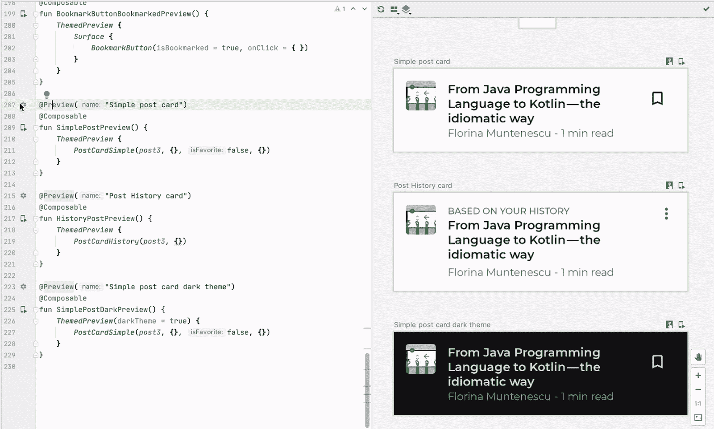

# 作曲预告 UX 之旅

> 原文：<https://medium.com/androiddevelopers/a-ux-journey-of-compose-preview-3c95e1f0a8bf?source=collection_archive---------4----------------------->

*以下帖子由 Android 开发者 UX 团队的*[*Preethi Sri nivas*](https://twitter.com/p3srini?lang=en)*(UX 研究员)和*[*Paris Hsu*](https://twitter.com/parishsuhsu?lang=en)*(交互设计师)撰写。*

Jetpack Compose 刚刚打了 [Beta](https://android-developers.googleblog.com/2021/02/announcing-jetpack-compose-beta.html) ！🎉在这个激动人心的时刻，Android 开发者 UX 团队想邀请您进入我们的世界，带您了解我们迄今为止是如何设计 Compose 预览版的。这从理解挑战和形成方向开始，继续到原型和评估。

# 背景:理解挑战

Jetpack Compose 是用于 Android 开发的下一代现代 UI 工具包，旨在使制作漂亮、高性能的 Android 应用程序更加简单快捷。它利用了直观的 Kotlin APIs，因此当应用程序状态改变时，您的 UI 会自动更新。当我们的团队第一次听说这个项目时，我们对 Compose 的可能性感到非常兴奋，这是一种混合逻辑和将数据绑定到 UI 的潜力，可以为开发人员打开新的用例。然而，这种构建 UI 的新方式带来了新的设计挑战。

对于经典的 Android 视图，UI 是静态的，主要是用 XML 创建的。这意味着我们几乎可以立即反映变化，并创建体验，如[布局编辑器](https://developer.android.com/studio/write/layout-editor)，开发人员可以通过可视化拖放编辑他们的应用布局，并查看自动生成的 XML 代码中反映的相应编辑。然而，使用 Compose，每次进行修改时，我们都必须编译 Kotlin 代码以反映更改，这需要时间，这会减慢迭代和创建过程。

# 构思:向设计方案冲刺

为了发现在 Compose 中支持这种开发 UI 代码的新模式的方法，我们的团队与我们的软件工程、开发人员关系工程和产品管理合作伙伴举办了一个研讨会，以解决一个设计挑战:**我们如何通过利用开发人员对当前工具的现有经验来帮助他们创建和操作 Compose UI？**

使用[设计思维方法](https://en.wikipedia.org/wiki/Design_thinking)，我们从理解和整理问题空间开始。这一过程要求团队在[“我们如何……”框架](https://www.designkit.org/methods/3)中写下想法，这些想法后来被[具体化](https://ux-everything.com/affinity-diagram/)以帮助识别和细化手头的设计问题。我们使用先前的研究作为跳板，在开发人员旅程的不同点上指导团队思考和工具解决方案的草图。

Compose Design Workshop

设计研讨会帮助综合了为 2020 年及以后的组合工具路线图奠定基础的核心原则:

*   建立在以前构建 XML 工具的经验基础上
*   像画布一样拥抱代码
*   针对迭代和实验进行优化

这些原则构成了我们设计理念向前发展的基础。例如，Compose Preview 建立在一种在*外观和感觉*中熟悉的体验上，但是补充了 Compose 通过小的、可重用的组件构建布局的范例。设计研讨会还鼓励我们更倾向于以代码为中心的 [REPL](https://en.wikipedia.org/wiki/Read%E2%80%93eval%E2%80%93print_loop) 体验，允许开发人员在预览代码时有更多的控制和灵活性——本质上提供了一个支持迭代、实验和学习的交互式编程环境。我们还构思了 XML 世界以外的新体验，例如交互式预览，用于支持 ide 内沙盒环境中隔离的实时交互；部署预览，用于部署可组合到仿真器或物理设备的预览，而无需运行整个应用程序。

# 原型:早期脉搏检查

为了验证我们的假设和设计方法，我们从设计研讨会开始原型化我们的想法，并在用户研究中测试它们。我们开展研究，以便验证当前的方向，并获得对未来想法或投资的反馈。我们选择了一种迭代的方法来获取反馈，因此在解决其他与作曲相关的主题的多项研究中，机会主义地纳入了与预览相关的主题。

举例来说，为了理解预览体验，我们从询问开发人员会问的问题开始:

*   如何使用撰写预览？
*   在什么样的背景下，人们想要预览一个动态的交互？
*   在物理设备或仿真器上部署一个独立的可组合组件并与之交互有多大用处？

我们邀请开发人员参加*编码会议*，在一个为研究目的而创建的 Compose 项目中完成简单的编程练习。这种方法节省了设置开发环境的时间和精力，特别是当 Compose 处于预开发人员预览阶段时，并帮助我们关注开发人员在使用预览和其他 Compose APIs 时的体验。早期的研究确实需要围绕产品稳定性问题开展工作，预览版并不总是像预期的那样工作。研究计划预测了这些不可避免的问题，同时仍然能够获得非常早期的见解。

Usability research via coding sessions

在这些会议中，一些开发人员在区分预览工具栏上的“*刷新”*图标和横幅中的“*刷新&构建”*图标时表示困惑。大多数人没有意识到“刷新”图标只会更新不需要完整构建的代码变更，而横幅则会更新构建过程中的所有变更。

> “如果 **Refresh** 和 **Build 和 Refresh** 打算相同，如果它们在一起就好了——我最初认为刷新按钮只会刷新 UI，不会构建项目。”

Preview Refresh & Build (before & after)

这一反馈使我们调整了二者并改善了体验，以便当用户单击图标或横幅时，预览会查看更改，以确定是否需要刷新或重建来反映更改。

几轮早期研究中关于 Compose Preview 的一个关键见解包括，开发人员在 Compose 中制作 UI 原型时，将提高的生产率与*处于控制中的感觉*联系起来。

> “**刷新**模式让我可以快速原型化用户界面。让 Kotlin 的全部功能可用于创建 UI 以及@Preview 函数的示例数据，这比旧的 XML 方式中的 XML 名称空间帮助器要好得多。”

我们也听到开发人员在与预览版中的组件交互时，对能够导航到代码中的特定点感到惊讶和高兴。

> “我刚刚发现了这一点，我很高兴，我可以在预览中点击不同的视图，并直接跳转到负责绘制它的代码。我很乐意看到更多这样的想法应用到 Jetpack Compose 中”

在可用性研究中，我们观察到开发人员通过在预览中点击不同的 UI 元素，在代码编辑器中导航到他们项目的不同部分——这需要对 UI 层次有更深的理解。一些开发人员发现，当撰写预览和代码导航中的交互不一致时，体验会有问题。例如，在列中可组合文本的目标区域之外单击，可以导航到代码编辑器中定义该列的行。这让我们通过在布局中包含可组合的轮廓来提供可组合的视觉启示，从而增强预览体验。

Preview code navigation

# 沉浸:写日记

现场的、面对面的可用性研究相对来说是轻量级的，有价值的，并且能激发新的想法。然而，由于时间限制，很难深入挖掘主题。因此，我们转向我们的研究方法，并开始更倾向于一种远程技术，这种技术允许开发人员在他们自己的时间内进行几周的 Compose 项目。在此期间，开发人员写日记，包括一系列问题，以记录他们在指定项目或自己项目中的工作流程。为了更好地理解开发人员日记中的特定条目，我们通常会在几周的探索之后，将这与采访对话结合起来。经过几天的探索，我们还邀请了一些开发人员参加 Google Meet 上的编码会议，以观察和确定事情进展顺利的时刻以及可以改进的体验。

Developer diary with questions to help guide feedback capture

这些研究中出现了一个一致的主题——开发人员使用预览来支持创建和故障排除/验证工作流。例如，在创建 UI 时，开发人员更多地依赖于*刷新*模式，而在处理手势/交互时，他们切换到使用*交互*模式，而*部署*模式最常用于故障排除或验证检查。

> “当我发现互动模式可以在长按上显示明星的动画时，我非常高兴。但是，在随后的长按中，交互模式不起作用——动画不再显示。通过在模拟器上部署预览模式，我看到动画确实工作了。如果交互模式变得更加稳定，它将是我测试交互内容+动画的首选模式。有趣的是，在创建新的用户界面和查看它们是如何呈现的时候，我大部分时间都不需要使用它。”

此外，我们从一些开发人员那里了解到，在考虑整个布局之前，能够提取并集中实现单个可组合组件的重要性。

> “只部署预览版意味着我不需要仅仅为了测试一个新的组件而将 UI 与实际的流程(有多个屏幕和用户输入)挂钩。这使得调试+更改复杂的 ui 变得容易得多。”

# 将洞察力转化为行动

我们将我们的方向建立在研究的基础上，这有助于我们将开发人员的见解和问题反馈到我们的工具迭代中——同时确保我们还捕捉到新出现的主题来塑造我们的设计理念。以下是几个例子:

# 新人预览

我们观察到开发人员在发现创建预览的入口点时遇到困难——许多人在示例项目中注意到了预览，但是无法在他们自己的项目中复制类似的体验。在创建预览可组合时，不直观的设计通常会导致对组合编译器支持和不支持的误解。例如，我们观察到一些开发人员试图预览接受参数的可组合组件 Compose 不支持这种功能。在这种情况下，编译器提供的错误消息经常被遗漏或忽略。

> “我不知道如何用预览显示拆分视图，即使我从示例项目中复制代码，我也无法使用预览注释。”

这个重要的发现让我们引入了一个*默认*状态，其中，如果一个 Kotlin 文件还没有定义预览组合，那么一个拆分编辑器(从 View/XML world 中的预览借用)总是以一个空状态可见。我们相信这种解决方案不仅能提高预览的意识和可发现性，还能提供与创建和操作预览相关的学习体验。

Preview default state

# 加速编码体验

在调查研究中，开发者问我们:

*   如何预览明暗主题的布局？
*   如何预览包含样本数据的布局？
*   我如何利用 Preview 来识别我在代码中的什么地方定义了一个特定的 UI 元素？
*   有没有一种方法可以让 Compose 模仿 View/XML 世界中的预览体验，特别是能够在代码更改时快速看到预览中的视觉变化？

这些问题说明了一个重要的主题——开发人员正在寻找一种快速简单的机制来操作预览，并期望更快的迭代。

我们将继续原型化和测试从开发人员反馈中出现的新功能，例如，预览配置选择器将允许开发人员可视化地配置他们的布局(例如，在不同的主题、设备、语言等中)。)，以增加@Preview API 的可发现性和易学性。

Preview Configuration Picker

另一个例子是[Live literals](https://developer.android.com/jetpack/compose/tooling#live-literals)——我们的工程团队的解决方案，通过引入对一些可组合值(例如，Boolean、Char、String、Color 等)的实时更新来优化迭代开发的速度。)在预览面板中。

Live Literals in action

[PreviewParameterProvider](https://developer.android.com/reference/kotlin/androidx/compose/ui/tooling/preview/PreviewParameterProvider) 是我们将样本数据合并到预览中的又一个例子，以允许真实环境测试。

Using the PreviewParameterProvider

# 旅程还在继续…

我们希望这篇文章揭示了您的反馈如何影响 Compose Preview 改进的幕后真相。当然，旅程并没有到此结束！总的来说，我们有许多计划来继续支持和改进 Compose 预览和工具的体验。例如，将[活文字](https://developer.android.com/jetpack/compose/tooling#live-literals)扩展为超越文字类型，以获得更快的速度和更快的迭代反馈循环。

和往常一样，如果你在使用撰写工具时遇到任何问题，或者对可以改善你的体验的新功能有什么想法，请在这里提交一个 bug [。我们也在寻找参与用户研究会议的开发人员——在此](https://issuetracker.google.com/issues/new?component=823947)注册[参与研究。](https://g.co/userresearch/androiddev21)