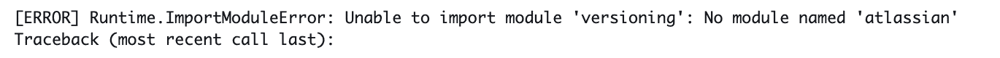
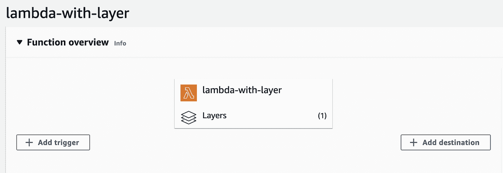
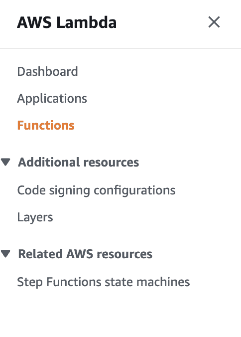
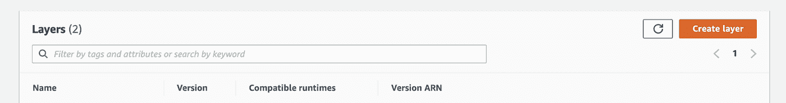
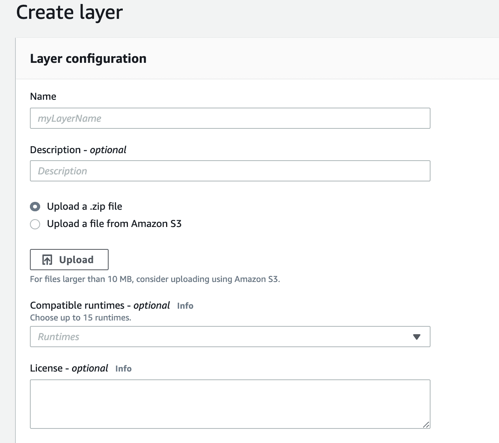
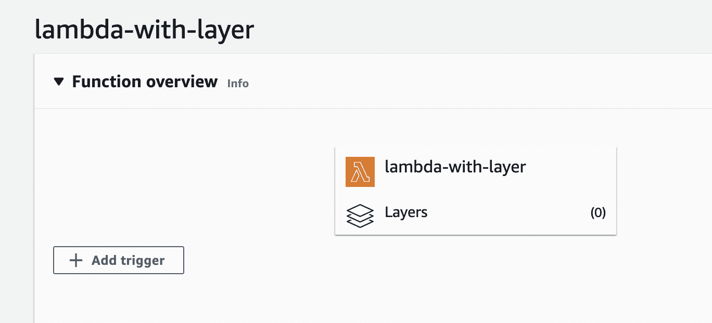
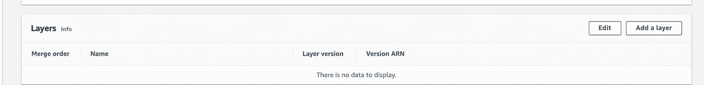

# Lambda 层的演练

> 原文：<https://medium.com/globant/a-walkthrough-to-lambda-layers-69c0f0c2392a?source=collection_archive---------0----------------------->

# 介绍

自从我了解了 AWS Lambda 函数，我就尽可能地实现它们。在 AWS 服务中，AWS Lambda 函数因其适应性和易用性而脱颖而出。然而，我最近不得不实现一个 Lambda 函数来更新一个 Confluence wiki 并使用 Atlassian-python-API 库。你猜怎么着？AWS Lambda 没有包含该库；因此密码被破解了。



我之前已经遇到过同样的问题，但是因为我们可以使用其他方法，所以我们只是修改了代码。这一次是不同的，因为解决方法很容易出错，所以我们要解决这个问题。我们是这样解决的。

# 问题是

需要运行用 python 写的 AWS Lambda 函数，该函数使用了 AWS Lambda 上默认不可用的 python 库。该功能使用 Terraform 进行部署。

# 解决方案

在做了一些研究后，AWS Lambda 层似乎是我们担忧的解决方案。根据 AWS 文档，层“*是一个. zip 文件档案，可以包含附加代码或数据”。*换句话说，你可以事先压缩你的函数正确运行所需要的任何东西，否则其他函数会用到它。然后，通过压缩它并将其保存为一个层，您可以重用您压缩的任何内容，而不必重新创建它。

# 实施

1.  *创建 zip 文件*

要创建 zip 文件，您必须知道文件夹必须具有以下结构:python/your library。例如，我们想安装 atlassian-python-api 和 requests 的库，安装后，文件夹看起来像这样:

记住这一点；否则，你的 Lambda 函数将无法识别已安装的库，它将不断抛出错误。

生成了包含所有所需库的名为 python 的文件夹后，您可以对其进行压缩

```
zip -r9 ../lambda_layer.zip .
```

重要注意事项:

a)r 标记递归地压缩到目录中的所有文件夹，9 标记表示最高的压缩。

b)在 python 文件夹所在的目录中执行该命令。如果您的 python 文件夹在$HOME/python_layer 中，那么您可以在该目录中进行操作。为避免出现故障，建议您检查该文件夹，其中只有 python 文件夹，其中包含您要添加到图层的库。为了以防万一，您可以使用 ls 命令检查这一点:

```
$HOME/python_layer ls
python
```

您的函数代码不需要在这个目录中。

*2。创建你的图层并把它附加到一个函数上*

无论您是将基础设施作为代码管理，还是以传统方式管理，两种方式都是可行的。请记住，每个 lambda 函数最多可以附加 5 个不同的层。

*   带地形的 IaC

幸运的是，Terraform 确实有 lambda 层的资源，所以我们只是将其配置如下:

如您所见，第一个资源是我们需要附加层的 lambda 函数。如果您想要创建层而不将其附加到任何函数，则可以忽略此步骤。当用层配置 lambda 时，主要的区别是在资源中添加了属性“layers”。

第二个资源是创建层的资源，称为“lambda_utils_layer”需要注意的两个关键方面:

a)确保您在文件名上使用的路径正是您的压缩文件夹所在的位置。

b)仔细检查 lambda 函数运行时是否在为您的层列出的兼容运行时之中。

执行 terraform apply 时，如果 lambda 函数已经存在，它将被就地更新，如下所示:

相反，如果 lambda 函数不存在，那么两个资源都会被创建。您可以在 AWS 控制台上检查一切正常，方法是转到您的 Lambda 函数并查看它是否附加了一个层。



*   从 AWS 管理控制台:

从管理控制台向 Lambda 添加层非常简单:

在左侧菜单中，选择层选项，



选择右边的创建层，



并上传您在前面步骤中创建的 zip 文件。



然后去你的功能，点击层



并选择添加层



请注意，如果您的函数运行时不在您的层的兼容运行时中，您创建的层就不会出现。

# 总结

AWS Lambda 函数是一个强大的工具，当向它们添加层时，它们的使用可能性得到了扩展。添加层简化了自定义函数的过程，并确保函数能够访问正确运行所需的库。因此，学习如何使用它们绝对是提升 Lambda 函数的必备技能。

# 附赠曲目

为了创建 zip 文件，我的同事[费利佩·梅希亚](https://co.linkedin.com/in/felipe-mej%C3%ADa-alvarez-54754899)与我分享了他在 bash 中编写的脚本，以创建 zip 文件并将层发布到 AWS。他无疑拯救了我的一周，在他的认可下，我们与你分享它，希望它也能拯救你的一周:

# 参考

*   [https://docs . AWS . Amazon . com/lambda/latest/DG/configuration-layers . html](https://docs.aws.amazon.com/lambda/latest/dg/configuration-layers.html)
*   [https://medium . com/globant/connecting-to-SQL-server-from-AWS-lambda-docker-container-b 474727522 EB](/globant/connecting-to-sql-server-from-aws-lambda-docker-container-b474727522eb)
*   [https://towards data science . com/introduction-to-Amazon-lambda-layers-and-boto 3-using-python 3-39bd 390 add 17](https://towardsdatascience.com/introduction-to-amazon-lambda-layers-and-boto3-using-python3-39bd390add17)
*   [AWS Globant (T1)](https://www.globant.com/stay-relevant/partnerships/aws)