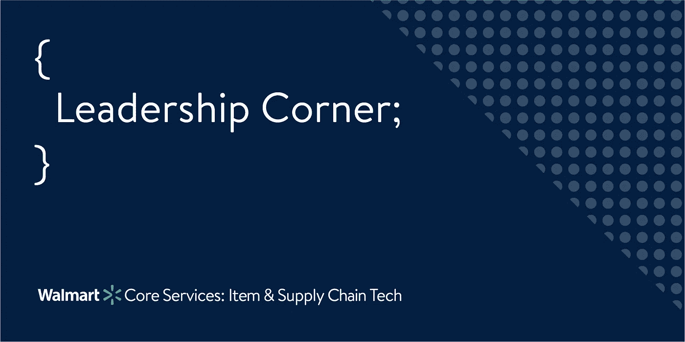

# 运转良好的供应链=运转良好的企业

> 原文：<https://medium.com/walmartglobaltech/a-well-run-supply-chain-a-well-run-business-1eb9ea6128e?source=collection_archive---------0----------------------->

(Image designed and owned by Walmart Global Tech)

我真不敢相信已经有一年多的时间，美国这么多的县开始实施就地安置规则，随着家庭准备在家中长期居住，购买行为发生了巨大变化。我们中的许多人永远不会忘记大多数商店是如何在短短几天内将必需品清空的，有些甚至只有几个小时。这立即扰乱了包括沃尔玛在内的所有公司的供应链。供应链僵化的企业会遇到一些大问题，而那些能够对客户不断变化的需求做出快速反应的企业，在应对新需求和重回正轨方面最为成功。灵活的供应链在任何时候都很重要，但新冠肺炎对购买行为的影响证明了*有多重要。*

通常，供应链基于前一年的采购模式和其他数据(如天气和人口统计)运行 52 周的预测计划。但像 COVID 这样的不可预见事件可能会打乱 52 周的预测计划，因此最重要的是公司在如何运营方面保持敏捷和灵活，并拥有允许这样做的技术。没有这一点，一个人可能会遇到麻烦。

作为沃尔玛运输和最后一英里技术的领导者，我们必须从全局出发，确定有助于应对不断变化的客户需求和行为的领域。下面我列出了运输中对沃尔玛顾客成功获得产品影响最大的两个领域:满足顾客不断变化的需求和优先考虑安全和速度。

1.  **满足不断变化的客户需求**

在沃尔玛，我们做出了一些明智的选择，使我们能够对顾客的需求做出快速反应。我们审视了供应链中面临最大压力的领域，然后说，我们能做些什么来缓解这些压力点？首先需要关注的是我们的履行中心，简称 FCs。由于数量增加，他们面临巨大的产能压力，无法跟上积压的工作。为了减轻我们 FCs 的压力，运输团队将我们的发货商店计划从 300 个增加到 2000 个。由于我们已经建立了以这种方式使用 300 家商店的技术，我们能够很快增加到 2000 家商店。通过利用我们的商店作为**前沿部署的履行节点**来采购和运送产品，这给了我们更多的履行能力，帮助我们继续运送基本物品，并像以前一样信守承诺。

然后，我们对另外两个系统进行了改进，帮助我们的商场更快地接收和储存必需品，以满足顾客不断增长的需求。我们做出的第一个改变是在我们的预约调度系统中快速实施优先排序功能，该系统自动调度来自供应商进入我们的配送中心(DC)的入站负载(包括活动负载和卸货负载)。这种优先排序功能使我们能够为运载必需品和低库存物品的拖车提供预约，使其最先到达。

第二个变化是专门为优先考虑已经在我们的院子里落货。为了做到这一点，我们使用了我们的报废拖车卸载优先化工具，以便我们可以在疫情期间快速跟踪它，同时我们致力于将它作为我们堆场管理系统的核心功能..这种能力优先考虑拖车，拖车上的基本物品将首先在我们的配送中心卸载。这两项变革为必需品创造了**智能流程**,使我们有可能首先向配送中心补充必需品，然后更快地为我们的商店提供服务，最终让顾客能够立即获得他们最需要的商品。

**2。安全和速度**

我们做出的第二个最重要的改变是提高客户购买和接收产品的速度，并确保产品尽可能安全。回到 2020 年 3 月，我们刚刚了解了病毒以及如何保持安全，但我们知道限制人与人之间的接触很重要。为了适应这种情况，我们知道我们必须调整购物选项，让顾客放心，并尽我们的努力确保他们和我们同事的安全。几乎是一夜之间，沃尔玛增加了非接触式送货选项。

由于新冠肺炎期间需求激增，网上 7 天的杂货时段将在几分钟内被预订，没有留给急需必需品的顾客。为了缓解这种情况，我们将交付时段的可用性从 7 天减少到 2 天，并定期开放产能。随着我们生产能力的提高，我们将时间段延长至 7 天。这让更多的顾客能够访问在线杂货店，我们的非接触式取货和送货选项确保了顾客和员工的安全。

我们还推出了快递服务，这样顾客不用出门就可以在两个小时或更短的时间内订购并收到产品。这种技术不仅可以更快地将产品送到客户手中，而且还缓解了早期疫情需求对交付位置容量的压力，因为我们增加了专门的快递提货容量。这是通过再次将我们的商店作为**前沿部署的履行节点**来实现的，这些节点离我们的顾客最近。

我们的在线杂货时段一直在帮助我们的客户节省时间，在我们购物时提取他们的订单，旨在增加我们最脆弱的客户的安全。我们建立了支持高危人群的能力，为老年人和高危人群提供特定的“高危时段”。

我们已经认识到，我们不能仅仅依靠 52 周的展望。我们必须能够看到正在发生的变化，甚至预见到它们，为即将到来的事情做好准备。有效管理供应链是我们永远需要的技能，因为这些类型的购买行为变化并不是 COVID 疫情独有的。例如，每当发生飓风、地震或加州野火等灾难时，它们就会出现。这都是关于减压点的——寻找压力积聚的地方，并制定一个减轻压力的计划；能够动态地重新安排货物流的优先顺序，以满足客户的最大需求。支持可靠供应链的技术必须灵活敏捷，以便做出响应，更好的是预测。

简单地说，供应链是任何销售产品的公司的心脏。它决定了在店内、网上销售的产品的数量和类型，以及直接送到顾客手中的产品，正如我们所讨论的，它决定了如何优先满足顾客的需求。当新冠肺炎病毒开始影响美国时，我们都知道管理良好的供应链是多么重要，不仅对公司，而且对客户。