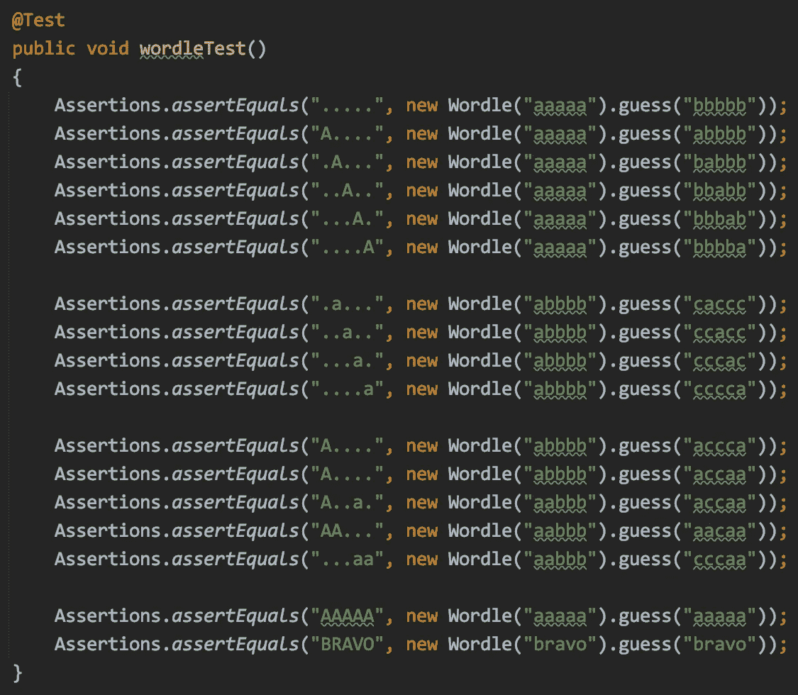
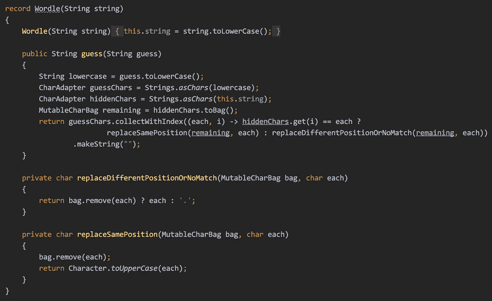
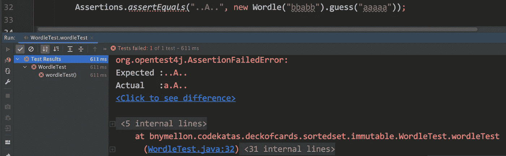
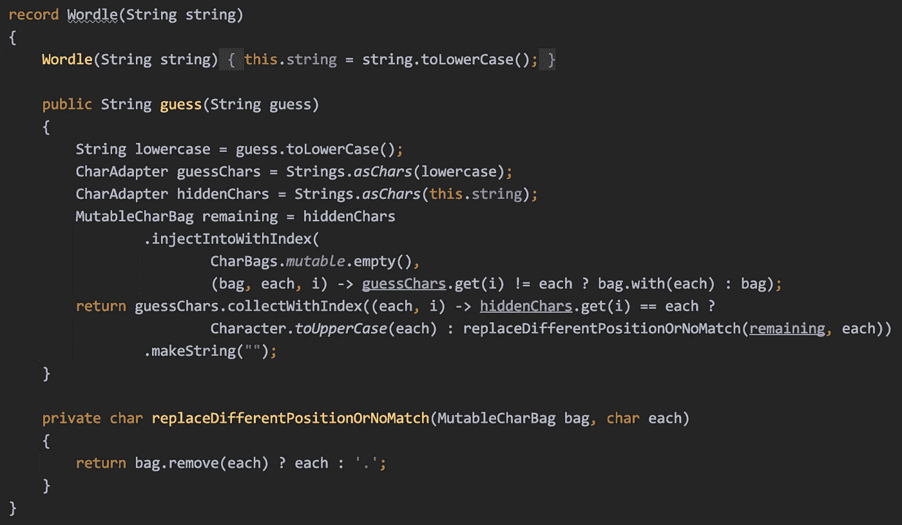
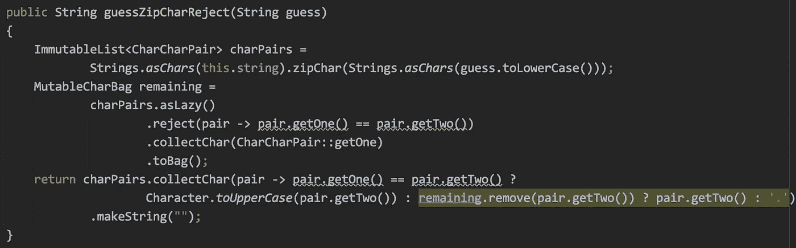

# 一个世界性的形挑战

> 原文：<https://medium.com/oracledevs/a-wordle-jldd-kata-challenge-b6fb1c89d8eb?source=collection_archive---------1----------------------->

学习如何使用 [Eclipse 集合](https://github.com/eclipse/eclipse-collections)来解决单词猜测形

# 形是编码难题，以保持你的技能敏锐

我喜欢创造和解决代码卡塔。代码卡塔是编程难题，可以帮助您保持敏锐的编码技能。我为“[每个 Java 程序员都应该知道的 97 件事](https://www.oreilly.com/library/view/97-things-every/9781491952689/)”这本书写了一篇题为“学习形和形学习”的文章，这篇文章的链接可以在 O'Reilly *97 件事*出版物的 Medium 上免费获得。

 [## 学习形和形来学习

### 随着 Java 生态系统的不断发展，每个 Java 开发人员都需要不断学习新技能。Java……

medium.com](/97-things/learn-to-kata-and-kata-to-learn-73c98a69e44c) 

# 沃尔多的奇妙世界

Wordle 是一个非常受欢迎的在线益智游戏，你有六次机会猜出一个五个字母的单词。每一次猜测都导致学习哪些字符与单词中的字符相匹配。通过颜色给你提示，让你知道你是否在正确的位置得到了一个正确的字母，该字母是否在单词中但在错误的位置，或者该字母是否与单词中的任何字母不匹配。

你可以在这篇文章中找到更多关于 Wordle 热潮的信息。

 [## 沃尔多解释道:掌握这个病毒性文字游戏你需要知道的一切

### Wordle 是一款病毒式文字游戏，最近被《纽约时报》以几百万美元的价格收购。但是…

www.cnet.com](https://www.cnet.com/how-to/wordle-explained-everything-you-need-to-know-about-the-viral-word-game/) 

# 时差驱动开发

在“前时代”，当技术会议和全球旅行更常见时，一些 Java 冠军( [José Paumard](https://medium.com/u/18673d5e2e01?source=post_page-----b6fb1c89d8eb--------------------------------) 、 [Nikhil Nanivadekar](https://medium.com/u/4285d8a2ca86?source=post_page-----b6fb1c89d8eb--------------------------------) 和我自己)会在我们参加会议时在 Twitter 上分享编码挑战(通常是 JavaOne/Oracle CodeOne)。在会议期间，我们都有不同程度的时差，所以我们决定在发布编码挑战时使用 JLDD 标签。最常见的编码挑战是解决 Java 集合或流的问题。我通常会发布使用 [Eclipse 集合](https://www.eclipse.org/collections/)的解决方案。

在整个疫情，我们仍然偶尔在 Twitter 上分享 JLDD 挑战，尽管时差很久以前就已经消除了。几周前，我分享了一个使用 Java 文本块和 Eclipse 集合的俳句形。

 [## 使用文本块的 Java 俳句

### 创意写作遇到 Java 文本块和 Eclipse 集合

medium.com](/javarevisited/haiku-for-java-using-text-blocks-6b7862ccd067) 

然后，José Paumard 在一段 25 分钟的 JEP 咖啡馆#9 视频中，对 JLDD 挑战进行了现场编码。他在解释 Eclipse 集合和 Java 17 解决方案方面做得非常出色。干得好！

# 沃尔多形

[José Paumard](https://medium.com/u/18673d5e2e01?source=post_page-----b6fb1c89d8eb--------------------------------) 本周以测试的形式给了我一个 JLDD 挑战，我需要写代码才能通过。我喜欢这种形式，它遵循经典的 TDD 风格，使用测试优先的方法。下面是使用普通 JUnit 5 断言的 kata 的测试代码。

Several hidden words and corresponding guesses that result in some output

基于这个测试的规则相当简单。

1.  如果猜测字符串中的一个字母与隐藏单词中的一个字母不匹配，那么用“.”替换输出中的字符
2.  如果猜测字符串中的一个字母与隐藏单词中的一个字母匹配，并且该字母位于相同的位置，则用大写字母替换该字符。
3.  如果猜测字符串中的一个字母与隐藏单词中的一个字母匹配，但该字母位于不同的位置，则用小写字母替换该字符。
4.  如果一个字母匹配，但在猜测字符串中出现的次数多于隐藏单词，则用“.”替换输出中的附加字符。

# 我使用 Eclipse 集合的第一个解决方案

我想出的解决方案如下所示，并且通过了所有的测试。

Code for Wordle guessing using Eclipse Collections

代码接受猜测，将每个字母与隐藏的单词进行比较，如果有直接匹配，则打印一个大写字母，否则，如果有间接匹配或“.”，则打印一个小写字母如果没有匹配或者字母是额外的匹配字符。`CharAdapter`类型上的方法`[collectWithIndex](https://www.eclipse.org/collections/javadoc/11.0.0/org/eclipse/collections/api/list/primitive/ImmutableCharList.html#collectWithIndex(org.eclipse.collections.api.block.function.primitive.CharIntToObjectFunction))`一次转换`guessChars`和`String`中的一个字符。我起初认为没有`char`值会被装箱为`Character`对象，但结果证明我错了。方法`collectWithIndex`接受一个`CharIntToObjectFunction`，这意味着每个输出字符的`char`值将被装箱为`Character`对象。这也意味着我们在 Eclipse 集合中没有纯粹的原始版本的`collectWithIndex`，就像我们对`[collectChar](https://www.eclipse.org/collections/javadoc/11.0.0/org/eclipse/collections/impl/string/immutable/CharAdapter.html#collectChar(org.eclipse.collections.api.block.function.primitive.CharToCharFunction))`所做的那样。我认为这在大多数情况下都是可以接受的，并且对于这个特殊的用例来说成本不会太高。我不认为添加一个名为`collectCharWithIndex`的纯原始版本会有它的分量。

然而，在创建输出`String`之前，有一个比将`char`值装箱为`Character`对象更大的问题。我发现有一个缺失的测试用例，以及一个我们应该添加到形中的额外规则。

# 规则:比起间接匹配，更喜欢直接匹配

我添加了以下导致我的第一个解决方案失败的测试用例。

A word that has a direct match at one letter, but indirect matches occur before the direct match

让我放大一下，这样你可以更清楚地看到测试用例。

The output for a word “bbabb” with a guess of “aaaaa” should be “..A..”

在这种情况下，字母“a”将在第三个位置有一个直接匹配，但猜测中的间接匹配应该被忽略，以支持第三个位置的直接匹配。

# 我的更新解决方案

对于了解我的人来说，你会知道我有点痴迷于在 Eclipse 集合 API 中提供良好的对称性。对于这个特殊的用例，如果在 Eclipse 集合中的原始集合类型上有一个等效的`[selectWithIndex](https://www.eclipse.org/collections/javadoc/11.0.0/org/eclipse/collections/api/list/ListIterable.html#selectWithIndex(org.eclipse.collections.api.block.predicate.primitive.ObjectIntPredicate))`和`[rejectWithIndex](https://www.eclipse.org/collections/javadoc/11.0.0/org/eclipse/collections/api/list/ListIterable.html#rejectWithIndex(org.eclipse.collections.api.block.predicate.primitive.ObjectIntPredicate))`就更好了。这个特殊的用例可能会让我在这里默认并添加缺少的方法。

然而，我可以使用另一种方法来实现这两种方法的等价物。那个方法就是`[injectIntoWithIndex](https://www.eclipse.org/collections/javadoc/11.0.0/org/eclipse/collections/impl/string/immutable/CharAdapter.html#injectIntoWithIndex(T,org.eclipse.collections.api.block.function.primitive.ObjectCharIntToObjectFunction))`。

下面是我更新的解决方案，使用`injectIntoWithIndex`创建一个`CharBag`，剩余的字符没有直接匹配。

Wordle guessing solution that handles all rules

如果你想了解`injectIntoWithIndex`方法的工作原理，你可以阅读下面这篇关于`injectInto`的博客。方法 injectInto 可用于实现大多数迭代模式，对于`injectIntoWithIndex`也是如此。它们都是神秘而强大的方法。

 [## EC 示例:注入

### 了解 Eclipse 集合中最通用、最灵活、最难理解的迭代模式之一。

donraab.medium.com](https://donraab.medium.com/ec-by-example-injectinto-923a35c3b0cd) 

# 更新:使用`zipChar`的替代解决方案

有时候，当你在同一个代码库上工作了 18 年，你会忘记一些事情。谢天谢地，朋友会偶尔提醒你可能已经忘记的事情。这发生在本周，弗拉迪米尔·扎哈罗夫在推特上分享了一个名为 T9 的不同解决方案。

弗拉德的解决方案很酷，绝对不是我会想到的方法。我忘记了在 Eclipse 集合中有一个原始版本的`zip`。Eclipse 集合中的每个原语`OrderedIterable`类型都支持相同类型的`zip`。所以一个`CharAdapter`有一个`zipChar`的方法。我很快想起四年前我在 primitive `zip`上写过一篇博客。

 [## 拉链对称

### 另一个对称同情的故事，在物品和原始收藏品的土地上。

medium.com](/javarevisited/zip-symmetry-a857a934ee26) 

当我看到 Vlad 的解决方案时，我意识到我可以用`zipChar`代替`injectIntoIndex`和`collectWithIndex`来编写我自己解决方案的替代方案。

Wordle Kata using zipChar with reject and collectChar

使用`zipChar`的两个解决方案在用于计算最终猜测结果`String`的算法上有很大不同。

# 我最终的 Eclipse 集合解决方案的源代码

我已经使用 Eclipse 集合为我的最终 Wordle JLDD Kata 挑战解决方案创建了一个要点。我期待看到 José Paumard 的纯 Java 17 解决方案。我总是从 José那里学到以前不知道的关于 Java 的新的有趣的东西。

# 最后的想法

我希望你喜欢这篇关于我使用 Eclipse 集合解决 JLDD Kata 挑战的博客。我当然欢迎这些挑战的其他解决方案，这样我们都可以学习新的和不同的编程问题的解决方案。这些解决方案可以是使用您最喜欢的库的 Java，甚至是其他编程语言。

感谢您抽出时间阅读！

*我是*[*Eclipse Foundation*](https://projects.eclipse.org/projects/technology.collections)*的*[*Eclipse Collections*](https://github.com/eclipse/eclipse-collections)*OSS 项目的项目负责人。* [*月食收藏*](https://github.com/eclipse/eclipse-collections) *为* [*投稿开放*](https://github.com/eclipse/eclipse-collections/blob/master/CONTRIBUTING.md) *。如果你喜欢这个库，你可以在 GitHub 上让我们知道。*