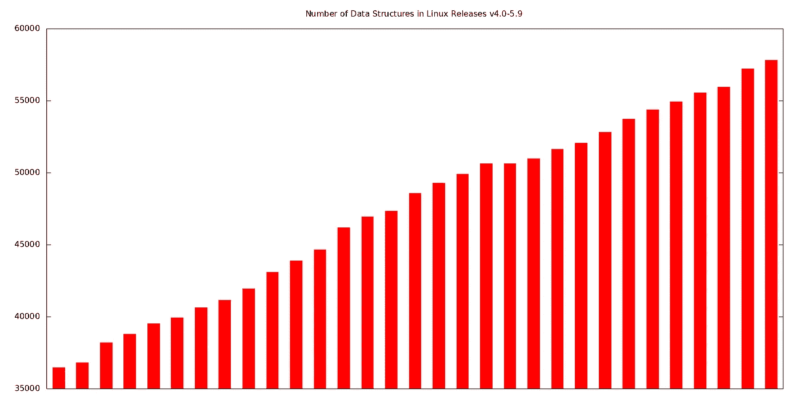
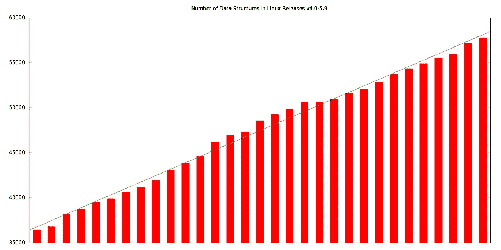
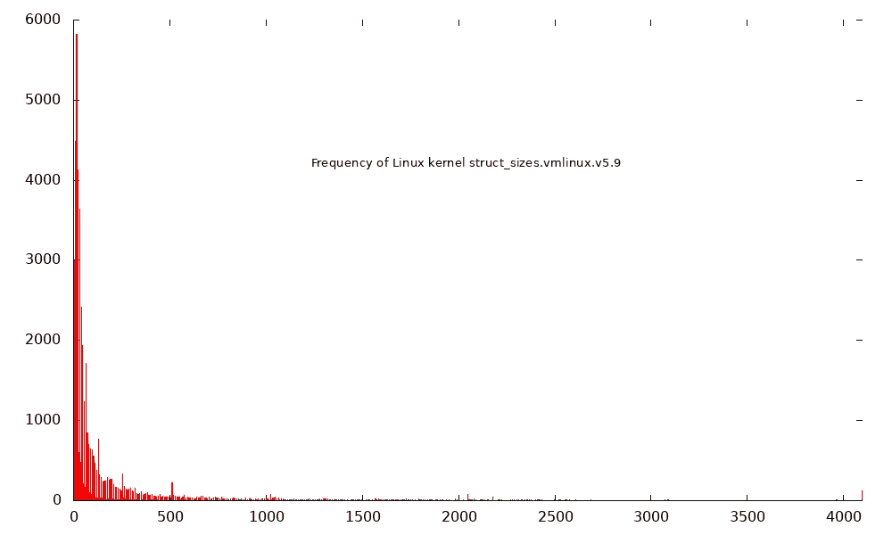
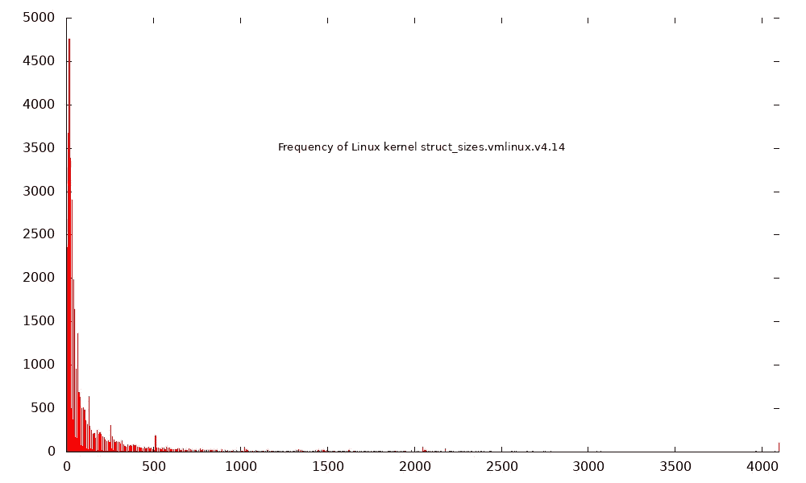
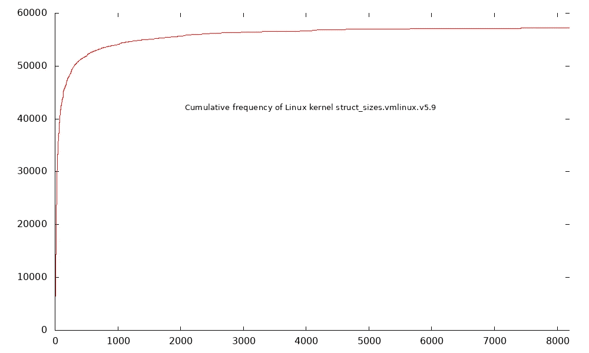

# 核心数据结构动物学指南

> 原文：<https://medium.com/oracledevs/a-zoological-guide-to-kernel-data-structures-4c68207e186b?source=collection_archive---------5----------------------->

# 内核数据结构有多种形状和大小。Oracle Linux 内核工程师 Alan Maguire 对 Linux 内核中的数据结构大小进行了统计分析。


最近，我正在开发一个 BPF 特性，它旨在提供一种机制来显示任何内核数据结构，以供调试之用。作为努力的一部分，我想知道极限是什么。最大的内核数据结构有多大？典型的内核数据结构大小是多少？

我们将尝试回答的基本问题是

*   有多少种数据结构，在内核版本之间可以观察到哪些模式？
*   最小和最大的数据结构是什么，为什么？
*   给定内核版本的结构大小的总体模式是什么？这在不同版本之间有什么变化？

我们读到的很多关于 Linux 内核的文章都谈到了大小，但是是在代码行数、文件数、提交数等等的上下文中。这些都是有趣的指标，但这里我们将重点关注数据结构，我们将在调查中使用两个神奇的工具:

*   ***pahole*** (戳孔):根据手册页， ***pahole*** 显示和操作数据结构布局。这只是暗示了它能做什么。出于我们的目的， ***pahole*** 可以获取一个内核映像，并向我们显示其中使用的各种结构的布局和大小。 ***pahole*** 通常在矮人套装内提供；如果做不到，可以通过[https://github.com/acmel/dwarves](https://github.com/acmel/dwarves)从源代码构建。
*   ***gnuplot*** :如果你以前没用过，我希望你会看到它有多强大。不仅仅是一个绘图工具，我们还可以用它来拟合函数，以构建我们绘制的数据模型。稍后我将提供一个这样做的例子。详见[http://www . gnuplot . info](http://www.gnuplot.info/)。

我们的目标是鸟瞰数据结构的大小。有哪些模式？这里我们将把自己局限于静态分析；换句话说，我们不会考虑内核运行时特定数据结构的使用频率。一个更注重动态的分析当然也很有趣！

另一个规则是——为了保持简单(并且可以跨内核版本进行比较),我们将使用“make allyesconfig”来生成。用于内核构建的配置文件。显然，选择更多/更少的特性会影响数据结构的大小，所以为了简单起见，我们现在忽略这一点。

这是我用来为 31 个从 v4.0 到 v5.9 发布的内核构建 vmlinux 二进制文件的 kbuild.sh 脚本，时间跨度为 2015 年中期到 2020 年 10 月。

该脚本应该在没有来自内核源代码 git 树顶层的参数的情况下运行。假设所有的工具和包都支持内核构建。

```
#!/usr/bin/bash
# Copyright (c) 2020, Oracle and/or its affiliates.
#
# The Universal Permissive License (UPL), Version 1.0
#
# Subject to the condition set forth below, permission is hereby granted to any
# person obtaining a copy of this software, associated documentation and/or data
# (collectively the "Software"), free of charge and under any and all copyright
# rights in the Software, and any and all patent rights owned or freely
# licensable by each licensor hereunder covering either (i) the unmodified
# Software as contributed to or provided by such licensor, or (ii) the Larger
# Works (as defined below), to deal in both
#
# (a) the Software, and
# (b) any piece of software and/or hardware listed in the lrgrwrks.txt file if
# one is included with the Software (each a "Larger Work" to which the Software
# is contributed by such licensors),
#
# without restriction, including without limitation the rights to copy, create
# derivative works of, display, perform, and distribute the Software and make,
# use, sell, offer for sale, import, export, have made, and have sold the
# Software and the Larger Work(s), and to sublicense the foregoing rights on
# either these or other terms.
#
# This license is subject to the following condition:
# The above copyright notice and either this complete permission notice or at
# a minimum a reference to the UPL must be included in all copies or
# substantial portions of the Software.
#
# THE SOFTWARE IS PROVIDED "AS IS", WITHOUT WARRANTY OF ANY KIND, EXPRESS OR
# IMPLIED, INCLUDING BUT NOT LIMITED TO THE WARRANTIES OF MERCHANTABILITY,
# FITNESS FOR A PARTICULAR PURPOSE AND NONINFRINGEMENT. IN NO EVENT SHALL THE
# AUTHORS OR COPYRIGHT HOLDERS BE LIABLE FOR ANY CLAIM, DAMAGES OR OTHER
# LIABILITY, WHETHER IN AN ACTION OF CONTRACT, TORT OR OTHERWISE, ARISING FROM,
# OUT OF OR IN CONNECTION WITH THE SOFTWARE OR THE USE OR OTHER DEALINGS IN THE
# SOFTWARE.
#

set -e

# Extract released tags, not rcs, sorted by version number
TAGS=$(git tag | awk '/^v[45]\.[0-9]+$/ { print $1 }' |sort -V)

# Now build vmlinux for each release, saving it to vmlinux.<release>
CFG=$(pwd)/.config
NPROCS="$(nproc)"
KBUILD="make -j${NPROCS}"

# Add space-separated problematic kernel versions here
SKIPLIST=" "

for TAG in $TAGS ; do
        # In case we need to restart, skip already build vmlinux versions.
        if [[ -f vmlinux.${TAG} ]]; then
                continue
        fi
        if [[ $SKIPLIST =~ "$TAG " ]]; then
                 echo "Skipping $TAG..."
                 continue
        fi
        git checkout $TAG
        $KBUILD allyesconfig
        echo "CONFIG_COMPILE_TEST=n" >> $CFG
        echo "CONFIG_DEBUG_KERNEL=y" >> $CFG
        echo "CONFIG_DEBUG_INFO=y" >>  $CFG
        OLDTARGET=oldconfig
        set +e
        HAVE_OLDDEFCONFIG=$(grep olddefconfig scripts/kconfig/Makefile)
        set -e
        if [[ -n "$HAVE_OLDDEFCONFIG" ]]; then
                OLDTARGET=olddefconfig
        fi
        $KBUILD $OLDTARGET
        $KBUILD
        cp vmlinux vmlinux.${TAG}
        pahole -s vmlinux.${TAG} | sort -nk 2 > struct_sizes.vmlinux.${TAG}
        rm vmlinux.${TAG}
done**done**
```

这是一些内核可能需要应用的补丁，以确保 buld 进程不会因为内核映像太大而终止。如果您看到错误消息“内核映像大于内核映像大小”,请应用以下补丁来删除断言，因为我们不需要担心内核在这里是否可用:

```
diff --git a/arch/x86/kernel/vmlinux.lds.S b/arch/x86/kernel/vmlinux.lds.S
index 795f3a8..712f670 100644
--- a/arch/x86/kernel/vmlinux.lds.S
+++ b/arch/x86/kernel/vmlinux.lds.S
@@ -393,12 +393,6 @@ SECTIONS
 INIT_PER_CPU(gdt_page);
 INIT_PER_CPU(irq_stack_union);

-/*
- * Build-time check on the image size:
- */        
-. = ASSERT((_end - _text <= KERNEL_IMAGE_SIZE),
-          "kernel image bigger than KERNEL_IMAGE_SIZE");
-
 #ifdef CONFIG_SMP
 . = ASSERT((irq_stack_union == 0),
            "irq_stack_union is not at start of per-cpu area");
```

现在我们已经构建了我们的内核，并将我们的数据结构大小放入一个按大小排序的每个内核的数据文件中；每个都称为 struct _ sizes . vmlinux . v { VERSION }。

现在开始回答一些关于 Linux 中数据结构的问题吧！

# 有多少数据结构？

关于第一个问题，我们来拿数字。这些可以通过跑步来收集

```
#  wc -l struct_sizes.vmlinux.v* | egrep -v total | sed 's/struct_sizes.vmlinux.v//' | sort -V | awk '{ print NR" "$1" "$2 }' > total_sizes.dat
```

…哪个

*   获取包含结构名称及其大小的每个 struct_sizes.vmlinux.vVERSION 文件；和
*   通过 wc 获取每个文件中的行数，不包括总数(即数据结构数)；
*   修剪“struct_sizes.vmlinux.v”前缀；和
*   打印索引，后跟结构的数量，然后是版本

对于 ***gnuplot*** 来说，拥有这种形式的数据很方便，因为索引(而不是版本号)更容易适应函数。

现在让我们使用 ***gnuplot*** 来绘制这些。

以下是 total_sizes.plot 脚本。它只是设置样式、值、总图像大小(1600x800)并指定输出文件是输入文件的名称加上一个“.”。png”后缀。

然后 total_sizes.dat 中的第一列被绘制为 X 值(它是数据值的简单索引)，第二列是 Y 值(发布的数据结构的数量)。

```
set style fill solid
set boxwidth 0.5
set terminal png size 1600,800
set output datafile.'.png'
unset key

set xtics nomirror
unset xtics
set title 'Number of Data Structures in Linux Releases v4.0-5.9'

plot datafile using 1:2 with boxes
```

上面应该运行为

```
# gnuplot -e "datafile='total_sizes.dat'" total_sizes.plot
```

…如果一切顺利，我们将有一个 total_sizes.dat.png 文件。

看起来是这样的:



但是，除了简单地可视化数据，我们还可以做更多的事情！ ***gnuplot*** 也将让我们对数据拟合一个模型。因此，让我们用一个简单的线性模型来展示 Linux 内核版本之间数据结构的数量是如何增加的。

以下是我们如何扩展 total_sizes.plot 以包括线性拟合。

```
set style fill solid
set boxwidth 0.5
set terminal png size 1600,800
set output datafile.'.fit.png'
set multiplot
unset key

set xtics nomirror
unset xtics
set title 'Number of Data Structures in Linux Releases v4.0-5.9'

plot datafile using 1:2 with boxes

lin(x) = (m*x) + c
fit [1:32] lin(x) datafile using 1:2  via m,c
replot lin(x)
```

最后三行(和“set multiplot”允许多个图)是唯一的区别。当它运行时，我们看到 ***gnuplot*** 符合如下值:

```
# gnuplot -e "datafile='total_sizes.dat'" total_sizes_fit.plot
[some fitting output omitted here]
...

Final set of parameters            Asymptotic Standard Error
=======================            ==========================

m               = 712.369          +/- 11.54        (1.62%)
c               = 36072.2          +/- 211.5        (0.5864%)
```

我们可以在这里看到结果，拟合线叠加在条形图上。



这告诉我们，线性拟合的标准误差很小，斜率(m 以上)约为 712。因此，假设线性拟合仍然适用，这允许我们预测未来版本中将有多少数据结构。

因此，假设 5.10 是第 32 个版本(x=32)，我们可以计算

```
lin(x) = (m*x) + c
lin(32) = (712.369*32) + 36072.2 ~= 58868
```

…预测 v5.10 中大约有 58868 个数据结构(再次假设线性拟合仍然适用)。请注意，如果我们只是将斜率值 712 加到 5.9(57827)上，我们会得到一个略有不同的答案，因为在前一种情况下，我们正在拟合，并且直线会预测到 5.9 值的一个略有不同的值(实际上是 58156)。

因此，使用 ***pahole*** 和 ***gnuplot*** ，我们了解到数据结构的增长大约是每个版本 712 个新类型，并且大致是线性的。

# 最小的结构是什么？

关于第二个问题，最小的数据结构大小为 0。让我们看一些例子，看看 0 大小的数据结构为什么有用。

对于“struct arch_elf_state”这种情况，该结构包含一些体系结构的数据，但对于 x86_64 并不需要。但是它需要被定义，所以 fs/binfmt_elf.c 将其定义为空结构。

许多其他情况是长度为 0 的数组，例如“struct bpf_raw_tracepoint_args”:

```
struct bpf_raw_tracepoint_args {
    __u64 args[0];
};
```

在这种情况下，原始跟踪点有不同数量的参数，但我们想很容易地访问 u64 值。所以定义一个零长度数组允许 BPF 程序利用该数组轻松地获取参数。

# 最大的建筑是什么？

这些内核版本中最大的数据结构是巨大的“struct rcu_state”，从 4280320 (v4.0)到 6414336 字节(v5.9)。它存储 RCU (Read-Copy-Update，一种非常聪明的同步机制)全局状态，其大小的原因是它包含一个“struct rcu_node”数组。

```
# pahole -C "rcu_state" vmlinux.v5.9
struct rcu_state {
    struct rcu_node            node[521] __attribute__((__aligned__(4096))); /*     0 6402048 */
    /* --- cacheline 100032 boundary (6402048 bytes) --- */
    ...
```

每个结构 rcu_node 在 4k 边界上对齐，并填充到 12k(因为这是最近的 4k 边界)，521 个结构的数组占用 6402048 字节。这占了 struct rcu_state 的 6414336 字节的大部分。

另一个值得注意的结构是“struct task_struct”，这是 Linux 中进程管理的核心。在 v4.1 中为 10688 字节，到 v5.9 时增长到 16576 字节。

在这个时间尺度上缩小的一个结构是“struct sk_buff ”,尽管幅度很小。在 4.0 版中是 232 字节，在 5.9 版中是 224 字节。再次假定由 TCP/IP 栈处理的每个分组利用“struct sk_buff ”,这使得该结构非常重要；事实上，快速数据路径(XDP)技术的卖点之一是*而不是*具有这种每包元数据开销！还值得一提的是，像这样的收缩，虽然看起来不大，但需要大量的工作，特别是因为 sk_buff 结构被大量的功能使用，所以必须携带一个覆盖大量不同需求的表示。大卫·米勒使用一些非常聪明的方法，推动了一场勇敢的努力来削减它的规模——你可以在这里跟踪结果:【http://vger.kernel.org/~davem/skb_size.html。

接下来，为了获得一个总体的视图，我们将为每个内核版本绘制结构大小，以感受各种大小的结构的分布。

# 版本中结构尺寸的分布

我们还没有感觉到的一件事是数据结构大小的总体分布。我们希望看到发布版本中数据结构大小的模式，比如大多数数据结构是否很小。同样，起点是用 ***gnuplot*** 可视化事物。

在这种情况下，为了有助于可视化，我们将使用值的频率图；也就是说，0 大小的数据结构出现了多少次？1 码的？结果将显示在条形图中。

为此，我们使用“平滑频率”图，其中 ***gnuplot*** 计算 x 值出现的次数，然后对相关的 y 值求和。这里，我们希望每次看到一个特定的结构大小时加 1，所以我们的 y 值就是 1。这是我们的 struct_sizes.plot 文件:

```
set key off
set border 3
set style fill solid

set xrange [0:4096]
set terminal png size 1000,600
set output datafile.'.png'

set title 'Frequency of Linux kernel '.datafile offset 0,-10 font ",10"

set table 'freq.tmp'
plot datafile using ($2):(1) smooth frequency with boxes
unset table
plot 'freq.tmp' smooth frequency with boxes
```

上面应该运行为

```
# gnuplot -e "datafile='struct_sizes.vmlinux.v5.9'" struct_sizes.plot
```

我们可以看到，在最初的早期峰值之后，观察到经典的指数衰减模式:



我们可以检查上面创建的临时文件 freq.tmp，查看峰值是针对 16 字节结构(5825 个结构)的，并且观察到一个有趣的模式。每 4 个字节我们得到一个大值，中间穿插着小值。例如，在下面的示例中，第一列是字节数，第二列是出现的频率，我们看到:

```
8  4488  8  8  i
9  130  9  9  i
10  231  10  10  i
11  73  11  11  i
12  2094  12  12  i
13  64  13  13  i
14  113  14  14  i
15  55  15  15  i
16  5825  16  16  i
17  60  17  17  i
18  120  18  18  i
19  28  19  19  i
20  1121  20  20  i
21  36  21  21  i
22  55  22  22  i
23  21  23  23  i
24  4125  24  24  i
```

在这里，我们看到可被 4 个字节整除的大小(8，12，16，20，24)都有更大数量的结构(4488，2094，5825，1121，4125)，而在它们之间我们有更小的值。为什么会这样？答案很可能是，一个结构以至少 4 字节对齐(例如，一个整数)或 8 字节对齐的值(例如，一个指针)结尾的概率很高，因为这些值非常常用。此外，请记住，许多内核数据结构指定了对齐要求，因此将相应地填充它们的结构。这很有意义，因为可被 8 整除的结构尺寸的频率往往比可被 4 整除的大得多。我们还看到 4096 字节的大量数据结构，对齐很可能被强制到 1 页的边界(见大小为 4096 的 122 个结构):

```
4095  1  4095  4095  i
4096  122  4096  4096  i
4098  3  4098  4098  o
```

在调查的所有内核版本中观察到了相同的模式，这里是 4.0:


…和 4.14:



为了更清楚地了解给定大小或更小的数据结构占总数据结构的百分比，我们可以使用累积频率曲线，其中曲线的高度代表数据结构的数量<= the current x value size. This just requires one small tweak to our plot to show a cumulative frequency:

```
set key off
set border 3
set style fill solid
set boxwidth 1 absolute

set xrange [0:8192]
set terminal png size 1000,600
set output datafile.'.cumulative.png'

set title 'Cumulative frequency of Linux kernel '.datafile offset 0,-10 font ",10"

set table 'freq.tmp'
plot datafile using ($2):(1) smooth frequency with boxes
unset table
plot 'freq.tmp' smooth cumulative
```



We can see that for the 5.9 kernel, the vast majority (> 50，000(总数 57827)小于 1000 字节。

再次缩小，关于结构大小频率模式有趣的是，它似乎反映了大数据结构的固有成本；他们在内存利用率方面付出了代价，所以当我们看到许多小数据结构时，随着我们接近更大的尺寸，这种下降是相当大的。

这种模式在其他地方也观察到了，这让我们回到了这篇文章的动物学标题。如果我们观察按大小分组的动物物种的频率，当我们从较小的物种到较大的物种时，我们会看到类似的指数衰减模式。更多信息参见[https://en . Wikipedia . org/wiki/Body _ size _ and _ species _ richity](https://en.wikipedia.org/wiki/Body_size_and_species_richness)。如果代谢成本是决定这种模式的一个因素，那么对于 Linux 内核中更大的数据结构，我们也可以在内存利用率方面观察到类似的“代谢成本”。一个相关的观察结果——自然界中较小的物种(如昆虫)比较大的物种存在的数量要多得多——对于 Linux 内核的研究将是有趣的，但是这将需要观察运行系统中的数据结构利用率，这是另外一天的工作！

*最初发表于*[*【https://blogs.oracle.com】*](https://blogs.oracle.com/linux/a-zoological-guide-to-kernel-data-structures)*。*