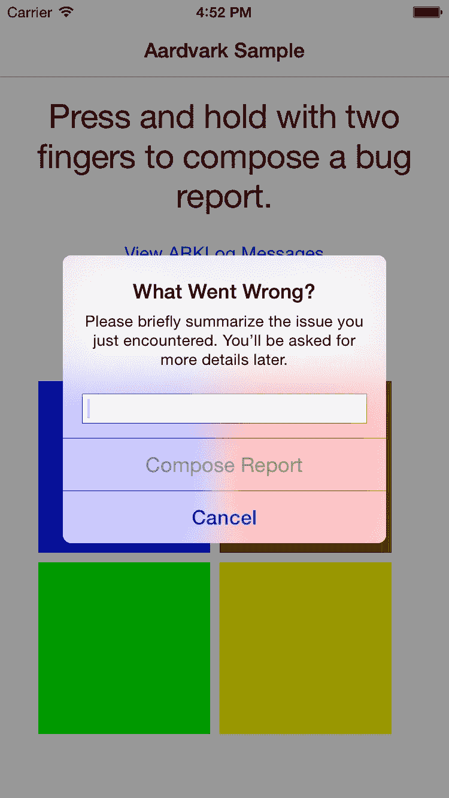
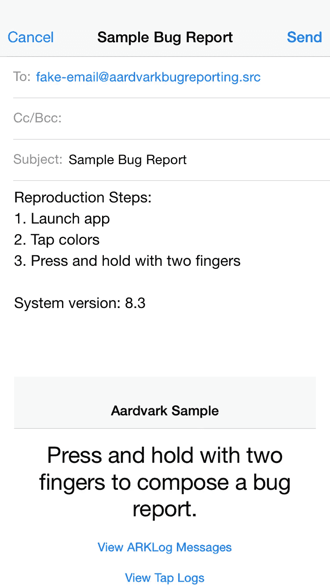
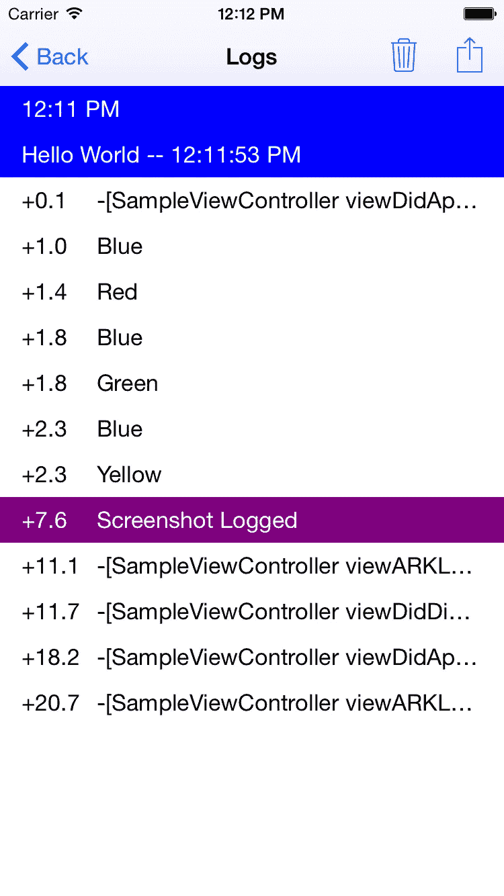
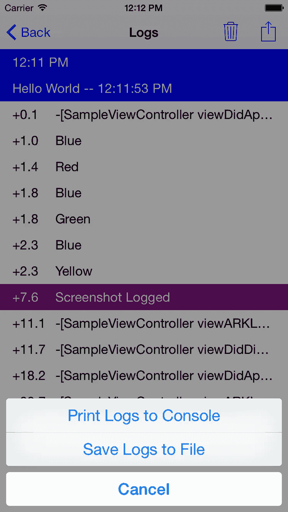
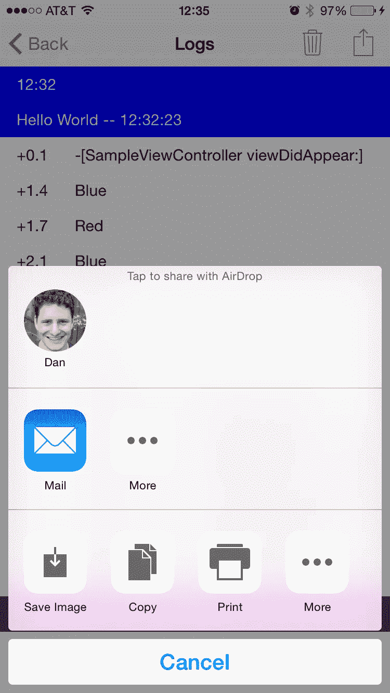

# 食蚁兽:你的木头发出啧啧声，你的虫子舔过

> 原文：<https://medium.com/square-corner-blog/aardvark-your-logs-slurped-your-bugs-licked-b57f972e129a?source=collection_archive---------6----------------------->

## 一个 iOS 库，提供及时且可操作的错误报告

*由* [*丹费德曼*](https://medium.com/u/5755ab427632?source=post_page-----b57f972e129a--------------------------------) *撰写。*

> 注意，我们已经行动了！如果您想继续了解 Square 的最新技术内容，请访问我们的新家[https://developer.squareup.com/blog](https://developer.squareup.com/blog)

# 可怕的电子邮件

我们都经历过这样的挫折:得到一个错误报告，却没有足够的信息来追踪它。邮件到达你的收件箱:“嘿，我试着做 X，但没成功。”没有内部版本号，没有截图，也没有解释“试过”或“没用”实际上是什么意思。你知道你有一个 bug，但是你没有找到它所需要的东西。你拼命给记者发电子邮件，寻求你需要的信息。也许你甚至会给他们发送如何从他们的设备导入控制台日志的说明。当他们回复你的时候，他们已经更新了他们的版本，他们的日志已经翻过来了，他们不知道如何重现他们所看到的。

很难提出一个好的 bug。没有人的记忆是完美的——一个花时间报告错误的人只会从他们的一天中抽出这么多时间来让你知道你是如何搞砸的。所以让我们卸下测试者的负担。

# 进入食蚁兽

Aardvark 是一个全面的日志记录系统，它可以非常容易地记录应用程序中的每个事件，并在您需要的时候从设备上获取这些日志:当 bug 被提交时。当有人看到出错时，他们需要做的只是用两个手指按住。Aardvark 获取一个截屏，询问客户哪里出错了，然后生成一个电子邮件错误报告，其中附有您的日志和截屏。现在你有了一个可操作的错误报告。

Aardvark 还内置了一个日志查看器，因此你可以直接在设备上查看日志，而不必编写电子邮件。当您在模拟器中工作时，您可以将日志导出到文件或打印到控制台。当你在设备上工作时，你可以随意使用 Airdrop。

更好的是，Aardvark 可以轻松地连接到你的应用程序中。用 ARKLog 替换所有 NSLog 调用，开始登录 Aardvark。然后用一行代码建立错误报告。就是这样！

# 日志一次，到处发

Aardvark 不仅仅是一个 bug 归档工具——它能够管理你所有的日志需求。如果您不仅使用日志记录来帮助跟踪 bug，还可以跟踪客户如何与您的应用程序交互(以及了解客户在崩溃发生前正在做什么)，您可以使用 Aardvark 将这些日志发送给其他服务。

怎么会？当您调用 ARKLog 时，Aardvark 会将该日志发送给日志分发器，后者会将该消息通知给它的每个日志观察者。然后，每个日志观察器都会使用日志，并确保它到达需要的地方。想要将您的日志转发到[crash lytics](https://www.crashlytics.com/)(Square 使用的令人敬畏的崩溃报告工具)？有了 Aardvark，你只需要 10 行代码就可以做到。只需在默认的日志分发器中添加一个日志观察器，当它收到消息时就会调用 CLSLog。

# 总是记录

还记得那次你把太多的 NSLog 语句放入你的应用程序，它慢得像爬行一样吗？ARKLog 不会发生这种事。Aardvark 对调用它的队列只做一件事:构造发送给它的格式字符串。一旦字符串被构造，Aardvark 就异步地将字符串分派到一个串行后台队列进行处理。担心这些日志会耗尽内存？不要这样。Aardvark 的 ARKLogStore 利用后台队列将日志直接序列化到磁盘上。它甚至可以为您将日志文件的大小保持在最小。只有当一个 bug 被归档时，它才会将日志放入内存。

# 捐助

我们希望[食蚁兽](https://github.com/square/Aardvark)对你和对我们一样有用，我们希望你能反馈你所做的任何改进！

*本帖是 Square 的“* [*周 iOS*](https://corner.squareup.com/2015/06/a-week-of-ios.html) *”系列的一部分。*

 [## 丹·费德曼

### 请关注丹·费德曼在 Medium 上的最新活动。57 个人在关注丹·费德曼，看看他们的故事…

medium.com](/@dfed)