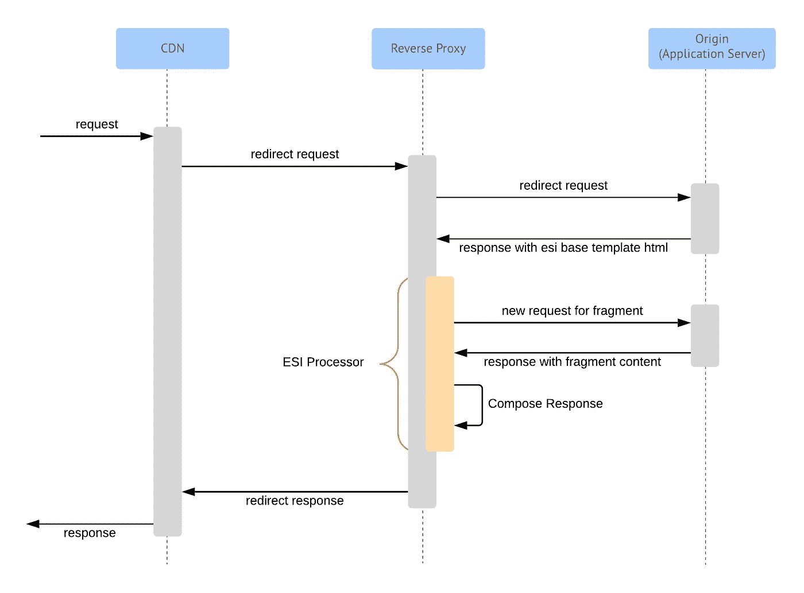

# A/B 测试与缓存

> 原文：<https://medium.com/walmartglobaltech/ab-testing-x-caching-a821e95df015?source=collection_archive---------0----------------------->

## 我们是如何在世博会上两全其美的

Image credit: [holdentrils](https://pixabay.com/users/holdentrils-297699/)

让我先告诉你我是如何开始这个项目的。

我加入了沃尔玛全球科技，致力于我们名为 Expo 的内部 A/B 测试和实验平台。我加入公司已经一两个月了，当然，我还在入职过程中。那天，一位同事转向我，问我是否将负责处理 Expo 问题，包括 ESI 模板缓存。

不用说，我很困惑。他简要介绍了什么是 ESI 模板，如何设置反向代理来缓存它们，为什么会出现问题，以及他们提出的解决方案。这有点道理。他们对这个问题有一个有效的解决方案，但其中有一些空白，我想这是因为我对这个问题缺乏了解。

第二天，我们与反向代理团队开会讨论了这个问题，并讨论了恢复工作的时间表。老实说，我对这个问题仍然了解不够，无法完全理解它。不过，我可以在会上说，过去有过不幸的经历，我很高兴我的经理处理了大部分对话。直到后来，我才知道这个团队曾经在生产环境中启用过缓存，但是并没有像预期的那样运行。因此，人们不急于再试一次。

问题是缓存是不可避免的。对于像 Walmart.com 这样的高流量网站，总是迫切需要通过支持更多的并发用户或更快的加载时间来增加用户转换，而仅仅利用代码优化或增加更多的计算能力并不总是解决问题的办法。缓存在任何网站架构中都扮演着重要角色，它被用于许多不同的场景中。例如，浏览器缓存、内容传递网络(CDN)层缓存、反向代理缓存、内存缓存、分布式缓存等。

然而，因为我们有一个 A/B 测试平台，它会故意为不同的用户更改站点，以便比较他们的行为，所以在某些情况下启用缓存可能会导致参与 A/B 测试的用户看到错误的体验。发生这种情况仅仅是因为缓存系统的性质，它保存以前生成的数据，为访问该站点的下一个用户服务。例如，让我们假设两个用户发出相同的请求。第一个用户被分配到治疗 a。第二个用户被分配到治疗 B，但获得了治疗 a 的缓存响应。这使得第二个用户的体验对于测试无效，因为他们看到的站点版本与前一个用户看到的相同。

因此，作为沃尔玛 A/B 测试平台的所有者，我们不得不推迟任何涉及前端或后端应用程序缓存的计划，直到我们找到合适的解决方案。

## 第一次尝试

Expo 团队提出的第一个解决方案是让我们的分配引擎生成一个通用的缓存键扩展，可以添加到任何缓存系统的键中。

因为当用户访问网站时，Expo 作业是全球生成的，所以我们预先知道每个用户被分配的所有实验及其变化的组合。利用这些信息，我们生成了一个 cookie，它对于每个实验任务的组合都是独一无二的。然后，缓存系统可以将该值附加到其缓存键，以确保在将数据保存到缓存存储时考虑到分配。

这种解决方案的问题是，用户可能拥有的分配组合的数量取决于系统中运行的实验数量。通过将该 cookie 作为其缓存键的一部分添加到缓存系统中，组合的数量会大大增加，从而导致缓存系统对其数据存储进行分段。这大大降低了缓存解决方案的效率，因为它增加了从存储中获取数据的时间，并迫使它更频繁地释放空间。

## ESI 模板的问题

ESI 代表边缘侧包含。这是一个模板解决方案，允许在网络边缘进行动态内容组装。它可以在内容交付网络(CDN)上、在反向代理中或者甚至直接在浏览器中实现。

该规范定义了许多可以在语言中使用的标签，但是对于本文，让我向您展示一个简单的模板。在下面的例子中，您将看到模板有一些自定义内容，并包括来自另一个 HTML 页面的内容作为最终结果的一部分。

ESI template implementation example

因为我们在反向代理层中实现了 ESI 处理器，所以上面的模板将如何处理的大致序列图如下所示。反向代理负责识别 ESI 模板是否已加载，并执行内部请求以构成最终响应。

ESI implementation on Reverse Proxy

现在，正如您所看到的，单个请求可以触发反向代理执行多个请求，这不是最佳的。这很容易给反向代理或提供模板或多个模板中使用的片段的应用服务器带来压力。最小化这个问题的方法是在反向代理上为模板页面和过度使用的片段启用缓存。

但是，如果正在运行的 A/B 测试修改了一个 ESI 基本模板页面或一个片段，会发生什么呢？缓存系统需要根据用户的分配提供每个页面的正确版本。当然，正如前面所解释的，他们可以通过添加我们的缓存键扩展 Cookie 来实现这一点，但是这将会很快对他们的数据存储进行碎片化，并且这将是无效的。事实上，这个问题正是第一次在生产中打开缓存时所发生的。

解决方案是预处理 Expo 缓存密钥扩展 cookie，并根据请求是否针对 ESI 模板来优化其值。

实验中添加了一个标记来标记修改这些页面的实验，然后使用该信息来重新计算每个请求的扩展 cookie 值。逻辑比较简单。我们检查请求是否针对 ESI 模板页面。如果是基础模板，检查用户分配，看他是否被分配到任何标记的实验。如果他没有被分配到这些实验中的任何一个，用一个常量值重写 cookie。否则，如果他被分配到这些实验中的任何一个，则只考虑标记的实验来计算新的缓存键。这种情况只发生在请求流上，在某种程度上，这些优化的 cookies 永远不会在响应中持久化。

以上是一个很好的解决方案，事实上，沃尔玛在这方面有专利，但实施起来可能会很棘手。

首先，它只适用于在反向代理上或请求流之后建立的缓存系统。它不允许在浏览器或 CDN 层上使用任何缓存。第二个问题是，所有的请求都必须经过这个逻辑，这使得网站总体上运行缓慢。但是，棘手的部分是，只有在 DevOps 团队、应用程序开发团队和我们的团队之间正确协调设置时，它才起作用。要使这个解决方案正常工作，需要正确设置一切。事实往往并非如此，因为团队总是对他们的应用程序进行更改，并修改 DevOps 配置。

当我们最终正确设置好所有系统后，我们执行了 A/B 测试来检查启用缓存是否会提高站点的性能，令我们惊讶的是，事实并非如此。我们发现在我们的反向代理层中启用缓存并没有像预期的那样执行，我们不得不关闭它。

## 自定义缓存键扩展

随着时间的推移，一些工程团队不得不推动，他们开始实施其他缓存解决方案，即使这意味着不支持使用我们的平台进行 A/B 测试。由于这个问题仍然悬而未决，寻找更强有力的通用解决方案的压力越来越大。

我们需要一个可以在任何缓存解决方案上工作的解决方案。这允许应用程序开发团队选择他们想要使用的缓存技术。这将允许他们利用 CDN 层缓存，甚至在需要时利用用户的浏览器缓存。最重要的是，我们需要一些性能足够好，不会影响网站的东西。

事实证明，这个解决方案并不难实现。它是上述两者的结合。我们需要允许我们的赋值引擎为特定的应用程序生成定制的缓存键扩展。与我们在赋值时生成现有缓存键扩展的方式相同，我们可以生成针对特定应用程序优化的其他扩展。

优化过程与之前描述的类似。我们添加了一个选项，允许用户用影响使用这些扩展的应用程序的处理来标记实验，并且我们在实验分配过程之后立即使用该信息来计算它们。这样，所有缓存键扩展都是在分配时生成的，并保存在 cookies 中，直到为用户会话计算新的分配为止，从而减轻了任何重大的性能影响。

这种解决方案的主要优点之一是，应用程序开发团队可以选择几乎任何缓存解决方案，只要他们将我们的扩展添加到他们的缓存键中。例如，我们目前有一个应用程序对后端请求使用反向代理缓存，对 XHR 请求使用客户端浏览器缓存。

当然，我们必须限制要生成的缓存键的数量，这一点很重要，但我们对这一机制有完全的控制权，这完全是根据应用程序开发工程团队的需求来调整的。

## 经验教训

这个项目的一个重要教训是拥有一个内部平台进行 A/B 测试的价值。能够按照我们的意愿定制它对于能够交付这样的特性是至关重要的。我们进行了多次项目迭代，以略微不同的需求解决这个问题，这是一个真正的团队努力，以达到我们现在对问题的理解水平，并能够为公司提供一个健壮的解决方案。

另一个教训是与应用工程团队真诚地坐下来，听听他们对问题的想法。我们有一个团队努力保持他们的应用程序稳定，我们让他们应用急需的缓存解决方案。他们在战壕里战斗，以保持网站的正常运行，对我们来说，认真听取他们在这个问题上的意见并找到共同点真的很重要。

总而言之，我们最终设法为需要启用缓存的应用提供了一个健壮的解决方案，同时仍然支持使用我们的平台进行 A/B 测试。

## 参考

[1]:(2001 年 8 月 4 日)。 *ESI 语言规范 1.0*【https://www.w3.org/TR/esi-lang/ 