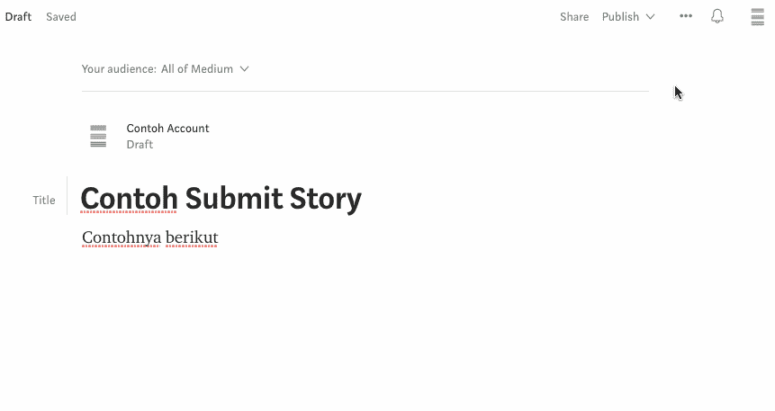

# About Easyread

> 原文：<https://medium.easyread.co/about-easyread-74b20960e180?source=collection_archive---------0----------------------->

[**Easyread**](https://medium.com/easyread) adalah sebuah *publication* yang berbasis komunitas di Indonesia. Dimulai dari *programmer-programmer* Indonesia yang gemar membaca dan menulis maka terbentuklah *publication* ini. Easyread berusaha menjadi wadah yang memberikan kemudahan buat rekan-rekan *programmer* untuk saling berbagi cerita dalam satu media.

brother from unsplash by [juan-pablo](https://unsplash.com/photos/7f_gsUxmiOQ)

Seperti yang kita ketahui, kita seringkali merasakan kesulitan ketika mencari artikel berbahasa Indonesia ataupun artikel yang mudah dipahami mengenai *Software Engineering* di [Medium](https://medium.com) . Karena itu alangkah baiknya jika kita membuat sebuah media yang digunakan sebagai sarana berbagi informasi melalui artikel-artikel yang kita tulis.

Berikut adalah hal penting yang berhubungan dengan *publication* ini.

*   Seorang *writer* (penulis) tidak diwajibkan untuk selalu menerbitkan tulisannya di Easyread. Penulis dapat menerbitkan tulisannya dimanapun. Hal tersebut merupakan wewenang penuh penulis.
*   Easyread hanya menerima tulisan yang berkaitan dengan *software engineering* seperti: *Programming* , *Data Engineering, Machine Learning, Programmer Life* , *Framework* , *Product* , *UI/UX Design* , *Start-up* dsb.
*   Tulisan yang sudah dikirim ( *submit* ) ke Easyread, diharapkan untuk tidak di hapus meskipun setiap penulis memiliki hak penuh pada artikelnya. Karena sebelum tulisan diterbitkan di Easyread telah dilakukan proses review terhadap artikel penulis.
*   Easyread juga menerima tulisan berbahasa Indonesia ataupun *English* . Tidak ada prioritas untuk kedua bahasa tersebut. Tulislah dalam bahasa yang anda lebih nyaman dan suka pada tulisan anda.
*   Tulisan yang dikirim oleh setiap penulis harus merupakan tulisan original atau karya penulis sendiri. Easyread menentang tindakan plagiarisme. Jika pada tulisan ditemukan tindakan plagiarisme, maka tulisan tersebut akan dihapus dari Easyread. Jika penulis menulis tulisan yang menyertakan kutipan atau isi dari sumber tertentu, penulis harus mencantumkan *link* original sumber kutipan atau isi tersebut.

# Submit Story

Adapun langkah untuk mengirimkan tulisan anda dibagi berdasarkan status anda pada Easyread. Adapun status penulis pada Easyread ialah

*   **Writer**

Status ini berlaku bagi setiap penulis yang sudah terdaftar sebagai penulis di Easyread

*   **Guest**

Status ini berlaku bagi penulis yang belum terdaftar di Easyread tetapi ingin mempublikasikan tulisannya di Easyread.

## Tahapan mengirim tulisan oleh penulis berstatus “writer”

Untuk *writer* langkah pengiriman tulisan adalah sebagai berikut.

*   Edit dan tulislah tulisan anda sampai lengkap dan selesai.
*   Setelah selesai, lakukan *review* pada tulisan anda tersebut. Pastikan tidak terdapat pengetikan yang salah ( *typo* ) ataupun kalimat-kalimat yang ambigu dan sulit dimengerti
*   Kemudian pada sudut kanan atas halaman anda klik menu. Pilih “ *Add to publication* ” lalu pilih “ *Easyread”.*
*   Lalu pilih “ *Submit draft* ” maka tulisan anda telah terkirim ke Easyread untuk kami review. Jika tulisan anda disetujui, maka selamat tulisan anda telah berhasil muncul di publikasi Easyread 😎

## Tahapan mengirim tulisan oleh penulis berstatus “guest”

Bagi penulis yang ingin mempublikasikan tulisannya di Easyread dan ingin bergabung menjadi *writer* pada Easyread, dapat mengirimkan *link* tulisannya ( *link draft* ataupun *link* yang sudah *publish* di Medium) ke alamat email **admin@easyread.co** agar tulisan anda dapat direview dan jika tulisan anda disetujui, maka selamat tulisan anda telah berhasil muncul di publikasi Easyread dan anda telah menjadi *writer* pada Easyread 😎