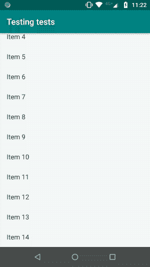
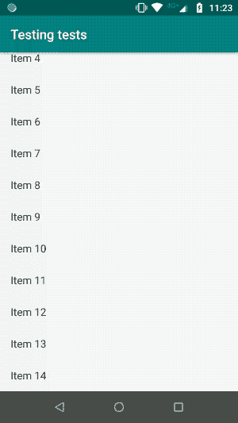

# 关于清单，零食，以及为什么他们合不来。

> 原文：<https://medium.com/google-developer-experts/about-lists-snackbars-and-why-they-dont-get-along-4c9ea11258f1?source=collection_archive---------2----------------------->


Image from [Johannes Plenio](https://www.instagram.com/jplenio/) — [Pixabay](https://medium.com/u/a640208c527a?source=post_page-----4c9ea11258f1--------------------------------)

最近，我一直在开发核心的纽约时报阅读应用的一个新功能，我遇到了一个非常具有挑战性的问题:每当用户点击列表中的一项时，就会出现一个永久的`Snackbar`。因为`Snackbar`应该被锚定到`RecyclerView`的下端，所以列表的最后一个元素总是至少被部分覆盖，并且不可访问。



We can see the last item being always covered

我们与团队的其他成员讨论了几种解决方案:我们试图使用`CoordinatorLayout`，但是由于`[Snackbar](https://developer.android.com/reference/android/support/design/widget/Snackbar.html?hl=en)` [不是](https://developer.android.com/reference/android/support/design/widget/Snackbar.html?hl=en) `[View](https://developer.android.com/reference/android/support/design/widget/Snackbar.html?hl=en)`，这种方法显得相当复杂；我们讨论过在列表末尾添加一个空的`View`，或者一些空格，但是我们没有被说服。

因此，在我的黑客日期间，我决定探索另一个解决方案:一般的想法是利用回调，这样当`Snackbar`可见时我可以得到警告。`BaseCallback<T>`提供了两个方法来覆盖，这两个方法将在`Snackbar`显示后被触发，并在 is 消失后被触发。

## 代码

主要思想是利用显示事件来提升内容——仅在需要时——并在`Snackbar`不再可见时降低内容。因为我们希望这尽可能平滑，所以我们在显示了`Snackbar`之后更新了间距，但是我们不会使用其他事件:这个方法将在`Snackbar`已经消失之后被触发，所以我们会看到一个小故障。

我们将使用`Snackbar`上的`Action`，这样我们就可以在动画开始之前重置间距，从而掩盖故障:

推动利润波动的逻辑非常简单，但我花了几个小时才完全理解。我们要做的第一件事是检查适配器中的最后一项是什么。

下一步将是`RecyclerView`的实际移动:我们创建一个新的`ConstraintSet`并从根`ConstraintLayout`克隆它，然后我们应用一个基于`Snackbar`高度或 0 的边距(当这样的条不再显示时)，然后我们将这个设置应用到根。

此时，如果所选项目是最后一项，我们滚动列表，以便每个项目都可见:

该代码基于几个特定于我们案例的假设:

*   我们的元素比`Snackbar`高，所以栏只能覆盖其中一个——这样我们只需要关心最后一项。
*   在我们的场景中，当我们按下`Snackbar`上的动作按钮时，我们被带到另一个屏幕，因此用户将看不到退出动画。
*   如果感兴趣的项目是最后一个，我们只想滚动—因为我们在底部添加了边距，用户仍然可以滚动并看到所有内容。

我们还需要在每次迭代中创建一个新的`SmoothScroller`实例，否则我们的应用程序会开始抱怨它被重用:

```
W/RecyclerView: An instance of SmoothScroller was started more than once. Each instance ofSmoothScroller is intended to only be used once. You should create a new instance for each use.
```

需要使用一个`SmoothScroller`，它是`LinearSmoothScroller`的一个小扩展，这样我们可以定义一个滚动速度，这个速度在屏幕的其余部分看起来很好，但它可以很容易地进一步阐述:

最终结果看起来相当不错，即使我对列表的退出行为不是 100%满意:



## 结论

这段代码实际上是根据我们所面临的问题而定制的，它可以很容易地根据可见项目的数量进行定制。

如果你想检查代码并尝试一下——也许能找到更好的解决方案——你可以在 [GitHub](https://github.com/tiwiz/AndroidXSharedTest) 上找到。