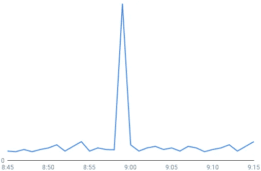
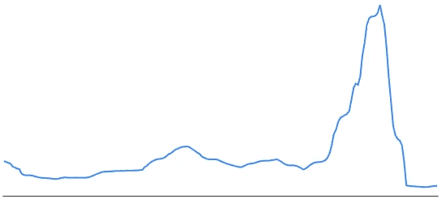

# 抽象分片与 Vitess 和分布式死锁

> 原文：<https://medium.com/square-corner-blog/abstracting-sharding-with-vitess-and-distributed-deadlocks-3128d7c8ffd1?source=collection_archive---------2----------------------->


> 注意，我们已经行动了！如果您想继续了解 Square 的最新技术内容，请访问我们在 https://developer.squareup.com/blog[的新家](https://developer.squareup.com/blog)

对于 Cash App 来说，Vitess 如此成功的一个主要原因是它从应用程序代码中抽象出了数据库分片。这允许我们共享数据库，而无需在应用程序中重写数千个事务。

当应用程序在不同分片上的两个实体组上发出写操作时，Vitess 将自动在所有分片上打开完成操作所需的事务。

这里有一个例子。假设爱丽丝住在碎片 1 上，鲍勃住在碎片 2 上:

这个特性有两个明显的缺点:

1.  原子性:如果第一个事务提交，第二个事务不能保证提交。默认是尽力而为的方法。我们仍然不得不重写任何处理资金流动的交易代码，因为我们不能承受一致性方面的任何损失。参见[杰西关于运动的帖子](/square-corner-blog/remodeling-cash-app-payments-539e1f6c4276)了解我们是如何解决这个问题的。
2.  所有的碎片一起提交，因此一个碎片上的任何锁都将被持有，直到所有其他碎片也提交。

我们认为这种权衡是值得的，因为我们已经达到了我们的容量极限，并希望尽快碎片化。

在我们第一次分片后不久，我们看到了服务中的几次短暂中断。所有请求都会挂起一分钟，然后失败，但之后一切都会恢复正常。我们的指标显示了三个事实:Vitess 事务池已满，QPS 降至零，MySQL 线程数激增。从我们的日志中，我们还看到 Vitess 在一分钟后就终止了事务。一旦池满了，一分钟内就不会有任何请求得到服务，从而导致停机。



Example MySQL thread count spike during an outage.

有更紧迫的容量问题，所以每个人都专注于分割成更多的碎片，我们希望有更多的碎片可以缓解这个问题。当我们达到 16 个碎片时，中断变得更加频繁，这成了我的首要任务。

当查询挂起时，第一反应是查看锁定。MySQL 在其`information_schema`中提供了几个有用的表，特别是`innodb_lock_waits`和`innodb_trx`。由于这个问题是间歇性的，我们开始通过设置一个`pt-stalk`进程来观察我们的数据库，并在 MySQL 线程数超过某个阈值时触发。

我们使用这个查询来查看哪些事务正在运行，哪些事务被阻塞:

```
SELECT
 TIMESTAMPDIFF(SECOND, rt.trx_wait_started, NOW()) AS wait_time,
 rt.trx_query AS waiting_query,
 w.blocking_trx_id,
 bt.trx_query AS blocking_query
FROM information_schema.innodb_lock_waits w
JOIN information_schema.innodb_trx rt
 ON w.requesting_trx_id=rt.trx_id
JOIN information_schema.innodb_trx bt
 ON w.blocking_trx_id=bt.trx_id;
```

结果是数百个类似下面的`insert`和`update`查询:

```
wait_time: 11
waiting_query: update notifications set ...
blocking_trx_id: 253762323865
blocking_query: NULL
```

`innodb_lock_waits`表显示了阻塞事务，但是由于阻塞事务是空闲的，我们永远看不到它在运行什么查询，不幸的是 MySQL 没有显示事务先前执行的语句。

由于 Vitess 保持事务打开，直到所有碎片都准备好提交，我有一种预感，空闲事务是那些保持打开，但等待另一个碎片上的工作完成的事务。如果以相反的顺序更新碎片，这可能会导致两个碎片之间的分布式死锁。考虑这个场景:

由于`insert`查询持有锁，`A`等待`B`，而`B`等待`A`，这是一个死锁。对于普通死锁，MySQL 通过检测两个事务中持有的锁的循环并中止其中一个事务来提供死锁预防。然而，在分布式死锁的情况下，每个数据库都不知道其他碎片上持有的锁，所以它不知道存在死锁，查询一直等到超时。

因为插入操作锁定了表的末尾，所以没有其他事务可以插入到两个分片上的这些表中，所有请求将迅速滚雪球，填满事务池并锁定整个服务。

修复方法是将应用程序级别的事务拆分为每个分片一个事务。上面的例子看起来像这样:

当我们修复了最频繁的应用程序级事务以避免交叉碎片写入时，我们立即看到 MySQL 锁等待时间有了很大的改善，中断也消失了。



MySQL lock waits increasing with shard count over a few months, then dropping off after the fix.

我们被 Vitess 提供的抽象蒙蔽了双眼，没有意识到碎片之间持有的锁没有死锁检测。这凸显了从应用程序中抽象出分片，而没有仔细考虑锁在幕后如何工作的危险。

现在可以理解为什么有更多的碎片会加剧这个问题了:使用多个碎片的可能性增加了，对大量客户执行更新需要更多的时间，持有锁的时间也更长了。

我们仍然认为这种权衡是值得的:死锁是几个月前 shard 的一个小代价，可以避免更大的停机。

这篇文章是 Square[Vitess 系列](/square-corner-blog/sharding-cash-10280fa3ef3b)的一部分。