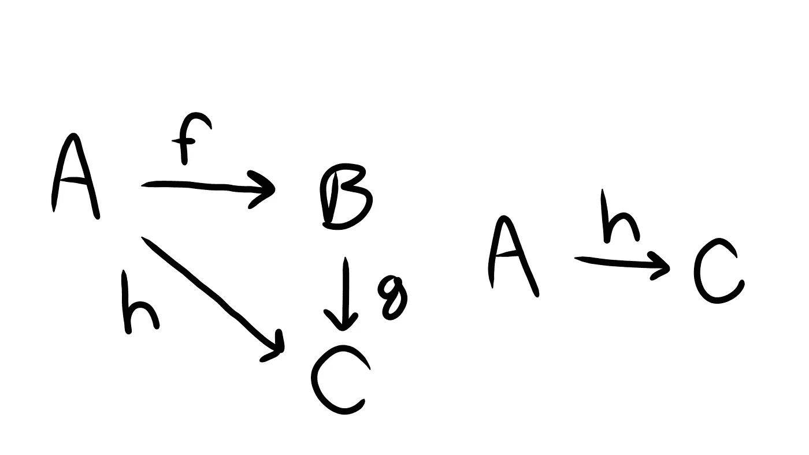

# 抽象与构成

> 原文：<https://medium.com/javascript-scene/abstraction-composition-cb2849d5bdd6?source=collection_archive---------0----------------------->


Smoke Art Cubes to Smoke — MattysFlicks — (CC BY 2.0)

> **注:**这是《作曲软件》系列的一部分**s**[(现在一本书！)](https://leanpub.com/composingsoftware) 从基础开始学习 JavaScript ES6+中的函数式编程和组合软件技术。敬请关注。还会有更多这样的事情发生！
> [买书](https://leanpub.com/composingsoftware) | [索引](/javascript-scene/composing-software-the-book-f31c77fc3ddc)|[|<上一张](/javascript-scene/curry-and-function-composition-2c208d774983) | [下一张>](/javascript-scene/abstract-data-types-and-the-software-crisis-671ea7fc72e7)

我在软件开发方面越成熟，我就越重视基础知识——当我还是初学者时，这些知识看起来微不足道，但现在随着经验的积累，它们具有深远的意义。

> “在空手道武术中[……]黑带的骄傲象征是佩戴足够长的时间，以便染料褪色为白色，以象征回到初学者状态。”~约翰·梅达，[《简约法则:设计、技术、商业、生活》](https://www.amazon.com/Laws-Simplicity-Design-Technology-Business/dp/0262134721/ref=as_li_ss_tl?ie=UTF8&qid=1516330765&sr=8-1&keywords=the+laws+of+simplicity&linkCode=ll1&tag=eejs-20&linkId=287b1d3357fa799ce7563584e098c5d8)

根据谷歌词典，抽象是“独立于事物的关联、属性或具体伴随物来考虑事物的过程”。

抽象这个词来自拉丁语动词 *abstrahere* ，意思是“抽离”。我喜欢这种洞察力。抽象是关于移除事物的——但是我们移除的是什么，目的是什么？

有时我喜欢将单词翻译成其他语言，然后再翻译回英语，以获得我们在英语中不常想到的其他联想。当我把“抽象”翻译成意第绪语再翻译回来时，结果是“心不在焉”。我也喜欢这个。一个心不在焉的人在自动驾驶仪上运行，没有积极地思考他们在做什么…只是在做。

抽象让我们安全地自动驾驶。所有的软件都是自动化的。如果有足够的时间，你在电脑上做的任何事情，你都可以用纸、墨水和信鸽来做。软件只是处理那些手工处理起来太耗时的小细节。

所有的软件都是抽象的，隐藏了所有的艰苦工作和无脑的细节，而我们却从中获益。

许多软件过程被一次又一次地重复。如果在问题分解阶段，我们决定一遍又一遍地重新实现重复的东西，那将需要很多不必要的工作。至少这是愚蠢的。在许多情况下，这是不切实际的。

相反，我们通过编写某种组件(函数、模块、类等等)，给它一个名字(身份)，并尽可能多次地重用它来消除重复。

分解的过程就是抽象的过程。成功的抽象意味着结果是一组独立有用且可重组的组件。由此我们得到了软件架构的一个重要原则:

软件解决方案应该可以分解成它们的组成部分，并且可以重新组合成新的解决方案，而不需要改变内部组件实现的细节。

# 抽象是简化的行为

> "简单就是减去明显的东西，加上有意义的东西."~约翰·梅达，[《简约法则:设计、技术、商业、生活》](https://www.amazon.com/Laws-Simplicity-Design-Technology-Business/dp/0262134721/ref=as_li_ss_tl?ie=UTF8&qid=1516330765&sr=8-1&keywords=the+laws+of+simplicity&linkCode=ll1&tag=eejs-20&linkId=287b1d3357fa799ce7563584e098c5d8)

抽象过程有两个主要部分:

*   **概括**是在重复的模式中寻找*相似性*(明显的)并将相似性隐藏在抽象背后的过程。
*   **专门化**是使用抽象的过程，只为每个用例提供*不同的*(有意义的)。

抽象是提取概念的潜在本质的过程。通过探索不同领域的不同问题之间的共同点，我们学会了如何跳出我们的思维定势，从不同的角度看待问题。当我们看到一个问题的本质时，我们发现一个好的解决方案可能适用于许多其他问题。如果我们很好地编写解决方案，我们可以从根本上降低应用程序的复杂性。

> "如果你以深刻的觉知触摸一件事物，你就触摸了一切."~一行禅师

这个原则可以用来从根本上减少构建应用程序所需的代码。

# 软件中的抽象

软件中的抽象有多种形式:

*   算法
*   数据结构
*   模块
*   班级
*   结构

我个人最喜欢的是:

> “有时候，优雅的实现只是一个函数。不是方法。不是一个班。不是框架。只是一个功能。”~约翰·卡马克(Id 软件，Oculus VR)

函数是很好的抽象，因为它们拥有良好抽象所必需的品质:

*   **身份** —为其指定名称并在不同的上下文中重用它的能力。
*   **组合** —将简单函数组合成更复杂函数的能力。

# 通过构图进行抽象

软件中最有用的抽象函数是*纯函数*，它们与数学中的函数共享模块化特征。在数学中，给定相同输入的函数将总是返回相同的输出。可以把函数看作输入和输出之间的关系。给定一些输入`A`，函数`f`将产生`B`作为输出。你可以说`f`定义了`A`和`B`之间的关系:

```
f: A -> B
```

同样，我们可以定义另一个函数`g`，它定义了`B`和`C`之间的关系:

```
g: B -> C
```

这个*意味着*另一个函数`h`，它定义了从`A`到`C`的直接关系:

```
h: A -> C
```

这些关系构成了问题空间的结构，而您在应用程序中组合函数的方式构成了应用程序的结构。

好的抽象通过隐藏结构来简化，同样的方式`h`将`A -> B -> C`减少到`A -> C`。



# 如何用更少的代码做更多的事情

抽象是用更少的代码做更多事情的关键。例如，假设您有一个简单地将两个数字相加的函数:

```
const add = (a, b) => a + b;
```

但是您经常使用它来增加，那么固定其中一个数字可能是有意义的:

```
const a = add(1, 1);
const b = add(a, 1);
const c = add(b, 1);
// ...
```

我们可以使用 add 函数:

```
const add = a => b => a + b;
```

然后创建一个部分应用程序，将函数应用于它的第一个参数，并返回一个接受下一个参数的新函数:

```
const inc = add(1);
```

现在，当我们需要增加`1`时，我们可以使用`inc`而不是`add`，这减少了所需的代码:

```
const a = inc(1);
const b = inc(a);
const c = inc(b);
// ...
```

在这种情况下，`inc`只是一个*的专门*版本的 add。所有的抽象函数都是抽象的。事实上，所有高阶函数都是一般化的，您可以通过传递一个或多个参数来专门化它们。

例如，`Array.prototype.map()`是一个高阶函数，它抽象了将函数应用于数组的每个元素的思想，以便返回一个新的处理值数组。我们可以将`map`写成一个可定制的函数来使这一点更加明显:

```
const map = f => arr => arr.map(f);
```

这个版本的`map`接受专门化的函数，然后返回一个它自己的专门化版本，接受要处理的数组:

```
const f = n => n * 2;const doubleAll = map(f);
const doubled = doubleAll([1, 2, 3]);
// => [2, 4, 6]
```

注意，`doubleAll`的定义只需要少量代码:`map(f)`——就是这样！这就是全部的定义。从有用的抽象概念开始，我们可以用很少的新代码构建相当复杂的行为。

# 结论

软件开发人员的整个职业生涯都在创建和构建抽象——许多人没有很好地掌握抽象或构建的基础。

当你创建抽象时，你应该深思熟虑，并且你应该意识到已经为你所用的好的抽象(比如总是有用的`map`、`filter`和`reduce`)。学会识别好的抽象的特征:

*   简单的
*   简明的
*   可重复使用的
*   自主的
*   可分解的
*   可重组的

# 在 EricElliottJS.com 了解更多信息

《抽象与构成》可以作为视频课程提供给 EricElliottJS.com 的成员。如果你还不是会员，今天就注册吧。

[](https://ericelliottjs.com/product/lifetime-access-pass/)

***埃里克·艾略特*** *是* [*【编程 JavaScript 应用】*](http://pjabook.com) *(O'Reilly)的作者，也是软件导师平台*[*devanywhere . io*](https://devanywhere.io/)*的联合创始人。他为 Adobe Systems 的****Adobe Systems*******Zumba Fitness*******华尔街日报*******ESPN*******BBC****等顶级录音师贡献了软件经验*****

**他在远离任何地方的地方和世界上最美丽的女人一起工作。**