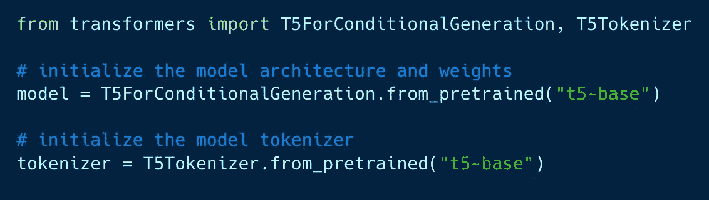

# 抽象文本摘要

> 原文：<https://medium.com/globant/abstractive-text-summarization-bccb4bf5851c?source=collection_archive---------0----------------------->

Photo by [Gülfer ERGİN](https://unsplash.com/@gulfergin_01?utm_source=medium&utm_medium=referral) on [Unsplash](https://unsplash.com?utm_source=medium&utm_medium=referral)

有两种主要的方法来自动概括文本——抽象的和摘录的。它们之间的主要区别是如何从文档中提取信息以及如何生成摘要。我试图解释这篇文章中的摘要

在这篇文章中，我们将讨论抽象概括。这种方法试图重写和重构原始文档中的文本，这更类似于人类编写摘要的方式。

抽象摘要集中于原始文本中最关键的信息，并为摘要创建一组新的句子。这项技术需要识别关键部分，解释上下文，并以新的方式重新创建它们。由于从文档中提取相关信息以及自动生成连贯文本的困难，抽象摘要被认为是一个比抽取摘要更复杂的问题。抽象概括方法与深度学习模型如 seq2seq 模型、LSTM 等一起工作良好。，以及流行的 Python 包(Spacy、NLTK 等。)和框架(Tensorflow，Keras)

## 做抽象总结的方法

那么现在当我们知道什么是抽象概括的时候，怎么做呢？做抽象概括有各种各样的方法，事实上，有许多方法的引用。但是我们不会在这里提到所有这些，因为如果我们这样做，那么这篇文章本身就需要一个总结！！😜

我们使用了 **HuggingFace 的变形金刚**库来进行抽象概括。Transformers 为我们提供了数以千计的预训练模型，可用于文本摘要以及各种各样的 NLP 任务，如文本分类、问答、翻译、语音识别、光学字符识别等。

## 什么是变形金刚？

这个名字让我们想起了著名的科幻电影《变形金刚》,但不幸的是，在这里我们看不到任何一个酷酷的机器人在变形🤖。尽管我们在这里会看到一个转变，不是机器人的转变，而是我们想要生成摘要的所有那些冗长的文本或文档的转变。

Huggingface Transformers 是一个非常受欢迎的库，其中包含了在过去几年中彻底改变了 NLP 的预训练模型。这些模型在 ML 社区获得了广泛的关注。预训练意味着这些模型以自我监督的方式在一些数据集(大量原始文本)上进行训练。在这种训练中，目标是根据模型的输入自动计算的。

## 总结过程

使用变形金刚库进行总结的最简单的方法是使用现有总结模型的“**总结** **管道**”。我们可以从 transformers 导入管道，并提供一个"**summary "**task**作为管道的字符串参数。由于我们没有指定任何模型，管道将使用默认模型[sshleifer/distilbart-CNN-12–6](https://huggingface.co/sshleifer/distilbart-cnn-12-6)。**

****

**在上面的代码中，Pipeline 是一个简单的 API，它抽象了生成摘要的大部分复杂代码，并且只接受一个参数，这是一个定义返回的管道的任务。在上面的例子中，我们使用了一个“**summary”**任务，它将返回一个 SummarizationPipeline。**

****使用训练好的模型****

**我们将使用谷歌的《变形金刚》T5 模型和它的分词器。根据《变形金刚》的官方文档，“T5 是一个编码器-解码器模型，在非监督和监督任务的多任务混合上进行预训练，每个任务都转换为文本到文本的格式。”**

**完全理解，对！！！😄。**

**简单地说，这是一个文本到文本的转换程序，所有的 NLP 任务都被重新组织成一个统一的文本到文本的格式，输入和输出都是文本串。**

****

**source: [Google AI Blog](https://ai.googleblog.com/2020/02/exploring-transfer-learning-with-t5.html)**

**下面是使用 T5ForConditionalGeneration 模型生成摘要的过程-**

*   **首先，我们将导入模型和标记器，然后初始化模型架构和权重，然后初始化标记器。**

****

**在上面的代码中，我们使用了`**from_pretrained()**` 方法来加载预先训练好的 **t5-base** 模型。t5 型号有不同的尺寸，例如-t5 小型、T5 底座、T5 大型、T5–3b 和 t511b。这些模型在训练数据集的大小和生成的摘要的准确性方面有所不同。**

**我们还初始化了一个标记器。标记化器对于将文本转换成模型可以处理的数据非常重要。模型只理解和处理数字，因此记号赋予器将提供的输入转换成数字数据。**

**当我们第一次执行这段代码时，会花费很多时间，因为 t5-base 模型将与其权重(词汇)和配置一起下载。**

*   **然后，我们创建一个变量来存储输入文本，并使用上面创建的标记器将文本编码为标记。**

****

**在上面的代码中，我们使用了`**encode()**` 方法，并传递了以下参数-**

*   ****return_tensors:** 如果设置，将返回张量而不是 python 整数列表。我们还可以用**【TF】**表示 tensor flow****pt "**表示 PyTorch，**【NP】**表示 Numpy。****
*   ******max_length:** 控制截断/填充参数之一使用的最大长度。****
*   ******截断:**激活并控制截断。****

****max_length 和 truncation 参数一起表示我们不希望原始文本绕过 512 个标记，这是 Transformers 中为标记化设置的默认限制。****

****最后一步是使用`**model.generate()**` 方法生成汇总输出。****

********

******输出******

****“垃圾食品是市场上发现的袋装油炸食品。它热量高，胆固醇高，健康营养成分低，钠矿物质低，糖、淀粉、不健康脂肪高，缺乏膳食纤维。”****

## ****限制****

****尽管上面提到的过程生成了一篇长文章的良好转换的摘要，但是这个过程有一些限制。****

*   ****如果输入文本太长，并且标记化过程超过了默认设置的 512 个标记的限制，那么我们就无法控制生成的摘要的输出。改变`**model.generate()**` 方法中的参数值，对生成的输出没有任何影响。****
*   ****所以我们不能用这个来概括一个很长的文档。即使我们想这样做，我们也需要将内容分成块，并创建这些块的摘要。最后，我们将它们结合起来，创建一个完整的输入摘要。这将使该过程成为一项乏味的任务。****
*   ****并且由于抽象摘要不仅仅提取已经存在的句子，而是使用训练的模型生成它自己的句子，所以有时生成的摘要包含那些与所提供的输入的上下文不匹配的单词。发生这种情况是因为模型在数据集上进行了训练。****

****可以使用定制数据集来重新训练预先训练的模型，但是训练模型在所使用的存储器、处理能力、处理时间等方面是非常昂贵的。我们需要非常强大的 GPU。虽然在云上有解决方案，但是这些也涉及到巨大的成本。****

## ****结论****

****这些提取和抽象的总结文章包括总结任何文本所需的所有基础知识。虽然这些不是总结文本的唯一方法，但它们肯定有助于在不损失信息质量的情况下创建冗长文本的摘要。在这个快节奏的世界里，这有助于节省时间。****

## ****参考****

*   ****[https://huggingface.co/docs/transformers/index](https://huggingface.co/docs/transformers/index)****
*   ****https://huggingface.co/blog/how-to-generate****
*   ****[https://www . thepythoncode . com/article/text-summarying-using-hugging face-transformers-python](https://www.thepythoncode.com/article/text-summarization-using-huggingface-transformers-python)****