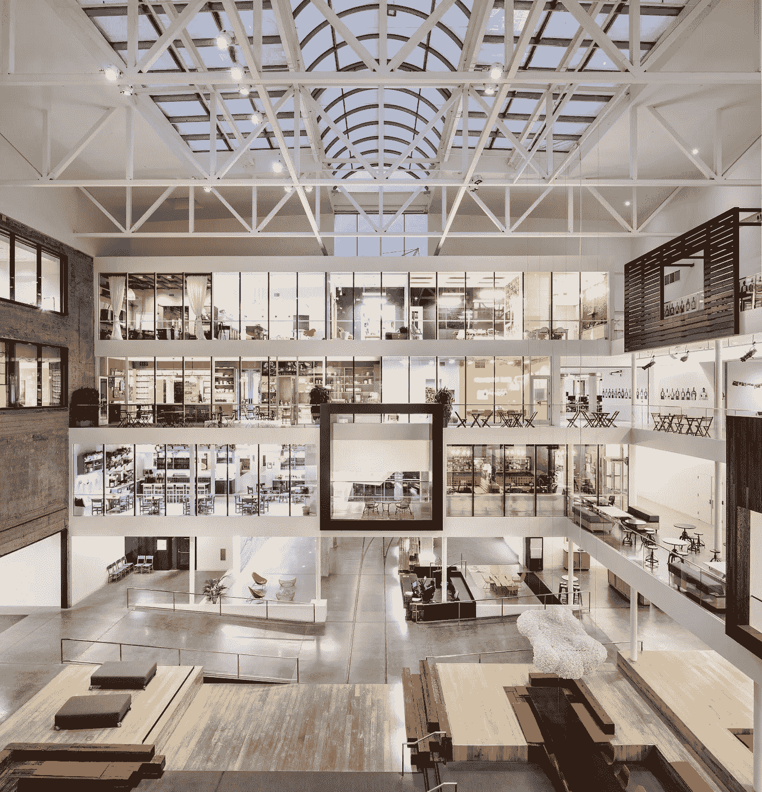

# 从学术界到数据科学

> 原文：<https://medium.com/airbnb-engineering/academia-to-data-science-99e68f36485e?source=collection_archive---------1----------------------->

由[阿夫尼什·萨卢加](http://www.cs.cmu.edu/~avneesh/)、[阿洛克·古普塔](https://www.linkedin.com/in/alokgupta83)、[库基·佩雷兹](https://www.linkedin.com/in/cukyperez)

# 介绍

当你在读研究生时，似乎唯一的职业选择就是呆在象牙塔里。这也是为什么——你的导师和同事很可能会鼓励你走他们选择的职业道路。事实上，在你周围的人中，选择偏见是很强的。当你是一名教授时，你相信你能扩展知识基础、教学和指导他人的唯一工作是在学术环境中。

然而，快速浏览一下博士劳动力市场就会发现，我们每年培养的博士人数超过了职位数量。此外，硅谷(以及整个科技行业)对许多前学者和有研究倾向的人来说一直是一个有吸引力的目的地，但从学术界到工业界的跨越并不容易。李立伟在他最近的一篇博客文章[中记录了思维模式的转变，并将这种转变框定在快速交付具有商业影响力的结果(在工业界)与交付完美的结果(在学术界)的背景下。](https://www.linkedin.com/pulse/mindset-shift-transitioning-from-academia-industry-tianhui-michael-li)

虽然我们同意这种基本的权衡，但在 Airbnb，我们觉得思维模式的转变稍微有些微妙。在这篇文章中，我们首先讨论了我们希望从学术界过渡到 Airbnb 的候选人所具备的技能(包括硬技能和软技能),然后是对那些希望进入硅谷快节奏创业世界的人的具体建议。

# 我们在学术界的数据科学家身上寻找的 4 样东西

如今，在科技公司和初创公司中，数据科学是一个超负荷的术语，指的是所有与数据相关的事物。它位于数学/统计学、商业领域知识和“黑客”的交叉点。数据科学家被要求从数据中提取见解，以推动公司的指标。在 Airbnb，这可能意味着管理数据以通知下一步启动哪个实验，或者建立一个机器学习模型以优化我们的用户体验。在 Airbnb，当考虑研究生院高级课程的候选人时，除了技术属性和与我们核心价值观的一致性，我们还考虑 4 个属性:

## 1.初学者的心态

以你的高等教育水平，我们认为你很可能是你所在领域的佼佼者，并且在你目前所接触的所有学术领域都非常成功。然而，学术上的成功和经验并不一定转化为行业上的成功。我们希望候选人头脑冷静，留意他们对业务尚不了解的东西。Airbnb 有着浓厚的导师文化和个人成长文化——来到这里并不是旅程的终点，还有很多东西需要学习。我们寻找的是那些渴望学习更多知识，并且有开放的心态去扩展他们专业领域之外的技能的人。

## 2.积极主动

我们希望博士生已经学会了自我管理的艺术。最重要的是，研究生院应该教会学生如何指导和优先考虑自己的学习。一名高级研究员通常会学习如何更早地看到死胡同，并迅速将他们的精力转向可能更有成效的方向。竞争性领域的研究也提供了挑战同行和推翻假设的机会。在 Airbnb 的数据科学中，我们预计这将转化为不接受现状，而是挑战我们假设的边界。

## 3.说到做到

有时我们会看到资深学者在交流中表现不佳。Airbnb 是一个非常协作的环境，数据科学家通常与其他数据科学家合作，但也与工程师、设计师、产品经理和非技术人员合作。擅长数据很重要，但在 Airbnb，我们需要将这些见解很好地传达给所有受众——从你团队中的数据科学家到首席执行官——否则这些建议可能不会产生应有的影响。在书面和口头交流中，见解、方法和假设的表达必须清晰、令人信服，并能引起听众的共鸣。

## 4.这是短跑，不是马拉松

在学术界发表一篇文章可能需要数年时间，但在工业界，周转时间要快得多。这并不是说质量更差，只是在 Airbnb，我们希望尽快推出数据产品的第一个版本，然后继续迭代可能改进的地方。在 Airbnb 的整个数据科学面试过程中，我们都在寻找具有创业精神、能够在发布数据产品或分享见解之前不需要完美解决方案的候选人。

# 对数据科学感兴趣的学者的 4 条建议

一个学者在离开象牙塔时的个人经历会因为他们来自的领域而有很大的不同。鉴于目前工业界和学术界在主题方面的紧密联系(特别是在计算机科学和应用经济学等领域)，研究想法和集成到最终产品之间的滞后通常是几个月，而不是几年。因此，那些实现飞跃的人通常拥有工作所需的“硬技能”，比如强大的编程和科学计算知识。然而，学习更软的技能和调整自己对行业的心态往往更难。我们将心态转变分为四大领域:

## 1.为小事担心

学术研究在从现实世界中围绕问题的混乱细节中抽象出核心问题方面做得非常好。有时，我们会得到几组经过精心策划和清理的训练数据集，并且评估是在一个记录良好的基准测试集上进行的，其他人已经对该测试集进行了评估。有些想法可能会涉及额外的数据清理，但是数据中包含的许多信息，尤其是训练标签，都是给定的。其他时候，我们可能会收集我们自己的数据，但来自严格控制的现场或实验室实验，我们可以尽量减少数据污染。

不幸的是，工业中的情况并非如此。首先，如何设置问题需要更多的思考和创造力。我们从记录的数据中提取或得到的标签是我们解决问题所需要的信号吗？仪器有什么问题吗？我们是否记录了我们需要的信息？数据科学家需要深入理解问题领域，并使用该信息来转换问题和数据，以便能够产生有意义的东西。让事物在这些快速变化的环境中工作，通常需要和抽象研究问题一样多的创造力，如果不是更多的话。

## 2.80%规则

根据这一点，在学术界，我们经常关注一个完全不同的问题体系。给定先验的高质量训练和测试数据，我们的任务通常是研究新的、最先进的解决方案，以将性能从已经很强的水平提高到更强的水平。另一方面，工业界的任务是部署一种以前从未存在过的模式。没有什么可以比较的，将内在评估指标(例如 AUC)转化为业务影响往好了说是挑战，往坏了说是危险。

考虑到这些现实，在这些情况下部署一个不完美的模型是明智的，但是“有 80%的可能性”。针对剩余 20%的性能进行优化通常不仅反映了缺乏优先级(“过早优化”)，而且还可能因为内在和外在评估指标之间的脱节而无法实现。

## 3.知识影响的最佳点

虽然迈克尔在他的[帖子](https://www.linkedin.com/pulse/mindset-shift-transitioning-from-academia-industry-tianhui-michael-li)中提到传递底线影响力比传播知识更重要，但在 Airbnb，我们认为最终目标是在这两个极端之间取得平衡。我们中的许多人最初进入学术界的动机是因为我们真正喜欢生产和传播知识，在一个行业环境中，有效地传播这些知识有着重要的价值，而不是让人们重新发明轮子。为此，Airbnb 建立了[知识库](/airbnb-engineering/scaling-knowledge-at-airbnb-875d73eff091#.16lwhqdvd)，我们最近[开源了](https://github.com/airbnb/knowledge-repo)。该存储库是我们内部的同行评审出版物论坛，我们鼓励数据科学家尽可能积极地参与其中。我们还每周举办研讨会，数据科学家或该领域的其他领导者可以在研讨会上展示他们的工作，并且在整个公司范围内鼓励导师制度。

## 4.积极主动

一个成功的研究者不仅知道难题的解决方案，而且知道该问什么问题。问正确的问题需要一种积极的态度——不要期望被交给一个问题去处理，你需要识别机会并相应地制定一个调查方向。主动询问是学术界发展成熟的技能，也是 Airbnb 鼓励顶级学者申请的原因之一。

套用一句众所周知的名言:“雇佣聪明人并告诉他们该做什么是没有意义的；我们雇佣聪明的人，这样他们就能告诉我们该做什么”。我们雇佣各种学术背景和资格的人，正是因为这些不同的优势提供了一系列独特的工具，来解决我们在 Airbnb 面临的各种有趣和挑战性的问题。

如果你有兴趣了解更多关于 Airbnb 的数据科学机会，那么你可以访问我们的职业页面[这里](https://www.airbnb.com/careers/departments/data-science-analytics)。

## 在 [airbnb.io](http://airbnb.io) 查看我们所有的开源项目，并在 Twitter 上关注我们:[@ Airbnb eng](https://twitter.com/AirbnbEng)+[@ Airbnb data](https://twitter.com/AirbnbData)