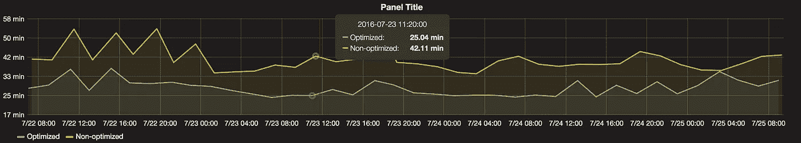

# 加速 Web 测试自动化，第 1 部分

> 原文：<https://medium.com/walmartglobaltech/accelerate-web-test-automation-part-1-e574f31938d1?source=collection_archive---------6----------------------->

在开发测试自动化时，性能可能是最后要考虑的事情。然而，有时测试的性能会变得如此重要，以至于测试结果可能会恶化。在这个**加速 web 测试自动化**系列中，我们将讨论我们对 Web 测试自动化代码基础设施所做的各种性能改进。

# 从简单开始

我们( [Testarmada](http://testarmada.github.io/) 团队)在 2014 年宣布了 [Magellan-Nightwatch](https://github.com/TestArmada/magellan-nightwatch) (MN)，Nightwatch.js 适配器。通过将 jQuery 注入到将要通过 selenium 的 [execute](https://github.com/SeleniumHQ/selenium/wiki/JsonWireProtocol#sessionsessionidexecute) api 执行命令/断言的页面中，MN 将始终确保您想要操作的元素是安全的。

例如，如果你想通过 MN 的 clickEl api 点击一个 id 为‘submit’的按钮，MN 不会点击，除非这个按钮被连续三次检查证明是可见的，每次检查都在这个按钮上执行一个 jQuery *:visible* ，如果这个按钮是可见的，返回 true。

自从 MN 被发明的那一天起，它就被用作我们在 [WalmartLabs](http://www.walmartlabs.com/) 的 nightwatch.js 的主要补丁。我们的测试自动化团队被 jQuery 出色的选择器宠坏了，比如 *:visible* 、 *:eq* 等等。他们不必担心添加冗余命令来检查他们想要操作的元素是否可操作以避免剥落。在 2015 年末，[http://testar mada . github . io](http://testarmada.github.io)被选为 Walmart labs React 平台的标准自动化解决方案。所有 git pull 请求都需要完全通过冒烟测试才能继续。事情好得不像真的。

# *随着流量的增长，总有一些性能需要改进*

2016 年初，第一个性能问题找上了我们。其中一个团队贡献了超过 170 个“冒烟”测试，因此套件执行时间超过了 1 个小时，这意味着对于该团队来说，人们必须等待至少 1 个小时才能审查和合并代码。嗯…

## 为什么慢？

MN 进行可见性检查的方式是，它不断发送 selenium 请求来执行 jQuery 的 *:visible* 选择器，直到响应中连续出现三个 true。让我们算一下。如果用户想要呼叫 clickEl，MN 将一起进行至少 4 次 selenium 呼叫(3 次具有肯定响应的可见性检查和 1 次 click)。这种 4-selenium-call 模式发生在所有 MN 命令和断言上，因为它们遵循相同的处理 *:visible* 检查的方式。硒的含量导致了缓慢。更糟糕的是，较慢的网络连接会加剧这种缓慢。

让我们做高层次的抽象。假设所有的 selenium 调用花费相同的时间，比如说 *n* 毫秒。给定一个测试套件，selenium 调用的数量将是( *m + 4)* ，其中 *m* 是可见性检查的否定响应数。此外，还有另一个因素 *w* ，即每次执行的并发数。这是一个等式

> *t(总套件执行时间)= (n * (m+4)) / w*

对于固定的 *n，*我们可以通过既不增加 *w 也不减少*(*m+4)来缩短 *t* 。*为了增加 *w* ，我们引入了分片，这意味着每次执行我们可以有更多的并发性。分片将不在第 1 部分中讨论。

要减少( *m+4)* ，我们需要尽可能的摆脱硒召唤。

## 我们能减少 m 吗？

几个不确定因素会影响 *m* ，比如网络速度(网络越慢， *m* 可能越大)，或者被测应用服务器的处理速度(处理速度越慢， *m* 可能越大)。鉴于执行环境的上下文较少，我们无法真正预测 *m* 会如何。

## *4-硒调用模式可以改变吗？*

在回答上面的问题之前，让我们仔细看看 4-selenium-call 模式。四个调用中的三个实际上在做同样的事情，*在需要的时候注入 jQuery*和*执行 jQuery 选择器。*但最重要的是，注入是通过 selenium 的同步 [execute](https://github.com/SeleniumHQ/selenium/wiki/JsonWireProtocol#sessionsessionidexecute) api 进行的，这意味着每个 jQuery 注入和选择器操作将占用一个 selenium 调用。然而，事情不一定非要这样。

## *我们能在一次硒调用中做更多的事情吗？*

答案肯定是**是**。但这并不意味着我们可以用 selenium 的同步执行 API 来实现。如果注入发生在页面还在加载的时候呢？如果所有的注射都发生在那一刻呢？因为我们无法假设页面完全加载需要多长时间，所以每次注入之间必然会有延迟。然而，execute API 不会等待延迟，它总是立即返回。为了在一个 selenium 调用中做更多的事情，我们不能再使用同步执行 api 了。

正如大多数人可能已经发现的，答案是使用异步版本的执行 API， [executeAsync](https://github.com/SeleniumHQ/selenium/wiki/JsonWireProtocol#sessionsessionidexecute_async) 。这个想法是正确的。与立即返回不同，executeAsync 将在完成所有事情后调用回调。因此，3 个 selenium 调用可以减少为 1 个 selenium 调用，在这里我们可以通过执行 jQuery selector 并使用 *setTimeout* 在每个步骤之间延迟来检查元素的可见性。听起来正是我们需要的，对吧？这个解决方案可行吗？

使用同步执行 API 的潜在好处是，无论页面是否准备好了 JavaScript 注入，它总是会返回。然而，executeAsync 不能保证这一点。executeAsync API 看起来不错，但还不够好。

如果我们混合同步和异步的优点会怎么样？如果页面不可操作(仍在加载资源、呈现或错误页面)，该函数将立即返回，并仅在页面准备就绪时进行异步可见性检查(JavaScript injectable)。

耶！就是这个！

## *该解决方案有什么帮助？*

当页面准备好时，优化来自元素的可见性检查。

1.  如果页面没有准备好，executeAsync API 的工作方式与 execute api 相同。
2.  如果页面准备好了，3-selenium-API 调用现在可以打包成一个调用。

## *测量*

测试改进的时间到了。通过使用 electrode checkout 在三个浏览器中运行两个每两小时一次的任务，共 171 个测试(总共 513 个测试)，一个使用性能改进库，一个使用旧库，持续 10 天，我们得到以下数据。

*   **非优化**:Magellan 测试平均 41 分钟完成(35 个样本的平均值)
*   **优化**:麦哲伦测试平均 28 分钟完成(35 个样本的平均值)

**改进**:(41–28)/41 =**31.7%**

# 结论

随着第一次性能改进，情况变得越来越好。如果您的测试自动化基础设施与我们的相似，并且您的执行速度很慢，请尝试一下，看看是否有帮助。请在评论里给我留言分享你的经历，这样我就可以回应了。关于这篇文章或者 web 测试自动化，如果你有什么特别的事情想让我写的话，请告诉我，我会尽力分享我所学到的。

我们仍在学习和成长。和我们在一起。

*未完待续……*