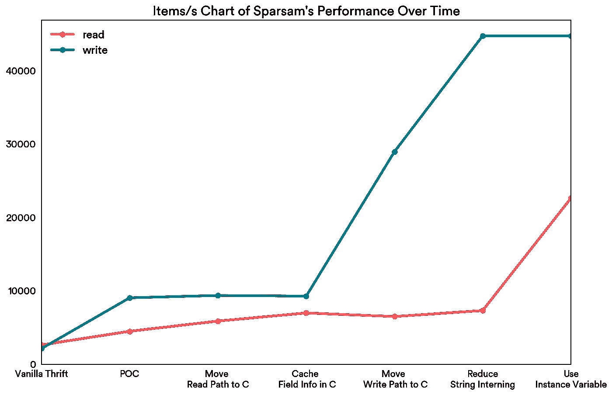
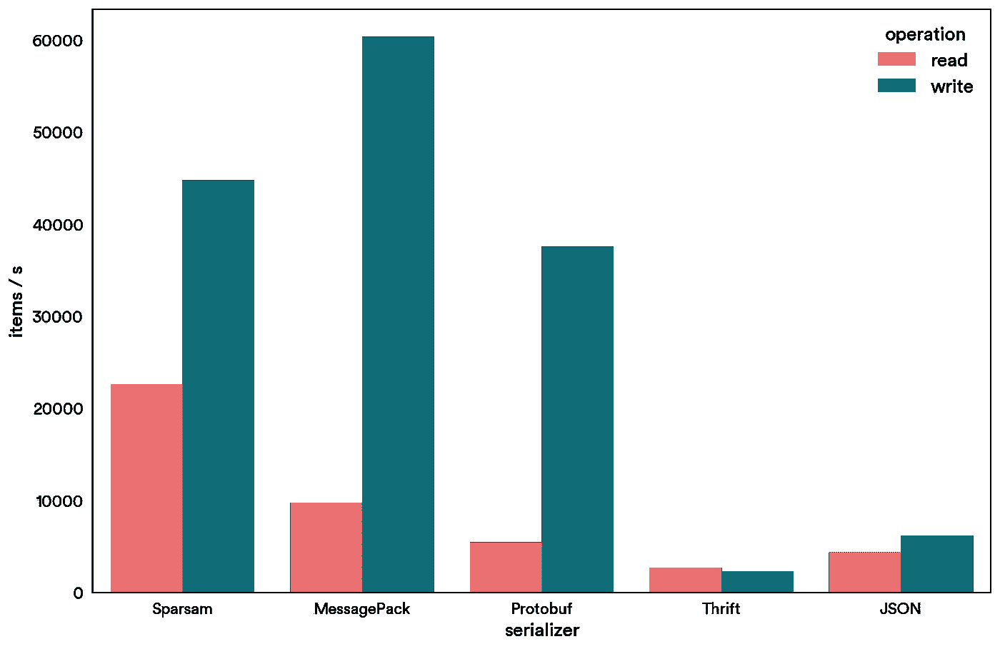

# 通过构建——和开源 Ruby 的快速节俭绑定，加速 Airbnb 的服务

> 原文：<https://medium.com/airbnb-engineering/accelerating-services-at-airbnb-by-building-a-blazing-fast-thrift-binding-for-ruby-8f63044ba149?source=collection_archive---------3----------------------->

## 介绍 [Sparsam](https://github.com/airbnb/sparsam) ，Airbnb 在 Ruby 中实现的节俭序列化器。 [Sparsam](https://github.com/airbnb/sparsam) 在序列化方面比旧的 Thrift Ruby 绑定快 25 倍，在反序列化方面快 8 倍。

The evolution of Sparsam’s performance over time. Higher is better, with the leftmost being the original Thrift implementation in Ruby.

在设计服务和它们之间的交互时，一致性和可伸缩性是我们追求的两个最重要的品质。实现这些品质的一个重要方面是用于服务间通信的序列化协议。在 Airbnb，我们使用 [Apache Thrift](https://thrift.apache.org/) 就是为了这个目的。Thrift 是一个优秀的序列化协议，简单而强大。想想 JSON，但它是二进制的，速度更快，模式和生成的模型类有助于提高生产率。节俭一直是扩展 Airbnb 架构的重要工具，以实现我们的使命:创造一个人人共享的世界。随着越来越多的人在 Airbnb 上寻找奇妙的旅程，我们应用程序的性能变得越来越重要。我们的性能工程团队的任务是通过优化 Airbnb 的性能来改善 Airbnb 社区的体验。在我们的一次分析会话中，我们惊讶地发现 Ruby Thrift 绑定可能非常低效:在某些情况下，仅仅序列化一条消息就可能花费完成一次调用所需时间的 80%。事实上，在我们的基准测试中，Ruby Thrift 甚至比 JSON 还要慢。因为在 Airbnb，Thrift 不用于 RPC，而仅用于序列化和反序列化(实际上是 Thrift-over-HTTP)，所以我们决定构建自己的快速 Thrift 绑定: [Sparsam](https://github.com/airbnb/sparsam) 。

# 在 Ruby 中实现裸机性能

由于 Ruby 的动态特性，用 Ruby 编写高性能代码可能很困难:与习语是零成本抽象的低级语言不同，[动态语言中的几乎所有东西都很昂贵](http://gjmurakami-10gen.github.io/talks/call_operation_cost_in_cpu_ticks_ruby/)。因此，毫不奇怪 Ruby Thrift 绑定利用了一个重要的工具来提高动态语言库的性能: [C 扩展](http://guides.rubygems.org/gems-with-extensions/)。作为一种抽象，C 扩展用一种高级语言中优雅的接口隐藏了所有性能实现的细节。然而，简单地使用 C 扩展并不能保证高性能。事实上，我们在 Ruby Thrift 绑定中观察到的许多模式都严重损害了它的性能。我们将讨论其中的一些模式，并展示 Sparsam 如何避免这些模式。

## 避免昂贵的字符串分配

创建一个新的 Ruby 字符串是很慢的，用 C 语言创建也快不了多少。Thrift Ruby 绑定速度慢的原因之一是它在反序列化数据时分配了过多的对象。对于它读取/写入的每个字段，需要通过`rb_iv_set/get`分配和保留一个 ruby 字符串。这种模式是有问题的，并且会显著增加访问每个字段的开销。在我们的一个实验中，简单地缓存一个字符串的内部 ID 可以获得 25%的加速。在 Sparsam 的早期版本中，我们将每个字段存储在一个`{FieldID => Value}`的哈希映射中。这样，我们完全避免了创建字符串和字符串实习的成本。

## 消除过多的跨语言函数调用

C 扩展速度快的一个重要原因是它们避开了 Ruby VM。通过这样做，C 扩展不需要分担动态语言的开销。跨越语言障碍的调用是不自由的，尤其是当从 C 调用 ruby 函数时，所以最佳实践是在一个大的 C 函数中尽可能多地处理。

尽管 Thrift Ruby 绑定处理了 C 内部的大部分序列化，但它也依赖于 Ruby VM 在运行时的动态调度。结果，大量的时间都花在了解析 Ruby VM 中调用的正确方法上。当消息包含大量字段或者具有深度嵌套的结构时，这种特性减少了使用 C 扩展的意义，并可能导致性能下降。另一方面，Sparsam 不依赖 Ruby VM 进行调度。通过这样做，我们最小化了序列化中 Ruby VM 调用的数量，并极大地提高了性能。

## 在 C++容器中缓存模式信息

我们发现的一个瓶颈是在序列化器中访问 Thrift 的结构定义。Thrift 的高度紧凑的二进制格式要求通信的两端都拥有被序列化的结构的模式。例如，在 ruby 中，thrift 将结构的定义编译成 Ruby 哈希，如下所示:

模式存储在`FIELDS`中，这是一个在 Ruby 类下定义的常量，这样的对象只能通过 Ruby VM 访问。这意味着对于一个字段的每次读/写，C 扩展都需要访问这样的模式，并在 Ruby 和 C 数据类型之间执行类型转换，以确定使用哪种方法。由于 Thrift 的嵌套结构支持，这个问题变得更加严重，因为嵌套结构会导致嵌套散列对象。为了减轻这种影响，我们在 C++ `map<FieldID, FieldType>`中缓存结构的模式信息。除了本身更快，我们还避免了在 Ruby VM 中调用函数和类型转换的成本。

## 使用实例变量删除间接层

使用我们的`{FieldID => Value}`映射的一个问题是，ruby 必须不断地增加哈希映射:每次读取一个值，哈希映射的容量都需要扩展以存储另一对数据，这导致了一个昂贵的`realloc`调用。此外，当访问一个字段时，需要进行两次散列查找:从字段名到字段 ID，以及从字段 ID 到值。因此，我们将这种设计替换为直接使用实例变量来存储数据。这种方法有三个好处:ruby 对实例变量的哈希增长行为不同于哈希映射，这使得它更适合存储反序列化的数据；访问数据时避免了间接层；Sparsam 创建的对象更接近于 PORO(普通的老式 Ruby 对象)。这种优化使我们的读取路径速度提高了近 3 倍，而对写入性能没有任何影响。

# 基准

为了测试 Sparsam 的速度，我们将几个序列化器的速度与我们在 Airbnb 生产中使用的一个简单模式进行了比较:

这个模式很简单，但是足够复杂，既有必需的字段又有容器类型。项目/秒的结果如下所示(越高越好):

QPS Comparison for Different Serializers in Ruby. Higher is better.

通过优化，Sparsam 在写入路径上实现了 25 倍的加速，在读取路径上实现了 8 倍的加速，将 Ruby 中的 Thrift 加速到与 MessagePack 一样快，并且明显快于 JSON，允许我们将更多的端点从传统的 JSON 端点移动到新的 Thrift 端点，而不会影响性能。

# 节俭结构的严格而强大的验证

除了速度快之外，Sparsam 还提供了对节约结构的广泛验证。默认情况下，Thrift 只检查必填字段；在 Sparsam 中，我们提供了两种额外的验证模式:“严格”和“递归”。

*   Strict:除了检查必填字段，strict 模式还检查结构中的字段类型。但是，如果其中一个字段是 struct 类型，它将只检查这个 struct 是否具有正确的 ruby struct，而不会检查其嵌套字段的类型。
*   递归:检查必填字段、字段类型，并进入每个嵌套结构以检查嵌套结构中的字段类型。

# 结论

开源软件在 Airbnb 发挥着重要作用。更快的序列化减少了面向服务架构的开销，从而改善了 Airbnb 社区的体验。通过开源 Sparsam，我们希望能够回馈社区。

我们鼓励您试用 [Sparsam](https://github.com/airbnb/sparsam) ，并通过 [GitHub](https://github.com/airbnb/sparsam) 向我们提供反馈。如果你喜欢从事性能工程工作，喜欢从应用程序中挤出最后一点性能，[我们将雇佣](https://www.airbnb.com/careers/departments/position/729187)。