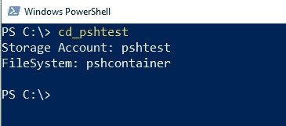

# Azure 数据湖命令行访问—第 1 部分

> 原文：<https://medium.com/version-1/access-adls-g2-with-unix-filesystem-commands-part-1-5c7e2584a4f9?source=collection_archive---------0----------------------->

***使用 PowerShell*** 在 Azure Data Lake Storage G2 上模拟 Unix 或 Cmd 命令— ls、md、rm、mv

从命令行 Unix 风格快速浏览 ADLS 的数据不是很棒吗？

在这篇文章中，我将通过一个(相当)简单的 PowerShell 代码来让您做到这一点。

## **示例—“CD”到 Azure Data Lake G2 并创建一个新文件夹。**


Creating a new folder in ADLS for my cat pictures…

***lls*** 表示“湖 ls”，而 ***lmd*** 表示“湖 md”，这样我们就不会与本地 ls & md 命令冲突。

## TL；博士；医生

*   您可以设置 PowerShell 代码和函数来使用类似 Unix 的命令在 ADLS G2 上快速移动。
*   您确实需要对每个 Lake 实例进行一些设置，但是 ls 和 mv 这样的命令是可重用的。
*   完整的代码清单[在这里](https://gist.github.com/SinisterChinaPenguin/fe7a867aeb789bf03bcc219d68c7245c)。
*   在这篇文章的最后有一个**故障排除**部分处理常见问题。

在这个博客系列的最后，我将展示一个带有快速设置说明的[完整代码清单](https://gist.github.com/SinisterChinaPenguin/fe7a867aeb789bf03bcc219d68c7245c)。

## **假设**

虽然您可以设置其他身份验证机制，但我假设您有 AAD 身份验证，并且您有权限访问您的存储。

我还假设 ADLS G2 文件系统已经就绪，并且我们对所有 ADLS 实例使用同一个 Azure 租户。不支持 ADLS·G1。

# 逐步建立

在这篇第 1 部分的文章中，我们将设置基本的 PowerShell 管道，并获得一个“CD”命令来连接 ADLS，以及一个“LS”函数来浏览我们的 ADLS 文件系统。

## **添加 Azure Storage PowerShell 模块**

这些脚本在 Azure 存储模块中使用 PowerShell Azure 存储命令，因此第一步是通过在 PowerShell 窗口中运行以下命令来安装该模块。

```
***Install-Module Az.Storage -Repository PSGallery -Force***
```

这将为我们提供所需的 PowerShell 存储命令，并且只需执行一次。

## **编辑您的 PowerShell 配置文件**

为了使每次启动 PowerShell 时命令都可用，我们将这篇文章中的所有代码添加到我们的 PowerShell 配置文件中(这只是一个 PowerShell 脚本)

要查看您的配置文件，只需在 PowerShell 窗口中键入 **$profile**


My profile path….

注意:微软。如果您以前没有设置 Psh 配置文件，PowerShell_profile.ps1 "文件可能不存在。

如果不存在，您可以从 PowerShell 运行 ***记事本$profile*** 进行编辑或创建。

或者创建\编辑 ***微软。您最喜欢的 IDE 中的 PowerShell _ profile . PS1***。


editing my PowerShell profile in VS Code

好了，先决条件已经完成，现在添加代码…

## **Azure 租户和连接功能**

首先，我们需要告诉 PowerShell 我们正在连接的 Azure 租户，以便在下面代码的第一行设置 **$tenantID** 变量。

我们还创建了一个 ***连接*** 函数来处理检查&建立 Azure 连接。

将以下代码粘贴到您的 PowerShell 配置文件中，用您的 tenantID 替换 xxxxxxx-xxx…。([该微软页面](https://docs.microsoft.com/en-us/azure/active-directory/fundamentals/active-directory-how-to-find-tenant)解释了如何获得您的 tenantID)

```
$tenantID="xxxxxxxx-xxxx-xxxx-xxxx-xxxxxxxxxxxx"**function connect**{
 if (-Not (get-azcontext))
 {
  Connect-AzAccount -TenantId $tenantID
 }
}
```

代码使用***get-az context***来检查我们是否连接到 Azure 租户&仅在我们尚未连接时调用***Connect-az account***。

## **“CD”命令**

我使用了前缀为“ ***CD*** ”的 PowerShell 函数在 ADLS 存储帐户\文件系统之间移动。

**重要提示** —您需要为您想要使用的每个 ADLS 文件系统设置一个**“CD”**函数。

例如，要连接到名为“**test**”&的存储帐户中的 ADLS G2，一个名为“ **myfilesystem** 的文件系统向您的配置文件添加一个新函数，如下所示:

```
function cd_test { # set to a friendly name for the ADLS filesystem you want to connect to
    connect
    $storageAccount = 'test'     # Set to your Storage Account Name
    $filesystem = 'myfilesystem'    # Set to your ADLS File System Name

    $global:ctx = New-AzStorageContext -StorageAccountName $storageAccount -UseConnectedAccount
    $global:filesystemname = $filesystem

    write-host "Storage Account: $storageAccount `nFileSystem: $global:filesystemname`n"
}
```

**CD…** 函数中的代码使用***New-AzStorageContext***命令在 **$global:ctx** 变量中设置一个存储上下文。它在后续 PowerShell 命令中用于为命令指定正确的存储帐户。

我们还设置了一个 **$filesystemname** ，它以同样的方式在 PowerShell 命令中指定正确的文件系统。

您需要将此功能复制到您的 PowerShell 配置文件中:

*   将“ **cd_test** ”更改为您选择的名称。
*   将***$ Storage Account***更改为您的 ADLS G2 存储帐户的名称。
*   将 ***$filesystem*** 设置为您的 ADLS G2 文件系统的名称。

下面是我为存储帐户“pshtest”和名为“pshcontainer”的文件系统使用的 cd 函数…

(See code [here](https://gist.github.com/SinisterChinaPenguin/a81e3136b24eaf4ae47cd78d8bc06c62))

## **“LS”命令**

最后，我们将为 **ls** 功能添加一个函数到我们的配置文件中。

我称它为“湖 ls”的 **lls** ，因为它需要一个不同于内置 ls 命令的名称。

此处不做任何更改—只需复制并粘贴到您的 PowerShell 配置文件中。

```
function lls([string]$path)
{
  if($path){
   Get-AzDataLakeGen2ChildItem -Context $ctx -FileSystem $filesystemname -Path $path | Format-Table -AutoSize
  }
  else{
   Get-AzDataLakeGen2ChildItem -Context $ctx -FileSystem $filesystemname | Format-Table -AutoSize
  }
}
```

这里我们用***Get-azdatalakegen 2 childitem t***o 列出 ADLS 的文件和文件夹，作为 ***$path 传入的路径。如果没有传入路径，我们只列出文件系统根目录的内容。***

注意，我们在这里使用了我们在上面的 ***connect*** 例程中设置的***$ CTX***和***$ file system name***全局变量。

***Format-Table*** 只是确保输出列表的格式很好。

## **组装并测试**

您现在应该有一些代码非常类似于下面的配置文件。

View\copy code [here](https://gist.github.com/SinisterChinaPenguin/718fbf8c8de13d675829f023dfb4b173)

要进行测试，您需要**关闭并重新打开 PowerShell 窗口**来加载您更新的配置文件。

如果有任何语法错误，请返回并仔细检查代码中的错误。

## 运行 CD 命令

我们现在可以键入 cd 函数的名称并连接到 ADLS，PowerShell 将提示我们是否需要进行身份验证。

例如，我调用了我的 cd 函数 ***cd_pshtest*** :



Connected! Type the name of YOUR cd function

如果成功，CD 命令将返回存储帐户\文件系统。

## 运行 LS 命令

现在我们已经连接到了 ADLS 文件系统，让我们测试 LS 命令——或者“LakeLS”的 LLS


我们可以传入一个路径来查看子文件夹，例如“mike”子文件夹:


## 解决纷争

*   您必须重新启动 PowerShell 窗口来加载新的配置文件。
*   授权错误可能需要您管理 ADLS 文件系统上的 ACL，以授予自己读\写\执行权限。
*   运行***Clear-az context***会很有用，如果你在租户之间移动很多&有连接问题。
*   ***Get-azdatalakegen 2 childitem:此请求未被授权使用此权限执行此操作。您将需要管理 ADLS 文件系统上的 ACL \ RBAC，以授予自己读\写\执行权限。***

## 最后

注意——命令没有“当前目录”的概念，所以你必须始终使用**完整路径**到任何命令。

希望这一切对您有用，并且是从 PowerShell 命令行在 ADLS 四处移动的一种很好的、简单的方式。

在这篇文章的下一部分，我将通过为 md、rm 和 mv 添加命令来扩展功能，并讨论我们可能扩展和改进这些实用程序的其他方法。


**关于作者:**
Mike Knee 是 Azure 1.0 版的数据开发人员。