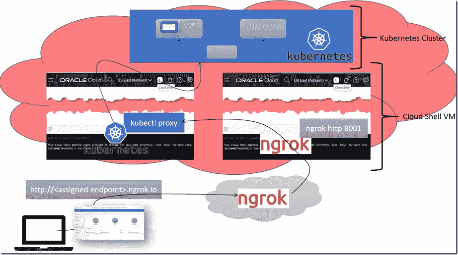

# 通过云壳代理和 ngrok 在本地访问 OCI OKE Kubernetes 仪表板

> 原文：<https://medium.com/oracledevs/access-oci-oke-kubernetes-dashboard-locally-through-cloud-shell-proxy-and-ngrok-43789ea16c22?source=collection_archive---------3----------------------->

本文将告诉您如何从浏览器访问基于 Oracle Cloud Infrastructure OKE 集群实例的 Kubernetes 仪表板，而无需在本地安装 kubectl。这个技巧使用 OCI 云 Shell 来运行 kubectl，以代理运行在 K8S 集群内部的仪表板应用程序，并且它使用 *ngrok* 来创建到云 Shell 中的代理的公共通道。想象成这样:

