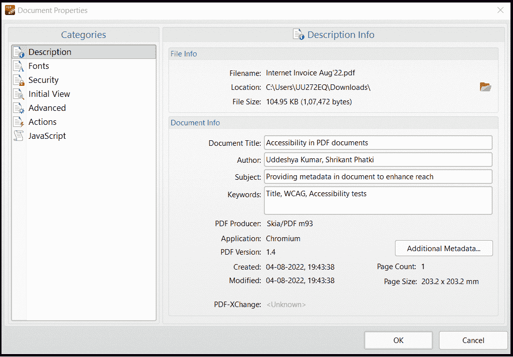
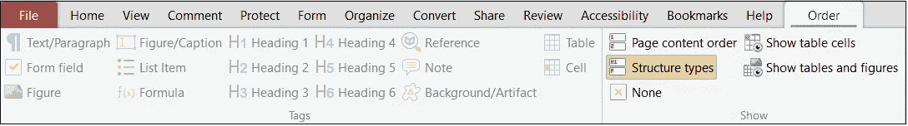
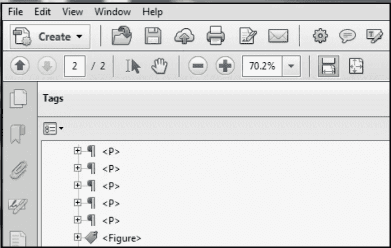
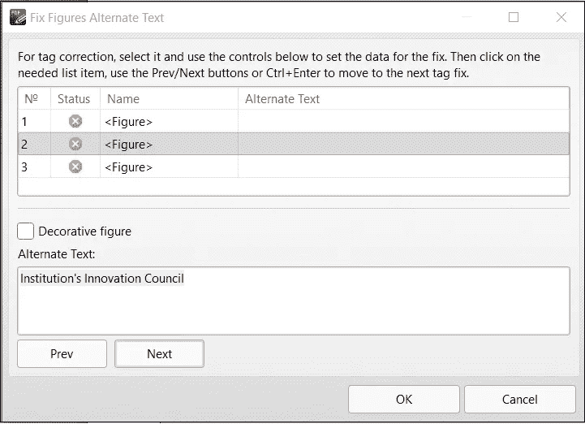
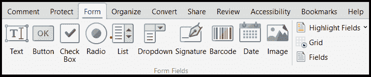
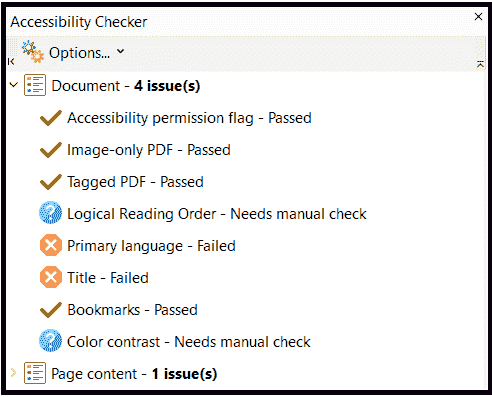

# PDF 中的可访问性:使多媒体文档具有包容性

> 原文：<https://medium.com/globant/accessibility-in-pdf-making-multimedia-documents-inclusive-8127bc78d343?source=collection_archive---------9----------------------->

合著者:[施里坎特·帕特基](https://medium.com/u/85e14537ce94?source=post_page-----8127bc78d343--------------------------------)

# 简介:

无障碍指的是尽最大可能提供机会和资源，避免妨碍与网络上的数字内容和工具互动的障碍，包括身体残疾者、环境不利者以及在互联网连接和速度方面的社会经济限制。可访问性背后的基本观点是，当内容被适当地设计和开发时，更多的人可以访问信息和功能。本文特别关注 pdf 中的可访问性。

# 什么是 PDF？

它是一种电子文档的文件格式，具有有限的可编辑选项。我们在日常生活中都会遇到 PDF 文档。雇佣合同、保险单、数字图书、电子发票、专业简历等。广泛使用 PDF 文档。它的特点是在传输电子数据的过程中不必考虑任何失真，这使它成为数字世界中不可避免的有用工具。根据定义，PDF 或可移植文档格式是 Adobe 开发的一种开放标准文件格式，无论应用程序软件、硬件或操作系统如何，都可以一致地展示基于 web 的只读文档。PDF 文件包含一整套固定布局的文档，包括文本、图像、媒体、超链接、交互式按钮和相关信息。它的普及可以归功于其在不同平台上的图形完整性、创建和使用文档的便利性、安全共享的特性等优点。

Accessibility in a PDF document

# 无障碍需求:

*希亚姆正寻求投资一项银行保单。银行营销代表向他解释条款，并提供一份包含保单细节的合同文件。视力受损的希亚姆发现自己无法掌握该文档中的信息。代表现在安排一个可访问的 PDF 格式的文档，Shyam 通过屏幕阅读器使用该文档，然后继续巩固该方案的交易。*

Source: [photogramio.com](https://photogramio.com/)

上述事例表明，在使用网络工具时，处于不利地位的用户具有包容性，而且由于在应用程序中实施了可访问性做法，一个实体的客户群得到了扩展。从更广泛的意义上来说，确保大多数人都能访问 PDF 文件，包括处于不利环境中的用户，如认知受限的用户、屏幕阅读器用户、智力受限的用户等。为了更容易理解内容，需要适当地开发文档。

从立法角度来看，互联网的主要国际标准组织万维网联盟(W3C)在其网站可访问性倡议中发布了一套详细的网站内容可访问性指南(WCAG ),为维护包括 PDF 文档在内的网站内容的可访问性提供指导。因此，可访问的 PDF 文档确定了更多的消费者，增强了用户体验，并实现了相关的法律合规性。

# 使 pdf 易于访问:

使 pdf 可访问的标准包括带有标签和元数据的文档的适当格式、易于导航的结构、提供替代格式，如音频和视频内容的标题、图像或图形的文本替代、功能的简单程序、书签、排版、对比度和颜色、突出显示等。制作可访问文档的更详细概述可以描述如下:

*   PDF 元数据:使用后端信息，阅读辅助技术可能能够解释文档。该元数据包括作者姓名、文档标题、相关主题、语言、关键字等。

*   文档细节:文档应该包括标题、页眉等。以及页面上的当前章节、页码、日期细节等。以帮助无障碍。
*   逻辑结构:使用标题、段落、列表、脚注、图像和表格数据将文档安排成一个层次结构。

*   标记 PDF 内容:遵循文档中的标准语义结构和属性，允许文档内容(如文本、图像和其他媒体)以相关的阅读顺序使用，以及提取和重新用于其他目的。

*   导航帮助:应该有相关的导航技术来帮助用户搜索和索引文档中的内容。
*   可访问的超链接:超链接、URL 等。应该有独特的标签，并应传达可理解的信息重定向目的地。
*   替代文本:图像必须有替代文本来服务视觉障碍的用户，这将把他们与屏幕阅读器联系起来。

Setting alternative text for image

*   表单描述:实现带标签的表单域，图标等相关位置的工具提示信息，展示验证的多层表达式，为交互式表单控件提供标签，复选框、单选按钮、列表等的放置规则。

这样创建的可访问的 PDF 文档可以与几乎所有辅助技术软件一起工作，例如:屏幕放大器、屏幕阅读器、语音识别、文本到语音转换软件、盲文显示器等。，并加强对用户的宣传。

# 有些不要:

为了提高可访问性并确保更好的用户体验，应该避免以下因素:

*   屏幕闪烁:避免不必要的动画或改变屏幕亮度，因为这些可能会影响文档的可访问性和用户友好性。
*   定时回复:有时文档需要时间限制才能与内容交互。在这种情况下，必须避免突然关闭。必须在关闭前提供适当的超时通知，让用户完成挂起的任务。
*   颜色和对比度:不依靠颜色或感官特性来传达意思，使用能提供足够对比度的颜色组合，避免使用闪烁或闪烁元素，没有用户启动就没有焦点变化等。

# 结论:

PDF 文档的广泛可用性要求在以这种文件格式创建内容时，必须确保可访问性实践，以保持最大用户群中信息媒体的兼容性。还制定了一系列指导方针(WCAG 2.0)，由有助于遵守无障碍标准的相关论坛进行管理。您还可以使用多种软件和在线工具，如 Adobe Acrobat 或其他 PDF 可访问性检查器来测试和验证错误，提供补救措施，从而改进多媒体文档，使其更具包容性。

Example: Testing accessibility of a PDF document