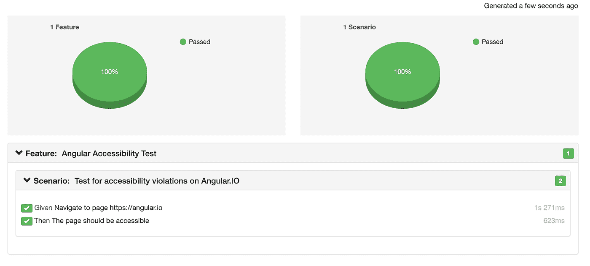

# 用量角器在不到 30 分钟内回归可达性

> 原文：<https://medium.com/capital-one-tech/accessibility-regression-with-protractor-in-less-than-30-minutes-9abf1fd4f558?source=collection_archive---------7----------------------->


# 前言

大多数 UI 开发人员都理解可访问性在当今时代的重要性。如果没有——[刷一下](https://developer.mozilla.org/en-US/docs/Learn/Accessibility/What_is_accessibility)！无法访问的网站不仅会给用户带来麻烦，还会给制作公司 [](https://fortune.com/2019/09/21/beyonce-lawsuit-website-ada-compliant/) 带来风险。我的任务是维护 Capital One 的一些产品的可访问性，我经历了构建、更改和维护几个 UI 可访问性回归套件的斗争。在本文中，我将向您展示如何使用[量角器](https://www.protractortest.org/#/)、[黄瓜](https://cucumber.io/)和开源工具 [axe-webdriverjs](https://github.com/dequelabs/axe-webdriverjs) (开源工具 [axe-core](https://github.com/dequelabs/axe-core) 的包装器)快速构建一个可访问性回归套件。

最好的部分——如果你坚持下去，你将能够复制和粘贴你的成功之路。

# 先决条件:

1.[节点](https://nodejs.org/en/download/)(我用的是 v12.13.1)

2.IDE(我使用 [VSCode](https://code.visualstudio.com/) )

3.机器上安装的 Java

4.Javascript / Typescript 工作知识

5.熟悉量角器和黄瓜框架

# 创建项目

**在您要放置项目的目录中打开一个终端。首先，让我们创建并初始化我们的项目:**

```
mkdir accessibility-regression
cd accessibility-regression
npm init — yes
```

**创建适当的目录来保存特征文件、步骤定义和报告:**

```
mkdir -p reports src/features src/steps
```

**此时，你的项目应该是这样的:**

```
|- accessibility-regression |- reports |- src |- features |- steps |- package.json
```

# 安装依赖项

现在，让我们预先安装所有需要的依赖项。在终端中，运行以下命令:

```
##
# Installs:
# Selenium webdriver accessibility tool wrapper
# Angular end to end testing framework
##
npm install — save-dev protractor
npm install — save-dev axe-webdriverjs##
# Installs:
# Cucumber Framework
# Protractor plugin to enable cucumber js
# Chai assertion library
# Cucumber HTML reporter
##npm install — save-dev cucumber
npm install — save-dev protractor-cucumber-framework
npm install — save-dev chai
npm install — save-dev cucumber-html-reporter
##
# Installs:
# Typescript packages that will enable Typescript in e2e source code
##npm install — save-dev typescript
npm install — save-dev ts-node
npm install — save-dev @types/node
```

# 配置项目

让我们开始设置量角器测试套件。在项目的基目录中，放置以下名为“`tsconfig.json`”的配置文件。此文件配置 ts-node 来解释或传输文件类型脚本源代码。

```
{
    “compilerOptions”: {
        “target”: “es6”,
        “module”: “commonjs”,
        “moduleResolution”: “node”,
        “inlineSourceMap”: true,
        “declaration”: false,
        “noImplicitAny”: false
    },
    “exclude”: [
        “node_modules”,
        “plugins.ts”
    ]
}
```

量角器需要一个基本功能的配置文件。它将规定浏览器设置、使用的框架、特征和步骤定义文件位置、报告配置以及更多。您可以在下面的代码中看到我们已经配置了这些选项。在项目的“`src`”目录中，将以下代码放在名为“`protractor.conf.js`”的配置文件中:

```
// Use this — interprets .ts as .js
require(‘ts-node’).register({ project: ‘./tsconfig.json’ });// Needed for cucumber html reporting
const reporter = require(‘cucumber-html-reporter’);exports.config = {
    // ‘Custom’ as we’re using the protractor version of cucumber
    framework: ‘custom’, // path relative to the current config file
    frameworkPath: require.resolve(‘protractor-cucumber-framework’), // Require feature files
    specs: [
        ‘./features/**/*.feature’, // accepts a glob
    ], // Run chrome browser in headless mode, disable gpu as it
    // doesn’t help in our case
    capabilities: {
        browserName: ‘chrome’,
        chromeOptions: {
            args: [‘ — headless’, ‘ — disable-gpu’],
        },
    }, cucumberOpts: {
        // This is where the results are stored
        format: [‘json:./reports/results.json’], // Requires these files on test launch
        require: [‘./steps/*.ts’],
        tags: true,
    }, // When the tests are finished running
    afterLaunch() {
        // Configure reporting options
        const options = {
            columnLayout: 1,
            theme: ‘bootstrap’,
            jsonFile: ‘./reports/results.json’,
            output: ‘./reports/cucumber_report.html’,
            reportSuiteAsScenarios: true,
            scenarioTimestamp: true,
            launchReport: true,
        }; // Generate the report
        reporter.generate(options);
     },
};
```

# 创建特征文件

此时，我们已经准备好构建我们的特征文件。一个特性文件描述了一些场景，在这些场景中，测试是用编码者和非编码者都能理解的纯文本描述的。场景由“给定、何时、然后”顺序的步骤组成。步骤也是易于阅读的步骤描述，并且通过正则表达式与步骤定义文件中的代码相匹配。为了节省时间，我们将利用量角器本质上是为角度位置而设计的知识来构建这些步骤——但是如果我们不测试一个呢？我们将把它分成两个不同的步骤，因为默认情况下，当导航到一个没有角度的页面时，量角器会抛出错误。

我们的意图如下:

*   导航到网址`{url}`
*   测试可访问性冲突

根据这些信息，在下面的`‘src/features/`目录中创建两个特征文件。我们将使用 Angular 的网站进行角度实现，使用 Google 进行非角度实现。

角度特征:

```
Feature: Angular Accessibility Test
    Scenario: Test for accessibility violations on Angular.IO
        Given Navigate to page [https://angular.io](https://angular.io)
        Then The page should be accessible
```

谷歌功能:

```
Feature: Google Accessibility Test
    Scenario: Test for accessibility violations on Google
        Given Navigate to non-angular page [https://google.com](https://google.com)
        Then The page should be accessible
```

# 创建步骤定义

现在我们将实现我们的步骤，以便我们的测试可以实际运行。导航到`src/steps/`目录并创建一个名为“`stepDefinitions.ts’`的文件。将以下代码放入文件中。

```
import { After, Given, Then } from ‘cucumber’;
import { browser } from ‘protractor’;
import { expect } from ‘chai’;// For accessibility
const axe = require(‘axe-webdriverjs’);// Navigate to angular page
Given(/^Navigate to page (.*)$/, async function (url) {
    await browser.get(url);
});// Navigate to non-angular page
Given(/^Navigate to non-angular page (.*)$/, async function (url) {
    browser.ignoreSynchronization = true;
    await browser.get(url);
});/** Cleanup */
After(function (scenario) {
    browser.ignoreSynchronization = false;
});
```

你可以看到第一步定义是利用量角器的默认导航。第二种方法利用 ignoreSynchronization 设置，它允许我们无错误地导航到非角度页面，因为浏览器不会侦听角度特定的事件来认为导航已完成。在每一步之后，我们将`ignoreSynchronization`重置为默认设置。

现在剩下的就是测试页面的可访问性冲突的步骤定义。Axe-Core 是在我们的包的核心使用的开源工具。这个项目有大量的追随者，这使得它在可靠性、可维护性和特性建议方面非常出色。在'`stepDefinitions.ts`'中，在用于清理的'`After()`'函数前添加以下步骤定义。这一步将分析页面的可访问性冲突。'【T2]'函数接受一组规则集。对于这个例子，我们将使用`wcag21aa (wcag2.1aa)`。

```
/**
* Accessibility step — [https://github.com/dequelabs/axe-webdriverjs](https://github.com/dequelabs/axe-webdriverjs)
*/
Then(/^The page should be accessible$/, async function() {
    /**
    * Available tags: wcag2a, wcag2aa, wcag21a, wcag21aa,
    * section508, best-practice, experimental, cat.
    */
    let results = await axe(browser.driver)
        .withTags([‘wcag21aa’,’cat’])
        .analyze(); /**
    * Check the results for violations. If there are any, indicate
    * what they are.
    */
    expect(results.violations.length).to.be.equal(
        0,
        `Accessibility Violations Found: ${JSON.stringify(
        results.violations,
        null,
        2
        )}`
    );
});
```

# 运行回归

现在我们准备跑了！默认情况下，量角器带有使用`webdriver-manager`启动 Selenium 服务器的能力。添加了一些配置选项，以允许您可能要测试的站点具有一定的灵活性。有关其使用的更多信息，请在终端中输入“`webdriver-manager –help`”。

**下载 selenium 服务器 jar 和 chromedriver 二进制文件。为此，在您的终端中，键入:**

```
node ./node_modules/protractor/bin/webdriver-manager update — standalone=true — gecko=false — ignore_ssl
```

**从项目的基础目录运行套件:**

```
npx protractor src/protractor.conf.js
```

结果将在`reports/cucumber_report.html`下显示。测试完成后，该页面应该会自动启动。注意—代理/vpn 可能会干扰此步骤。如果这一步超时，这是开始调试的好地方。

# 分析报告

生成的报告将用颜色编码(绿色表示成功，红色表示失败)，提供概述统计数据，并允许您深入了解失败和成功。失败将提供详细的消息和定位器，允许您查明问题区域并修复它们。



***就是这样！*** 您现在拥有了一个功能齐全的可访问性回归套件。为您的页面添加功能文件，并始终记得保持套件最新。该套件可以在本地运行，也可以集成到您的 CI 工具中。保持联系，朋友们！

# 参考资料:

*   [https://cucumber.io/docs/guides/10-minute-tutorial/](https://cucumber.io/docs/guides/10-minute-tutorial/)
*   [http://www.protractortest.org/#/tutorial](http://www.protractortest.org/#/tutorial)
*   【https://www.npmjs.com/package/protractor-cucumber-framework】

*披露声明:2020 资本一。观点是作者个人的观点。除非本帖中另有说明，否则 Capital One 不隶属于所提及的任何公司，也不被这些公司认可。使用或展示的所有商标和其他知识产权是其各自所有者的财产。*