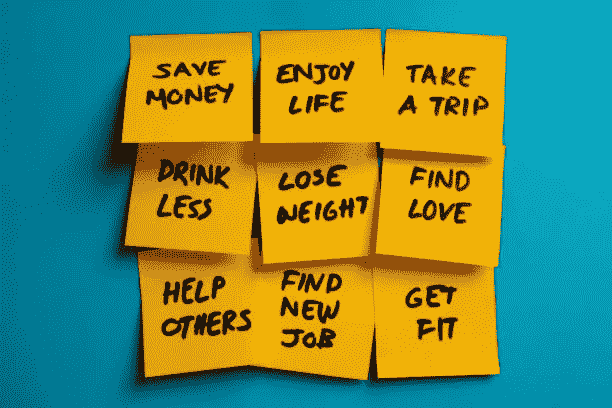
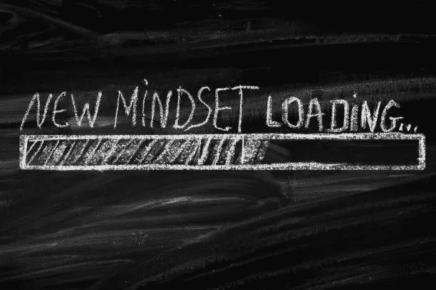

# 通过尝试这种新方法，完成你今年 100%的目标。

> 原文：<https://medium.com/walmartglobaltech/accomplish-100-of-your-goals-this-year-by-trying-this-new-approach-f8be7024fe0d?source=collection_archive---------0----------------------->

Credit:[themacx](https://www.istockphoto.com/photo/silhouette-100-percent-with-nature-gm838989824-136562979)

# 是改变的时候了

今年你想实现的最重要的事情是什么，你觉得有可能实现吗？

如果你正在寻找生活的改变，请继续阅读这篇文章，找出你如何定义、塑造和拥抱一个新的视角来实现你的目标。

# ***自毁性质的新年决心***

Credit:[solidcolours](https://www.istockphoto.com/photo/new-years-resolutions-gm1080060154-289477064)

减肥，存钱，找份新工作…

每年，世界各地的人们都会宣布他们的新年决心，以实现一个目标，改善他们生活的某个方面。

尽管意图是好的，[研究](https://health.usnews.com/health-news/blogs/eat-run/articles/2015-12-29/why-80-percent-of-new-years-resolutions-fail)显示，80%的人在 30 天后放弃了他们的决心，因为他们设定了雄心勃勃的目标，却不知道实现这些目标需要付出多少努力。

如果这听起来很熟悉，今年尝试一些新的东西，抛弃新年决心，开始定义新年实现。

# ***新年实现的力量***

Credit:[marrio31](https://www.istockphoto.com/photo/a-goal-without-a-plan-is-just-a-wish-gm1150064491-311203551)

实现是将你的注意力集中在完成或实现期望或预期的事情上的能力。它有助于组织你的思想，让你制定出实现目标的计划。

定义新的一年的实现，是所有关于心理准备。用这四个问题来帮助自己走向成功:

Credit:[marrio31](https://www.istockphoto.com/photo/new-mindset-new-results-gm1096844472-294510663)

## #1:是什么促使你做出改变？

如果你对你的目标没有动力或热情，你成功的机会很小。确定你为什么想要做出改变(例如，生活质量、个人成就、家庭或朋友)，并允许这成为当事情变得困难时激励你的动力。

## #2:你的改变计划是什么？

根据你想要完成的目标，制定一个具有渐进里程碑的计划，提前花时间定义一个适合你的范围和时间表。这确保了你的目标是可行的和可衡量的。

## #3 当你努力改变时，谁能支持你？

确定负责任的合作伙伴以指导、鼓励和保持你在实现目标的轨道上是很重要的。拥有一个强大的支持系统可以在困难时期提供动力。

## #4:你将如何庆祝你的胜利？

通过确定庆祝较小的里程碑的方式来加入一点乐趣总是很重要的。这种积极的强化是一种伟大的技巧，可以让你在努力实现目标的过程中保持动力。

# ***在 2020 年实现你的改变***

Credit:[Erikona](https://www.istockphoto.com/photo/search-frame-composition-gm1147799243-309756427)

无论是有计划的还是无计划的，变化都是不可避免的。如果没有正确的愿景，变化可能会让你迷失方向，无法达到最终目标。

通过确定一个激励你的目标，概述一个具有可衡量结果的现实计划，寻找支持你的责任伙伴，并腾出时间庆祝你的成功，来保持正轨。这样做会让你离实现 2020 年的目标更近一步！