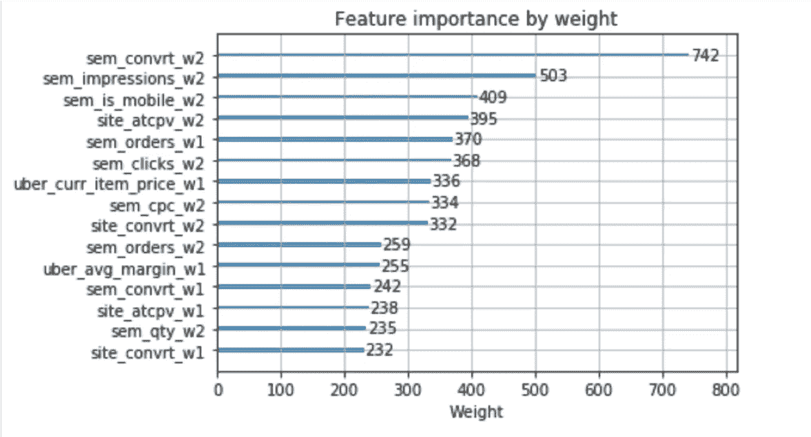
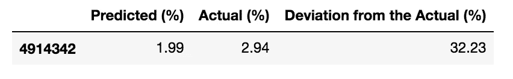
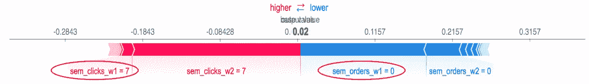
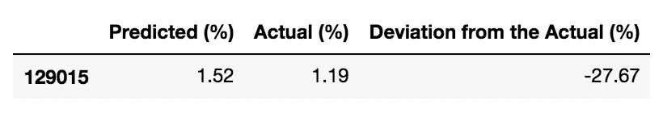
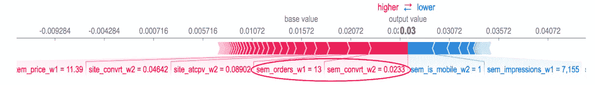
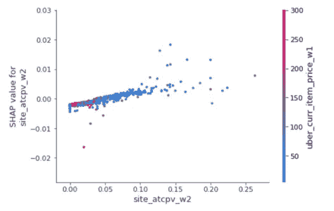

# 可解释的机器学习:揭开黑箱之谜的尝试

> 原文：<https://medium.com/walmartglobaltech/accuracy-vs-interpretability-paradox-382803f6a99d?source=collection_archive---------6----------------------->

**准确性 vs 可解释性悖论**

在选择特定的预测建模技术时，数据科学家经常不得不处理经典的准确性与可解释性悖论。基于传统 OLS(普通最小二乘法)的技术，如线性和逻辑回归，提供了易于解释的见解(系数)，并清楚地解释了预测变量对响应变量(您试图预测的变量)的增量影响。换句话说，很容易理解输入中 1 个单位的变化对响应变量的预期影响。通常，当决策边界是线性的时，OLS 技术表现良好，但情况可能通常不是这样。在这种情况下，基于树的集成技术，如随机森林、xgboost 等，在预测能力方面优于传统的 OLS 模型。然而，基于树的模型的主要挑战是解释特定特征如何至少在方向上影响个体预测的困难。正是由于这个原因，基于树的技术虽然是 ML 算法的一种广泛使用的形式，但通常被认为是一个黑箱。

**什么是 SHAP，为什么有用？**

基于树的模型所支持的特征重要性图揭示了输入特征的相对重要性。尽管这些图概括得很好，但它们无助于理解某个特征对给定预测的影响。这就是[SHAP](https://github.com/slundberg/shap)的真正威力。借助 SHAP 包支持的绘图，我们可以可视化各个预测以及所有输入要素对特定预测的影响。SHAP 包源于博弈论方法，其中每个预测都被视为功能交互作用博弈的结果。

**SHAP 如何确定特征的重要性？**

对于给定的预测，每个特征被分配一个称为 shapely 值的分数，该分数确定该特征对特定预测的贡献。要素的 shapely 值计算为要素相对于输入要素所有可能排列集的平均边际贡献。换句话说，预测包含和不包含输入要素的所有输入要素排列的响应变量，以确定得分，然后对观察到的差异取平均值，以获得 shapely 得分。此外，对于给定的预测，所有输入要素的 shapely 值必须等于预测值和基线值(即训练数据集的平均值)之间的差值。关于这个计算背后的数学细节，请参考这篇[文章](/@gabrieltseng/interpreting-complex-models-with-shap-values-1c187db6ec83)。

**SHAP 的一个 SEM(搜索引擎营销)用例:**

使用任何基于树的算法训练的模型可以作为输入馈送到 SHAP 包中的树解释器函数。虽然 SHAP 图可以应用于基于深度学习的技术，但本文的重点仅限于 SHAP 的树解释器功能。为了我们的分析目的，使用 xgboost 技术建立的 SEM ad 转换率预测模型使用来自 SHAP 包的图进行分析。该模型中使用了 60 多种输入功能。从高层次来看，这些功能可以分为以下几个部分:

基于 sem 绩效的历史信号— *sem 订单、sem 点击量、SEM 广告支出*

历史站点绩效信号— *站点订单、站点收入*

项目属性相关信号— *项目价格、评级*

xgboost 模型的标准特征重要性图如下图所示。它给出了特征在整个训练数据集中的相对重要性。换句话说，从该图中我们了解到，在大多数情况下，“sem_convrt_w2”(前 2 周的历史 sem 转化率)被学习为比“sem_clicks_w2”(前 2 周的历史 sem 点击)更好的广告转化率预测器。虽然该图有助于理解相对环境中的重要特征，但它并未提供对驱动个体预测的特征的洞察。

Note : Weight refers to the number of times a particular feature is used for splitting the decision tree nodes

借助应用于广告转换率预测模型的 SHAP 软件包，有可能理解驱动个体预测的特征。例如，考虑下面来自 SHAP 的力图，它用于可视化两种不同场景的特征重要性。在力图中，红色和蓝色表示以下内容

***红色——将预测值推高到基线(平均值)以上的特征***

***蓝色——将预测值拉低至基线以下的特征***

**场景 1:** 预测 ad 转化率小于实际值。因此，这里的重点是识别降低预测的特征。

从上面的图中可以理解，与同期具有点击的广告相比，模型认为前几周缺少任何“ *sem 订单*”(上面用蓝色编码的特征颜色)更为关键，这导致了较低的预测转化率。

**场景二:**预测值大于实际值。因此，这种情况下的重点是识别使预测超出基线的特征。

正如所观察到的，该模型将过去 2 周较高的“sem 转换率”(上面用红色编码的特征颜色)以及前 1 周较高的“sem 订单”视为导致预测超出基线的关键因素。

请注意，同样的功能“sem_orders_w1”如何在上述两种情况下驱动不同的预测。标准的特征重要性图无法达到这种详细程度，也无法提供关于如何得出特定预测的更多信息。这导致 ML 算法对于使用这种算法输出的业务团队来说是一个黑箱。在 SHAP、莱姆等软件包的帮助下，数据科学家可以提高对最大似然算法内部工作的可见性，从而赢得业务合作伙伴的信任。此外，它还可以作为一种工具，数据科学家可以使用它来诊断有噪声的预测和微调算法性能。

除了单个预测的可视化，SHAP 还支持依赖图来可视化一个特定的功能如何与另一个功能，以及这些功能如何一起影响输出指标。下图说明了*“站点添加到购物车页面视图”*功能如何影响预测的*“广告转换率”。*据观察，正如预期的那样，购物车页面浏览量越多，转化的机会就越大。此外，颜色编码表示*“站点添加到购物车页面视图”*和*“商品价格”功能*之间的交互。蓝色表示低价记录，而红色表示高价记录。因此，与低价商品相比，高价商品的购物车页面浏览量往往较低，这反过来表明转化的机会较低，从而表明我们的购物者对价格敏感。同样，可以选择任意两个输入特性，研究它们对输出指标的综合影响。

*Dependence plot showing interactions between site_add_to_cart and item_price features and their impact on conversion rate*

*关于团队—* *搜索&展示营销(SDM)工程与科学@沃尔玛实验室负责优化 walmart.com 的付费和免费搜索。我们是一个由大数据极客、数据科学家和应用工程师组成的积极性很高的团队，在小型敏捷团队中工作，以解决复杂且影响大的问题。我们正在构建智能数据系统，对来自在线和离线用户活动的大量数据流进行摄取、建模和分析。我们使用最先进的机器学习、数据挖掘和优化算法来分析 Hadoop 和 Spark 上的所有数据。*