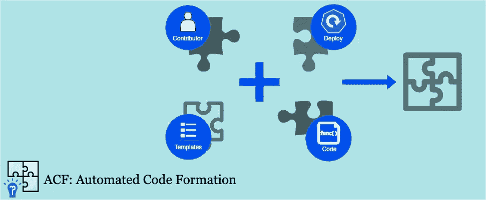
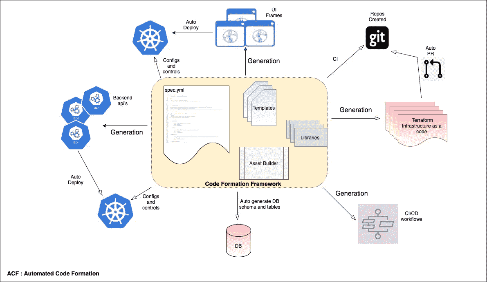
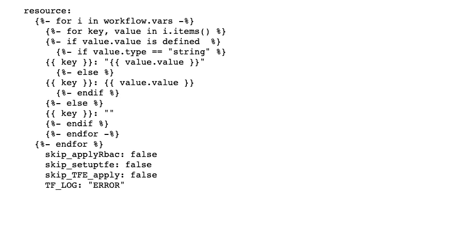
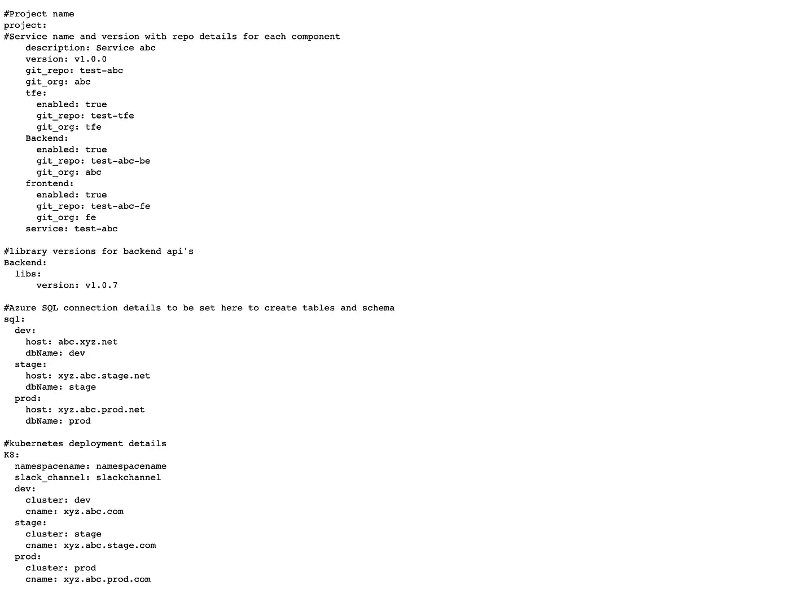
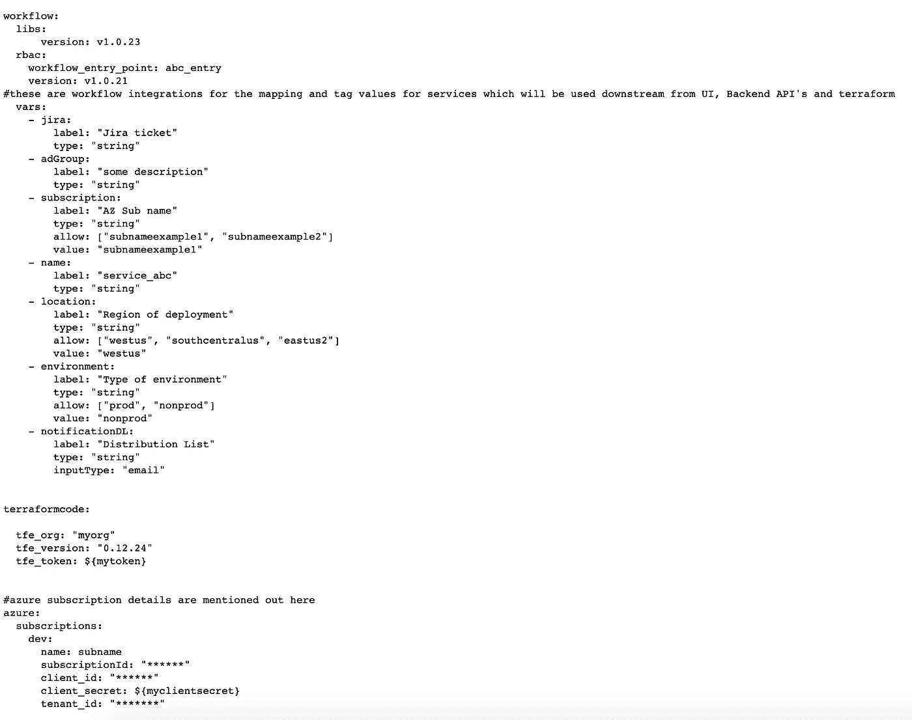
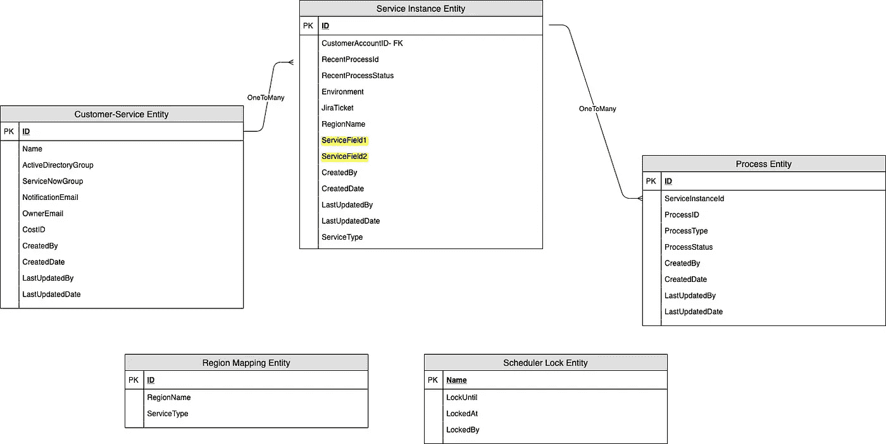
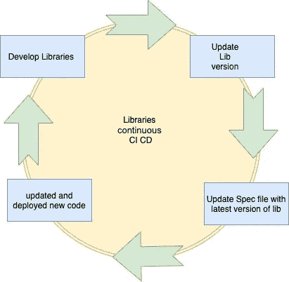
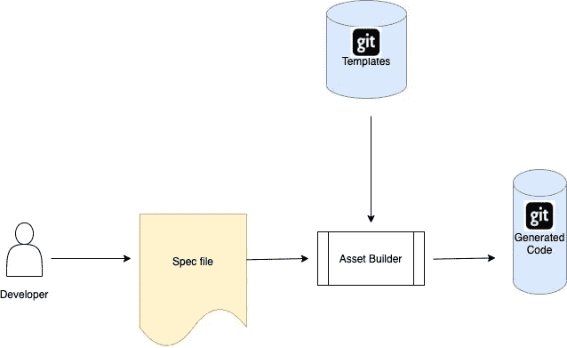
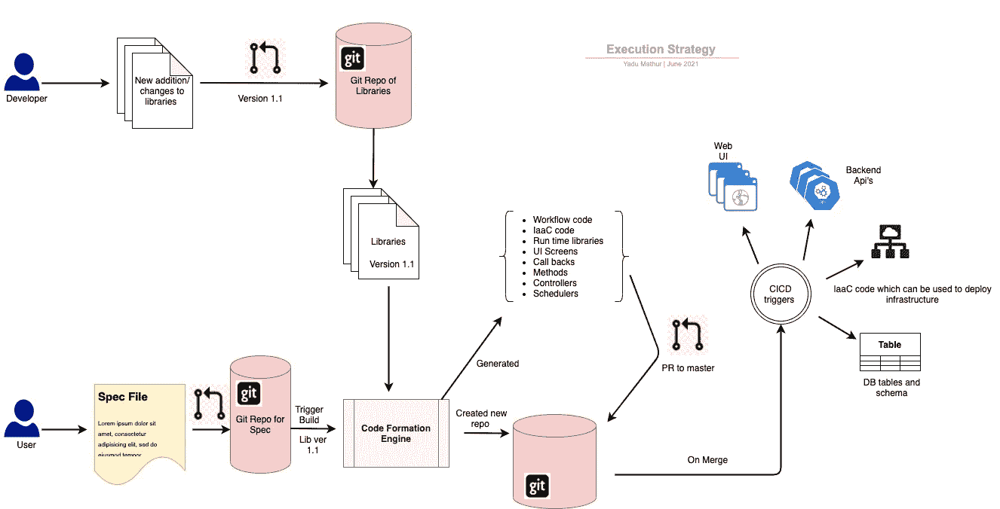

# ACF:自动化代码形成(工程卓越)

> 原文：<https://medium.com/walmartglobaltech/acf-automated-code-formation-engineering-excellence-3dd77b2f39df?source=collection_archive---------1----------------------->

Figure 1: ACF custom header image

# 代码作为模板:涵盖 IaaC、工作流、UI 屏幕、数据库模式和后端 API

# **简介**:

**代码形成**和作为模板的代码发展非常迅速，随着我们向卓越工程迈进，我们需要评估 IaaC(以下称为代码)和 **CaaT** (作为模板的代码)的自动部署、持续集成和管理的选项。

在这篇博文中，我们的目标是谈论**“代码形成框架”**及其不同组件的设计。我们创建了这个框架来生成管理基础设施的代码。该框架包括创建 web UI、后端 API，然后从规范文件和资产构建器连接它们。

# 目标:

我们的目标是编排“微应用和基础设施代码”，然后将其作为自助服务平台，供用户部署和管理他们的云资源。

这里的微应用由微前端、绑定的后端微服务和作为代码的基础设施组成，包括 Terraform 模块和工作流。

要为 Azure 的 Azure Redis Cache(云资源)等服务产品创建自助服务平台，我们需要以下组件。

*   用于从用户处获取规范的 UI
*   后端 API 处理具有规范的请求并传递它
*   数据库来存储和获取规范
*   使用规范部署云资源的 Terraform 代码
*   集成生态系统和所有其他组件的工作流程

# **设计:**

“代码形成框架”的基本设计是基于 6 个重要组件创建的

1.  模板
2.  规格文件
3.  实体关系模型
4.  图书馆
5.  资产生成器
6.  部署

**Figure 2: High-level view of “Code Formation” framework.** ( k8 icon photo reference [https://commons.wikimedia.org/wiki/File:Kubernetes_(container_engine).png](https://commons.wikimedia.org/wiki/File:Kubernetes_(container_engine).png), git icon photo reference [https://iconscout.com/icon/git-free-opensource-distributed-version-control-system-square](https://iconscout.com/icon/git-free-opensource-distributed-version-control-system-square) )

让我们来理解上面的每一个

**1。模板:**

代码模板对于框架的每个部分都是非常重要的组件。**代码模板**是可重用的代码片段，允许您快速插入常用的代码片段。

IaaC terraform 模板生成 Terraform main.tf 文件、variables.tf 文件、provider.tf 文件和 outputs.tf 文件。

下面以 Azure Redis 缓存为例，详细介绍了其中的每一项。

**Variables.tf** *:位置、订阅、缓存层、缓存名称、SKU、订阅详情等。*

**main . TF:***Terraform 的实际资源和模块代码，用于部署资源。*

**provider.tf:** *由 required_providers 块组成，它指定了提供者的本地名称、源地址和版本。*

**Outputs.tf:** *它有 Terraform 模块的返回值。*

类似地，工作流模板用于生成工作流 Yaml 文件，这些文件通过 concord([https://github.com/walmartlabs/concord](https://github.com/walmartlabs/concord))执行。模板是用 Jinja2 编写的，其中一些可以定制。

**注**:样本工作流程 YAML 模板

Figure 3: Snippet of an example of workflow template

目标是使该框架成为基于云资源需求的插件式应用程序。我们所要做的就是添加新模板或更改现有模板。

**注意:**示例 application.properties 模板。

Figure 4: Example of an application.properties template.

**2。规格文件:**

规格文件是决定结果、执行策略和部署顺序的框架的骨架。

等级库文件放置在等级库存储库中。当开发人员对 master 上的新流提出 pull 请求时，代码形成流将在 PR 合并期间被触发。

**注**:可以分叉整个项目的 Spec 文件示例。

Figure 5: Example of a Spec template.

**3。实体关系模型:**

部署有一个已定义的 ER 模型，在为后端 API 生成代码时，该模型在整个 CI 流程中是同步的。

**注**:实体数据关系示例。

Figure 6: ER model

*   包括客户信息在内的所有服务细节都存储在客户服务实体中。每个客户服务可以有 3 个服务实例—特定云服务的开发/阶段/生产。
*   服务实例实体包含每个服务的环境细节。
*   流程实体用于在每个服务实例完成任何活动时跟踪流程的类型。通过更新服务实例实体中相应的流程 id 来跟踪在服务实例上完成的最后一个操作。
*   由于多个进程可以并行运行，为了管理当前正在运行的进程上的锁，使用了 Schedular 锁实体。
*   使用区域映射实体，供应表格动态地反映当前可用的区域。

**4。库:**

大部分代码都是可重用的，因此已经提前为构建时代码生成创建了库，例如 Slack 和电子邮件通知、UI 映射器、自定义字段等。也有直接用于云服务代码的运行时库，如推送云资源上的 RBAC 控件、资源供应平台代码、资源删除平台代码等。

Figure 7: CICD for library Management

库管理的 CICD:库被版本化，并作为框架包的一部分使用。对库的任何新更新都将被版本化，开发人员可以用新的 lib 版本更新规范，这将重新触发管道来部署代码。

**5。资产生成器:**

以下是资产构建器经历的步骤

*   步骤 1:为项目创建 git 存储库
*   步骤 2:它解析 spec 文件和模板来生成代码。
*   步骤 3:它用生成的代码向新创建的 repo 的发布分支发出一个 pull 请求。
*   步骤 4:它通过单元测试案例和集成测试套件运行代码。
*   步骤 5:它在 Sonar 上发布代码覆盖率

**Figure 8: Asset builder flow.** (git icon photo reference [https://iconscout.com/icon/git-free-opensource-distributed-version-control-system-square](https://iconscout.com/icon/git-free-opensource-distributed-version-control-system-square) )

**6。部署:**

向 git repo 的发布分支创建一个 pull 请求，并通过框架生成代码。这带来了通过自动部署在 K8 运行的基本版本。为了确保没有人工干预，所有新的更改都必须通过规范更新进行。

通过代码形成引擎生成的文件被标记为“受管文件”，确保开发人员遵循正确的 CI 流程进行重建，并且在发生任何更改的情况下，这些更改都应该经过代码形成框架。

这在项目中引入了设计良好的 CI 和 CD 流程，实现了 git 存储库、命名约定、文件夹结构、构建管道和发布管理的标准化。

Kubernetes 是一个用于管理容器化工作负载和服务的开源平台，用于部署该容器。

**注**:K8 YAML 部署模板示例

Figure 9: Example snippet of K8 deployment file template

# 执行和生命周期:

代码生成框架有两种类型的用户。

**自动化代码形成的开发人员**:开发人员负责更新和管理库，创建模板，更新资产构建器以支持新的库，以及添加新的模板。

**自动化代码形成的消费者**:消费者将通过编写规范文件和运行代码形成引擎，使用代码形成引擎来管理部署的应用程序。

**Figure 10: Overall flow of the code formation engine and the outcome.** (git icon photo reference [https://iconscout.com/icon/git-free-opensource-distributed-version-control-system-square](https://iconscout.com/icon/git-free-opensource-distributed-version-control-system-square) )

# 结果是:

我们的目标是编排“微应用和基础设施代码”，然后将其作为自助服务平台，供用户部署和管理他们的云资源。我们实现了目标，此外，我们还将引入云资源自助服务平台的 MTTM(平均上市时间)从 26 周缩短到不到 2 周。

本文展示的工作是由一个优秀的工程师团队完成的。

工程团队:**杜亚·马图尔**，**安东·谢尔科诺夫，安基塔·贾斯瓦尔，穆妮卡·耶拉马拉，斯里尼迪·科拉帕蒂，马赫什·佩达瓦利**