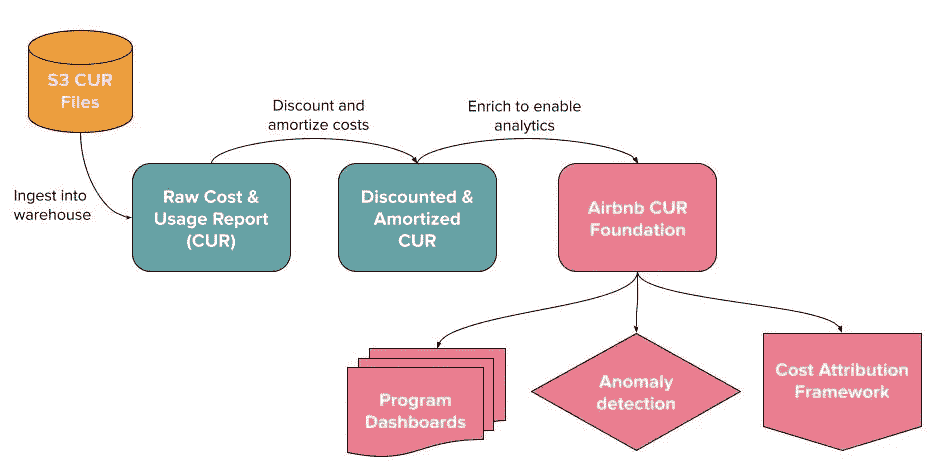
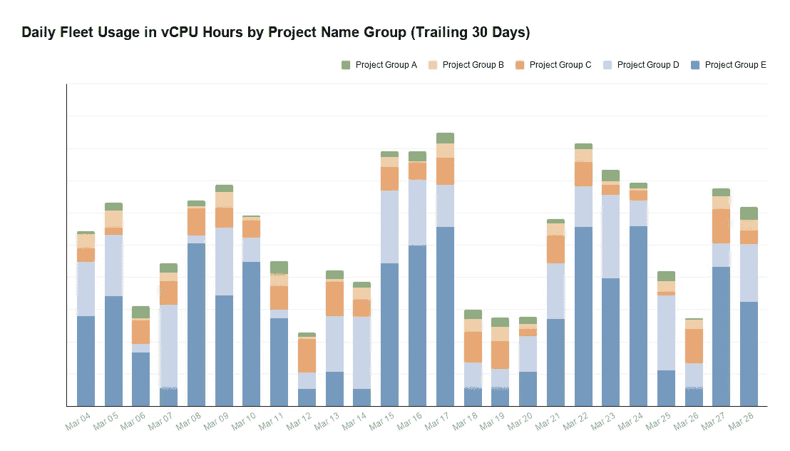
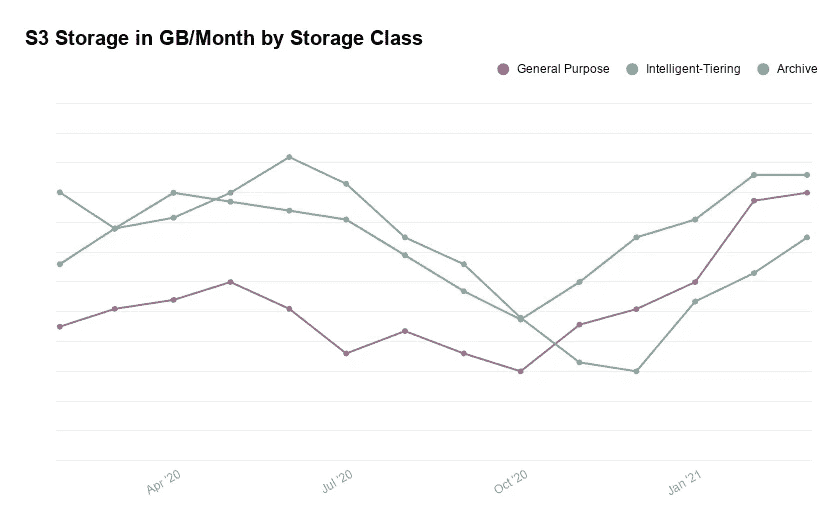
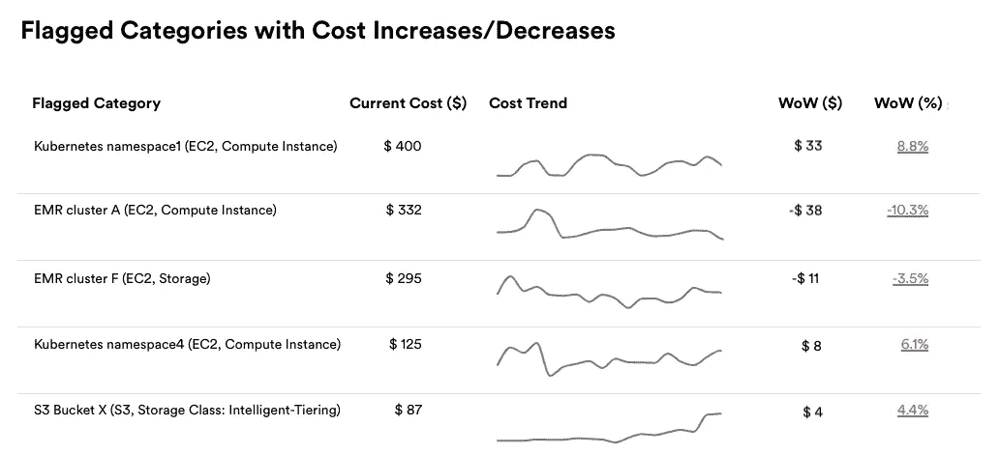
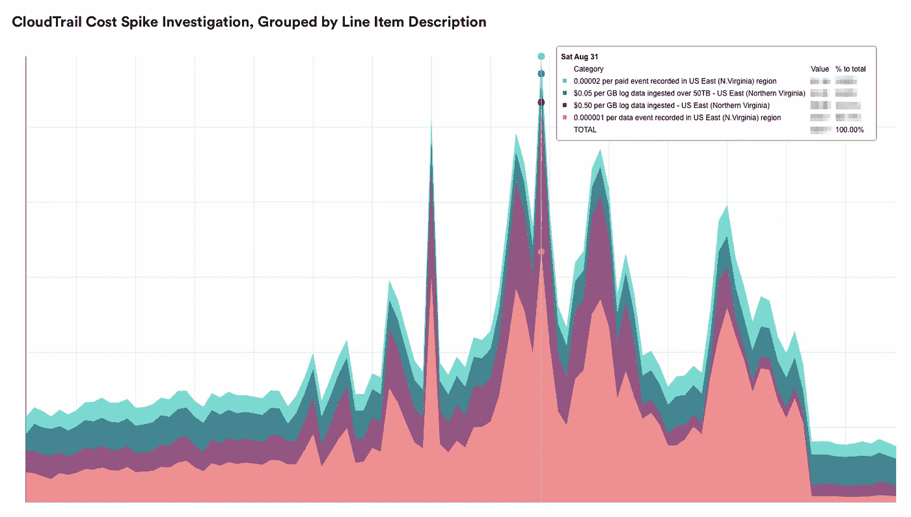

# 利用成本数据实现洞察和节约

> 原文：<https://medium.com/airbnb-engineering/achieving-insights-and-savings-with-cost-data-ec9a49fd74bc?source=collection_archive---------3----------------------->

## *云效率之路始于成本数据基础*

由[安娜·玛特林](https://www.linkedin.com/in/annamatlin/)和[塔玛·埃特曼](https://www.linkedin.com/in/tamareterman/)

# 介绍

业务盈利能力和可持续性是投资基础设施效率的有力理由，但人们很容易对如何实际降低成本感到困惑。强大且可操作的数据基础对于成功的效率计划至关重要。在 Airbnb，建立这一基础使得优先考虑节约机会成为可能，并迎来了一波成本削减，在之前的文章中[对此进行了总结。](/airbnb-engineering/our-journey-towards-cloud-efficiency-9c02ba04ade8)

更重要的是，成本数据已经成为长期控制的杠杆。该团队可以在每月账单出现严重问题之前迅速做出反应，并在大型新项目可能变得昂贵时提前计划。在公司层面，成本和使用的可见性引发了一场文化转变。当节约可以衡量时，它们可以被认可，成本效率项目成为令人兴奋的机会。截至 2021 年初，Airbnb 上访问量最大的仪表板是 AWS 成本仪表板。

我们希望分享我们的方法将使更多的公司实现 AWS 成本节约。尽管 Airbnb 的成本数据基础是在考虑一个云提供商的情况下建立的，但我们从建立管道、定义指标和设计可视化中获得的经验适用于任何云提供商。

# 构建基础

在 Airbnb 成本效率努力的早期，该团队依赖于 AWS 控制台中的[成本浏览器](https://aws.amazon.com/aws-cost-management/aws-cost-explorer/)仪表盘。与每月发票相比，Cost Explorer 有了显著改善，因为它可以在月底前看到数据，但它没有提供详细的见解，因为它没有连接到 Airbnb 的数据工具。Airbnb 的大多数团队依靠数据仓库(即[阿帕奇气流](https://airbnb.io/projects/airflow/)、[阿帕奇蜂巢、阿帕奇火花](/airbnb-engineering/scaling-a-mature-data-pipeline-managing-overhead-f34835cbc866))和广泛的分析基础设施(即 [Minerva](/airbnb-engineering/data-quality-at-airbnb-e582465f3ef7) 、[阿帕奇德鲁伊](/airbnb-engineering/druid-airbnb-data-platform-601c312f2a4c)、[数据门户](https://medium.com/airbnb-engineering/data/home)、[阿帕奇超集](https://airbnb.io/projects/superset/)、 [SLA 监控](/airbnb-engineering/visualizing-data-timeliness-at-airbnb-ee638fdf4710))来做出基于数据的决策。为了充分利用可用资源，我们的团队在丰富的原始数据源 [AWS 成本&使用报告](https://docs.aws.amazon.com/cur/latest/userguide/what-is-cur.html) (CUR)的基础上构建了一个管道。

管道转换和修改 CUR 数据，如下所示。我们把这个管道称为“Airbnb CUR 管道”，产生的表统称为“Airbnb CUR 基础”。这是因为管道用 Airbnb 特定的业务逻辑和命名约定丰富了 CUR 数据。

*Figure 1\. Airbnb CUR Pipeline*

将原始 CUR 文件加载和转换到 Airbnb CUR Foundation 是在每天运行的气流管道中执行的。我们将在下面更详细地描述这个管道。

## Airbnb 曲线管道步骤

1.  **摄取** **来自亚马逊 S3** 的报告数据:CUR 被配置为降落在 S3 桶中。从这个桶中，报告文件被读入 Airbnb 的数据仓库。在原始数据中，包括报告和字段的所有版本。
2.  **反映企业折扣计划(EDP)的折扣成本:**每个公司在折扣方面的情况都不一样。更新每一行成本数据以反映 EDP 合同。
3.  **摊销成本以配合使用:**摊销可以将 1 年或 3 年的承诺(例如，储蓄计划、预留实例)分散到整个合同期，以便成本反映资源使用情况。这个计算需要一些[自定义逻辑](https://gist.github.com/amatlin/27d8b4b8169ae6f787acbc925b5d5c37)。
4.  **丰富数据以支持下游分析:**字段被重命名以反映 Airbnb 约定，前缀指定列是 ID、指标还是维度。使用自定义计算混合折扣成本，以便对所有项目收取相同的平均单位成本费用，类似于 [AWS 混合费率](https://docs.aws.amazon.com/awsaccountbilling/latest/aboutv2/con-bill-blended-rates.html)。

## 设计成功管道的技巧

根据我们的经验，以下是一些确保 Airbnb CUR 稳定准确的建议:

**设计时考虑下游用例。在构建任何东西之前，都要为你的管道建立需求。管道服务水平协议(SLA)将如何与原始数据的滞后保持一致？从财务和工程的角度来看，什么是顶级指标，这些指标将如何解释？将用于切割和分类这些指标的维度或分组变量是什么？我们将原始 CUR 中的大约 200 个维度减少到大约 30 个对 Airbnb CUR Foundation 最有用的维度。这种简单性使得下游的表更容易使用。**

**建立追溯调整。**用量和成本数据在每月计费周期内会发生追溯性变化。这种限制影响了架构决策。我们设计了一个包含两种类型的表的数据模型:一种用追溯调整覆盖，另一种用不可变的历史快照覆盖。第一种表格是成本计划仪表板的基础，而第二种表格确保异常检测和归因的可重复计算。

**研究获取原始数据的选项。**AWS 控制台中有一个选项菜单，用于创建新的成本&使用情况报告。在最终确定哪些设置最适合我们的下游需求之前，我们配置了几个报告。Airbnb 的 CUR 报告包括刷新、版本、每小时数据和资源 id。文件格式对于成功地将数据摄取到仓库(通过 Spark)很重要，但是使用[亚马逊红移](https://docs.aws.amazon.com/cur/latest/userguide/cur-query-other.html)和[亚马逊雅典娜](https://docs.aws.amazon.com/cur/latest/userguide/cur-query-athena.html)的公司可以摄取数据而无需额外处理。

## 替代成本监控选项

我们认识到，不是每个公司都想建立和维护成本数据管道。还有许多第三方供应商使用 CUR 执行分析。Airbnb 决定建造还是购买的动机是内部资源的可用性、纳入定制逻辑(例如折扣)的需求以及与内部数据工具集成的机会。

# 用成本数据讲故事

得益于数据科学、财务、技术项目管理和工程之间的紧密合作，成本效率团队开发了一套关键指标和维度，当它们出现在图表和仪表盘中时，可以立即付诸实施。根据重要的定义进行调整，实现了每周监控、容量购买、预算、机会规模确定和节约衡量。在下一节中，我们将描述我们构建成本数据的方法，以获得最大的洞察力和影响力。

## 为利益相关者定义有意义的指标

成本效率工作的最佳衡量标准简单明了，并且为合作伙伴团队所熟知。

**顶线指标:**Airbnb CUR 数据的主要指标是**成本**，以美元为单位，其中包括摊销、贴现和混合，如上所述。**每次预订的成本**反映了 AWS 成本对业务利润的影响。

**AWS 特定产品的使用指标**:与成本指标不同，不同产品的使用指标也不同。例如，我们已经定义了一个 **vCPU-Hours** 指标，该指标在设备级别测量计算使用情况，考虑实例大小。由于定价条款的原因，使用指标通常会揭示成本数据中不明显的增长趋势。对于 S3 存储来说尤其如此，我们以**GB/月**来衡量。**Amazon Glacier 和 Deep Glacier 等冷藏选项的定价比标准存储要便宜得多，因此只看成本数据可能会导致我们忽略这些冷藏类别的使用增长。**

****计划成功指标:**我们的**百分比节约计划覆盖率利用**指标强调了与预先承诺的节约计划金额相比，计算使用的过量或不足。这个覆盖率指标也与其他带有保留实例的 AWS 产品相关，比如关系数据库服务(Amazon RDS)。**

## **包括相关维度**

**以下是 Airbnb CUR Foundation 和 metrics 提供的一些有意义的维度示例。**

*   ****产品代码** —与 AWS 产品关联的产品代码，例如，Amazon EC2 是 Amazon Elastic Compute Cloud 的产品代码。**
*   ****产品系列** —将产品代码中的相关使用类型组合在一起。例如，RDS 的产品系列包括数据库实例、系统操作、数据库存储。这个维度对于理解特定 AWS 产品中的模式尤其有价值。**
*   ****行项目描述** —对用法的详细描述，有助于深入了解行项目的定价模式。例如，请参见下面的 AWS CloudTrail 成本案例研究。**
*   ****定价术语** —表示用途是储蓄计划、预留、按需、现货还是未使用。我们使用这个维度进行容量管理。**
*   ****项目名称** —这是一个用户定义的标签，出现在 CUR 数据中。比如[高架桥](/airbnb-engineering/taming-service-oriented-architecture-using-a-data-oriented-service-mesh-da771a841344)项目就有自己的标签。**
*   ****项目名称组—** 该字段在更高的层次上将项目名称组合在一起。例如，EMR 集群有单独的项目，但是它们都被分组到一个 EMR 项目名称组中。有关此维度的实际示例，请参见下表。**

**我们发现其他有价值的维度包括实例类型系列、实例类型、使用类型、存储类别和操作。一些突出了一般趋势，而另一些对于更深入的数据探索是有用的。有关这些尺寸的更多信息，请访问 [AWS CUR 文档](https://docs.aws.amazon.com/cur/latest/userguide/Lineitem-columns.html)。**

## **分享直观形象**

**下面是三个值得注意的成本数据可视化，带有模拟数据。**

****

***Figure 2\. Daily fleet usage in vCPU-Hours by project name group (trailing 30 days)***

****

***Figure 3\. S3 Usage in GB/Month by Storage Class***

****

***Figure 4\. Categories with week-over-week (WoW) cost increases/decreases flagged in monitoring***

## **小型案例研究**

**“行项目描述”字段对于成本数据检测工作非常有用。在下图中，按行项目描述维度对成本指标进行分组显示，CloudTrail 成本的峰值是由数据事件而非日志数据引起的。这一发现引导我们查看 S3 请求模式，并开始与拥有该数据的团队进行对话。最终，这项调查显著降低了 CloudTrail 的日常成本。**

****

***Figure 5\. CloudTrail cost spike investigation, grouped by line item description***

## **成本数据社会化的技巧**

**尽管拥有数据基础开启了一个充满机遇的世界，但仅仅拥有数据是不够的。下面我们选择了一些提示，一旦数据存在，就从数据中获取价值。**

*   ****了解领域**:为什么储蓄计划比预约计划更灵活？自动扩展工作负载意味着什么？为了发现机会，了解云定价模式和技术前景是很有帮助的。这可以通过阅读 AWS 文档、观看 AWS reinvention 的演讲、与使用云提供商产品的工程团队密切合作以及与其他成本效率从业者合作来实现。**
*   ****定期审查成本:**我们的团队发现，持续监控成本数据的唯一方法是每周聚在一起审查关键指标的仪表板，并对通过异常检测发现的峰值进行分类。**
*   ****换算成美元:**分享调查结果时，始终以财务术语传达影响。与其他领域不同，成本是高度有形的，当领导者知道不作为将导致额外支出时，他们会迅速做出反应。例如，“如果存储继续以 X%的速度增长，2021 年将花费 Y 美元。”**
*   ****与利益相关者合作:**在构建仪表板或开始分析之前，从关键团队成员和领导那里获取信息。你不仅会分享一些更有用的东西，而且你的利益相关者也会感谢你尽早让他们加入谈话。**
*   ****好奇**！提问。当事情看起来很奇怪时，挖掘数据，并与他人分享你的学习成果。通常，这些调查可以导致与工程团队的对话，并启动效率工作的跟踪。**

# **结论**

**开发一个值得信赖和可解释的成本数据基础，为 Airbnb 在云成本管理方面的长期成功奠定了基础。但是光靠数据不足以实现成本节约。Airbnb 领导层对节约目标的承诺、有效的项目管理、合同管理和卓越的技术使项目的成功成为可能。工程师们在办公时间突然出现，在全公司的仪表板上询问他们的成本，团队自豪地分享他们效率项目的结果。**

**我们希望本帖中分享的基本细节和知识将揭开这一领域的神秘面纱，并激励其他公司的从业者追求基于数据的成本效率之路。**

**您对云效率充满热情，还是受到独特数据挑战的启发？我们一直在寻找有才华的人加入团队！**

# **鸣谢❤️**

**Airbnb CUR 基金会是在许多人的支持下成立的。我们非常感谢 Stephen Zielinski、Krishna Bhupatiraju、、、**、** Jon Tai、、Xu、Melanie Cebula 和刘明珠为我们提供的技术和建筑建议。感谢大卫·摩利逊对这篇文章的深思熟虑和建设性的反馈。我们很幸运地得到了许多支持这项工作的经理的支持:阿里·西格尔、珍·赖斯、杨光、斯瓦鲁普·贾加迪什、里德·安德森、布赖恩·华莱士、杰森·索贝尔和巴拉特·兰根。**

**我们要向 AWS 客户团队表示感谢，他们在我们的成本效益之旅的每一步都与我们合作:丹·法切蒂、阿姆利亚·夏尔马、内森·佩里、杰夫·马鑫。也感谢其他公司的许多成本效率从业者，他们慷慨地分享了他们的经验。**

**【亚马逊网络服务、EC2、亚马逊 RDS、亚马逊红移、亚马逊雅典娜、亚马逊冰川、亚马逊弹性计算云、AWS CloudTrail 和亚马逊 S3 是 Amazon.com 公司或其附属公司在美国和/或其他国家的商标。**

***Apache Airflow、Apache Hive、Apache Spark、Apache Druid、Apache Superset 和 Apache 是 Apache Software Foundation 在美国和/或其他国家的注册商标或商标。***

***Kubernetes 是 Linux 基金会在美国和/或其他国家的注册商标。***

***所有商标均为其各自所有者的财产。这些的任何使用仅用于识别目的，并不意味着赞助或认可。***