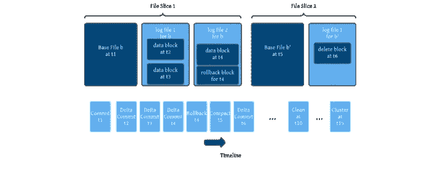
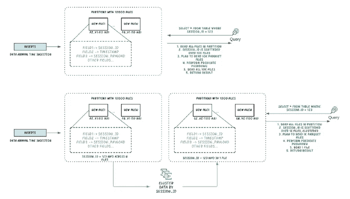

# 分布式文件系统上的 ACID 转换

> 原文：<https://medium.com/walmartglobaltech/acid-transformations-on-distributed-file-system-fdec5301c1b1?source=collection_archive---------6----------------------->


**Apache Hudi**

上图来源:[https://hudi.apache.org/](https://hudi.apache.org/)

**合著者**:绍拉布·佩特里亚

**同是挑战:**

在大数据世界中，在分布式文件系统上执行 ACID 转换总是具有挑战性，而专有数据库通常更适合执行 ACID 转换，这通常会对存储和计算收费

酸是原子性、一致性、隔离性和持久性的缩写。这四种品质中的每一种都有助于事务确保数据完整性的能力

# 阿帕奇胡迪简介:

> Apache 胡迪是一种开源文件格式，它提供了 ACID 转换，而胡迪意味着 Hadoop 可以进行插入、删除和增量。为了降低成本，我们可以将数据存储在分布式文件系统中，并在其上创建胡迪表。所以我们只付仓储费

胡迪以 parquet 格式存储数据，并将事务日志存储在**中。帽衫文件夹**。对于每次提交，都会创建一个增量日志，日志以 [Avro](http://avro.apache.org/) 格式对数据进行编码，以加快日志记录速度

胡迪是围绕基本文件和增量日志文件的概念设计的，这些日志文件存储对给定基本文件(称为文件片)的更新/增量。它们的格式是可插拔的，Parquet(列访问)和 HFile(索引访问)是目前支持的基本文件格式。增量日志以 [Avro](http://avro.apache.org/) (面向行)格式对数据进行编码，以加快日志记录速度(就像 Kafka 主题一样)。胡迪独特的文件布局方案将对给定基本文件的所有更改编码为一系列块(数据块、删除块、回滚块),这些块被合并以导出更新的基本文件。本质上，这构成了一个自包含的重做日志，让我们在其上实现有趣的特性。



上图来源:[https://hudi . Apache . org/blog/2021/07/21/streaming-data-lake-platform/](https://hudi.apache.org/blog/2021/07/21/streaming-data-lake-platform/)

在胡迪有两种不同类型的桌子，如下所述

1.  **写入时复制(CoW):** 数据以列格式存储(Parquet)，在写入期间更新会创建文件的新版本。这种存储类型最适用于读取量大的工作负载，因为最新版本的数据集总是以高效的列文件形式提供
2.  **读时合并(MoR):** 数据以列(Parquet)和基于行(Avro)格式的组合存储；更新被记录到基于行的“增量文件”中，并在以后被压缩，以创建列文件的新版本。这种存储类型最适用于写负载繁重的工作负载，因为新提交会作为增量文件快速写入，但是读取数据集需要将压缩的列文件与增量文件合并。

写时复制表支持两种查询。

**快照查询:**
查询最近一次快照的表数据，直到最后一次提交成功。

**增量查询:**
查询对表所做的增量修改。这些查询有助于下游作业处理更改的数据。
例如:在时间段 t1 和时间段 t2 之间将数据提交到表中。(更新+插入)

从胡迪 0.9 版本开始，它与 Spark SQL 兼容，因此我们可以编写本地 SQL 来执行 ACID 转换，如删除、更新和合并命令

# 让我们深入研究代码。

> **环境设置
> Spark 版本:2.4
> Apache 胡迪版本:0.10
> 文件系统:HDFS/GCS 等..**

下面的代码将启动一个包含所有胡迪包的 spark shell，并创建一个胡迪表，然后根据逻辑执行 ACID 转换

```
spark-shell \
--class org.apache.hudi.utilities.HoodieClusteringJob \
- packages org.apache.hudi:hudi-spark-bundle_2.12:0.10.0,org.apache.spark:spark-avro_2.12:2.4.4 \
- conf 'spark.serializer=org.apache.spark.serializer.KryoSerializer'import scala.collection.JavaConversions._
import org.apache.spark.sql.SaveMode._
import org.apache.hudi.DataSourceReadOptions._
import org.apache.hudi.DataSourceWriteOptions._
import org.apache.hudi.config.HoodieWriteConfig._spark.sql(“create table if not exists Hudi_Table ( col1 string, col2 string, col3 string,col4 string,col5 string,col6 int,col7 date,col8 string) using hudi options ( type = ‘cow’, primaryKey = ‘col1’ ) partitioned by (col7,col8)”)spark.sql(“merge into Hudi_Table X using ( select col1,col2,col3,col4,col5,col6,col7,col8 from stage_Table ) source on X.col1 = source.col1 WHEN MATCHED THEN update set X.col2 = source.col2 when NOT matched then INSERT * ")
```

默认情况下，胡迪表创建下面提到的列以及我们在逻辑中指定的列

*   **_hoodie_commit_time** :最后一次触及该记录的提交。基于此列，将检索记录的最新版本
*   **_hoodie_record_key** :被视为每个 DFS 分区内的主键，所有更新/插入的基础
*   **_hoodie_file_name** :包含记录的实际文件名(对筛选重复非常有用)
*   **_ hoodie _ partition _ Path**:basePath 中标识包含该记录的分区的路径

将超过 2 GB 的数据加载到具有 upsert 数据的胡迪表中大约需要 9 分钟


# 性能调整:

# 1.聚类:

文件大小和摄取速度之间的权衡由**hoodie . parquet . small . file . limit**属性提供，以配置文件大小。有两种类型的集群调度和执行集群。

下面是聚类的例子



上图来源:

[https://hudi . Apache . org/blog/2021/01/27/胡迪-聚类-intro/](https://hudi.apache.org/blog/2021/01/27/hudi-clustering-intro/)

# 2.批量插入:

通过设置以下两种配置，胡迪支持将 bulk_insert 作为写操作类型:

设置 hoodie . SQL . bulk . insert . enable = true；
设置 hoodie . SQL . insert . mode =非严格；

# 3.索引

当您将记录键建模为单调递增(例如时间戳前缀)时，胡迪提供了最佳的索引性能，从而导致范围修剪过滤掉大量文件进行比较。即使对于基于 UUID 的按键，也有已知的技术来实现这一点。例如，在一个包含 80B 个关键字/3 个分区/11416 个文件/10TB 数据的事件表上，使用 100M 个带时间戳前缀的关键字(5%的更新，95%的插入)，胡迪索引实现了比普通 spark join 快 7 倍(2880 秒对 440 秒)的速度。

# 局限性:

1.  目前，Apache 胡迪 0.10 只提供基于主键列更新记录的功能。不支持基于非主键列或主键列的更新
2.  如果定义了复合主键，则需要在 ON 条件中指定所有列
3.  胡迪表上不支持 varchar、时间戳等数据类型

# 可能的解决方案:

1.  **Delta :** 它是另一种文件格式，在分布式文件系统之上提供 ACID 转换功能。在这里，我们也可以基于非主键列更新记录。
2.  **Iceberg :** 这是一种针对大型分析数据集的开放式表格格式。Iceberg 为 Spark、PrestoDB、Hive 等计算引擎添加了表格..它还提供了基于非主键更新记录的功能

# 参考资料:

【https://hudi . Apache . org/blog/2021/07/21/streaming-data-lake-platform/
[https://hudi.apache.org/docs/quick-start-guide](https://hudi.apache.org/docs/quick-start-guide)
[https://github.com/apache/hudi/tree/master/hudi-examples](https://github.com/apache/hudi/tree/master/hudi-examples)
[https://CWI ki . Apache . org/confluence/display/胡迪/Tuning+Guide](https://cwiki.apache.org/confluence/display/HUDI/Tuning+Guide)