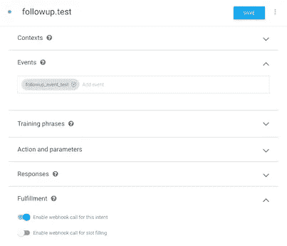
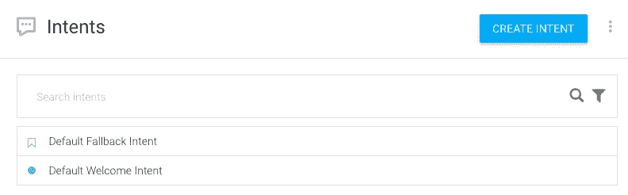
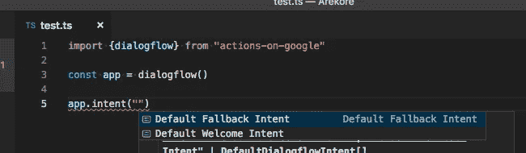

# 对 Google SDK 2.4.1 更新的操作

> 原文：<https://medium.com/google-developer-experts/actions-on-google-sdk-2-4-1-updates-63a0bf9ae94e?source=collection_archive---------7----------------------->

开发者可以扩展谷歌助手的功能。例如，他们可以向 Google Assistant 提供一个动作来完成某件事，用户可以用动作名调用该动作。actions-on-google-nodejs SDK(在这里，我称之为“SDK”simplify)允许他们轻松地构建动作并使用 google 上的动作所提供的每个功能。

2018 年 10 月 5 日，SDK 新版本 2.4.1 已经发布。我想在这里介绍新版本的三个重要更新。

# 修复关于“跟进”功能的错误

您的操作可以通过`conv.followup()`函数发出一个事件。而且，您的操作可以通过创建意图来处理事件，从而接收事件。

例如，当您的操作调用您的实现中的`conv.followup()`时，

```
app.intent("something", conv => {
  conv.followup("follow_up_event_test", {
    ... // Some parameters
  });
});
```

您的操作可以通过定义处理事件的意图来处理事件。



```
app.intent("followup.test", conv => {
  // do something...
});
```

直到 SDK 版本 2.3.0，才出现了使用`conv.followup()`功能时保存的数据丢失的 bug。如果您的操作将用户名存储到`conv.data`存储器中，

```
app.intent("something", conv => {
  conv.data["user_name"] = "Yoichiro";
  conv.followup("followup_event_test");
});
```

用户名丢失。也就是说，如果您的操作有如下代码，

```
app.intent("followup.test", conv => {
  conv.ask(`Hi ${conv.data["user_name"]}. Followed up.`);
});
```

直到 2.3.0，你会看到下面的结果。


但是，这个错误在 2.4.1 中被修复了。通过使用 2.4.1，您的操作可以在使用`conv.followup()`时传递用户名。


# 默认对话流意图的自动完成

当您在 Dialogflow 上创建新代理时，您可以看到两个预先创建的默认意图:

*   "默认欢迎意图"
*   "默认回退意图"



基本上不用改名字，没有任何触动就会用。但是，这些名称有点长，因此，您可能会输入错误。

如果你使用 TypeScript 和可视化源代码或这样的环境，打字错误会大大减少。因为，代替您键入，这些意图名称将被自动完成。



我想使用这个功能，但我不能这样做。因为，我是 IntelliJ IDEA 用户(还不支持字符串自动完成)…

# 支持数字交易

最近，谷歌开始支持数字交易。通过数字交易，你的行动可以处理由 Google Play 管理的数字商品，并可以将它们出售给你的用户。

[](https://developers.google.com/actions/transactions/digital/dev-guide-digital) [## 构建数字交易| Google 上的行动| Google 开发者

### 要向数字采购 API 发送请求，您需要下载一个与您的……

developers.google.com](https://developers.google.com/actions/transactions/digital/dev-guide-digital) 

为了处理数字商品，开发者需要使用不同于实物商品交易步骤的方式。也就是有下面这一步。

1.  收集信息。
2.  建立订单。
3.  完成购买。
4.  描述购买状态。

在 SDK 最新的 2.4.1 中，已经提供了`CompletePurchase`类。您的操作可以通过发送`CompletePurchase`类的实例来完成购买(这是为了上面的步骤 3)。

```
app.intent("something", (conv, params, option) => {
  const [skuType, id] = option.split(",");
  conv.ask(new CompletePurchase({
    skuId: {
      skuType: skuType,
      id: id,
      packageName: <PACKAGE_NAME>,
    },
  }));
});
```

因此，如果您需要处理数字交易，您需要使用 SDK 的 2.4.1 版本。

# 结论

谷歌助手和谷歌上的操作每天都在发展，开发者可以使用的功能数量也在相应增加。基本上，开发者通过 SDK 访问这些特性。也就是说，SDK 的更新信息对开发者来说非常重要。

您可以从以下页面了解更新信息。请关注更新信息，以便快速跟上。

[](https://github.com/actions-on-google/actions-on-google-nodejs/releases) [## 谷歌上的操作/谷歌节点上的操作

### 用于 Google 上操作的 Node.js 客户端库。通过以下方式为 actions-on-Google/actions-on-Google-nodejs 开发做出贡献…

github.com](https://github.com/actions-on-google/actions-on-google-nodejs/releases)