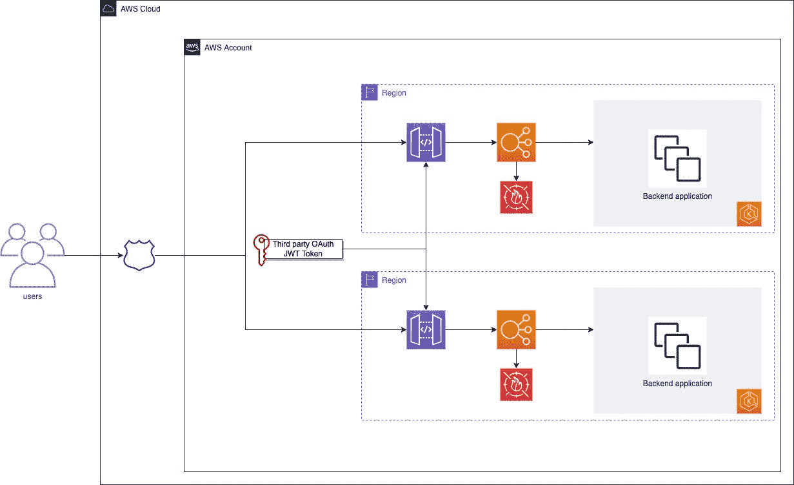
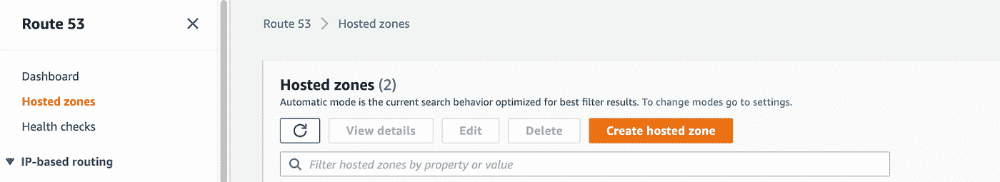
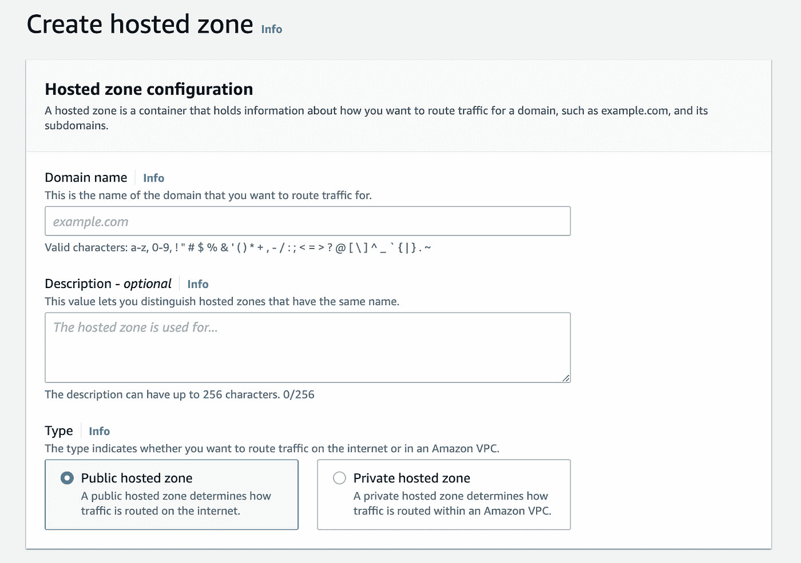
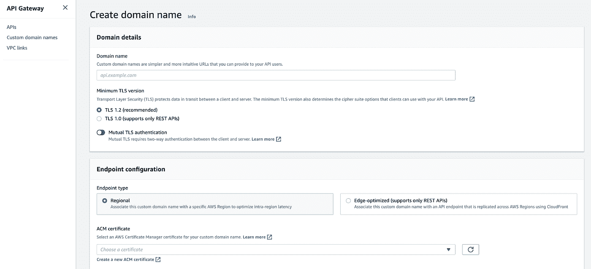
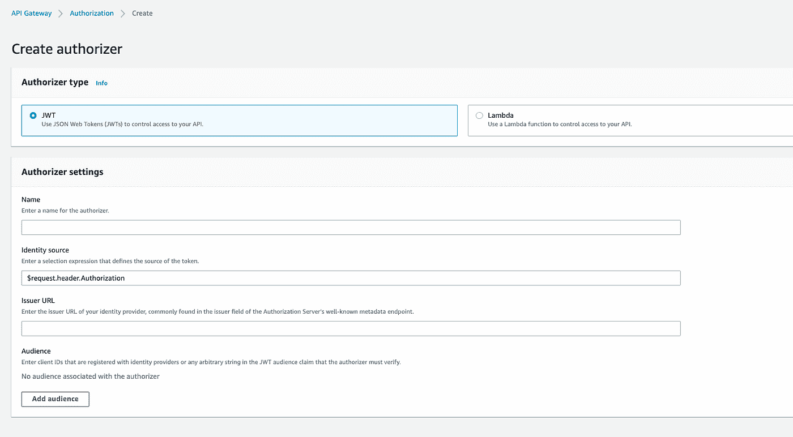

# 主动-主动 API 网关:带 terraform 代码的分步指南

> 原文：<https://medium.com/globant/active-active-api-gateway-a-step-by-step-guide-with-terraform-code-9882d6c2609a?source=collection_archive---------0----------------------->

应用程序基础架构和灾难恢复策略各不相同，这取决于每个公司的需求。如果没有坚固的基础设施，那么拥有坚固的代码又有什么意义呢？采用主动-主动策略，尽管比其他策略(如指示灯或温暖袖手旁观)更昂贵；确保我们的客户不会受到主站点故障的影响，并且他们始终由延迟最小的区域提供服务。这里我们将解释部署主动-主动 API 网关的一步一步，并分享一些有用的代码。

本文将回顾以下部分:

*   体系结构
*   所需资源的部署
*   结论

# 体系结构

我们将部署的基础架构:

流程如下所示:

*   用户去我们的网站
*   Route53 重定向到延迟最小的区域，或者如果其中一个区域出现故障，则重定向到工作正常的区域
*   HTTP API 根据第三方 OAuth 对用户进行身份验证
*   如果用户通过了正确的身份验证，它将重定向到负载平衡器
*   负载平衡器将根据 WAF 规则检查是否允许继续
*   如果允许继续，用户将被定向到相应的应用程序

因为 Amazon Cognito 不支持主动-主动 API 网关配置，所以我们使用一个定制的解决方案来提供 JSON Web 令牌(JWT)进行身份验证。这个定制的解决方案促使我们决定实现 HTTP API，而不是 Rest Api。我们可以使用带有 Lambda 的 JWT 授权器，但是我们更喜欢这种更简单的方法。此外，HTTP apis 比它们的 Rest 对等物更便宜(关于 API 之间的 AWS 比较，你可以参考官方文档[这里](https://docs.aws.amazon.com/apigateway/latest/developerguide/http-api-vs-rest.html))。

# 部署资源

1.  创建托管区域

除非您已经有了要在其中创建记录的托管区域，否则您应该创建一个。为此，请转到 AWS 控制台 Route53，然后单击创建托管区域:

在您的域名中，您需要指明您的托管区域的域名。域名是所有子域名的后缀。例如，如果你的域名是 my-domain.com，那么你将能够创建子域名，如 cool.my-domain.com 和 supercool.my-domain.com。此外，您需要将您的托管区域标记为 Public，因为我们希望该区域可以公开访问。

创建托管区域时，AWS 会自动创建两条记录:一条是 NS 类型的，另一条是 SOA 类型的。NS 代表名称服务器，指的是包含您的 DNS 的服务器。SOA 代表授权开始(Start of Authority)，拥有与域名相关的所有管理信息，比如你的姓名和联系方式(这与 RFC 1035 规则有关，你可以在这里阅读更多)。

2.创建 API 和 API 记录

一旦你创建了你的托管区域，首先你需要创建你的自定义域名和你想要公开的 API。因此，您应该转到 API 网关控制台。

3.创建一个与您的托管区域的后缀相匹配的域名

当创建您的域名时，您必须指明:它的名称、最低 TLS 版本、端点配置，如果它有 ACM 证书，您必须选择它。

4.创建 HTTP API

创建 HTTP API 时，您需要:

*   添加集成
*   指明 HTTP API 名称
*   配置路线
*   添加 VPC 链接

简而言之，这是如何工作的？用户将向您的{yourcustomdomainname}/{api}发出请求。在这个例子中，它可能是:devops.cool.my-domain.com/learn-api。请注意，您的自定义域名以我们在第一个实例中创建的托管区域的域名结尾。

当您创建集成时，您正在指示 api 应该将请求重定向到哪里。在我们的例子中，我们将流量重定向到一个已经存在的应用负载平衡器。如果使用 ACM 证书，在集成中确保 HTTPS 主机名和映射主机名的参数与证书的主机名相匹配是很重要的。否则，它将抛出一个未经授权的错误。

api 的路由指定路径。按照我们的例子，也许我希望我的 api 公开不同的路径，比如“aws-courses”和“gcp-courses”，在这种情况下，我的 api 将有两条路径，每条路径一条；可从以下网址获得:

*   devops.cool.my-domain.com/learn-api/aws-courses
*   devops.cool.my-domain.com/learn-api/gcp-courses

每条路线也有方法。可能的方法有 POST、PUT、PATCH、GET、DELETE。如果您希望用户能够使用这些方法中的任何一种，您可以指定 any 作为该特定路线的方法。

VPC 链接至关重要，因为没有它，api 将无法访问它应该重定向到的资源。

如果你想知道更多关于 api 是如何工作的，你可以在[这篇文章](https://www.alexdebrie.com/posts/api-gateway-elements/)上找到更多信息。

重要提示:由于我们正在部署主动-主动配置，请确保自定义域名和您的路由部署在不同的区域，但命名相同。在我们的示例中，两个自定义域名都应该是“devops.cool.my-domain.com ”,并且两个 api 路由应该是相同的。

在我们的例子中，我们需要实现一个定制的授权器。可以从 AWS api 网关控制台向 Api 添加授权者，如下所示:

在写着姓名的地方，你应该写上你想要的授权人的姓名。如果您留下$request.header.Authorization，这意味着授权令牌应该包含在请求中。发布者 URL 是授权服务器端点，受众是注册的客户端 id。如果在使用令牌执行请求时，令牌与列出的任何受众都不匹配，api 将返回一个授权错误。

5.创造 53 项 CNAME 纪录

一旦设置了 api 网关，就为 api 网关设置 DNS 记录。这是令人困惑的部分。

第一步:为你的自定义域名创建一个延迟记录

第二步:为您的应用程序负载平衡器创建一个 CNAME 记录。

让我们深入了解其中的每一个步骤。

第一步是设置延迟记录，每个区域一个。每个延迟记录应该具有完全相同的名称；然而，它们将指向它们相应的 api 网关。因此，当用户向您的自定义域名发出请求时，route53 会将用户重定向到延迟最小的区域。

一旦做到这一点，你需要进入第二步。对于应用程序负载平衡器背后的每个服务，确保您有一个 CNAME 类型的 DNS 记录。通过这种方式，应用程序负载平衡器将能够将流量重定向到它。

# 可选:配置晶片

配置 WAF ALC 是可选的，但总是建议这样做。对此进行配置有两个重要方面。首先是设置规则，这些规则可以根据 IP、位置等进行匹配。第二个是将 WAF ACL 与资源相关联，它应该应用它的规则。如果你想将 WAF 日志保存到 Kinesis Data Firehose 中，请记住它的名称应该以 aws-waf-logs 开头(见官方文档[此处](https://docs.aws.amazon.com/waf/latest/developerguide/logging-kinesis.html))。

# 结论

配置主动-主动 api 可能既有助于灾难恢复策略，也有助于确保用户重定向到延迟最小的区域。这种 api 的配置需要在两个不同的区域设置相同的 api 配置，然后创建 route53 资源以将流量重定向到它们。将授权者添加到 api，将 WAF ACL 添加到应用程序负载平衡器，这并不是强制性的，但是这样做绝对是一个好的实践。

# 奖金

您也可以使用 Terraform，而不是从控制台执行此操作。我们已经在[这个地形库](https://registry.terraform.io/modules/rgg1993/api-gateway/aws/1.0.0)上传了我们用来创建所有这些资源的模块(除了从控制台手动创建的托管区域)。

# 承认

这个解决方案是由[伊万·费尔南德斯](https://www.linkedin.com/in/ivanferb?miniProfileUrn=urn%3Ali%3Afs_miniProfile%3AACoAAA9buSIBllgcvnAXktSbJJ96--ECOmykhd8&lipi=urn%3Ali%3Apage%3Ad_flagship3_search_srp_all%3BzrVmI26AT0mqMrcC0CYwVw%3D%3D)设计的，所以所有的功劳都应该归他。我只是在他的指导下编写了实现解决方案的模块，并决定写这篇文章来确保我理解这个过程。