# 主动-主动无共享数据库架构

> 原文：<https://medium.com/capital-one-tech/active-active-shared-nothing-database-architecture-304957ffb89?source=collection_archive---------0----------------------->

## 为正确的案例选择正确的模式

# 序文

*“难以相信这不可能，”*困惑的泰德哀求道。*“这是 2020 年；肯定会有其他办法的”。*

这是 Acme Widgets 的教学时刻。他们技术堆栈中的一个数据库出现故障，导致他们的许多服务中断。首席技术官 Ted 召开了一次高级技术领导的紧急会议，以制定战术和长期解决方案的行动方针。他想到的一个解决方案是将所有数据库转换为主动-主动模式，它们之间没有共享资产，在地理上分散以降低风险；但是应用程序没有变化。所有的目光都转向新任命的总建筑师简，征求她的意见。出乎所有人意料的是，Jane 平静地宣布，如果没有应用程序重构，不是所有的数据库都可以是主动-主动无共享(AASN)的。她还解释说，对有些人来说这是不可能的，对有些人来说甚至不需要这样做。

对简来说，这并不是什么新情况。在加入 Acme 之前，作为许多组织的数据领导者，她必须就数据弹性(不同于应用程序弹性)的微妙差异对许多其他技术领导者进行培训。

她从过去的经验中知道，用清晰的例子解释什么可以做，什么可以做，是证明什么对 Acme 最有利的最佳方式。

# 获得基础知识

简宣布，首先要做的是正确定义 AASN。这意味着在两个不同地理位置的存储区中有两个数据库副本，它们具有相同的数据，都服务于在该数据中心运行的应用程序的副本，如下图所示。

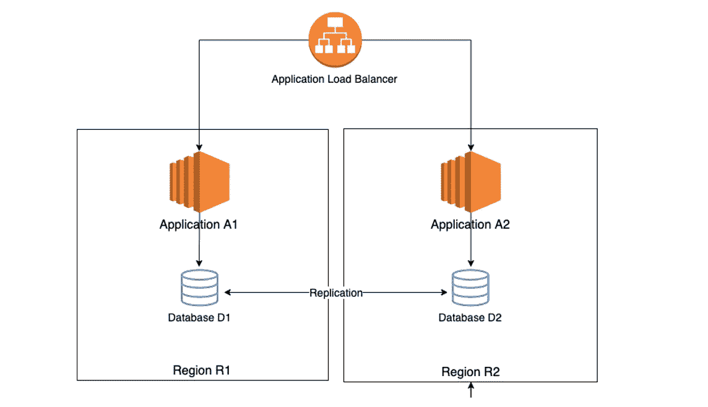

应用程序 A1 和 A2 只是运行在两个不同地区(R1 和 R2)的同一应用程序的副本。数据库 D1 和 D2 是运行在不同地区的同一个数据库的副本。数据库是双向复制的，因此对一个数据库的更改会保留在另一个数据库中。A1 连接到 D1，A2 仅连接到 D2。数据库 D1 和 D2 的副本之间不共享任何东西。

Jane 提醒他们，他们之间没有任何共享，因此像 Oracle Real Application Clusters(【https://www.oracle.com/database/technologies/rac.html】)这样的共享存储或严重依赖同步共享存储系统的系统不符合要求。因为从可用性的角度来看，它们可以完全相互独立，这带来了弹性。但是，简强调说，这并不总是可能的，在许多情况下甚至不需要。

*“不需要？”*困惑的 Ted 问道，*“等等，我们的数据库必须具有高可用性，不是吗？”*

“是的，我们有，”简回答。*“AASN 数据库架构经常与高可用性混为一谈；但是* ***它们是不同的概念。*** *"* 有可能在数据层实现高可用性，而“热”备用数据库可能位于不同的地理区域。当当前主数据库出现故障时，备用数据库会接管，从最后一个事务开始。利用适当的技术和良好的体系结构，可以将恢复点目标降低到 0，即在主要故障期间不会丢失任何数据。不幸的是，这通常伴随着断电的可能性，即在非常小但可察觉的时间段内没有数据库可用于正常服务。有了合适的架构，就有可能将系统停机或断电时间减少到接近于零。但是，她警告说这很关键，除非在非常特殊的情况下，否则通常不可能将热备用数据库指定为可用的活动数据库。因此，系统具有高可用性；但不能称为主动/主动。

“我明白你的意思，”泰德同意道。*“我们可以高度可用，但不一定是主动/主动的，没有共享资产。”*

那么，观众们想，我们如何才能开发一个真正的主动/主动架构，在数据库层使用无共享资产呢？简回答说，只要我们谨慎对待它，不要指望一刀切的解决方案，它在许多情况下都是可能的。在本文中，您将学习由 Jane 解释的 AASN 数据库系统的各种模式，以及必须伴随它们的架构考虑。

# 申请的状态

*“你提到的 AASN 在很多应用中是不可能的，”*Ted 询问道。“你能解释那些案例吗？”

Jane 解释说，关键是仔细的应用程序设计，尤其是应用程序应该是无状态的，不需要跨越到数据库的另一个副本进行验证。当需要在应用程序中维护状态时，例如在电子商务订单更新的情况下，数据库中的 AASN 架构会带来巨大的数据完整性风险。实现 AASN 数据库层的理想场景是只读数据库，在这种情况下，应用程序的状态不会改变，或者虽然改变了，但最终一致的状态是可以接受的。Jane 警告说，在后一种情况下，应用程序需要意识到并应该能够处理对数据库副本进行冲突更改的可能性。

观众敦促她详细说明应用程序需要做什么。Jane 继续说道:应用程序需要了解 AASN 数据库层的三个约束:

1.  最终，而不是立即，一致的数据存储。
2.  由于两个副本中的同一记录发生了变化，可能会产生冲突。
3.  由于一个更新在另一个副本上的冲突更新之后出现，可能导致数据损坏。

# 传统方法

简继续她的叙述。首先，她谈到了主动/被动无共享(APSN)架构，强调了“被动”这个词以下是数据库层 APSN 体系结构的传统观点:

在此图中，A1 和 A2 是同一应用程序的两个实例，分别运行在 R1 和 R2 地区，并连接到数据库 D1(主)和 D2(备用)。数据库 D2 是 D1 的热备用，它通过某种类型的数据库复制技术不断更新。当地区 R1 失败时，数据库 D1 也会失败。数据库 D2 只是承担主数据存储的责任。在 R1 区域发生故障后，D2 成为主要区域，应用程序负载平衡器将流量发送到该区域。在任一时间点，只有一份数据拷贝是主数据。

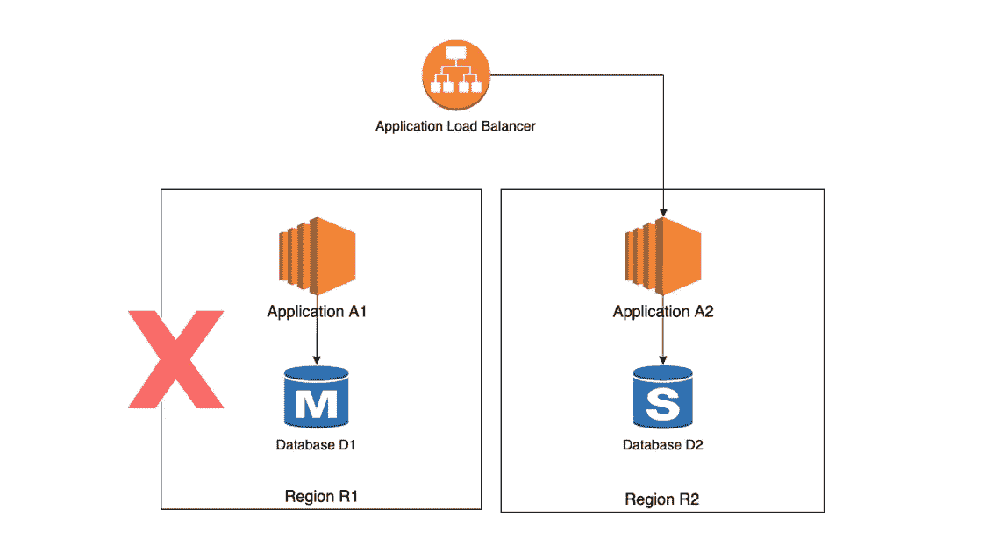

# 限电期

但是，在负载平衡器将流量发送到应用程序 A2 之前，它必须确保备用数据库完全跟上对数据库 D1 所做的更改。这个时间无论多短，应用程序仍可察觉，称为掉电期。Jane 解释说，掉电持续时间完全取决于对数据库 D1 所做的更改量，在无活动或低活动期间可能为零。

但是，观众想知道，有没有可能消除灯火管制期？

当然，Jane 澄清说，消除数据库层中的掉电期是可能的；但是为了确保同步不会滞后，复制需要同步。虽然这听起来不错，但实际上我们必须考虑两个不利因素:

1.  这通常非常昂贵，尤其是在跨区域的情况下，因为必须使用延迟非常低的介质来传输数据。
2.  它增加了应用程序的性能开销，因为数据库在向应用程序发送提交响应之前必须得到 D1 和 D2 的确认。

因此，数据库复制通常是异步的，因此某种程度的断电是不可避免的。

# 热备用

这让期待迅速得到答案的观众情绪低落。简继续她的叙述。区域 R1 恢复后，反向复制开始。

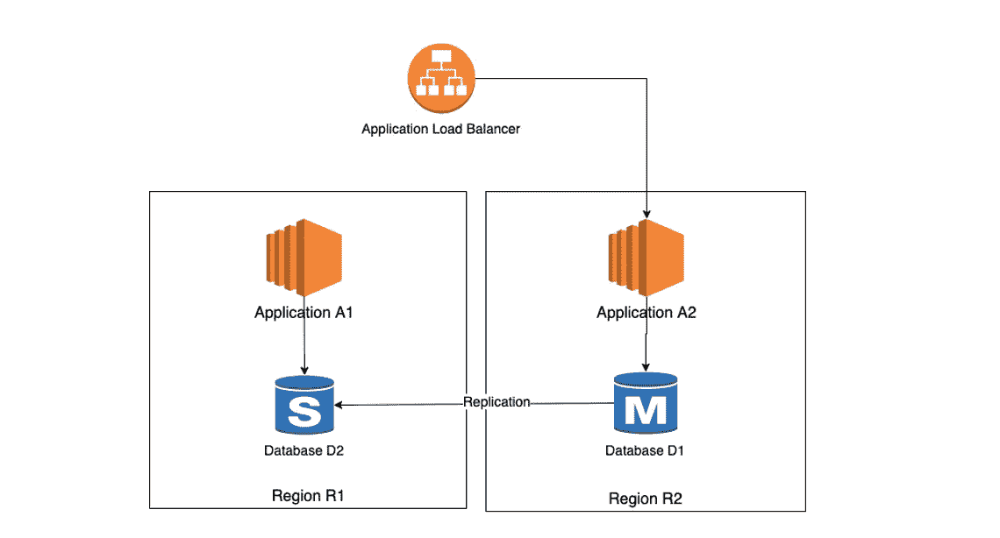

Jane 提请观众注意，在这种体系结构中，只有一个数据“主”副本。另一份总是仅仅是备用的。这消除了数据存储之间发生冲突的任何可能性。另一方面，主动-主动无共享数据存储区假设两个数据存储区始终是主数据存储区，复制在两个方向上进行，应用程序负载平衡器向两个数据存储区发送流量。这样，当 R1 地区出现故障时，负载均衡器只会停止向该地区发送流量，而来自 D1 的所有更改都已经在 D2 可用，因此没有断电期。

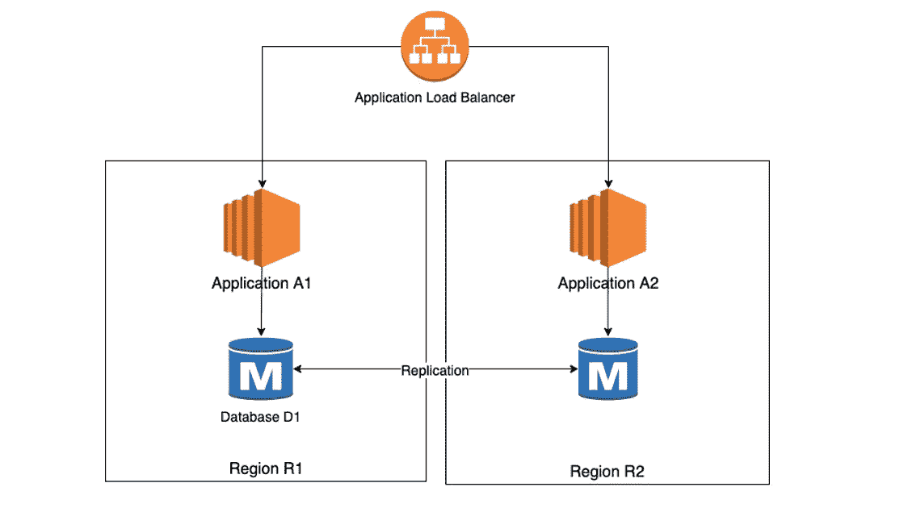

“牛逼！”激动的 ted 宣布。“为什么我们不能将我们的数据存储转换为主动-主动无共享，从主动-被动无共享？为什么我们需要改变我们的应用程序？”

简解释说，这就是问题所在。根据应用程序的意图，它**可能根本不运行**，或者可能在**静默数据损坏**的情况下运行。这就是我们要注意的。

这两个短语就像悬在空中的剑——“可能不起作用”和“无声的数据损坏”。

*“请解释，”*显然被激起了兴趣的泰德哀求道。

但是在进一步解释之前，Jane 希望观众了解一些数据管理的基础知识。

# CAP 定理

Jane 提出了一个问题供观众思考，“当我们在两个数据存储中存储相同数据的多个副本来解决单个副本的故障时，当一个副本出现故障时会发生什么？”其他副本是否会立即从故障中接管操作？它们可能是，也可能不是，这取决于架构。这就是 CAP 定理的规则——一致性、可用性和分区容差([https://en.wikipedia.org/wiki/CAP_theorem](https://en.wikipedia.org/wiki/CAP_theorem))—的用武之地。

**一致性:**如果在不同的数据存储中有多个数据副本，那么它们是否在任何时间点都 100%同步？如果是这样，他们需要一个高速、低延迟的网络。但是，由于从所有数据存储中获得提交确认的时间现在变长了，这对应用程序的性能产生了负面影响。

**可用性:**如果一个数据存储不可用，其他副本能否接管，使应用程序获得无错误响应。请记住，这仅仅是数据存储对应用程序的响应。那里可能有最新的更新，也可能没有。

**分区容差:**当数据存储副本之间的消息被丢弃时，应用程序还能运行吗？这无法保证幸存的副本都已同步。

简解释说，上限定理表明，在任何设计中，我们只能拥有三个属性中的两个；不是三个都是。

她解释说，看待这个问题的另一种方式是通过下图所示的文氏图。请注意，这三个属性中有两个有重叠的地方；但是没有一个空间是这三者融合的地方。简强调，理解这三者的融合是不可能的，这一点非常重要。例如，如果我们努力追求一致性，我们就不能为可用性而设计；但是当一个拷贝停机时会发生什么呢？当副本恢复时，我们必须暂停数据存储上的操作，直到我们可以将新恢复的副本与幸存的副本同步。否则新启动的分区将会不一致，违反 CAP 中的“C”。

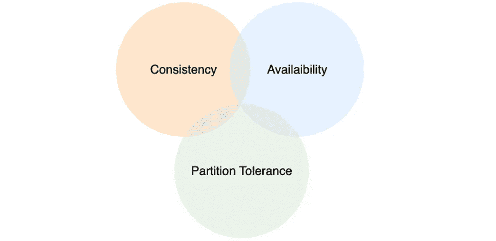

# 最终一致状态

那么，观众会问，如果它们不一致，维护这些副本又有什么意义呢？

维护副本仅仅意味着数据存储库异步同步**；因此，它们最终会同步。但是在给定的时间点，系统无法保证数据存储 100%同步。这被称为最终一致性，而不是直接一致性。理解这种差异是至关重要的。**

**为了说明这一点，Jane 向他们展示了一个具有三个数据存储库的数据系统的示例体系结构，该体系结构满足 CAP 定理中的 A 和 P，而不考虑 C，即最终一致。**

**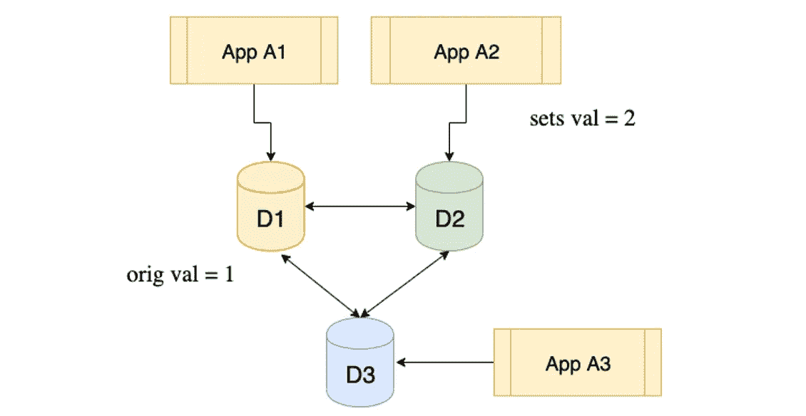**

**她解释了这个场景:假设一个数据元素的值为 1，这个值最初在所有三个数据存储中是相同的。现在，应用程序 A2 将该值更新为 2。由于体系结构更倾向于可用性和分区容差，而不是一致性，所以其他两个数据存储可能没有获得更新。此时，如果应用程序 A3 读取数据元素，它可能会得到值 1，而不是最近的值 2。这在许多情况下可能是不可接受的，在这些情况下，最新值不仅是所希望的，而且是绝对必要的，例如在电子商务订单中。数据存储 D3 将*最终*获得更新值 2；但不是马上。**

# **冲突解决**

**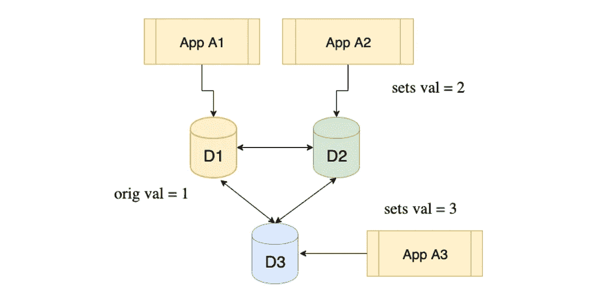**

**简解释了第二个问题。她考虑了另一种情况，如下图所示。我们像以前一样从初始值 1 开始，应用程序 A2 在数据存储区 D2 中将它更新为 2。但是在它被传播到所有其他数据存储之前，连接到数据存储 D3 的应用 A3 将该值更新为 3。数据存储 D1 有什么价值？**

**她警告说，由于数据复制是异步的，因此无法预测哪个更新会先到达。如果来自 D2 的更新首先到达它，它将是 2，否则它将是 3。这种不可预测性在很多情况下可能是不可接受的。**

**D2 也出现了类似的问题。它应该忽略自己的更新并将元素更新为 3 吗？同样的问题也适用于 D3。**

# **冲突解决处理技术**

**Ted 和观众现在对主动-主动无共享架构的潜在问题有了清晰的认识。但是他们大声地问，有没有什么技巧可以避免这些问题，尤其是冲突的解决？**

**Jane 回答说，有很多方法可以处理冲突，但是没有一种方法对应用程序的功能和数据准确性是透明的。以下是一些技术，按照实现起来从简单到复杂的顺序排列:**

*   ****最后站着的人:**最后进来的更新，不管来源如何，都被应用。在上述情况下，值 3 将应用于数据存储区 D1 和 D2，假设消息按此顺序出现。但是，可能会出现竞争情况，即更新会级联多次。数据库系统通常有内置的终止开关来避免这些竞争情况。**
*   ****时间戳权重:**非常类似于最后一个人站立的解决方案，但有一点需要注意。它不依赖于更新的顺序，而是检查更新的时间戳，并仅根据时间戳比较更新。这要求所有三个数据存储库与单个时间服务器同步(这在某种程度上侵蚀了“无共享”部分)；但是它可能更公平，并且避免了竞态条件。**
*   ****位置权重:**为每个数据存储分配一个权重。权重最高的存储中的更新胜出，并应用于所有其他数据存储。在前面的示例中，如果 D1、D2 和 D3 的权重分别为 300、200 和 100，则值最终将为 2，因为这是来自 D2 的权重为 200 的更新，而 D3 的权重为 100。所以在 D3 中，这个值将被更新为 2，覆盖它自己的 3。同样，D1 将重新更新为 2。**
*   ****应用程序权重:**每个更新都标记有一个应用程序 ID，并且每个应用程序也被加权。权重最高的应用程序的更改最终会被保存。**

**简在这里停顿了一下，引导观众思考这些技术的影响。*“我们正在讨论丢弃一个数据存储中的更改，并用另一个替换它，”*她说。*“无论选择哪种技术，对数据准确性的影响都非常大。我们必须从应用程序的设计中考虑它；而不是数据存储架构。”***

**观众已经同意了 Jane 一直以来所说的，但是现在很好奇什么样的架构决策可以利用 AASN 以及何时利用。**

# **架构决策**

**Jane 解释说，通常数据存储根据其用途分为多种类型:**

*   ****记录系统:**数据存储用作应用程序的记录系统。它必须是一致的，没有任何含糊不清或数据的真实性问题。**
*   ****引用系统:**数据存储作为数据的二级系统，用于引用。分析商店属于这一类。机器学习、历史数据分析都是在这个数据存储上完成的。**
*   ****只读:**数据存储用于只读活动，不会发生任何更新。**
*   ****静态内容:**数据存储用于托管静态内容。例如，不经常更改的 web 属性和营销材料的托管图像。**
*   ****缓存:**数据存储用于跨多个应用程序缓存数据以实现更快的访问，并且对延迟极其敏感。**
*   ****会话状态:**数据是应用程序特定会话的本地数据，与会话之外的数据无关。示例包括将用户交互的行为数据放入应用程序、购物车、cookies 等。**

**Jane 继续说道，数据库层中主动-主动考虑可接受的架构模式取决于数据存储的使用情况。最极端的情况是，会话状态数据存储保存的数据只与该会话相关，在外部是不可见的。在其他地方创建数据存储的副本对应用程序没有用处，因为它无法从那里读取状态。因此，活动数据架构实际上不会增加任何价值，也是不相关的。**

**观众同意甚至不需要数据库的拷贝，更不用说主动-主动了，但是想知道它们在其他什么地方可能是相关的。Jane 解释说，在其他一些情况下，比如在购物车数据存储中，我们可能希望在数据存储失败后持久保存数据。在这种情况下，辅助拷贝是有用的，但不需要主动-主动体系结构。主动-被动数据库配置很有帮助，因为应用程序的新实例只是在不同位置的旧的、现已死亡的应用程序实例停止的地方继续工作。**

**另一方面，记录数据存储系统需要一致、明确且绝对准确的数据，因此不太适合主动-主动数据存储。Jane 解释说，如果使用 AASN 数据架构，应用程序的设计必须能够处理这种配置中不可避免的冲突。这些都不是要解决的小问题。*“以我的经验来看，”* Jane 认为，*“几乎所有的 SoR 数据库都不适合 AASN 架构，而且大部分都不可能。即使是那些可以做到的，也需要非常激烈的应用程序重构，而且往往成本大于收益。”***

**观众，尤其是特德，现在明白了简最初在这个问题上保持沉默的实质。*“显然 SoR 的电子商务订单更新等数据库并不是 AASN 的绝佳选择，”*何反思道。*“在另一极端，会话状态数据存储是完美的；但是甚至不需要数据库的副本。但是在这两个极端之间的所有用例呢？需要什么来利用 AASN 的优势呢？”***

**Jane 解释说，介于这两个极端之间的其他模式可以受益于 AASN 数据存储，但必须能够解决以下两个问题:**

1.  **冲突解决策略是什么——最后一名、时间权重、位置权重还是应用权重？**
2.  **应用程序将如何处理由于冲突解决而导致的数据逻辑变化？**

**Acme 的应用程序开发主管 Debbie 要求 Jane 对此进行更多的阐述。**

**Jane 考虑了应用程序缓存的情况。如果两个数据存储区的更新方式不同，则可能会出现缓存值不同的情况。在大多数缓存中，这是可以接受的，因为最终值可以从记录系统中确定地导出。参照系也遵循同样的模式。机器学习训练应用可能不会受到数据微小变化的影响。大多数数据分析师执行的汇总不会因数据的微小变化而发生实质性变化。所以它们在最终一致的状态下可能是没问题的。**

**进一步说，Jane 给出了另一个显示客户订单历史的自助查询系统的例子。由于使用了不同的数据库，而不是记录系统的数据库，因此无论如何也不能保证数据的一致性；因此，多个副本之间数据漂移的可能性不会增加任何额外的风险。但并不是所有的参照系都是这样使用的。如果该系统是记录系统的精确副本，则该条件不成立。**

***“以我的经验来看，”*简认为，*“现实生活中不存在这样的系统，除非某个时间点的数据可供参考。例如，想象一下帐户查找系统的情况，其中可以获得截至每天上午 12:00 的帐户余额，而不是截至现在的余额。AASN 的数据基础设施很好地处理了这个问题。”***

**她重申，这不仅仅是数据层的变化，AASN 可能需要改变应用程序的设计，甚至是应用程序的业务意图。**

# **应用程序设计模式**

**现在 Debbie 理解了 AASN 数据层的细微差别，她想学习一些应用程序模式来利用它。**

# **无状态与有状态应用程序**

**Jane 解释说，设计的关键是这样一个问题:应用程序是无状态的还是有状态的？**

**通常，应用程序在单个执行线程中会与数据存储进行多次交互。它需要数据库来维护应用程序的状态，还是应用程序需要跟踪它？或者，应用程序是否假设每个数据库调用都是相互独立的？如果是后者，就叫无状态应用。使用主动-主动无共享数据层，无状态应用程序更容易实现。**

**简解释了这些模式:**

# **模式 1:许多主设备，但只有一个是活动的**

**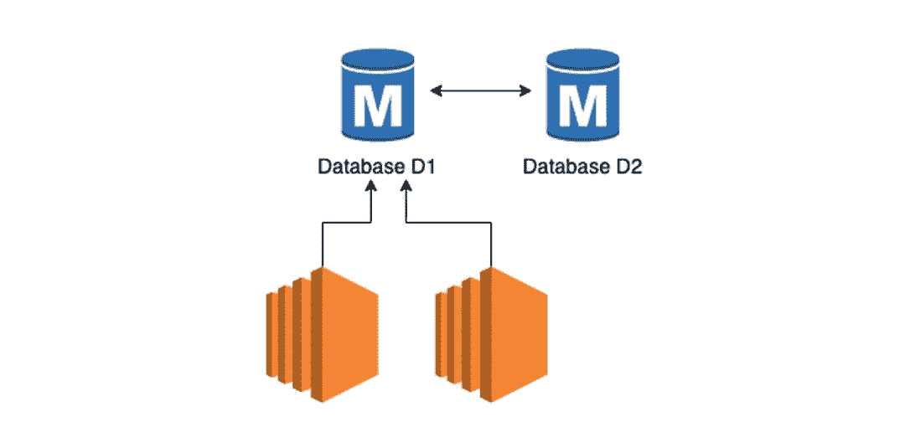**

**数据存储区都是主数据存储区，即所有数据存储区之间双向进行复制。但是，Jane 警告说，只有一个数据存储区被标记为活动的。如果失败，那么另一个主设备可以被激活；但是在给定的时间点，只有一个是活动的。通过确保所有器件都是主器件，我们可以改善掉电时序。通过使一个主设备成为活动的，我们消除了冲突和相关风险的可能性。**

***“你说我们改善了掉电时间，”*黛比插了一句，*“不是消除它们。为什么？”***

***“这是因为复制是异步的，”【Jane 解释道，“*导致另一个主设备可能会落后，哪怕是一点点，甚至是零。”****

# **模式 2:一个主服务器和多个备用服务器(读者)**

**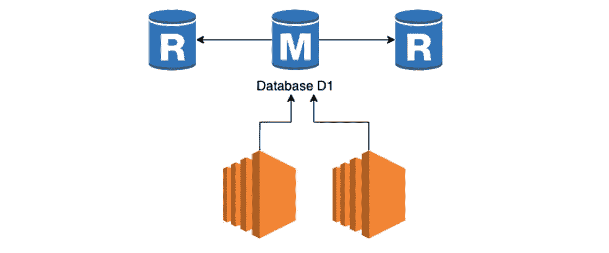**

**我们只创建了一个主服务器，但创建了多个用于只读访问的副本服务器(因此不会发生更新)。有些应用程序是纯只读的，这可能与任何阅读器都不一致。灾难发生后，我们可以将其中一个读取器转换为主读取器，并将事务指向该读取器。由于没有主动-主动数据库，我们消除了冲突的可能性。然而，简警告说，激活阅读器需要一些时间；因此，停电时间比之前的模式要长一点。**

# **模式 3:一个阅读器和多个阅读器**

**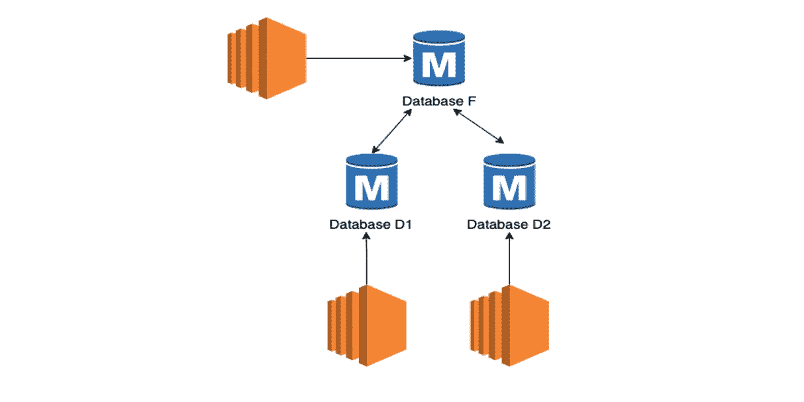**

**这是上面显示的两种方法的结合，但是有所改变。所有数据存储都是主存储，并且是主动-主动的；但是有一个(数据库 F)是超级高手，叫做“feeder”数据库。所有应用程序都连接到所有数据库并更新它们。为了保持一致性，feeder 数据库被赋予了非常高的权重，这使得它自己的更新更多，并传播到其他主服务器。其他主文件也可以更新，但频率较低。简警告说，发生冲突的可能性很低，但不会完全消除。如果存在冲突，来自 feeder 数据存储的更新将覆盖本地更改。**

# **模式 4:许多母版，但由应用程序更新**

**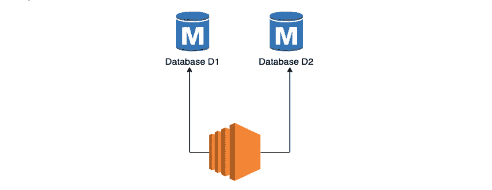**

**简认为，这也许是 AASN 最实际的用法。这里所有的数据库都是主数据库，但是我们没有使用数据库复制策略，而是使用应用程序直接更新它们。**

**Jane 提请观众注意这样一个事实，即数据库 D1 和 D2 之间没有复制。应用程序独立更新两个数据库。因为没有数据库级复制，所以没有冲突的可能性，因此也没有随之而来的风险。就数据库技术而言，每个数据库都是单一的，即没有其他分区；所以 CAP 定理不适用。**

# **模式 5:多个主机缓冲写入**

**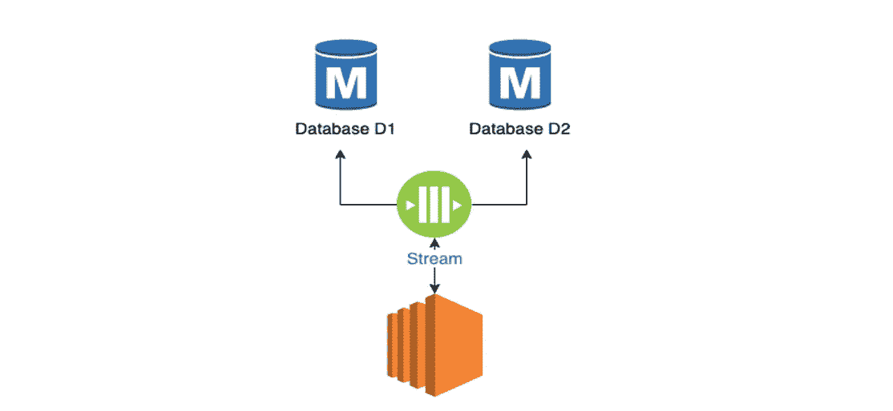**

**Jane 指出，模式 4 提出了一个不同的问题，这是因为数据库写入的数量。在从所有数据库获得确认之前，应用程序无法继续。这可能会增加延迟问题，特别是如果应用程序是数据库聊天。为了解决这个问题，在模式 5 中，我们在两者之间使用了一个消息传递层。应用程序流向消息传递层，而不是数据库。一个单独的进程从消息传递层获取数据并写入多个主数据库。当对消息传递层的写入完成时，应用程序获得确认，因此速度非常快。**

**黛比显然对这种模式感到兴奋；但是简警告说，虽然这听起来简单，但它增加了两个风险:**

1.  **整体数据可用性会有更多的延迟。当应用程序提交时，数据不会写入数据库。当另一个进程获得它并写入数据库时，它就被写入了。**
2.  **不保证数据写入的顺序；所以可能存在数据一致性问题。**

**Jane 解释说，由于这些限制，这种模式最适合静态的或不经常改变的内容——缓存和引用系统——而不适合记录系统。**

# **延期**

**简总结说，主动-主动无共享数据库层体系结构的成功取决于数据库的类型、它的用途以及应用程序处理数据更新冲突的能力和意愿。在数据库级别打开双向复制并期望应用程序不知道这一点从来都不是一件简单的事情。一般来说，记录数据存储系统最难实现，会话状态数据存储系统最容易实现。因此，Acme 可以在数据库层为许多系统实现 AASN，而无需更改应用程序，也可以为一些有一些应用程序更改的系统实现，或者根本不为一些系统实现。对于某些类型的系统，在实现高可用性的同时，数据层也不需要 AASN。**

**简在下表中对此进行了总结:**

**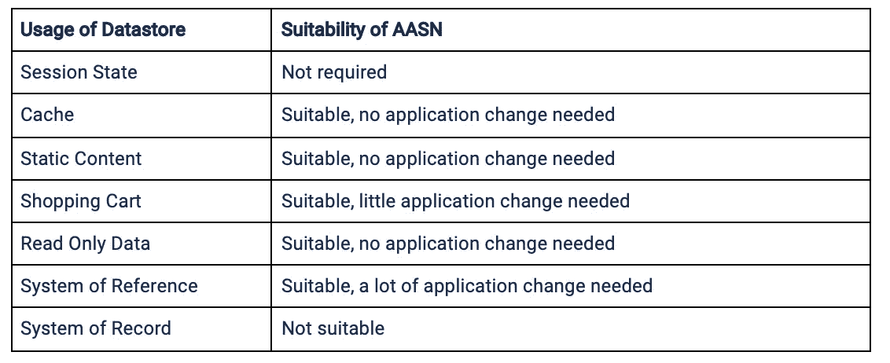**

**会议在紧张的气氛中开始；但最后对问题和可能的解决办法有了清楚的理解和评价。泰德非常感谢简，并宣布休会。**

# **关键要点**

1.  **AASN 体系结构意味着数据存储分布在不同的地理位置，它们之间没有共享资产，并且每个数据存储都愿意为本地运行的应用程序实例提供服务。**
2.  **在大多数情况下，没有应用程序重构，AASN 数据库层就无法完成。**
3.  **数据存储分为以下类型:记录系统、引用系统、只读、静态内容、缓存和会话状态。**
4.  **不可能所有数据存储都具有 AASN 配置。一般来说，在上面的光谱中，从左到右，适合度的范围是不适合到适合。**
5.  **单个数据元素可能被两个不同区域的两个不同应用程序更新，从而导致数据冲突。应用程序必须认识到这种可能性。不是所有的应用程序都能处理它，即使在重构之后。**
6.  **几乎所有复制都是异步的，这意味着会有延迟的更新覆盖最近的更新，从而导致数据损坏。**
7.  **同步复制虽然可行，但非常昂贵，而且往往不切实际。**
8.  **在一些数据库技术中，数据存储并不立即彼此一致，而是最终一致。这意味着应用程序将获得不同的数据，具体取决于它们连接到哪个拷贝。**

***tatoenjoy 创建的业务向量—***

****原载于*[*https://www.capitalone.com*](https://www.capitalone.com/tech/software-engineering/active-active-shared-nothing-database-architecture/)*。****

****披露声明:2020 资本一。观点是作者个人的观点。除非本帖中另有说明，否则 Capital One 不隶属于所提及的任何公司，也不被这些公司认可。使用或展示的所有商标和其他知识产权是其各自所有者的财产。****