# Active directory 云之旅，第 1 部分:设置

> 原文：<https://medium.com/globant/active-directory-journey-to-the-cloud-part-1-setup-4441200f1978?source=collection_archive---------1----------------------->

# 介绍

在任何云平台上的组织中工作时，您是否想过是什么使得在登录组织的域(笔记本电脑/台式机)以及您工作的云平台时可以使用相同的凭据？这是可能的，因为您的组织广告与云提供商的广告是同步的。在这篇文章中，我们将尝试对任何组织的 AD 和 Azure AD 之间的集成有一个高层次的理解。

在本文档中，我们将讨论以下几点:

*   先决条件
*   工作流程
*   根据设计的工作流程应遵循的步骤
*   摘要
*   别名
*   参考

# 先决条件

*   Azure 账户——可以使用**预付费**或**免费试用**Azure**账户。**
*   自定义域名-你可以购买任何自定义域名通过任何域名提供商，如 freenom.com，godaddy.com 和更多。

# **工作流程**

我们将把整个系统分成两部分-

1.  购买自定义域并进行 DNS 相关配置。
2.  在 Azure 云级别创建虚拟机，并在其上安装 AD 角色，以便将其模拟为内部 AD。

# **根据设计的工作流程应遵循的步骤-**

**1。** **购买** **自定义** **域名** **和** **做******DNS****相关** **配置。****

*   **从任何域名提供商处购买一个域名，并记下它。
    我将在整个活动中使用**chiragplane . tk**域名。**

**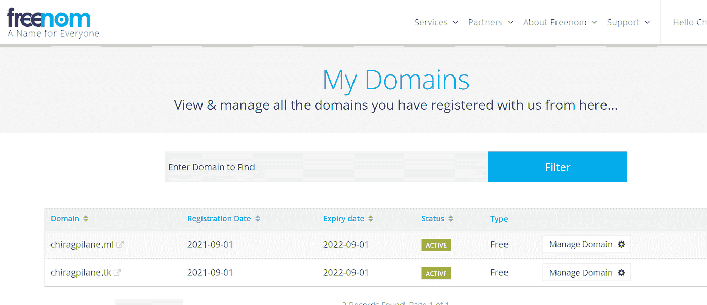**

*   **在 Azure 中创建一个与购买的域名同名的公共 DNS 区域(chiragpilane.tk ),然后单击 Create。NS 和 SOA 记录将在 DNS 区域内自动创建，但这会增加 Azure 的额外成本。或者，您也可以使用域名提供商提供的 DNS 管理器，因为它不会产生任何费用。**

**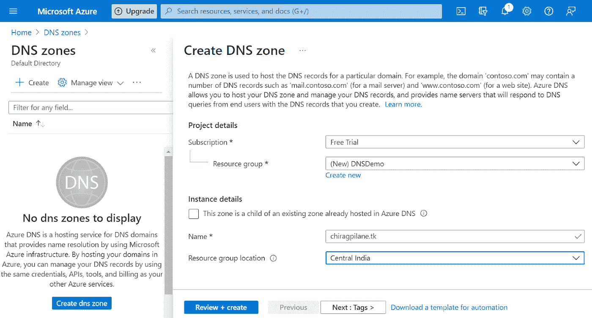****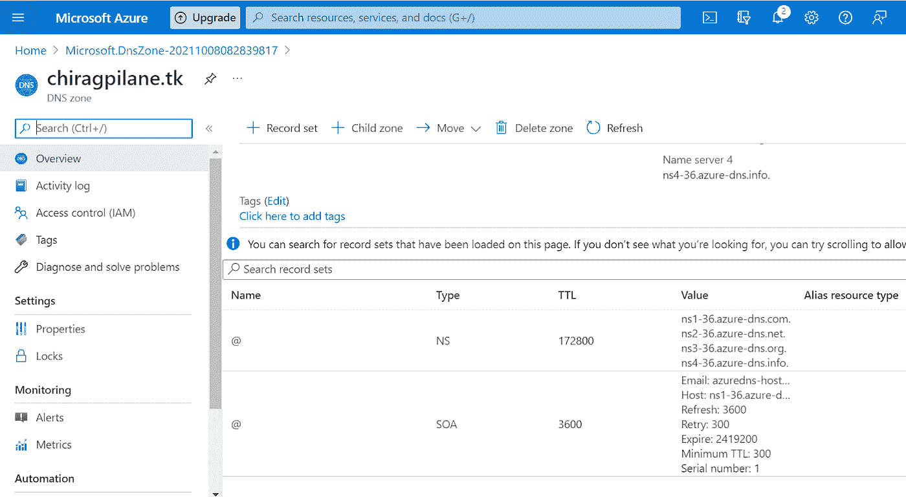**

*   **从域提供商 DNS 管理器中点击管理 DNS，将我们域的 NS 记录映射到 Azure 中创建的公共 DNS 区域的 NS 记录，这样我们域的所有请求都将发送到 Azure 提供的名称服务器。**

**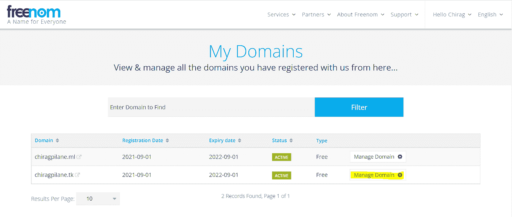****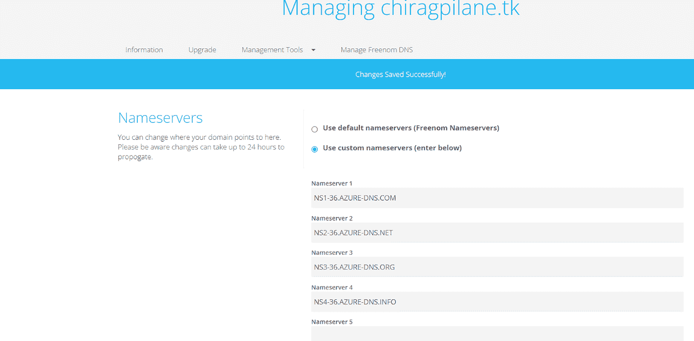**

*   **您还可以使用任何 d NS 检查器网站(如 mxtoolbox.com dnschecker.org)验证更新的 NS 记录是否反映了您的域。**

**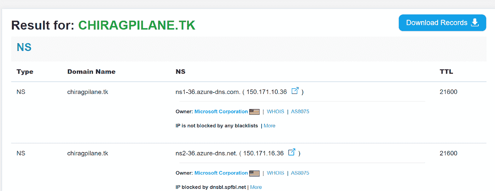****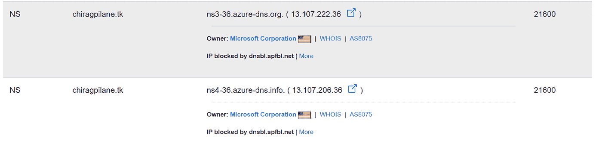**

****2。** **在 Azure 云级别创建虚拟机，并在其上安装 ad 角色，以便将其模拟为本地 AD。****

*   **使用 Azure 中的 Windows Server 2019 数据中心映像创建一个 Windows VM，如下图所示，其余设置保持默认。完成后，点击审查+创建。**

**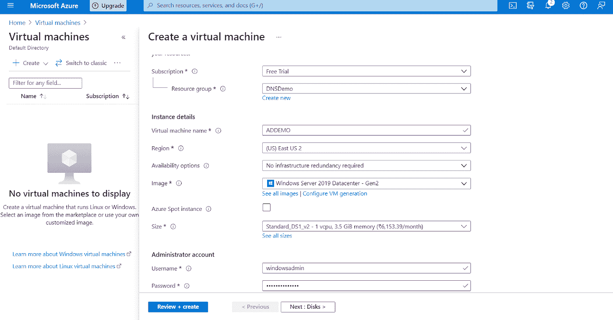**

*   **使用 RDP 登录虚拟机，并从服务器管理器在虚拟机上安装 AD 角色。**

**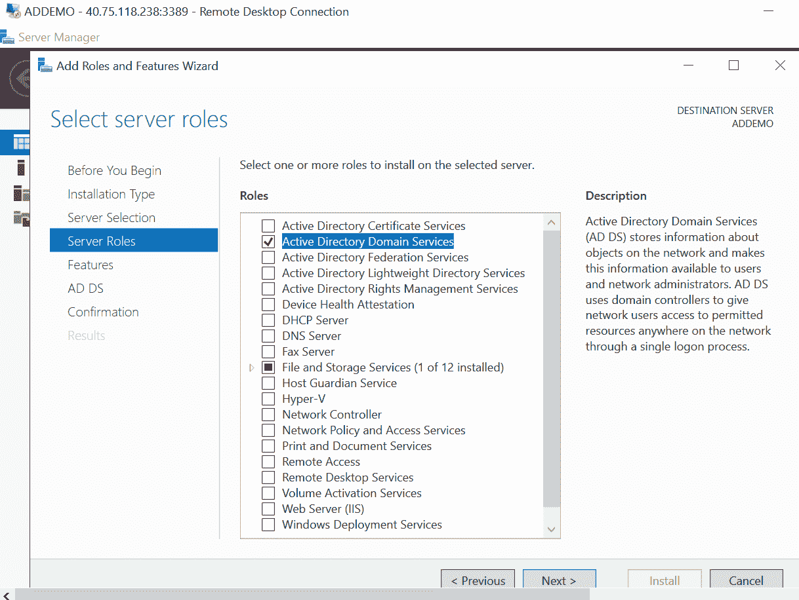**

*   **安装 AD 角色后，配置 AD 并添加您的自定义域。**

**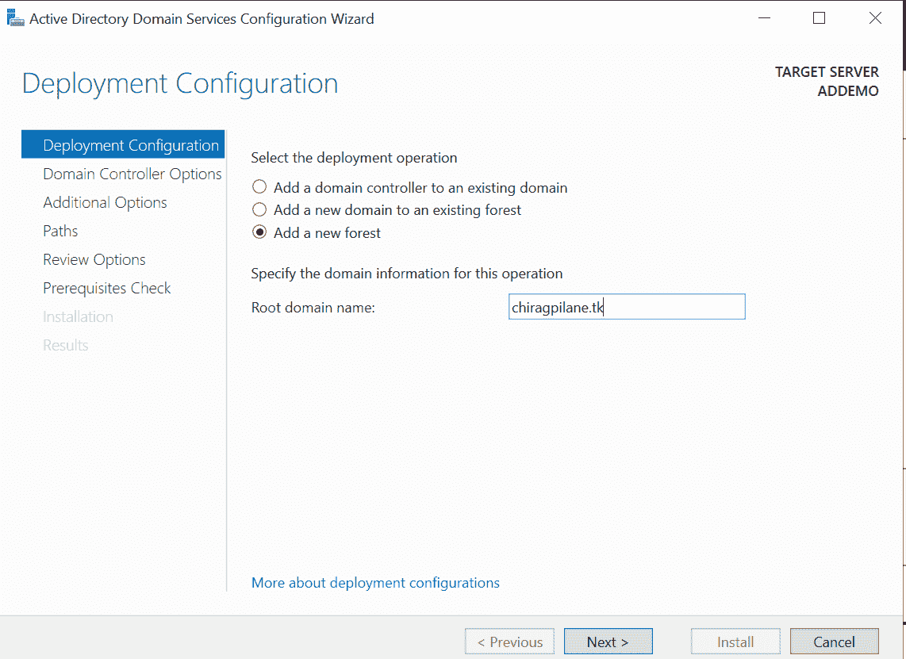****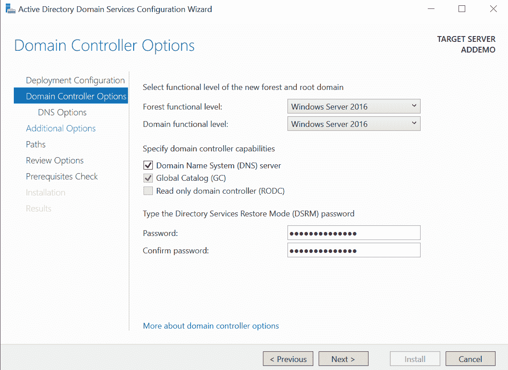**

*   **保持默认设置，然后点击安装。**

**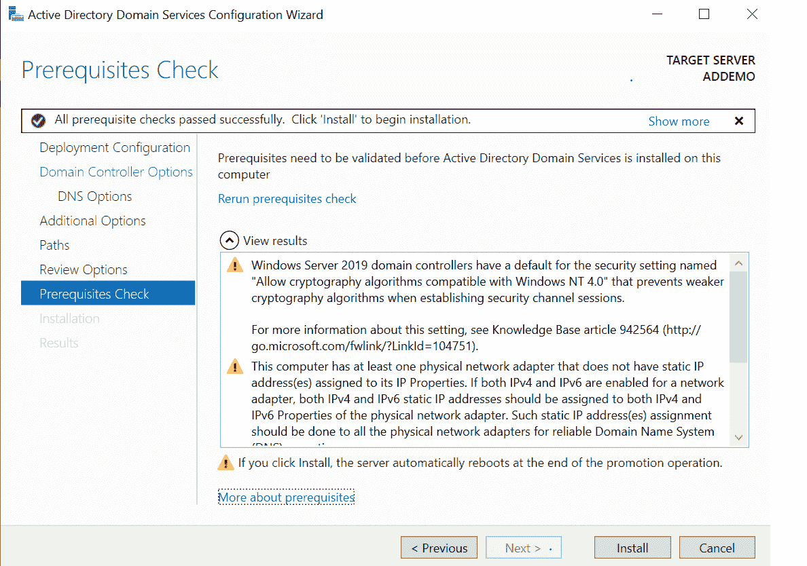**

*   **一旦配置了我们的自定义本地 AD，我们将添加我们的 DNS 服务器的私有 IP 作为部署服务器的 Vnet 的自定义 DNS IP，以便在该 Vnet 中部署的任何服务器都将使用我们的自定义 DNS 进行域解析，而不是 Azure 提供的 DNS。**

**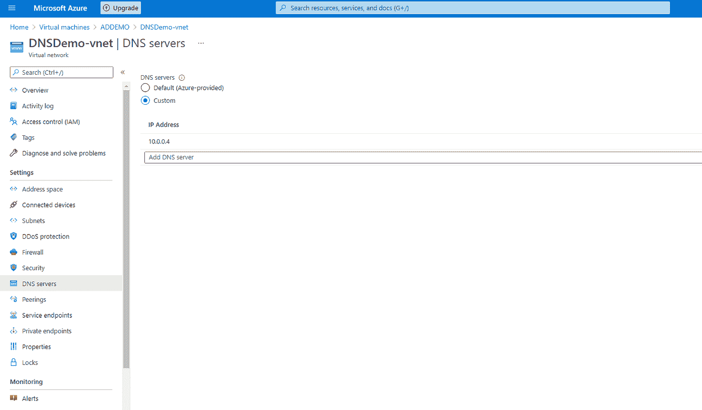**

*   **在 Azure 门户中创建另一个 VM，并将其加入到您自定义创建的域中。**

**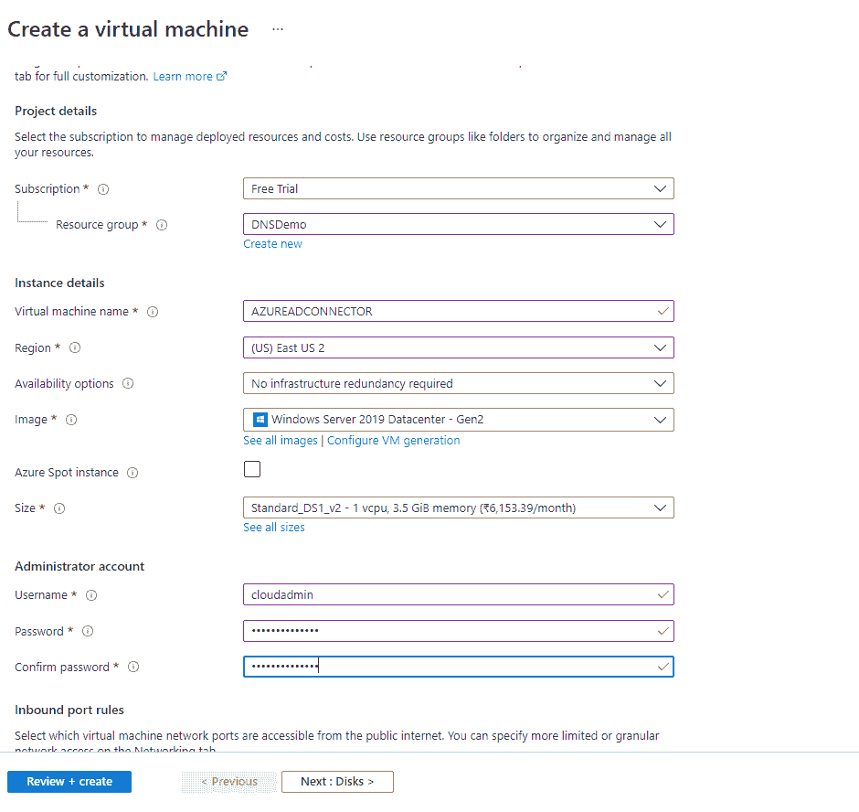****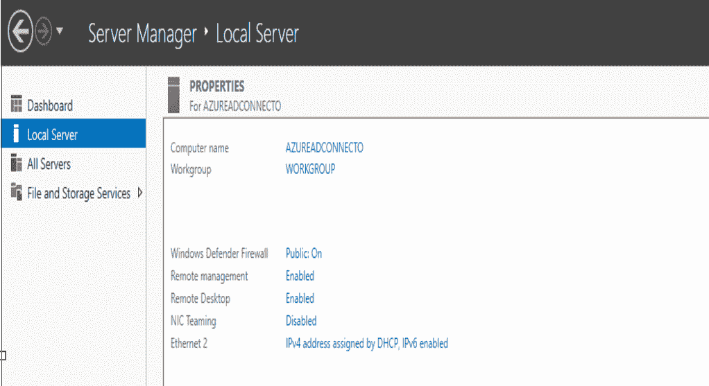**

*   **将服务器添加到我们的自定义域中。**

**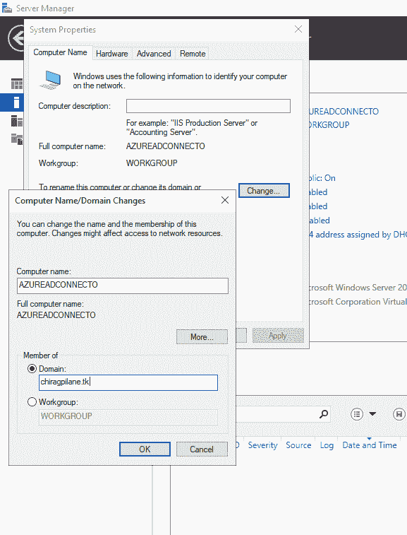****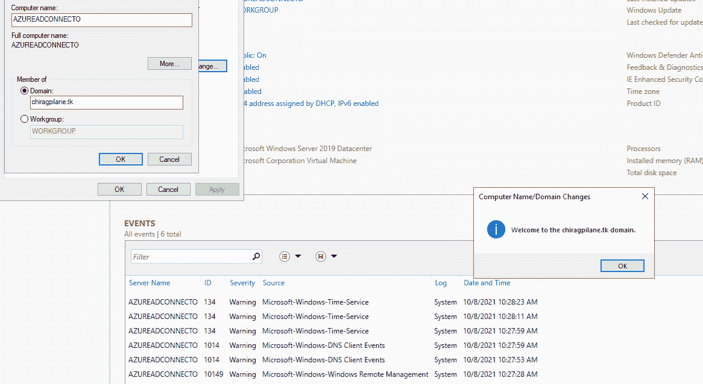**

*   **请参考本文的第二部分，以了解广告整合的进一步过程。**

# ****总结****

**通过这篇文章，我们能够设置使用自定义域将本地 AD 与 Azure AD 集成所需的所有先决条件。文章还解释了 Azure 的资源之一 DNS zone 的用法。**

# ****别名****

*   **AD -活动目录**
*   **DNS -域名服务**
*   **NS -名称服务器记录**
*   **SOA -授权记录的开始**
*   **VM -虚拟机**
*   **虚拟网络**

# ****参考文献****

**[https://docs . Microsoft . com/en-us/azure/architecture/reference-architectures/identity/azure-ad](https://docs.microsoft.com/en-us/azure/architecture/reference-architectures/identity/azure-ad)**

** [## Azure AD 域服务中同步的工作方式

### Azure Active Directory 域服务(Azure AD DS)管理的域中的对象和凭据可以创建…

docs.microsoft.com](https://docs.microsoft.com/en-us/azure/active-directory-domain-services/synchronization) 

[Globant CloudOps](https://www.globant.com/studio/cloudops)**