# Active directory 云计算之旅，第 2 部分:Azure AD 和 AD 集成

> 原文：<https://medium.com/globant/active-directory-journey-to-the-cloud-part-2-azure-ad-ad-integration-25f8ad883258?source=collection_archive---------0----------------------->

# 介绍

本文档是前一文档的延续，前一文档提到了在实施 AD 集成之前需要满足的先决条件。

在本文档中，我们将讨论以下几点:

*   先决条件
*   工作流程
*   摘要
*   别名
*   参考

# 先决条件

*   Azure 账户——可以使用**预付费**或**免费试用**Azure**账户。**
*   自定义域名-你可以购买任何自定义域名通过任何域名提供商，如 freenom.com，godaddy.com 和更多。
*   通读本文档前，请参考本文的[第 1 部分](/globant/active-directory-journey-to-the-cloud-part-1-setup-4441200f1978)。

# **工作流程**

我们将按照下面提到的步骤来实现 AD 集成。

**1。** **在 Azure AD 级别添加自定义域并配置 AD 同步**

*   将我们的自定义域添加到 Azure AD，并通过添加公共 DNS 区域中提供的 TXT 记录来验证它。

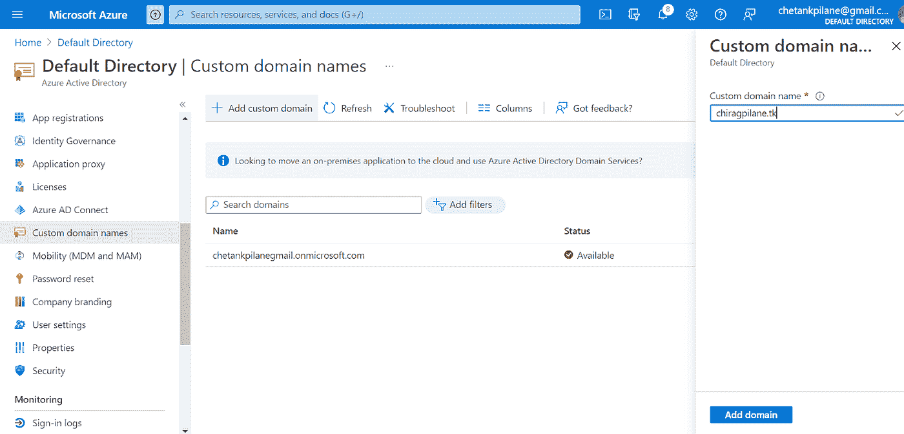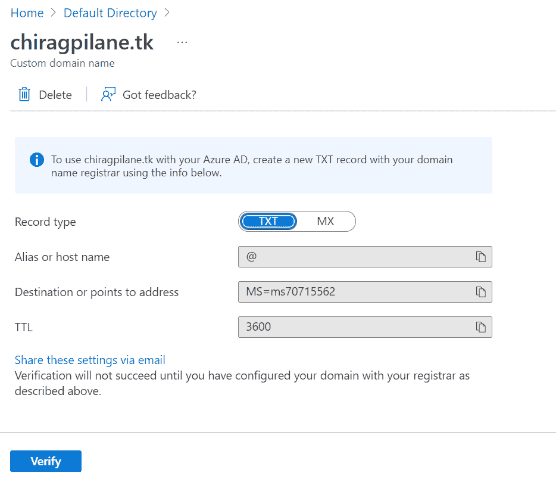

*   将 TXT 记录添加到我们的自定义 DNS 区域，以便 Azure AD 能够验证我们的域。

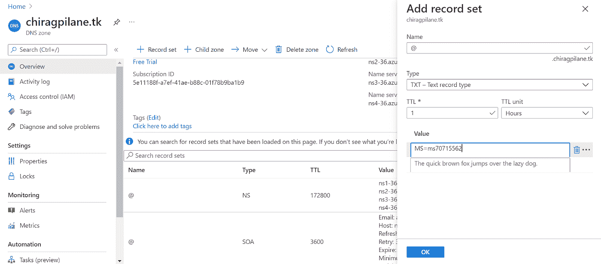

*   点击 Azure 广告中的验证按钮。

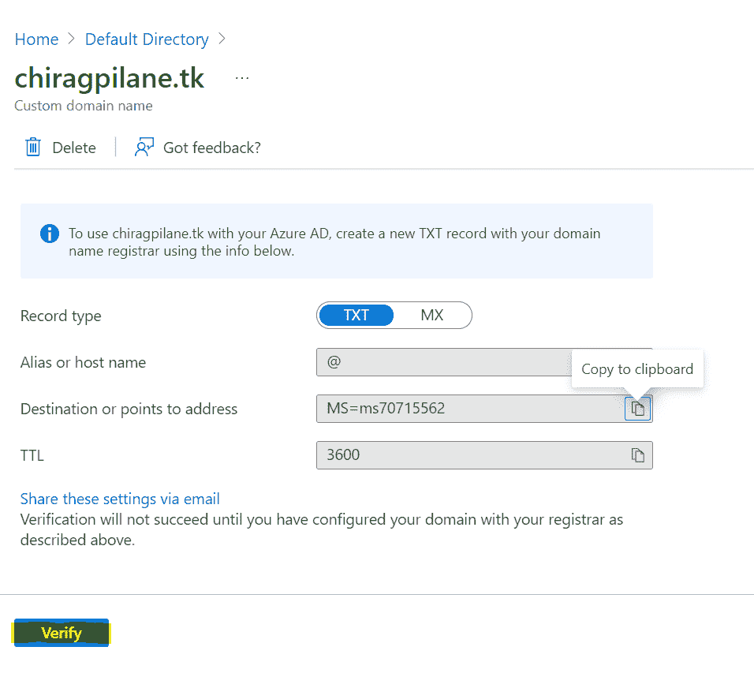

*   如果 Azure AD 成功验证了详细信息，您将获得如下所示的验证成功消息。

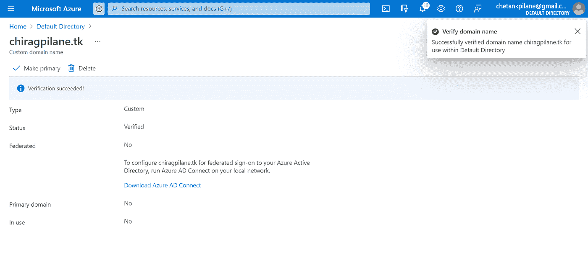

*   在我们的自定义内部部署广告中创建一个具有企业管理员角色的用户。导航到服务器管理器中的工具部分，然后选择 AD 用户和计算机。单击我们的域，然后选择添加用户。

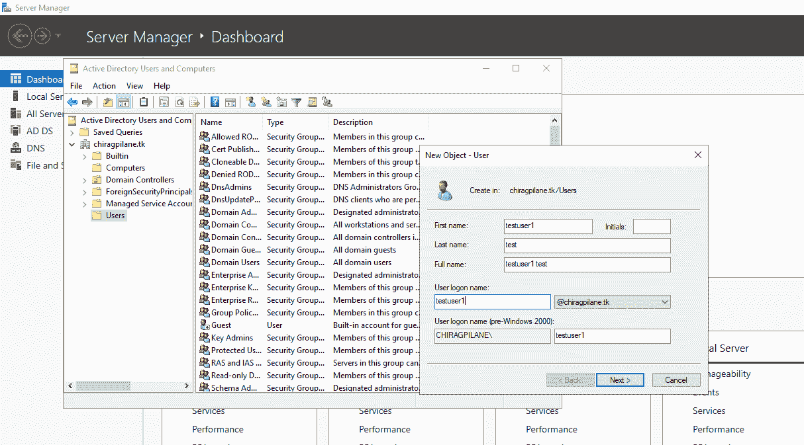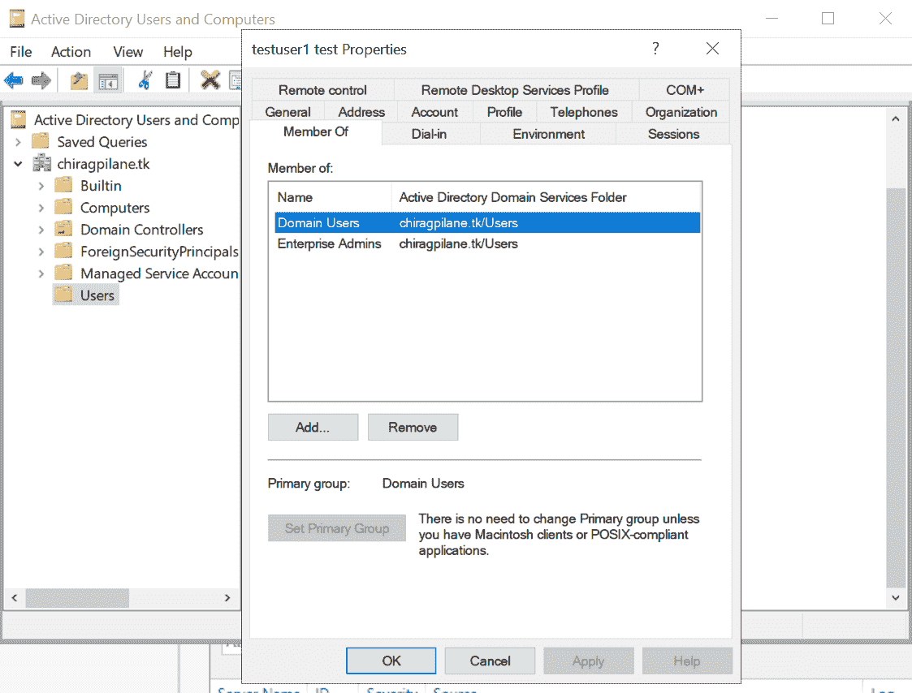

**注意-** 要配置内部 AD 和 Azure AD 之间的 AD 同步，用户需要拥有内部 AD 的企业管理访问权限和 Azure AD 级别的全局管理访问权限。

*   在 Azure AD 中创建一个具有全局管理员角色的用户。

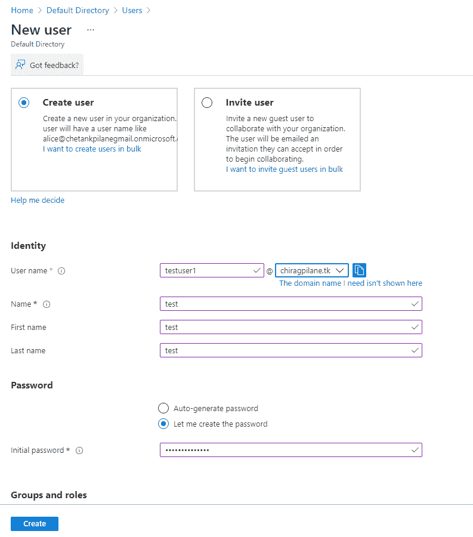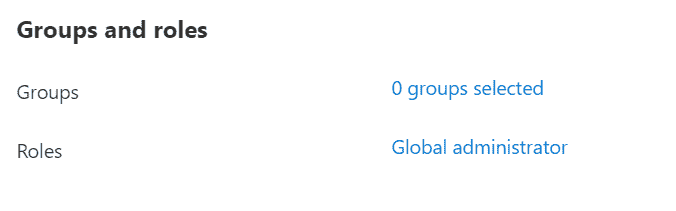

*   在 AD Connector 虚拟机上下载并配置 AD sync 代理。

[https://www.microsoft.com/en-us/download/details.aspx?id=47594](https://www.microsoft.com/en-us/download/details.aspx?id=47594)

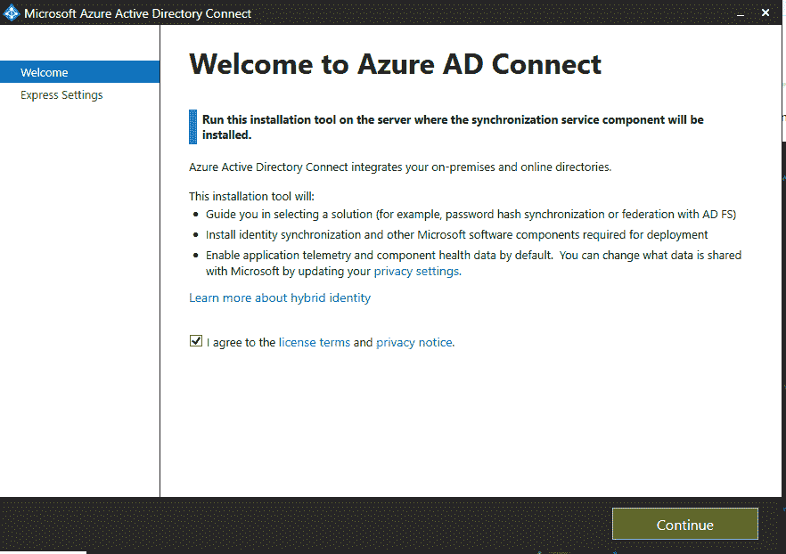

*   使用我们在 Azure 的上一步中创建的相同的全局用户凭证。

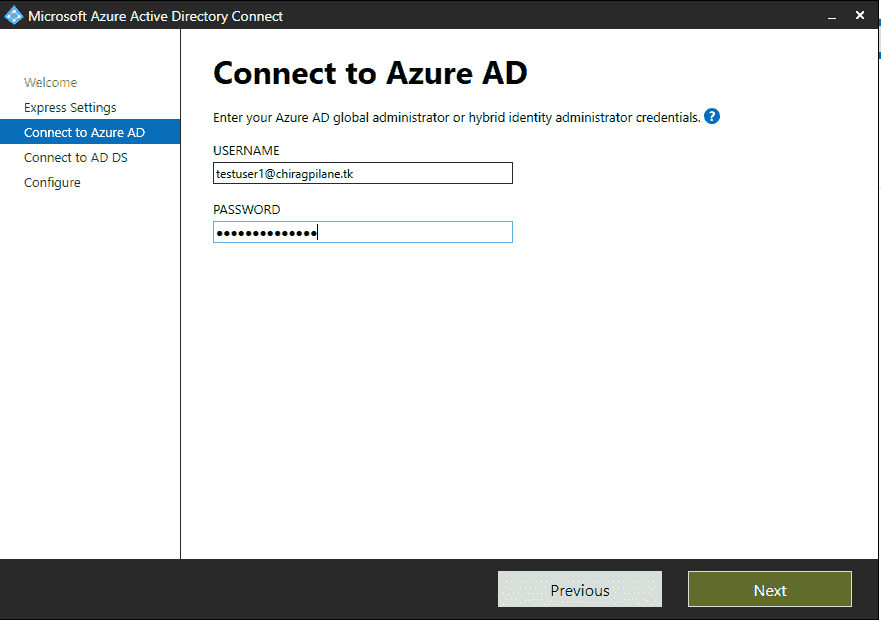

*   使用我们在上一步中在本地 AD 中创建的相同企业管理员用户凭据。

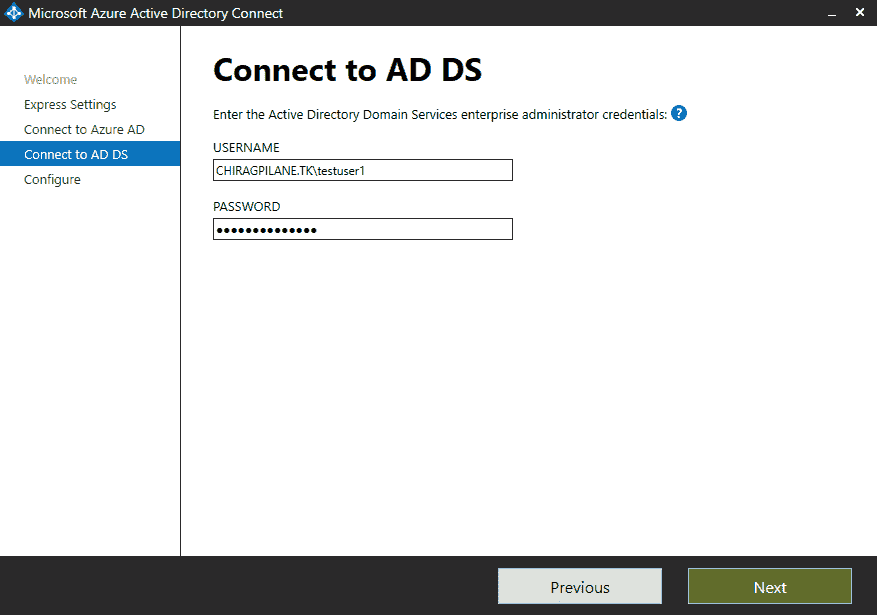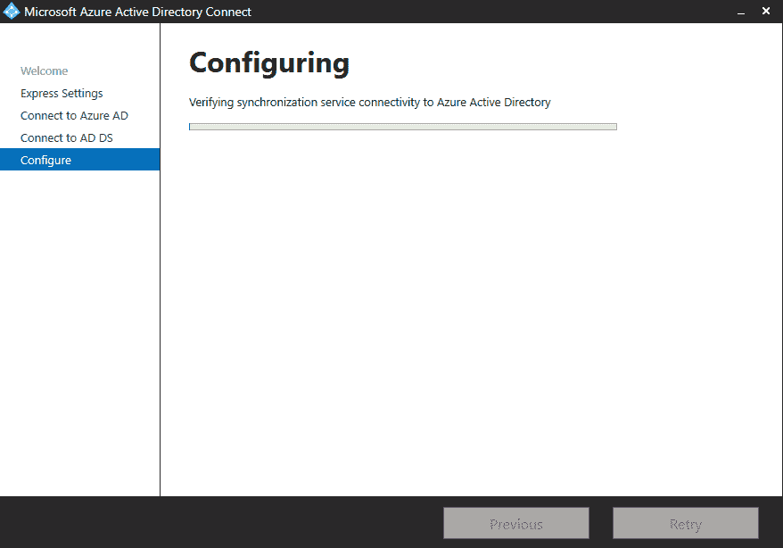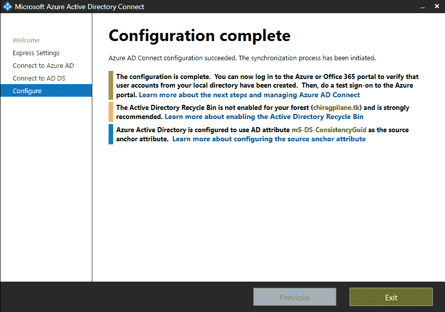

*   一旦本地 AD 与 Azure AD 同步，我们可以在 Azure AD 用户选项卡中看到本地用户，默认同步方法将是密码哈希同步。

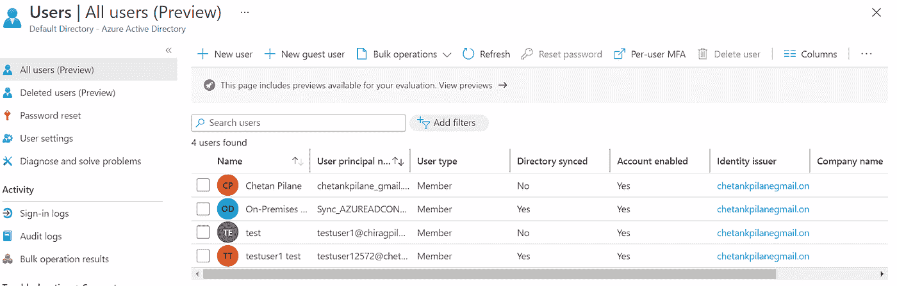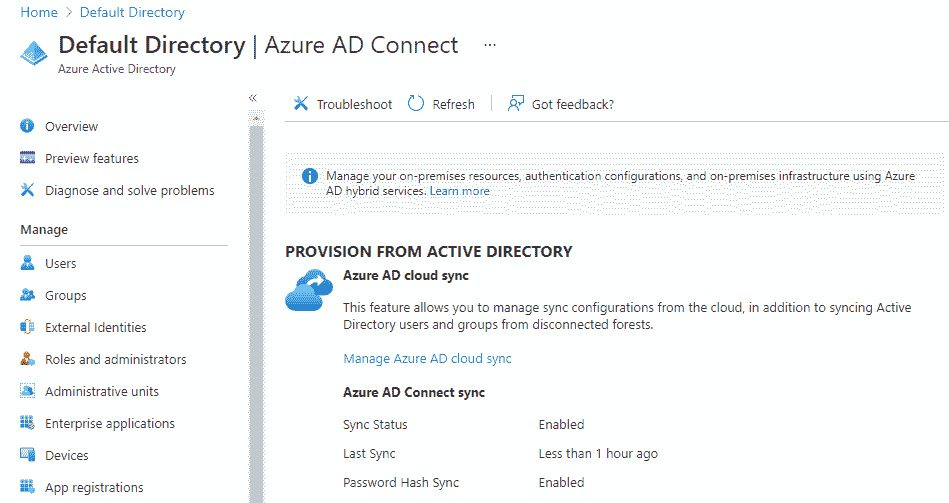

# **总结**

通过这篇文章，我们能够使用一个自定义域将本地广告与 Azure 广告集成在一起。文章还解释了 Azure 的资源之一 DNS zone 的用法。

# **别名**

*   AD -活动目录
*   DNS -域名服务
*   NS -名称服务器记录
*   SOA -授权记录的开始
*   VM -虚拟机

# **参考文献**

[https://docs . Microsoft . com/en-us/azure/architecture/reference-architectures/identity/azure-ad](https://docs.microsoft.com/en-us/azure/architecture/reference-architectures/identity/azure-ad)

[https://docs . Microsoft . com/en-us/azure/active-directory-domain-services/synchron ization](https://docs.microsoft.com/en-us/azure/active-directory-domain-services/synchronization)