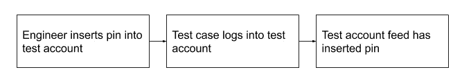
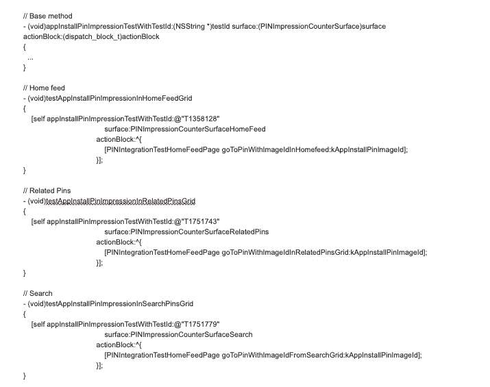
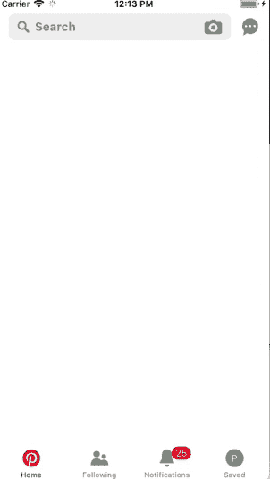
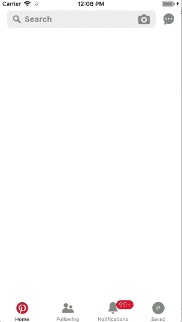
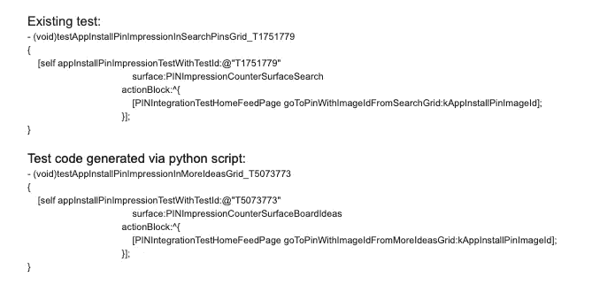

# 移动广告度量质量与测试

> 原文：<https://medium.com/pinterest-engineering/ad-metrics-quality-and-testing-on-mobile-fae9e70e7761?source=collection_archive---------7----------------------->

Maya Reddy |软件工程师，广告格式

在 Pinterest，我们每天都帮助我们的广告合作伙伴通过不同的广告形式接触 Pinners，并为他们提供关于其广告表现的指标和分析。保持合作伙伴的信任和提供价值至关重要，因此我们公开的指标(最终基于包含客户事件的日志)必须正确。

2017 年初，我们每两周有一次移动发布，我们会在每次发布前做人工 QA 来验证日志行为。很快，客户团队开始投资集成测试框架；在这种情况下，集成测试是通过 UI 流程的自动化测试，从登录应用程序开始，执行诸如点击 pin、保存 pin 等行为。在自动化操作结束时，测试会验证日志是否与 UI 操作相匹配。

# 为什么我们创建了 ads 日志集成测试套件

*   在发布周期的早期捕获并修复 bug—以前，我们依赖人工 QA，这意味着团队可能直到发布周期的后期才捕获 bug，而且我们经常在发布截止日期前不久修复 P1 的 bug。
*   **满怀信心地发布代码** —自动化测试允许我们运行更多的测试用例，并且更加确信新代码没有引入错误或问题。
*   **重新分配手动测试**——将重复的 QA 任务转移到集成测试意味着手动 QA 可以做更多的探索性测试和新功能测试。

# 挑战

## 如何确保我们测试了正确的格式

我们需要一种方法来保证某个广告会出现在用户的提要中，这样我们就可以对所需的广告格式进行测试。在下面的例子中，我们需要一个应用安装广告来显示。

测试案例示例:

1.  滚动提要并完整查看应用程序安装 Pin
2.  确认印象触发。验证:id 已填充，并且看起来像有效的复合 Id

我们使用一个方便的工具，根据 JSON 数据在 API 级别插入提升的 pin。我们有许多不同的测试帐户，每个帐户都有一个特定的 Pin。然后，我们的自动化测试可以登录特定格式测试所需的任何帐户！

## 我们如何组织测试

我们的广告出现在 Pinterest 应用的很多地方。当用户执行搜索等操作时，它们会出现在主页提要中。有时，一个 bug 可能只影响一个表面，所以我们需要在所有不同的表面上进行测试。这增加了测试的数量，但是很容易从逻辑上将它们分开。我们有一个执行所有 UI 操作和日志记录检查的基方法，我们有一个针对每个表面的测试方法，该方法在调用基方法之前导航到该表面。

下面是在 home feed、search 和相关 Pins feed 上运行的一个测试。测试是检查当上下文菜单出现时，印象是否正确结束。

## 测试复制

随着广告在新的表面上投放，我们需要证明广告行为和日志工作符合预期。例如，在用户板上，有一个名为“更多想法”的新部分，广告现在可以出现在那里，我们希望能够轻松复制现有的测试，以便在这个新的表面上运行。理想情况下，拥有表面的团队也应该能够拥有他们的测试子集，从测试创建到维护。由于大多数测试都是以一致的结构编写的，因此我们创建了一个 Python 脚本，通过复制和修改现有的测试来为新的曲面生成测试。

# 连续累计

随着我们添加更多的格式及其相关的测试覆盖，测试套件变得越来越大。我们可用的内部容量限制了我们运行完整测试套件的频率。经过一些迭代之后，我们当前的流程是在有更多可用容量时，每晚运行一次测试套件。然而，我们也挑选了一小部分测试在每次提交时运行，以便获得关于 bug 的早期信号。我们总是确保在将构建提交到 App Store/Play Store 之前，完整的测试套件通过了发布候选。我们在集成环境中使用以下设置:

*   Buildkite——我们为在远程机器上运行的集成测试设置了 build kite 管道。
*   测试完成得更快，因为它们是并行运行的。
*   测试运行时，开发人员可以开发其他功能。
*   我们可以安排构建，以便测试在夜间运行，或者设置集成，以便测试在每次提交时运行。
*   Metro —用于分析测试结果和趋势的内部工具。我们可以看到一段时间内特定管道以及单个测试的成功率。

# 我们如何维护测试

一旦编写了一个测试，它就被添加到阶段化 Buildkite 管道中。新的测试会运行几天，我们会修复出现的任何问题。稳定后，我们将其添加到生产 Buildkite 管道中。除了编写测试的前期成本之外，还需要一些维护测试的工作。

*   有时一个特性的改变会破坏集成测试。例如,“后退”按钮可能会变成“关闭”按钮。因为我们依赖于可访问性标签，所以我们的测试会失败。在这种情况下，我们会向适当的团队提交一个 bug，以便他们可以修复这个问题。

*   其他时候，随着时间的推移，我们如何编写测试的问题变得越来越明显。在那些情况下，我们更新测试框架/设置本身。

# 结论

自动化集成测试让我们对报告给广告客户的指标充满信心。我们正在不断地改进流程，使我们的测试更容易运行和维护。

*鸣谢:感谢 Wendy Lu、Matt Mo、Joseph Smalls-Mantey、Jordan Maler、Tony Lu、Jerry Marino、Freddy 蒙塔诺、广告格式 iOS 团队、Metrics Quality &测试工具团队、iOS 核心平台团队，以及所有为此提供帮助的人！*