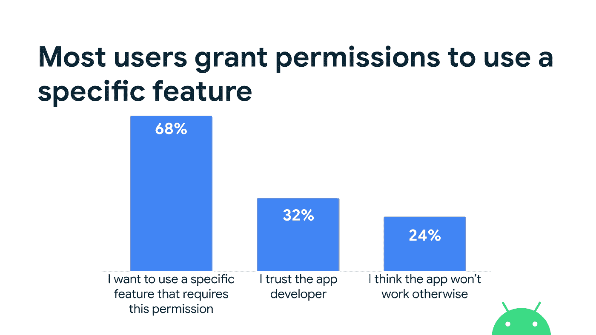
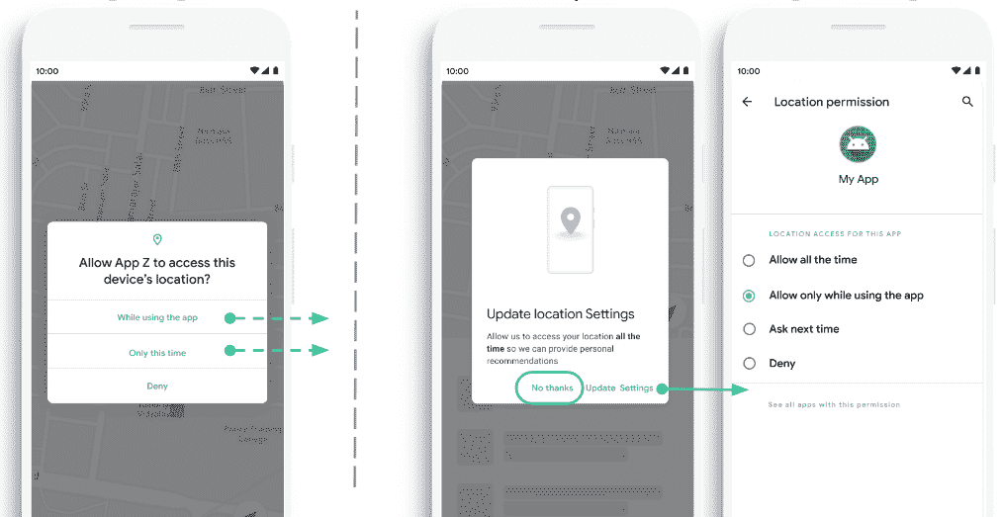

# 让您的应用适应最新的隐私最佳实践

> 原文：<https://medium.com/androiddevelopers/adapt-your-app-for-the-latest-privacy-best-practices-d7469a547314?source=collection_archive---------0----------------------->

Android 11 最终发布是[这里是](https://android-developers.googleblog.com/2020/09/android11-final-release.html)！这个版本建立在以前版本的隐私改进的基础上，为用户提供了更好的控制和透明度，以及帮助应用程序负责任地处理数据的护栏。

这些改进中的许多都加强了适用于最近 Android 版本的现代最佳实践(它们并不特定于 Android 11！).在本文中，我们将研究其中的 4 个最佳实践，以帮助您的设计经得起未来的考验，并为兼容性测试用例进行规划。

1.  处理内容 URI 共享
2.  增量权限请求
3.  前台敏感数据访问
4.  使用可重置标识符

**给予其他应用适当的 URI 权限。**

随着 Android 11 中[包可见性](https://developer.android.com/preview/privacy/package-visibility)的改变，默认情况下，针对 **API 级别 30** 的应用对设备上其他已安装包的可见性将受到限制。这旨在为应用程序提供更好的问责制，以“查看”设备上的其他包。

为了简化迁移，为常见用例提供了一个[实施指南](https://developer.android.com/preview/privacy/package-visibility-use-cases)。一般来说，一个应用程序必须对其他已安装的包可见(使用`[PackageManager](https://developer.android.com/reference/android/content/pm/PackageManager)` API 验证),以便与它们交互。例如，这适用于启动服务或从属于另一个应用程序的内容提供商处读取内容。

您的内容提供商的访问模型可能涉及发送一个隐式意图，而不是针对给定包的显式意图。因此，您的设计无法假设接收应用程序的目标 API 级别，该级别决定了应用程序是否受 Android 11 上的包可见性限制。

为了确保接收应用程序可以看到您的包，从而可以访问任何共享的 URIs，您需要在意向中包含`FLAG_GRANT_READ_URI_PERMISSION` 和/或`FLAG_GRANT_WRITE_URI_PERMISSION` URI 标志。注意，写权限**并不意味着读访问。一旦被意向触发，接收应用程序将被授予临时访问 URIs 的权限。**

当您计划更新应用的目标 SDK 版本(甚至是 Android 11 之前的版本)时，请注意涉及与另一个应用共享内容提供商访问权限的情况，并确保授予适当的 URI 权限。不管内容提供商的所有者是谁，这都是适用的。

将数据访问级别限制在手头任务所需的范围内通常是一种好的做法。理想情况下，你的内容提供者应该已经拥有个人 [URI 模式](https://developer.android.com/guide/topics/manifest/provider-element#gprmsn)的适当共享权限。如果是这样，你的内容提供商已经兼容 Android 11 了！

**增量请求权限。**

这项 [Android 用户研究](https://research.google/pubs/pub46261/)显示，如果请求符合用户的期望，用户更有可能给予许可。因此，当应用程序中的某个功能需要权限时，最好[请求上下文中的权限](https://developer.android.com/training/permissions/requesting)。

*顶级用户权限授予原因。来源:* [*安卓用户研究*](https://research.google/pubs/pub46261/) *。*

这尤其适用于位置访问等敏感权限。自 Android 10 以来，该平台引入了一种细粒度的位置模型，可以区分前台和后台的位置访问。大多数位置用例只需要前台访问，比如当用户参与一项活动时。

事实上，Google Play 有一个[政策](https://support.google.com/googleplay/android-developer/answer/9799150)限制不必要的后台位置访问。要检查您的应用程序可能在哪里访问后台位置，[请查看此清单](https://developer.android.com/training/location/background)。如果您的应用程序需要背景位置，例如地理围栏用例，请确保这对您的功能至关重要。

对于适用的应用程序，他们应该首先请求前台位置，然后再请求后台位置。这种方法为用户提供了控制权限授予级别的选项。此外，您可以有策略地显示解释或设计适当的 UX，以提供关于用户如何从授予附加位置权限中受益的附加上下文。

Android 11 对目标为 **API 级别 30** 的应用强制执行增量位置许可请求。任何包含**前台位置(精细或粗略)和后台位置权限的权限请求都将被忽略，并导致以下错误消息。**

`E/GrantPermissionsActivity: Apps targeting 30 must have foreground permission before requesting background and must request background on its own.`

*注意，同一个* `*requestPermissions()*` *API 调用中的任何其他非位置权限也将被忽略。*

由于`requestPermissions` API 将一组权限作为输入参数，您可能已经有了演示以下模式的代码。我们鼓励您在必要时审核和设计一个替代的用户流。

如果使用了`ActivityCompat`或框架 API:

同样，如果使用 Jetpack 活动库:

**正确使用位置、麦克风和摄像机。**

Android 的设计鼓励在访问敏感数据(如麦克风、摄像头和位置)时保持透明。例如，应用程序只能在前台使用麦克风和摄像头，例如当用户可以看到用户界面时。这提高了透明度，因此用户可以在启用相关功能时做出明智的决定。

如果你的应用有访问敏感数据的前台服务，确保用例涉及直接的用户交互，用户可以控制正在执行的任务。例如，在视频会议应用程序中，您可以使用前台服务来支持涉及麦克风和摄像机访问的活动会议会话。还应该有一个启示，让用户开始和停止会话，从而前台服务。

此外，您的应用程序必须正确设置`foregroundServiceType`属性，以指示位置、麦克风或摄像头的使用。这为需要数据的应用提供了系统可见性，并且是针对 Android 11 的应用的要求。了解更多关于[前台服务变更](https://developer.android.com/preview/privacy/foreground-services)。

您可以在清单中声明多种数据类型的用法。

如果您的实现是基于`WorkManager`中的[长期运行的 worker](https://developer.android.com/topic/libraries/architecture/workmanager/advanced/long-running) ，那么它实际上是由一个名为`SystemForegroundService`的前台服务支持的。您应该在您的应用程序清单中包含适当的前台服务类型，该清单将与 Jetpack 库的 AAR [清单文件](https://android.googlesource.com/platform/frameworks/support/+/refs/heads/androidx-master-dev/work/workmanager/src/main/AndroidManifest.xml?source=post_page---------------------------%2F%2F%2F%2F%2F%2F&autodive=0%2F%2F%2F%2F%2F%2F%2F%2F%2F%2F%2F%2F%2F%2F)合并。

通过定义适当的前台服务类型，将此元素包含在您的应用程序清单中。

当您提升 worker 作为前台服务运行时，您需要将适当的前台服务类型传递到`ForegroundInfo`对象中。这些类型必须与上面的合并清单中定义的类型相同，或者是它们的子集。

**迁移掉不可重置的标识符。**

Android 系统使用许多不可重置的硬件标识符，如 IMEI，来支持各种操作系统功能。出于隐私考虑，这些标识符的持久性和唯一性使它们不适合大多数身份识别用例。

[从 Android 10](https://developer.android.com/about/versions/10/privacy/changes#data-ids) 开始，系统对各种不可重置的标识符的访问受到限制。例如，只有拥有`READ_PRIVILEGED_PHONE_STATE` 权限的特权系统应用程序才能通过`[getSimSerialNumber()](https://developer.android.com/reference/android/telephony/TelephonyManager#getSimSerialNumber())`方法访问 SIM 卡硬件标识符。在 Android 11 中，系统通过对`[getIccId()](https://developer.android.com/reference/android/telephony/SubscriptionInfo#getIccId())`方法应用类似的限制，进一步[限制访问](https://developer.android.com/about/versions/11/behavior-changes-all#privacy)，现在返回一个空字符串。

以前可能利用该标识符将功能链接到某个 SIM 的应用程序应该验证与 Android 11 上的“空字符串”返回值的兼容性。一种替代方法是使用`[getSubscriptionId()](https://developer.android.com/reference/android/telephony/SubscriptionInfo#getSubscriptionId())`方法，该方法返回设备上给定 SIM 的从 1 开始的唯一索引值。也就是说，如果在设备上重新安装相同的 SIM，它将保留先前分配的订购标识符，除非设备是出厂重置的。[了解更多](https://developer.android.com/training/articles/user-data-ids#mobile-service-subscriptions)。

该平台和 Google Play 服务提供了许多具有各种唯一性、可重置性和适用于各种用例的范围的[标识符](https://developer.android.com/training/articles/user-data-ids#identifier-characteristics)。你可以查看更多的标识符[用例](https://developer.android.com/training/articles/user-data-ids)。

我希望这些建议有助于你准备目标 API 级别的更新，并使你的应用程序设计更加隐私友好！你可以在文档中了解更多关于 Android 11 和[隐私最佳实践](https://developer.android.com/privacy/best-practices)的其他[相关改进。](https://developer.android.com/about/versions/11/privacy)

*感谢凯文·赫夫纳格尔和杰里米·沃克。*