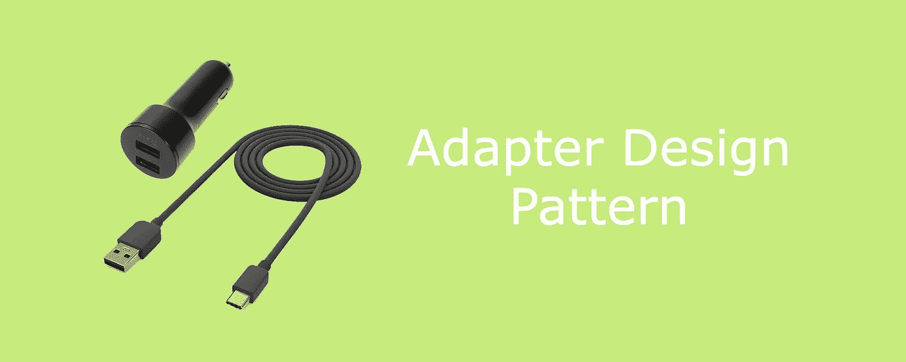
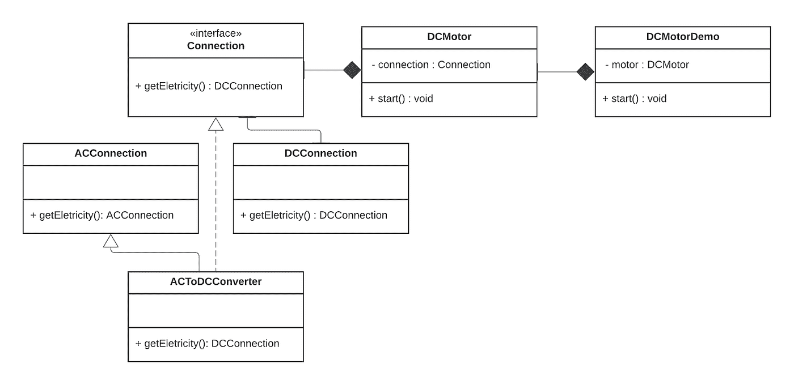
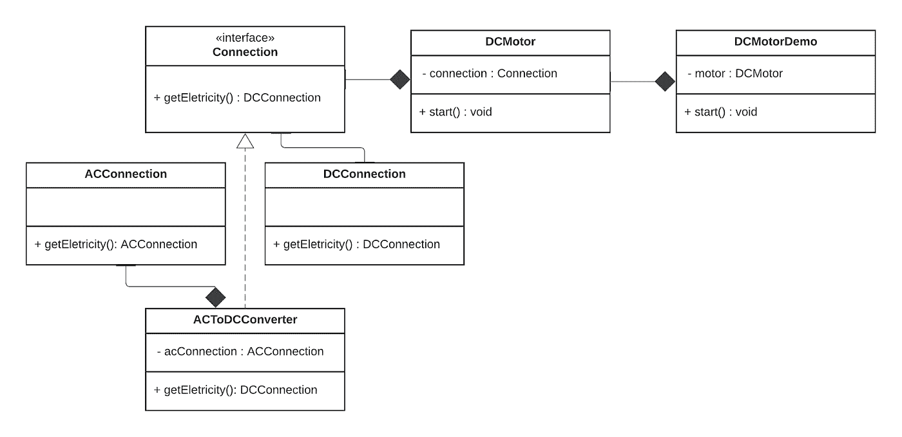

# 简化的适配器设计模式

> 原文：<https://medium.com/globant/adapter-design-pattern-simplified-749339e32a7d?source=collection_archive---------4----------------------->



Adapter design pattern

在本文中，我们将讨论适配器设计模式的所有内容。适配器设计模式是一种**结构**设计模式。我们也可以称之为包装。

**为什么我们需要适配器设计模式？**

有时接口之间可能不兼容，为了在这样的接口之间进行通信，我们需要将不兼容的接口对象转换成兼容的。这里适配器设计模式派上了用场，适配器是一个专门设计的对象，它将一个对象的接口转换成另一个对象的接口。

有两种方法可以实现适配器设计模式
1。**类适配器**:类适配器使用**继承**使一个接口适应另一个接口。
2。**对象适配器**:对象适配器依赖于**对象组合**。

## 类别适配器

让我们以 DC 电机为例，它需要 DC 电源连接，但不知何故我们有一个交流电源连接。为了启动 DC 电机，我们需要将交流连接转换到 DC。



**实施。**

**步骤 1** :定义满足 DC 电机要求的连接接口

```
interface Connection {
 fun getEletricity(): DCConnection 
}
```

**第二步**:现在 DC 电机类将连接作为输入参数

```
open class DCMotor(connection:Connection){
  fun startMotor(){
    val electricity = connection.getEletricity()
    .....
    .....
   }
}
```

相反，ACConnection 和 DCConnection 类如下所示

```
open class ACConnection {
   fun getConnection():ACConnection{
       returns acConnection
   }
}open class DCConnection {
   fun getConnection():DCConnection{
    returns dcConnection
   }
}
```

交流连接与 DC 电机不兼容，借助适配器模式将交流连接转换到 DC。

**第三步**:一个**类适配器**使用**继承**来适配接口。getEletricity()操作将 ACConnection 转换为 DCConnection，以符合连接接口要求。

最后，我们定义 getEletricity()，它将交流连接转换为 DC。

```
class ACToDCConverter : Connection, ACConnection {
   fun getEletricity(): DCConnection{
     val ac = getEletricity()
     //convert AC to DC
     .......
     .......
     Return dcConnection 
   } 
}
```

或者，在 Kotlin 中，我们可以使用**扩展函数**来实现类适配器行为。

```
fun ACConnection.toDCConnection() : DCConnection {
      return object : DCConnection {
       // Do something to convert
     }
}
```

**对象适配器**

对象适配器使用对象组合来组合具有不同接口的类。



**实现**。让我们用一个对象适配器来实现它。在这种方法中，适配器 ACToDCObjectAdapter 维护一个指向 acConnection 的指针。

```
class ACToDCObjectAdapter(acConnection:AcConnection):DCConnection {
    fun getEletricity(): DCConnection{
       val ac = acConnection.getConnection()
     //convert AC to DC
     .......
     .......
     Return dcConnection 
    }
 }
```

它是如何工作的？

客户端调用适配器实例上的操作。反过来，适配器调用执行请求的 adaptee(不兼容类)操作。

```
class AdapterDemo {
    fun main(){
      //Class Adapter 
      val acToDCClassAdapter = ACToDCConverter()
      val dcMotor = DCMotor(acToDCClassAdapter)
      dcMotor.startMotor()

     //Object Adapter
     val acConnection = ACConnection()
     val acToDCObjectAdapter = ACToDCObjectAdapter(acConnection)
     val dcMotor1 = DCMotor(acToDCClassAdapter)
      dcMotor1.startMotor()
   }
 }
```

我们什么时候可以使用它？

1.接口与你的其余代码不兼容。例如，我们使用 XML 到 JSON 解析器，映射类，将一种数据类型转换成另一种。

2.当您想要重用一些现有的子类，这些子类缺少一些不能添加到超类中的公共功能时。您可以将子类包装到适配器中，并添加缺少的功能。

**优势**

**代码分离**:您可以将接口或数据转换代码从程序的主要业务逻辑中分离出来。

**可伸缩性**:您可以在程序中引入新类型的适配器，而无需破坏现有的客户端代码，只要它们通过客户端接口与适配器一起工作。

可重用性:一个对象适配器允许一个适配器与许多被适配器一起工作，即被适配器本身及其所有子类(如果有的话)。适配器还可以一次向所有适配器添加功能。

**可扩展性:**类适配器覆盖了被适配器的一些行为，因为适配器是被适配器的子类。

**外卖**

当我们不能修改/调整两个不兼容的接口时，适配器设计模式就派上了用场。
但是，即使您可以修改/调整现有的类或接口，创建适配器也可以被认为是一种反模式，因为它会产生开销/冗余类。

> 这都是关于适配器设计模式的。我希望这篇文章内容丰富。
> 谢谢！✌️
> 
> 特别感谢 [Rohit Chandekar](https://medium.com/u/c82347902bcd?source=post_page-----749339e32a7d--------------------------------) 和 [Prerana Pawar](https://medium.com/u/d62ea07f77ed?source=post_page-----749339e32a7d--------------------------------) 帮助我写这篇文章。