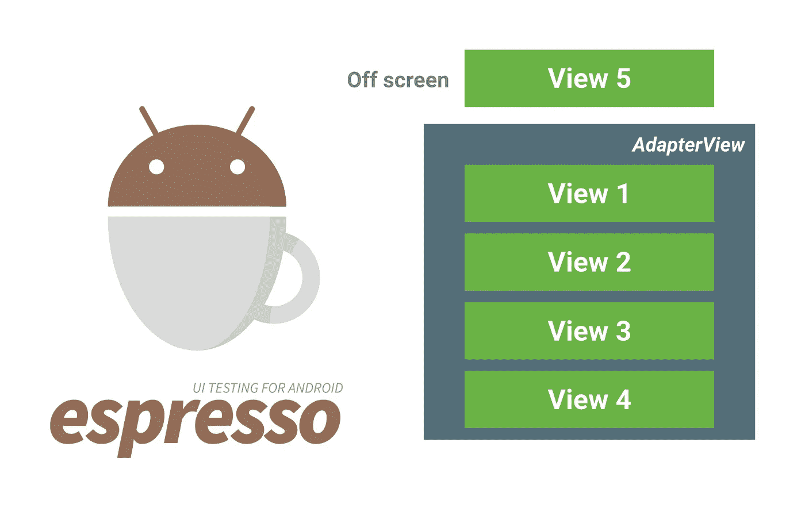
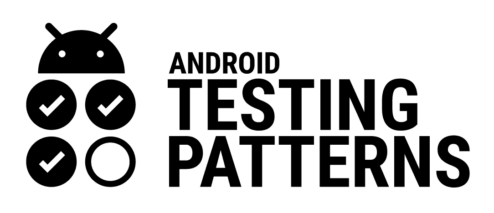

# AdapterViews 和 Espresso

> 原文：<https://medium.com/androiddevelopers/adapterviews-and-espresso-f4172aa853cf?source=collection_archive---------2----------------------->



如果在你分心并关闭这个标签之前，你在这篇文章中读到的只有一件事，那就是:**在你的 Espresso 测试中使用 *AdapterViews* 时，使用 *onData()* 而不是 *onView()* 。**

*AdapterViews* 如 list、grids 和 spinners 与通常的布局(如 LinearLayout)不同，因为它们没有在视图层次结构中保留所有的子元素。AdapterViews 的主要目的是高效地在屏幕上显示大型数据集，因此它们必须通过只维护当前适合视窗的数据元素的视图对象来优化内存使用和性能。

所有其他元素仅作为支持 AdapterView 的适配器中的数据集存在。使用*espresso . on data(Matcher data Matcher)*您提供一个匹配器，它将尝试匹配适配器中的一行。如果匹配成功，Espresso 会将该行显示在屏幕上并进入视图层次结构，这样您就可以像往常一样在其视图上执行操作并检查断言:

```
onData(**Matcher dataMatcher**)
   .perform(ViewAction action)
   .check(ViewAssertion assert)
```

与 *onView()* 的主要区别在于，您将传递一个处理适配器提供的数据的匹配器，而不是一个寻找视图属性的匹配器。

默认情况下， *onData()* 将搜索它在当前屏幕上找到的所有 AdapterViews。如果您想限制它，您可以使用一个视图匹配器，它将用于定位您感兴趣的 AdapterView:

```
onData(Matcher dataMatcher)
   .**inAdapterView(Matcher<View> adapterMatcher)
**   .perform(...)
```

# 匹配来自适配器的数据

那么，您提供给 *onData()* 的数据匹配器是如何工作的呢？基本上，Espresso 逐个检查支持 AdapterView 的适配器中的项目，并将*Adapter . getitem(int position)*的结果传递给匹配器。

根据你的适配器将哪种数据作为它的条目(并因此从 *Adapter.getItem* 返回)，你将需要使用不同的匹配器。假设您有一个保存字符串对象数组的 **ArrayAdapter** ，您可以使用基本的文本匹配器:

```
onData**(**is**(**instanceOf**(**String**.**class**)),** is**(**"Americano"**)));**//partial text match:
onData**(**is**(**instanceOf**(**String**.**class**)),** containsString**(**"ricano"**)));**//starts with text:
onData**(**is**(**instanceOf**(**String**.**class**)),** startsWith**(**"Amer"**)));**
```

如果您使用的是返回存储为映射的键值对的 **SimpleAdapter** ，那么有一个匹配器可以找到包含给定键值条目的条目:

```
onData**(** is**(**instanceOf**(**Map**.**class**)),** 
    hasEntry**(**equalTo**(**"jobTitle"**),** is**(**"Barista"**)))
);**
```

对于 **CursorAdapters** ，我们在 Espresso 中构建了一组匹配器，让您可以检查光标值:

```
onData**(** is**(**instanceOf**(**Cursor**.**class**)),** 
    CursorMatchers.withRowString**("**job_title**",** is**("**Barista**"))
);**
```

最后，如果您对适配器项目使用自己的数据类型(假设它返回类型 *Person* 的对象)，您可以编写自己的定制匹配器来检查您想要的属性:

```
public static Matcher withName**(**Matcher nameMatcher**){**
    return new TypeSafeMatcher**<**Person**>(){**
        @Override
        public boolean matchesSafely**(**Person person**) {**
            return nameMatcher.matches**(**person.getName**())**;
        **}** @Overridepublic void describeTo**(**Description description**) {**
            ...
        **}**
 **}
}**
```

# 再循环查看的案例

乍一看，似乎应该将相同的方法应用于 RecyclerView，因为它也使用适配器来保存数据，并重用少量的视图对象在屏幕上显示数据。不幸的是，RecyclerView 不从 AdapterView 继承(而是 ViewGroup 的直接子类)，所以不能对它使用 onData。

相反，您应该使用 [RecyclerViewActions](https://developer.android.com/reference/android/support/test/espresso/contrib/RecyclerViewActions.html) 方法之一将 RecyclerView 滚动到所需的项目，并对其执行 ViewAction(使用 ViewHolder 匹配器或位置):

```
onView**(**withId**(**R.id.myRecyclerView**))**
    .perform**(**
        RecyclerViewActions.actionOnItemAtPosition**(**0, click**())**
    **);**
```

