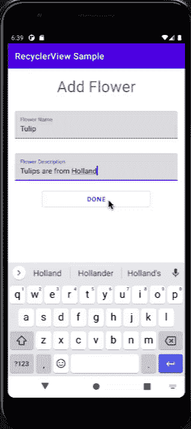
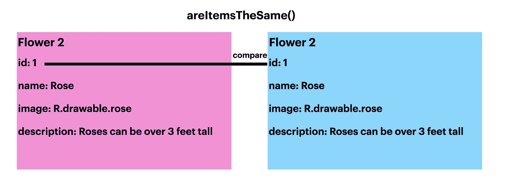
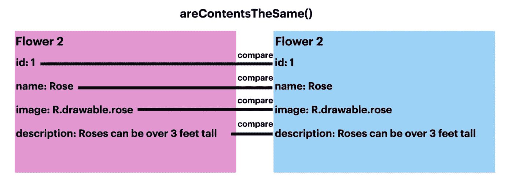

# 适应 ListAdapter

> 原文：<https://medium.com/androiddevelopers/adapting-to-listadapter-341da4218f5b?source=collection_archive---------0----------------------->

这是[系列文章](https://medium.com/androiddevelopers/tagged/recycler-view-series)的第二篇，涵盖了创建和使用`RecyclerView`的基础知识。如果你已经对如何创建一个`RecyclerView`有了坚实的理解，那么继续吧。否则，考虑从[这篇帖子](/androiddevelopers/getting-to-know-recyclerview-ea14f8514e6)开始。

`RecyclerView`是高效显示数据项列表的好方法。对于显示静态数据列表来说，默认适配器工作得很好。然而，在大多数用例中，`RecyclerView`数据是动态的。以一个待办事项 app 为例:添加新的事项，删除已完成的事项。`notifyItemInserted()`可以在指定的索引处插入新的任务，但是删除项目时会出现问题。`notifyItemRemoved()`仅在您有想要移除的任务的位置时有用。可以编写代码来获取要删除的任务的位置，然后调用`notifyItemRemoved()`，但是这段代码可能会变得混乱。调用`notifyDataSetChanged()`是一个选项，但是它会重绘整个视图，甚至是未更改的部分，这是一个开销很大的操作。`ListAdapter`处理添加和删除，无需重绘整个视图，甚至可以动画显示这些更改。

使用`ListAdapter`的另一个好处是，当添加或删除一个项目时，它会附带动画。这为用户查看列表中的变化提供了一个很好的视觉提示。没有`ListAdapter`动画也是可能的，但是它们必须由开发者实现，并且不会有相同的性能，因为视图很可能需要随着动画一起重画。

Animation after adding an item.

# 折中

`DiffUtil`是使`ListAdapter`能够有效改变列表中项目的秘密成分。`DiffUtil`将新列表与旧列表进行比较，以确定添加、移动和删除了什么，并输出一个更新操作列表，将第一个列表有效地转换为第二个列表。

为了识别新数据，`DiffUtil`要求你覆盖`areItemsTheSame()`和`areContentsTheSame()`。`areItemsTheSame()`检查两个项目是否实际上是同一项目。`areContentsTheSame()`检查两个项目是否有相同的数据。

Diagram showing how areItemsTheSame() compares items.

Diagram showing how areContentsTheSame() compares items.

在`Adapter`类中添加一个覆盖`areItemsTheSame()`和`areContentsTheSame()`的`DiffUtil`对象。

更新`Adapter`类以继承`ListAdapter`类而不是`RecyclerView.Adapter`。传入`DiffCallback`。

# 更新列表

`[ListAdapter](https://developer.android.com/reference/androidx/recyclerview/widget/ListAdapter)`使用名为`[submitList()](https://developer.android.com/reference/androidx/recyclerview/widget/ListAdapter#submitList(java.util.List%3CT%3E))`的方法获取数据，该方法提交一个与当前列表不同的列表并显示。这意味着您不再需要覆盖`getItemCount()`，因为`ListAdapter`管理列表。

在`Activity`类中，调用`Adapter`上的`submitList()`并传入数据列表。

在`Adapter`类中，`onBindViewHolder()`现在可以使用`[getItem()](https://developer.android.com/reference/androidx/recyclerview/widget/ListAdapter#getItem(int))`从给定位置的数据列表中检索条目。

就是这样！把你的`RecyclerView`转换成使用`ListAdapter`只需要几步。现在，您的应用程序可以通过使用`ListAdapter`自动获得更好的性能和更好的用户体验，只更新那些已经更改的项目。

# 后续步骤

包括`ListAdapter`在内的完整代码示例可以在这里找到[。](https://github.com/android/views-widgets-samples/tree/main/RecyclerViewKotlin)

感谢您阅读我的`[RecyclerView](https://medium.com/androiddevelopers/tagged/recycler-view-series)` [系列](https://medium.com/androiddevelopers/tagged/recycler-view-series)的第二部！请继续关注我写的更多`RecyclerView`特性。

如果你想了解更多关于`ListAdapter`的信息，请查看文档。