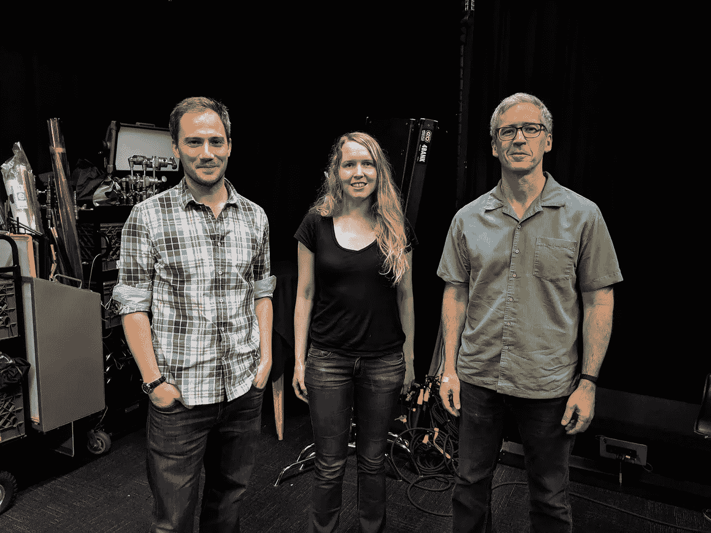

# ADB 120:机器学习

> 原文：<https://medium.com/androiddevelopers/adb-120-machine-learning-9ffc398ec77d?source=collection_archive---------0----------------------->

关于 ML 的新播客

Romain, Anna, and Chet

在这最新的一集里，切特和罗曼与谷歌大脑团队的安娜·戈尔迪谈论了机器学习。如果你曾经想知道人工智能和机器学习之间的区别，或者什么是深度神经网络，那么这一集就是为你准备的。需要澄清的是，这个节目与 Android 没有任何特别的关系，我们只是认为这对 Android 开发者来说是一个有趣的话题。

最喜欢的短语:“卷积神经网络”

无论您使用什么应用程序或平台来播放播客，都可以使用该播客。如果你喜欢，你也可以直接下载 mp3 文件；下面的博客站点中有一个链接。

 [## 第 120 集:机器学习

### 切特和罗曼就机器学习问题采访了谷歌大脑团队的安娜·戈尔迪。如果你想知道…

androidbackstage.blogspot.com](http://androidbackstage.blogspot.com/2019/08/episode-120-machine-learning.html) 

*想知道“亚行”是什么？它代表 Android 开发人员后台，一个由 Android 开发人员创建并为其服务的播客。该节目由 Tor Norbye(来自 Android Studio 团队)、Romain Guy(来自 Android Toolkit 团队)和我(来自 Android 开发者关系团队)主持。我们和工程师讨论东西是如何工作的。*