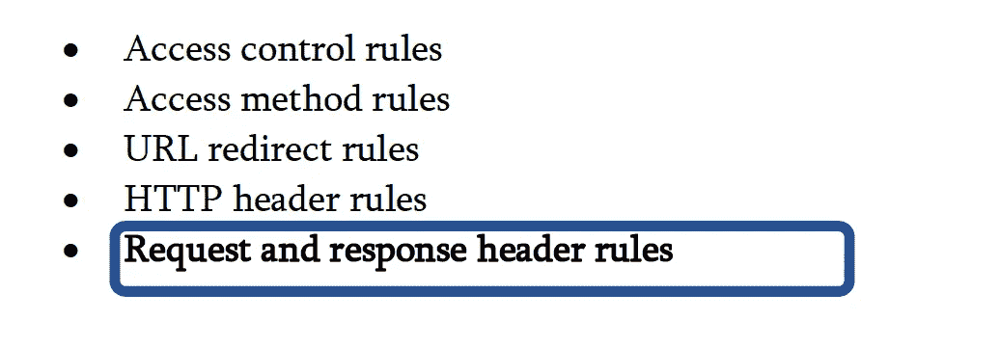
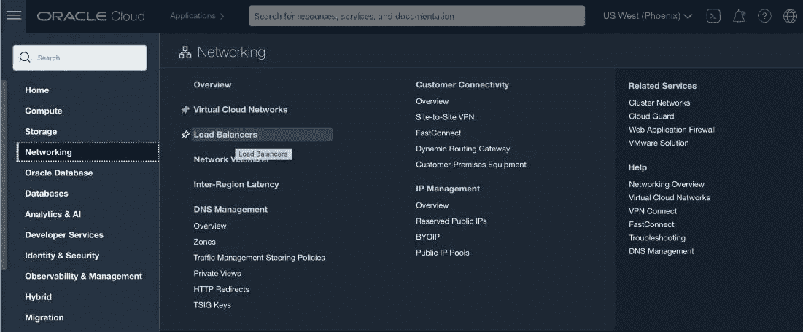
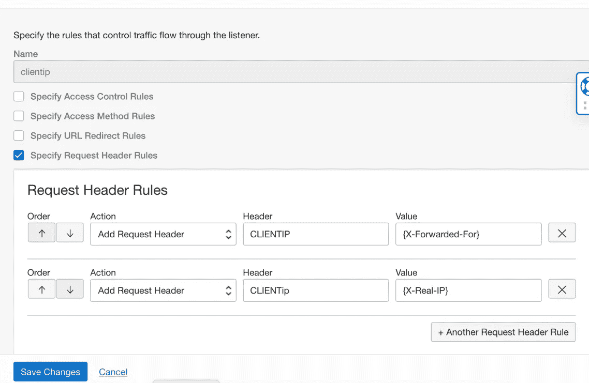
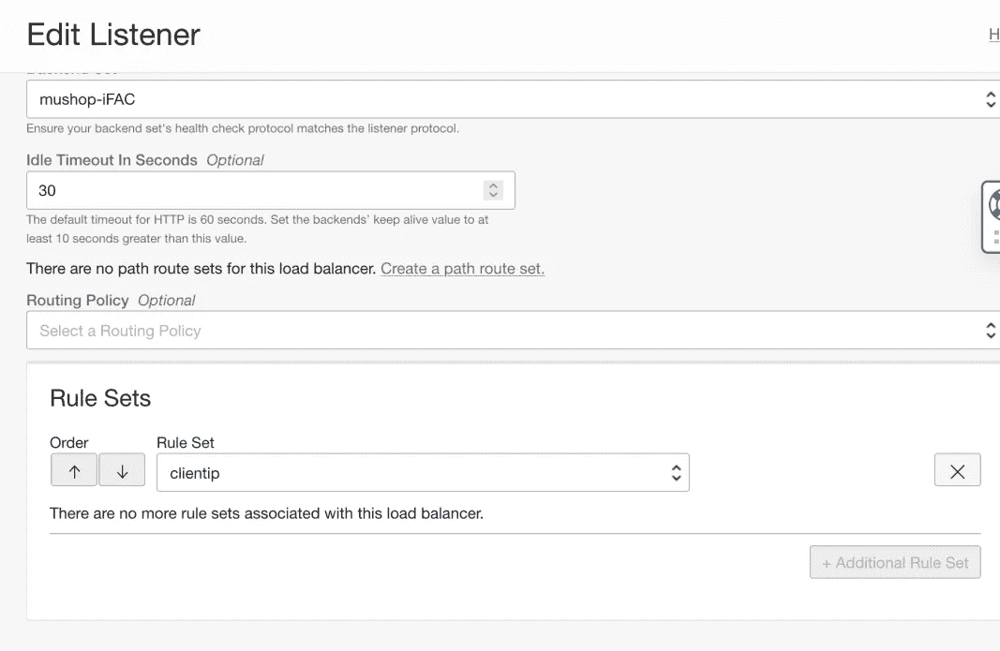
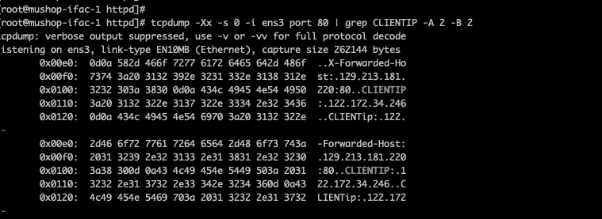
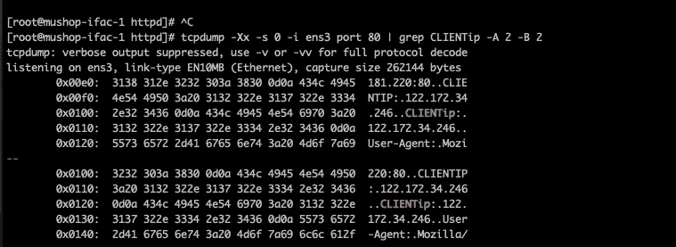

# 向 OCI 负载平衡器添加自定义 HTTP 请求或响应标头

> 原文：<https://medium.com/oracledevs/add-custom-http-request-or-response-header-to-oci-load-balancer-7eb7861e168c?source=collection_archive---------0----------------------->

今天，我们将讨论添加自定义 HTTP 请求或响应头。有些客户要求有时需要我们根据后端应用程序的设计添加自定义标题。

Oracle 云基础设施上的应用负载平衡器工作在第 7 层，因此它支持 HTTP 和 HTTPS。它可以根据基于主机或基于路径的规则分发 HTTP 和 HTTPS 流量。应用程序负载平衡器是一种上下文感知的负载分布，它可以基于 HTTP 头转发和操作请求。它还具有可配置的健康检查状态代码范围，此外，根据后端服务器的要求，可以插入定制的请求和响应头。

**自定义标题如何工作**

自定义请求和响应头允许您指定负载平衡器添加到请求和响应中的附加头。这些规则使您能够向后端服务器提供元数据，使您能够判断哪个侦听器发出了请求、客户端 IP 地址的地理位置、通知 WebLogic 负载平衡器终止了 SSL 等等。

默认情况下，应用程序负载平衡器将某些头添加到它在后端和客户端之间代理的所有 HTTP(S)请求和响应中。更多信息，请参见[https://docs . Oracle . com/en-us/iaas/Content/Balance/Reference/http headers . htm](https://docs.oracle.com/en-us/iaas/Content/Balance/Reference/httpheaders.htm)

在本例中，客户希望复制其现有的本地环境，方法是使用 X-Forwarded-For 或 X-REAL-IP 添加一个特定的 HTTP 头作为 CLIENTIP，其值为实际客户端 IP。

在我们完成这些步骤之前，让我们理解:**什么是规则集？**

规则集是与负载平衡器连接并应用于一个或多个负载平衡器侦听器的规则的命名集合。您必须首先建立包含规则的规则集，然后才能将其应用于侦听器。规则是表示负载平衡器侦听器对流量采取的操作的对象。负载平衡器的设置包括规则集。创建或编辑负载平衡器侦听器时，可以指定要使用的规则集。规则集可以包含以下几种规则:

**以下是将定制请求标题添加到 OCI LB 的步骤:**

1.登录 https://cloud.oracle.com/的 OCI 控制台—

2.导航到-

*联网>负载平衡器>选择您的负载平衡器并查看详细信息*

3.在左侧向下滚动

*   *选择规则集>选择创建规则集>命名>选择指定请求标题规则*并选择动作“添加请求标题”。
*   根据用户需要的变量或名称键入标题名称，并选择值为{X-Real-IP}或{X-Forwarded-For}。
*   请看下面的截图，注意我选择了不同的标题名称来显示不同的值。

4.保存更改以保存规则集。

5.选择同一页面下的监听器–

编辑*监听器>向下滚动到规则集*，并将步骤 4 中创建的规则集附加到监听器。这将把规则集应用到负载平衡器监听器。

现在配置完成了。让我们从后端服务器实例开始检查，我们可以看到实例接收到插入的自定义头，实际的客户端 IP 用于测试负载平衡器。我们使用了下面的 tcpdump 命令来检查这一点:

> tcpdump -Xx -s 0 -i <interface>端口 <port_num>| grep <filter>-A 2 -B 2</filter></port_num></interface>

正如我们在上面的截图中所看到的，一个新的自定义头(值为 **CLIENTIP 和 CLIENTip** ，值为 **X-Forwarded-For 和 X-Real-IP** (实际的客户端 IP 地址)被传递到后端服务器。

**接下来的步骤**

有关更多信息，请参见 OCI 文档中的 OCI 网络负载平衡器。我们希望您体验 Oracle 云基础架构提供的这些新特性和所有企业级功能。

如果您对 OCI 应用负载均衡器有任何疑问，请随时写信@***piyush.jalan93@gmail.com***&敬请关注下一篇文章。我还要感谢我的同事 Animesh Dixit 对这个博客的贡献。

谢谢大家！