# 使用 OIDC 模块将 Google SSO 添加到您的 Mendix 应用程序中

> 原文：<https://medium.com/mendix/add-google-sso-to-your-mendix-app-using-the-oidc-module-a76784b2690f?source=collection_archive---------0----------------------->

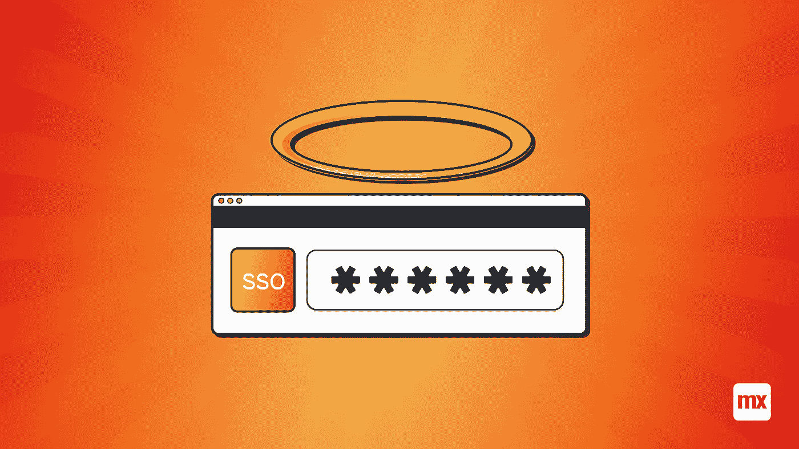

# 如今，没有终端用户有时间完成一个冗长的注册过程，我们都填写了足够 10 辈子的“确认你的电子邮件地址”框。这就是为什么现在几乎每个网站或应用程序都有“继续使用谷歌”或其他常用平台如 facebook 或微软的选项。

除了简化应用程序的 UX，单点登录还有其他优势。多个应用程序使用一个密码或帐户限制了系统中易受攻击点的数量，提高了安全性，并使注册用户更容易记住他们的凭据。事实证明，人们在密码管理方面很糟糕，通常人们会为多个账户重复使用同一个密码(这是一个非常糟糕的想法)。

因此，在这篇博客中，我将向你展示如何使用 [OIDC 市场模块](https://marketplace.mendix.com/link/component/117529) (Open ID Connect 单点登录)在几分钟内将谷歌单点登录添加到任何 Mendix 应用程序中

# 我们需要什么？

在我们开始之前，花一点时间检查你是否有你需要的一切。确保您已经创建了一个谷歌云平台帐户。

您还需要在 Mendix 应用程序中安装一些市场模块:

*   社区公共资源
*   加密
*   纳流共享
*   OIDC 模块

[https://www.mendix.com/pricing/](https://www.mendix.com/pricing/)

# 入门指南

在[谷歌云控制台](https://cloud.google.com/)上，进入你的项目概述，如下所示。

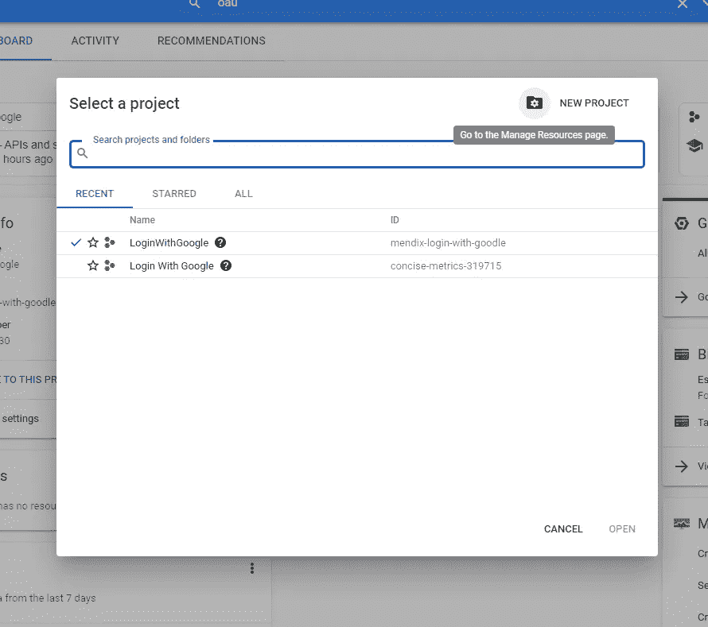

点击创建一个**新项目**，给它命名(可以是任何东西)，然后点击**创建**

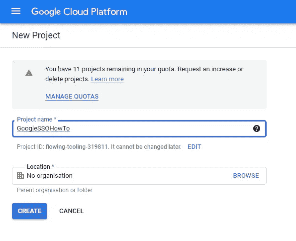

打开您的项目，在页面顶部的搜索栏中的仪表板上搜索 OAUTH 同意屏幕。

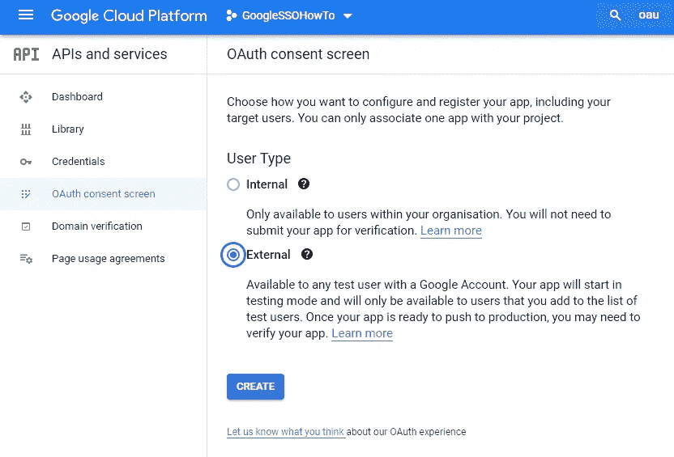

对于用户类型，选择外部(这将允许任何拥有 google 帐户的用户创建一个帐户并访问您的应用程序。单击“创建”继续。在下一页上，用您自己的信息填写所需的所有详细信息，如下所示。

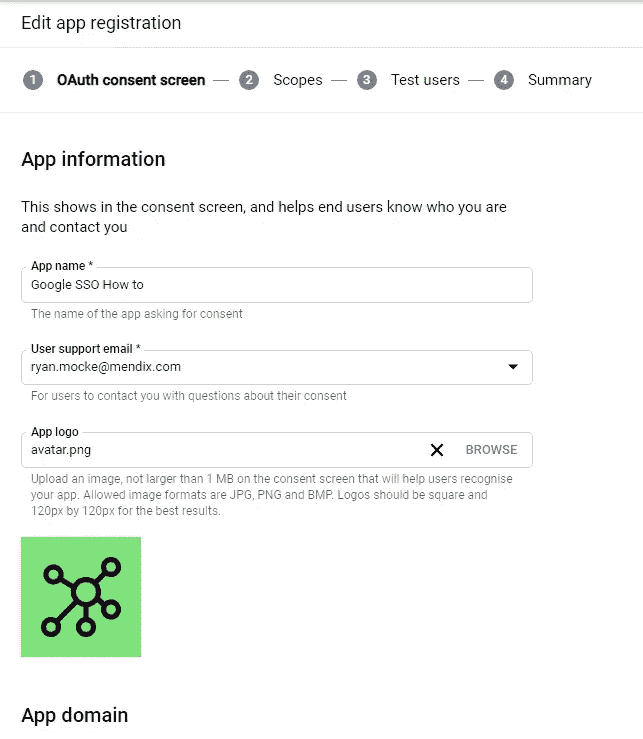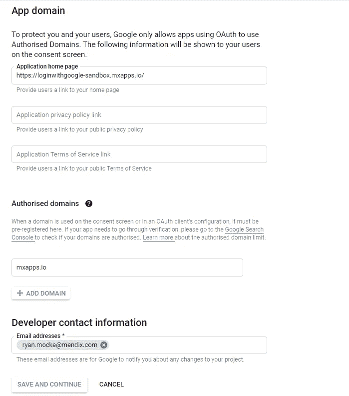

在下一个屏幕“范围”中，您不需要填写任何内容。只需点击屏幕底部的保存并继续。

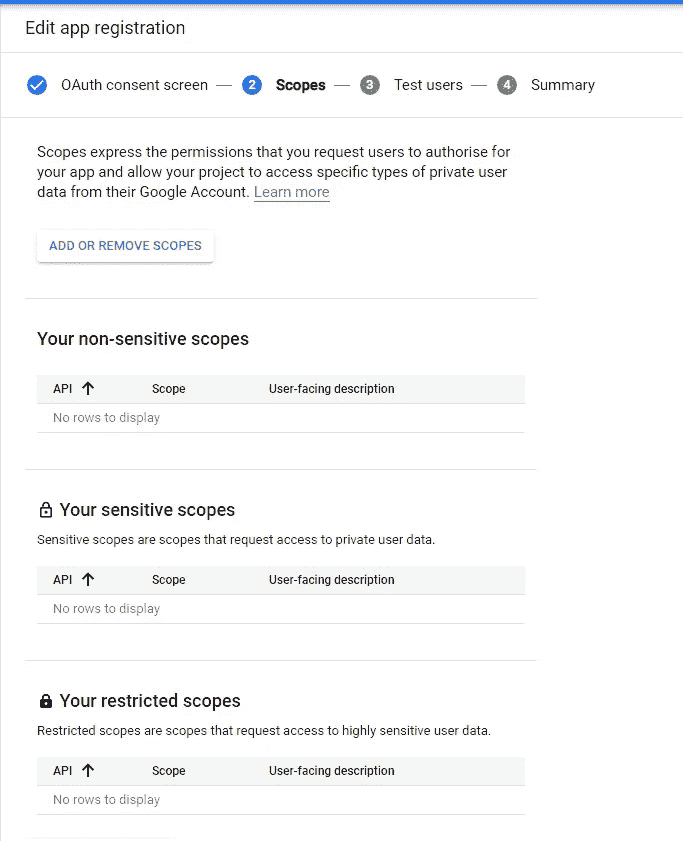

在最后一个名为“测试用户”的屏幕上，您可以指定在测试期间允许访问应用程序的用户列表。当您的应用程序仍在开发中时，这通常是不需要的，除非您需要超过 100 个测试用户(因为这是极限)。决定是否需要指定用户，点击屏幕底部的**保存并继续** e 继续。

现在，我们可以导航到“credentials”页面(在左侧菜单上),单击“Create Credentials ”,从显示的下拉列表中选择“OAuth ClientID”

在下一页选择您的应用程序类型，在我的例子中，我选择了 Web 应用程序

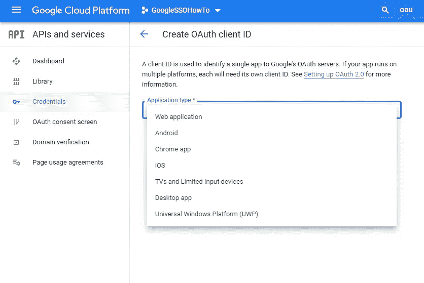

给你的客户一个名字，加上两个“授权重定向 URI”。第一个添加的是您的应用程序的云 URL(免费应用程序 URL 或任何云 URL)，第二个是您的本地主机。我们添加了本地主机选项，以便能够在本地测试。请记住在任何应用重定向 URL 的末尾添加“/oauth/v2/callback”。完成后点击**创建**。

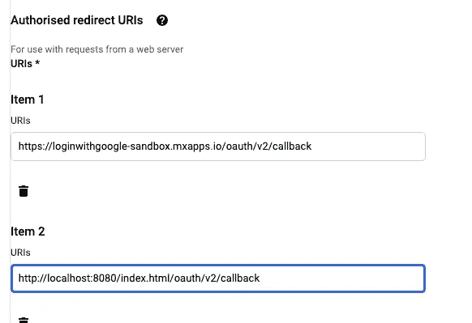

全部完成！请确保将您的客户 ID 和客户机密保存在安全的地方，以供以后参考。

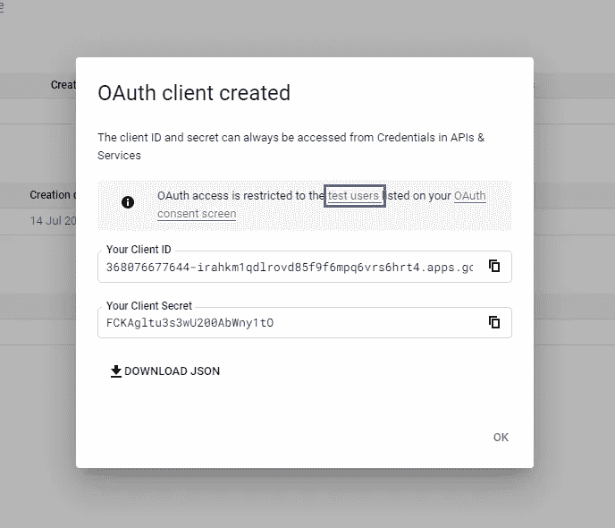

# 在 Studio Pro 中

现在是这个构建的 Mendix 部分！为了确保匿名用户可以访问所需的页面，我们需要确保我们的应用程序配置为安全，也允许匿名用户的访问。为此，我们需要一个来宾用户角色，我们可以选择它作为匿名用户。

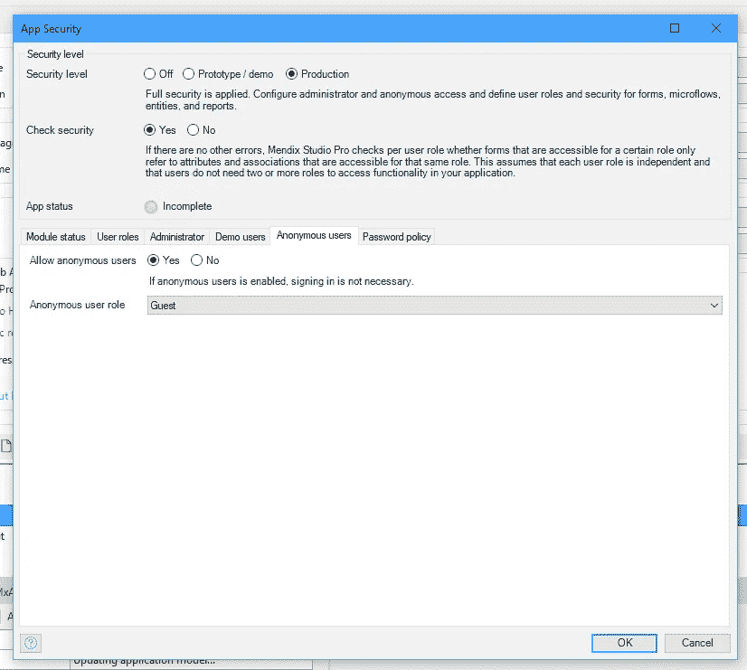

还要确保您的来宾用户角色作为匿名模块角色分配给 OIDC 模块，并且管理员需要分配给同一 OIDC 模块的管理员用户角色。

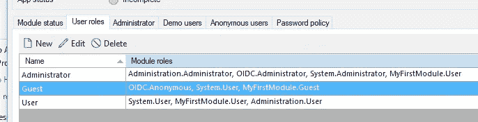

既然我们已经设置了安全性和用户角色，我们还需要允许用户访问登录页面。转到您的项目导航，为来宾添加一个基于角色的主页。为此，你可以选择由 OIDC 模块提供的页面，“OIDC。Login_Web_Button”。还为用户提供一个基于角色的主页。

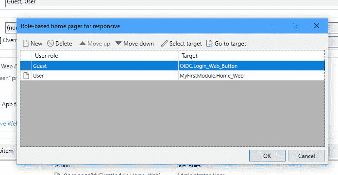

最后，我们必须允许管理员访问和配置 SSO 客户端凭证。再次有一个页面已经提供在名为“OIDC _ 客户 _ 概述”的 ODIC 模块中。将此添加到您的导航中，并确保您的应用管理员可以访问它。

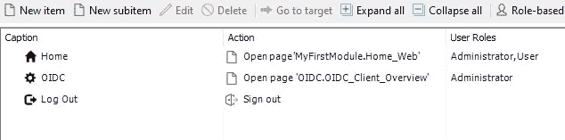

在本地运行您的应用程序，并以管理员身份登录。我使用演示切换器小部件在这里轻松登录。接下来导航到 OIDC 客户端概述页面。单击“新建”创建新配置。

填写别名是任何你想要的名字，我只是叫它谷歌。

输入您的客户端 ID，并将状态设置为太活跃。最重要的是，你需要添加谷歌(【https://accounts.google.com/.】T2)的自动配置网址知名/openid-configuration )并点击“导入配置”。这将自动填充其余的必填字段。这个 URL 是特定于 Google 的，其他提供商也有他们自己的版本，所以请确保您使用的提供商有正确的导入 URL。

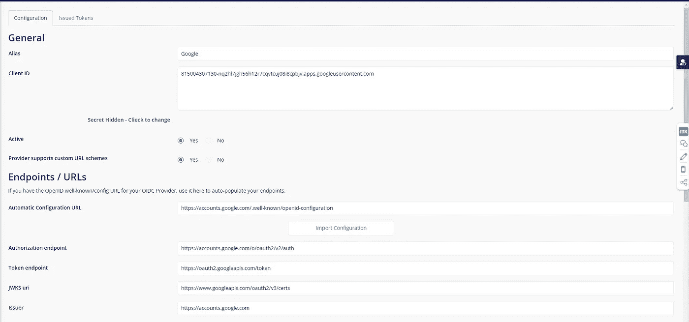

最后一步是选择您的范围，这是客户端提供的关于您的用户的属性。确保选择 OpenID、电子邮件和个人资料(个人资料是存储您的大部分用户信息的地方。

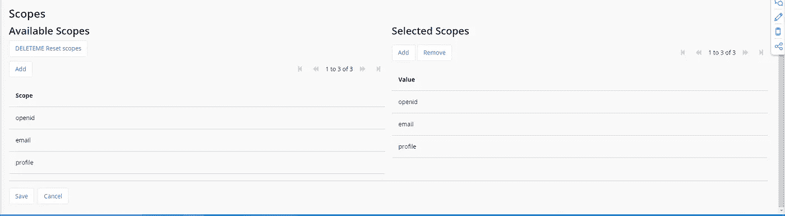

# 测试登录

当一个访客用户登陆你的网站时，他们将会看到下面的页面，用户应该点击“通过 SSO 登录”

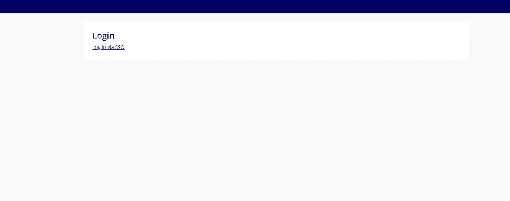

接下来，他们将看到这个屏幕，提示用户选择他们想要登录的 google 帐户。

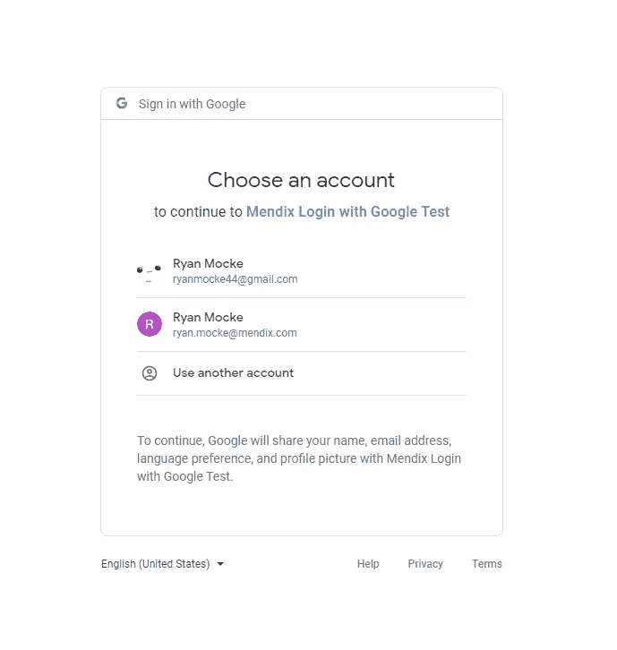

如果您的配置成功，用户应该以经过身份验证的用户身份登录主页。为了确保这个设置正常工作，我在主页上添加了一个数据视图，返回登录用户的帐户，并使用标签显示$Account/FullName 属性。

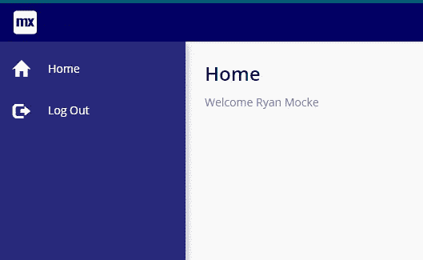

# 最后一件事

虽然在这个博客中，我把重点放在使用谷歌作为单点登录客户端，但重要的是要记住，这个模块可以支持其他平台，比如 Salesforce 和 Microsoft，但是这个设置应该适用于任何符合 OIDC 的客户端。最后，本模块也适用于 Native Mobile，所以请尝试新的实现，并从中获得乐趣！

特别感谢 **Eric Tieniber** ，这个市场模块的创建者，以及他在这篇文章写作中的帮助！

# 阅读更多

 [## OpenID Connect | OpenID

### OpenID Connect 1.0 是 OAuth 2.0 协议之上的一个简单的身份层。它允许客户端验证…

openid.net](https://openid.net/connect/)  [## 什么是 OIDC？它是如何运作的？

### 了解您需要了解的有关 OpenID Connect 身份验证协议的信息。

www.pingidentity.com](https://www.pingidentity.com/en/resources/client-library/articles/openid-connect.html)  [## OpenID -维基百科

### OpenID 是一个开放的标准和分散的认证协议。由非盈利性的 OpenID 基金会推动，它…

en.wikipedia.org](https://en.wikipedia.org/wiki/OpenID) 

*来自出版商-*

*如果你喜欢这篇文章，你可以在我们的* [*中页*](https://medium.com/mendix) *或者我们自己的* [*社区博客网站*](https://developers.mendix.com/community-blog/) *上找到更多类似的文章。*

*对于想要开始的决策者，您可以注册一个* [*免费账户*](https://signup.mendix.com/link/signup/?source=direct) *，并通过我们的* [*书院*](https://academy.mendix.com/link/home) *获得即时学习机会。*

*有兴趣更多地参与我们的社区吗？您可以加入我们的*[*Slack community channel*](https://join.slack.com/t/mendixcommunity/shared_invite/zt-hwhwkcxu-~59ywyjqHlUHXmrw5heqpQ)*或对于那些想更多参与的人，请关注加入我们的*[*ups*](https://developers.mendix.com/meetups/#meetupsNearYou)*。*