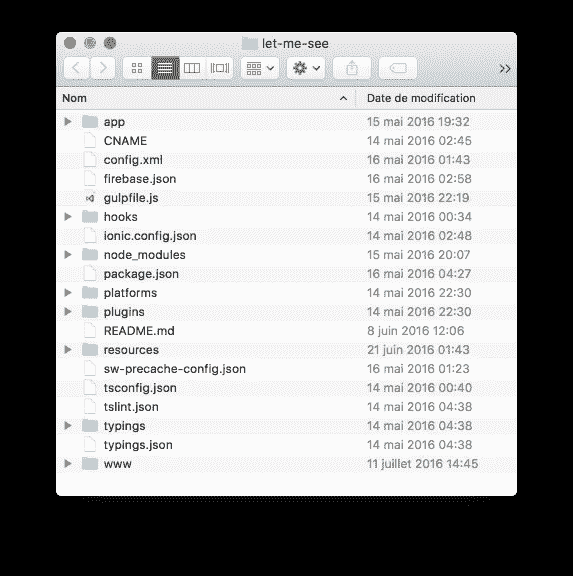

# 向任何 Web 应用程序添加离线支持

> 原文：<https://medium.com/google-developer-experts/add-offline-support-to-any-web-app-c20edc4bea0e?source=collection_archive---------2----------------------->


[http://blog.htc.com/wp-content/uploads/2013/05/Seashells_TAKAGI.jpg](http://blog.htc.com/wp-content/uploads/2013/05/Seashells_TAKAGI.jpg)

最近，我参加了 [AngularAttack 2016 黑客马拉松](https://www.angularattack.com/)，并构建了“[让我看看](https://www.angularattack.com/entries/101-angularlabs-london)”:一个帮助失明人士看世界的应用。这个应用程序是使用 [Ionic2](http://blog.ionic.io/built-with-ionic-2-let-me-see/) (当然还有 [Angular2](https://angular.io/) )构建的。但最重要的是，我希望应用程序是渐进式的，所以我添加了对离线缓存的支持，以获得更好的即时加载。让我告诉你我是如何简单快速地添加…

> 哦！对了，《让我看看》得了创新奖！

在我们开始之前，我假设您已经有一个现有的 web 应用程序。我将使用“让我看看”作为一个例子，但是我们将一起走过的步骤将适用于任何现代的单页面应用程序。

我们开始吧。这是我们应用程序的结构…



正如你所看到的，这是一个简单的 Ionic2 应用程序，带有一些额外的用于 [Firebase](https://www.firebase.com/) 的配置文件，因为这个应用程序是由[托管在 Firebase](http://letmesee.firebaseapp.com)上的。但是让我们在另一篇博文中讨论这个问题。

您应该注意到的是*SW-pre cache-config . JSON*文件的存在。该文件由[维修工人预缓存](https://github.com/GoogleChrome/sw-precache)(*SW-预缓存*)工具使用。

> [Tl；服务工作者预缓存允许我们预缓存应用程序外壳所需的所有必要资源。它还会自动为我们生成服务器工作文件！](http://www.urbandictionary.com/define.php?term=Tl%3BDr&defid=57118)

以下是 *sw-precache* 工具的工作原理…

首先，您必须决定是否要将该工具作为命令行界面(CLI)全局使用:

```
$ npm install --global sw-precache
```

像这样使用它:

```
$ sw-precache --sw-file='www/sw.js' \
              --static-file-globs='www/**/*.html'
```

或者在本地使用您的构建系统:

```
$ npm install --save-dev sw-precache
```

并配合自己的构建系统使用( [Gulp](http://gulpjs.com/) 、[web pack](https://webpack.github.io/)……)。

然后，我们需要提供一个配置文件:*SW-pre cache-config . JSON .*这是我们的“让我看看”应用程序的外观:

```
{
  "swFile": "www/sw.js",
  "staticFileGlobs": [
    "www/manifest.json",
    "www/**/*.css",
    "www/**/*.{ttf,woff,woff2,eof}",
    "www/**/*.js",
    "www/**/*.html",
    "www/**/*.{png,jpg,gif,svg,mp3}"
  ],
  "handleFetch": true,
  "stripPrefix": "www/",
  "cacheId": "let-me-see-v1",
  "maximumFileSizeToCacheInBytes": 4194304,
  "ignoreUrlParametersMatching": "[/./]",
  "verbose": true
}
```

让我快速解释一下其中的一些选项:

*   **swFile** :将要生成的 service worker 文件的路径(这个选项没有记载——参见[这个文件](https://github.com/GoogleChrome/sw-precache/blob/master/cli.js#L36))；
*   **staticFileGlobs** :一个或多个字符串模式的数组。这些文件将被缓存并脱机使用；
*   **handleFetch** :确定 *fetch* 事件处理程序是否包含在生成的服务工作者代码中；
*   **cacheId** :用于区分缓存的字符串；
*   **maximumFileSizeToCacheInBytes**:设置预缓存列表中文件允许的最大大小([不客气](https://github.com/GoogleChrome/sw-precache/pull/113))；
*   **stripPrefix** :在运行时从路径 URL 的开头删除指定的字符串。

你可以在 [github 库](https://github.com/GoogleChrome/sw-precache#options-parameter)中阅读关于这些选项的更详细的文档。

现在我们已经安装好了 *sw-precache* 工具。我们需要让它与我们的应用程序一起工作。我选择使用 *sw-precache* 作为吞咽任务，因为 Ionic2 将它用作构建系统。它甚至提供了挂钩，您可以在其中添加您的定制构建任务。

那么，让我们创建我们的吞咽任务:

```
gulp.task('sw', function(callback) {
  var path = require('path');
  var swPrecache = require('sw-precache');
  var rootDir = 'www';
  var options = **require('./sw-precache-config.json');**
  options.ignoreUrlParametersMatching = [/./];
  swPrecache.write(path.join(rootDir, 'sw.js'), options, callback);
});
```

然后，我们在构建任务之后调用我们的任务，这样当构建完成时， *sw-precache* 工具可以为我们生成服务器工作进程:

```
//...
gulp.task('build:after', [**'sw'**]);
//...
```

可选地，我们也可以在*观察*任务期间运行*软件*任务。这意味着每次在应用程序中编辑文件时，都会自动生成服务工作器:

```
gulp.task('watch', ['clean'], function(done){
  runSequence(
    ['sass', 'html', 'fonts', 'scripts'],
    **'sw',**
    function(){ //...
```

我也强烈推荐你关闭 **handleFetch** 选项，基本上就是关闭 *fetch* 事件。否则，内容将总是由服务工作者缓存提供；并且您的实时重新加载设置可能无法按预期工作。

就是这样。你完了！

现在，您已经为您的 Web 应用程序添加了离线支持。你可以在 github 上看到“让我看看”[的完全自动生成的服务工人。](https://github.com/manekinekko/angularattack2016/blob/master/www/sw.js)

最后但同样重要的是，不要忘记在您的*index.html*中注册该服务人员:

```
<script>
   if('serviceWorker' in navigator) {
     navigator.serviceWorker.register('sw.js');
   }
</script>
```

[](https://github.com/manekinekko/angularattack2016) [## manekinekko/angularattack2016

### angularattack2016 -让我看看:失明人士的助手应用

github.com](https://github.com/manekinekko/angularattack2016) 

*关注*[*@ manekinekko*](https://twitter.com/manekinekko)*了解更多网络平台。*