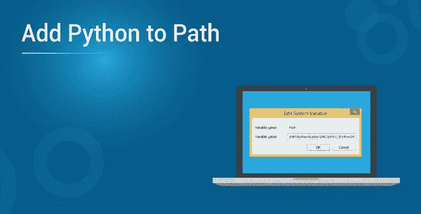
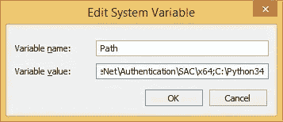

# 如何将 Python 添加到 Path 中？

> 原文：<https://medium.com/edureka/add-python-to-path-f97fcab2a58d?source=collection_archive---------1----------------------->

本文将提出一个非常简单而重要的概念，即如何将 Python 添加到 path 中，并随后进行详细的实践演示。本文将涉及以下几点:

*   将 Python 添加到路径
*   安装 Python
*   设置路径
*   如何在 Windows 中添加 Python 路径？
*   在 Unix 或 Linux 中设置路径
*   环境变量

那么让我们开始吧，

# **将 Python 添加到路径**

今天，你能想到的任何问题都有一个应用程序。无论是以 web 应用程序的形式，还是以在智能手机上运行的形式，应用程序的世界实际上都是一个充满机会的无底洞，这使得 Python 成为全世界许多开发人员的显而易见的选择。Python 之所以成为如此受欢迎的选择，是因为该平台提供了过多的特性。

对于刚刚开始学习 Python 的开发人员来说，可能会在没有首先满足先决条件的情况下错误地在 Windows 中安装 Python。我们从开发人员那里听到的最常见的问题之一是如何在 Python 中添加路径，在本文中，我们将讨论这个问题。

但首先，让我们先了解一下基本情况。

继续这篇关于如何将 Python 添加到 Path 的文章，

**风味巨蟒**

与市场上其他可用的编程平台类似，Python 也受到目前存在的所有操作系统的支持，最突出的是 Linux、Mac OS 和 Windows。

# 安装 Python

可以下载的最新版本的 Python 非常容易安装。您只需要下载适用于您的操作系统的二进制代码并安装它。如果您发现二进制代码不适用于您正在使用的操作系统，您需要使用 C 编译器来手动编译源代码。

手动编译源代码的最大优点之一是，在安装过程中，您可能需要更多的灵活性。

继续这篇关于如何将 Python 添加到 Path 的文章，

# 设置路径

一旦你在你的系统上安装了 Python，接下来是设置路径的棘手部分，这样你就可以轻松地访问 python.exe 文件。根据您当前使用的操作系统，设置 path 的过程会有很大的不同。下面提到的是同时为 Windows、Mac 和 Linux 设置 Path 的步骤。

**给 Windows 添加 Python 路径**

如果您像大多数其他开发人员一样通过遵循在线教程在 Windows 中安装了 Python，在大多数情况下，Python 可执行文件有可能没有添加到 Windows Path 变量中。虽然这在开始时听起来像是一件小事，但当您开始全面使用 Python 时，这将会导致一个问题。Python 可执行文件负责列出当您在 Python 窗口的命令提示符中键入命令时将执行的目录。一旦在 Windows 目录中添加了 python 可执行文件，只需输入 Python 关键字，即可访问 python.exe 文件。增加这个特性的一个主要优点是，每次你需要访问 python.exe 文件时，你不需要指定程序的完整路径。

现在让我们考虑一种情况，Python 可执行文件没有被添加到 Windows 路径中。在这种情况下，当您在命令提示符下输入 Python 命令时，您将会看到以下消息的重复。

C:>python

“python”不被识别为内部或外部命令，

可操作的程序或批处理文件。

此消息清楚地表明 python.exe 文件尚未添加到 Windows 路径，因此您将无法访问它。在这种情况下，如果您想要访问 python.exe 文件，您需要指定文件的完整地址。它看起来会像这样，

C:>C:Python34python 版本

从这个例子中可以看出，这个过程肯定比看起来要复杂，因此建议您在安装过程的最开始就将 python 可执行文件添加到 Windows 路径中。

继续这篇关于如何将 Python 添加到 Path 的文章，

# 如何在 Windows 中添加 Python 路径？

既然我们已经意识到不在 Windows 中添加 Python Path 的影响，这里有一个添加它的简单方法。

1.  使用快捷键 ctrl+R 启动 Windows 计算机上的运行功能。
2.  运行提示符启动并运行后，键入 sysdm.cpl
3.  按 Enter 键，您将被重定向到系统属性。在这一部分中，找到“高级”选项卡，然后单击显示“环境变量”的按钮。
4.  在“环境变量”下，找到系统变量并找到路径。
5.  点击编辑并找到变量值选项。在本节中，在短语的末尾添加已经存在的路径。这里需要注意的最重要的一点是，在添加路径之前，您需要包含一个分号(；)以便两者可以容易地区分。
6.  在我们上面的例子中，我们添加了这样的路径:丙:Python34。

完成后，按 OK，路径将被添加到特定位置。保存所有操作并重新启动系统，以获得更有效的性能。

继续这篇关于如何将 Python 添加到 Path 的文章，

# 在 Unix 或 Linux 中设置路径

在 Unix 或 Linux 中添加 Path 的步骤相当简单，只需遵循下面列出的步骤。

1.  在 csh shell 中，键入以下句子:PATH " $ PATH:/usr/local/bin/python "并按 Enter 键。
2.  如果您使用的是 Linux 的标准版本，请打开 bash shell 并键入以下短语，export PATH = " $ PATH:/usr/local/bin/python "并按 Enter 键。
3.  如果您可以访问 sh 或 ksh shell，请打开终端并键入以下内容，PATH = " $ PATH:/usr/local/bin/python "并按 Enter 键。

在 Unix 或 Linux 中向 python 添加路径时，需要注意的最重要的一点是，/usr/local/bin/python 是 Python 目录的默认路径。

继续这篇关于如何将 Python 添加到 Path 的文章，

# 环境变量

现在您已经成功地将 Path 添加到 Python 中，下面是 Python 可以识别的一些最重要的环境变量。

1.  PYTHONPATH:这是 Python 识别的最常见的环境变量之一，它的作用类似于原始路径。这个变量的使用告诉 Python 模块文件的位置以及如何将它们导入到程序中。使用此函数时，请确保包含 Python 源代码库目录以及包含 Python 源代码的目录。在某些情况下，PYTHONPATH 已经存在于 Python 目录中。
2.  PYTHONSTARTUP:这个文件的使用包含了一个初始化文件的路径，这个文件包含了 Python 源代码。每次在 Python 中启动解释器时都会执行这个函数。在 Unix 或 Linux 中，它被命名为 pythonrc.py，使用这个命令加载修改 PYTHONPATH 的实用程序。
3.  PYTHONCASEOK:这是一个特定于 Windows 的环境变量。当您使用这个变量时，Python 将在 import 语句中找到第一个不区分大小写的匹配。为了激活这个变量，您可以将它设置为您选择的任何值。
4.  PYTHONHOME:这是可以在 Python 中使用的模块搜索路径的替代方法。在大多数情况下，这被嵌入到 PYTHONSTARTUP 或 PYTHONPATH 中，以便使库之间的模块切换变得相当容易。

这是不是把我们带到了这篇关于如何将 Python 添加到 Path 的文章的结尾？如果你想查看更多关于人工智能、DevOps、道德黑客等市场最热门技术的文章，你可以参考 [Edureka 的官方网站。](https://www.edureka.co/blog/?utm_source=medium&utm_medium=content-link&utm_campaign=add-python-to-path)

请留意本系列中的其他文章，它们将解释 Python 和数据科学的各个方面。

> *1。*[*Python 中的机器学习分类器*](/edureka/machine-learning-classifier-c02fbd8400c9)
> 
> *2。* [*Python Scikit-Learn 小抄*](/edureka/python-scikit-learn-cheat-sheet-9786382be9f5)
> 
> *3。* [*机器学习工具*](/edureka/python-libraries-for-data-science-and-machine-learning-1c502744f277)
> 
> *4。* [*用于数据科学和机器学习的 Python 库*](/edureka/python-libraries-for-data-science-and-machine-learning-1c502744f277)
> 
> *5。*[*Python 中的聊天机器人*](/edureka/how-to-make-a-chatbot-in-python-b68fd390b219)
> 
> *6。* [*蟒蛇收藏*](/edureka/collections-in-python-d0bc0ed8d938)
> 
> *7。* [*Python 模块*](/edureka/python-modules-abb0145a5963)
> 
> *8。* [*Python 开发者技能*](/edureka/python-developer-skills-371583a69be1)
> 
> *9。* [*哎呀面试问答*](/edureka/oops-interview-questions-621fc922cdf4)
> 
> *10。*[*Python 开发者简历*](/edureka/python-developer-resume-ded7799b4389)
> 
> *11。*[*Python 中的探索性数据分析*](/edureka/exploratory-data-analysis-in-python-3ee69362a46e)
> 
> *12。* [*蛇与蟒蛇的游戏*](/edureka/python-turtle-module-361816449390)
> 
> *13。* [*Python 开发者工资*](/edureka/python-developer-salary-ba2eff6a502e)
> 
> *14。* [*主成分分析*](/edureka/principal-component-analysis-69d7a4babc96)
> 
> *15。*[*Python vs c++*](/edureka/python-vs-cpp-c3ffbea01eec)
> 
> *16。* [*刺儿头教程*](/edureka/scrapy-tutorial-5584517658fb)
> 
> *17。*[*Python SciPy*](/edureka/scipy-tutorial-38723361ba4b)
> 
> *18。* [*最小二乘回归法*](/edureka/least-square-regression-40b59cca8ea7)
> 
> *19。* [*Jupyter 笔记本小抄*](/edureka/jupyter-notebook-cheat-sheet-88f60d1aca7)
> 
> 20。 [*Python 基础知识*](/edureka/python-basics-f371d7fc0054)
> 
> *21。* [*Python 模式程序*](/edureka/python-pattern-programs-75e1e764a42f)
> 
> *22。* [*用 Python 进行网页抓取*](/edureka/web-scraping-with-python-d9e6506007bf)
> 
> *23。* [*Python 装饰师*](/edureka/python-decorator-tutorial-bf7b21278564)
> 
> *24。*[*Python Spyder IDE*](/edureka/spyder-ide-2a91caac4e46)
> 
> *二十五。*[*Python 中使用 Kivy 的移动应用*](/edureka/kivy-tutorial-9a0f02fe53f5)
> 
> *二十六。* [*十大最佳学习书籍&练习 Python*](/edureka/best-books-for-python-11137561beb7)
> 
> *27。* [*机器人框架与 Python*](/edureka/robot-framework-tutorial-f8a75ab23cfd)
> 
> *28。*[*Python 中的贪吃蛇游戏*](/edureka/snake-game-with-pygame-497f1683eeaa)
> 
> *29。* [*Django 面试问答*](/edureka/django-interview-questions-a4df7bfeb7e8)
> 
> *30。* [*十大 Python 应用*](/edureka/python-applications-18b780d64f3b)
> 
> *31。*[*Python 中的哈希表和哈希表*](/edureka/hash-tables-and-hashmaps-in-python-3bd7fc1b00b4)
> 
> *32。*[*Python 3.8*](/edureka/whats-new-python-3-8-7d52cda747b)
> 
> *33。* [*支持向量机*](/edureka/support-vector-machine-in-python-539dca55c26a)
> 
> *34。* [*Python 教程*](/edureka/python-tutorial-be1b3d015745)

*原载于 2019 年 9 月 18 日*[*https://www.edureka.co*](https://www.edureka.co/blog/add-python-to-path/)*。*