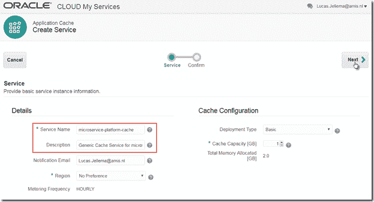

# 向 Oracle Cloud 上的 Node.js 应用程序添加跨实例、跨重启和跨应用程序缓存

> 原文：<https://medium.com/oracledevs/adding-a-cross-instance-cross-restarts-and-cross-application-cache-to-node-applications-on-oracle-53e4078632fb?source=collection_archive---------0----------------------->

在之前的帖子中，我描述了如何在简单的节点应用程序上从 Oracle 开发人员云到 Oracle 应用程序容器云进行持续集成和交付:[在 Oracle 开发人员云中自动构建和部署节点应用程序到应用程序容器云](https://technology.amis.nl/2017/08/11/automating-build-and-deployment-of-node-application-in-oracle-developer-cloud-to-application-container-cloud/)。在这篇文章中，我将扩展这个非常简单的应用程序，使其具有统计请求的功能。对于应用程序的每个 HTTP 请求，计数器都会递增，并且在响应中返回当前的计数器值。

最初的实现非常简单:节点应用程序包含一个全局变量，该变量随着处理的每个请求而增加。这很天真，因为:

*   多个实例同时运行，每个实例都有自己的计数；由于负载平衡，后续的请求由不同的实例处理，响应将显示出稍微不规则的请求计数器模式；请求总数未知:每个实例都是该实例的小计
*   当应用程序重启时——甚至是重启或添加单个实例时——每个相关实例的请求计数器都会被重置

此外，请求计数值在节点应用程序之外不可用，只能通过调用应用程序来检索，这反过来会增加计数。

一个更好的实现是使用缓存，由应用程序实例共享，并且在应用程序(实例)重启后仍然存在。如果我们允许的话，这也有可能使请求计数值对其他可以访问相同缓存的微服务可用。

这篇文章演示了如何在应用容器云服务上设置应用缓存，以及如何从节点应用中利用它。它表明请求计数器将跨实例共享，并且在重新部署和重新启动后仍然存在。

注意:在这个简单的例子中，仍然有一些小的竞争条件没有解决，因为读、更新和写不是作为原子操作执行的，也没有实现锁定。

这些步骤是:

*   为*问候*微服务增加请求计数功能
*   展示多个请求(由多个实例处理)和实例重启的缺点
*   实现应用程序缓存
*   为开发者云服务中的*问候*添加应用缓存服务绑定到 ACCS 部署配置文件
*   在*问候*微服务中利用应用缓存
*   重新部署*问候*微服务，并演示请求计数器是共享和保留的

本文来源于 GitHub:[https://github.com/lucasjellema/greeting](https://github.com/lucasjellema/greeting)。

# 向问候微服务添加请求计数功能

这个非常简单的 HTTP 请求处理程序用一个全局变量 *requestCounter* 进行了扩展，该变量为每个请求显示并递增:

不难证明多个请求(由多个实例处理)的缺点:

这里我们可以看到两个不同的实例(显然)是如何处理后续请求的，每个实例都有自己独立增加的计数。

应用程序重新启动后，计数回到开始。

# 配置应用程序缓存

要配置应用程序缓存，我们需要从 Oracle 应用程序容器云服务控制台进行操作。

指定详细信息—名称和可能的大小:

按“创建”,将创建缓存:

I got notified about its completion by email (picture on the right).

# 将应用程序缓存服务绑定添加到 ACCS 部署配置文件，以便在开发人员云服务中使用问候语

为了能够从 ACCS 上的应用程序内部访问缓存，应用程序需要绑定到缓存服务的服务。这可以在控制台中(手动)配置，也可以通过 REST API、psm cli 和 Developer Cloud Service 中部署配置中的部署描述符来配置。

通过 web 用户界面进行的手动配置如下所示:

## 或者通过服务绑定:

然后，我可以利用 psm 命令行界面来检查 ACCS 上的应用程序实例的 JSON 定义，从而了解如何使用应用程序缓存的服务绑定来编辑 deployment.json 文件。首先**设置 psm** :

并检查问候语应用程序:

> psm accs app -n 问候语-o 详细-的 json

要了解服务绑定的 JSON 定义:

现在我知道了如何在开发人员云服务的部署配置中更新部署描述符:

下次执行此部署时，将配置绑定到应用程序缓存的服务。

注意:必须提供访问应用程序缓存的凭证，是的，虽然听起来很可怕，但密码是明文的！

似乎不需要凭据。password 的值现在是 BogusPassword——这不是我的密码的真实值——并且仍然可以访问缓存。假设应用程序在正确的网络域内运行的事实使其有资格访问缓存。

服务绑定使应用程序可以使用以下环境变量——由 ACCS 平台在运行时填充:

# 在问候微服务中利用应用缓存

这里演示了利用服务绑定的环境变量的最简单方法(注意，这还没有实际使用缓存):

以及对请求的影响:

现在，通过 REST 调用与缓存进行实际交互，如下所述:[http://www . Oracle . com/web folder/tech network/tutorials/OBE/cloud/apaas/node/node-accs-caching-basic/node-accs-caching-basic . html](http://www.oracle.com/webfolder/technetwork/tutorials/obe/cloud/apaas/node/node-accs-caching-basic/node-accs-caching-basic.html)，我们将使用一个节点模块 node-rest-client。使用以下命令将该模块添加到应用程序

npm 安装节点-rest-客户端-保存

注意:这条指令将更新 package.json 并下载模块代码。只有更改后的 package.json 被提交给 git 存储库。当应用程序下一次构建在开发人员云服务中时，它将在将节点应用程序压缩到单个归档文件之前执行 *npm 安装*。 *npm install* 的动作确保 node-rest-client 的源代码被下载，并将被添加到部署到 ACCS 的 greeting.zip 文件中。

使用这个模块，app.js 文件被扩展为从应用程序缓存中读取和向应用程序缓存中写入。看到这里改变了代码[https://github.com/lucasjellema/greeting/blob/master/app.js](https://github.com/lucasjellema/greeting/blob/master/app.js):

# 重新部署问候微服务，并演示请求计数器是共享和保留的

当我们多次调用问候语服务时，我们看到一系列不断增加的计数值:

即使应用程序重新启动或重新部署，请求计数也会保留，当应用程序再次可用时，我们只需继续计数。

来自两个 ACCS 应用程序实例的日志提供了对所发生情况的洞察——负载平衡如何使这些实例间歇地处理请求——以及它们如何从缓存中读取彼此的结果。

# **资源**

本文来源于 GitHub:[https://github.com/lucasjellema/greeting](https://github.com/lucasjellema/greeting)。

Mike Lehmann 的博客文章，宣布了 ACCS 的缓存特性:[https://blogs . Oracle . com/developers/caching-with-Oracle-application-container-cloud](https://blogs.oracle.com/developers/caching-with-oracle-application-container-cloud)

关于 ACCS 缓存的文档:[https://docs . Oracle . com/en/cloud/PAAs/app-container-cloud/cache/getting-started-Caches . html](https://docs.oracle.com/en/cloud/paas/app-container-cloud/cache/getting-started-caches.html)

关于缓存支持 ACCS 上各种基于技术的应用的教程:[https://docs . Oracle . com/en/cloud/PAAs/app-container-cloud/create-sample-caching-applications . html](https://docs.oracle.com/en/cloud/paas/app-container-cloud/create-sample-caching-applications.html)

使用 Oracle 应用容器云服务中的缓存 REST API 创建 Node.js 应用的教程[http://www . Oracle . com/web folder/tech network/tutorials/OBE/Cloud/apaas/node/node-accs-Caching-basic/node-accs-Caching-basic . html # section 4](http://www.oracle.com/webfolder/technetwork/tutorials/obe/cloud/apaas/node/node-accs-caching-basic/node-accs-caching-basic.html)

缓存服务的公共 API 文档—[https://API catalog . Oracle cloud . com/ui/views/API collection/Oracle-public/Cache-app/v1](https://apicatalog.oraclecloud.com/ui/views/apicollection/oracle-public/cache-app/v1)

使用 psm 检索 ACCS 应用程序的部署详细信息:[https://docs . Oracle . com/en/cloud/PAAs/Java-cloud/PS CLI/accs-app . html](https://docs.oracle.com/en/cloud/paas/java-cloud/pscli/accs-app.html)(了解如何定义应用程序缓存引用)

*原载于 2017 年 8 月 12 日*[*technology . amis . nl*](https://technology.amis.nl/2017/08/12/adding-a-cross-instance-cross-restarts-and-cross-application-cache-to-node-applications-on-oracle-application-container-cloud/)*。*