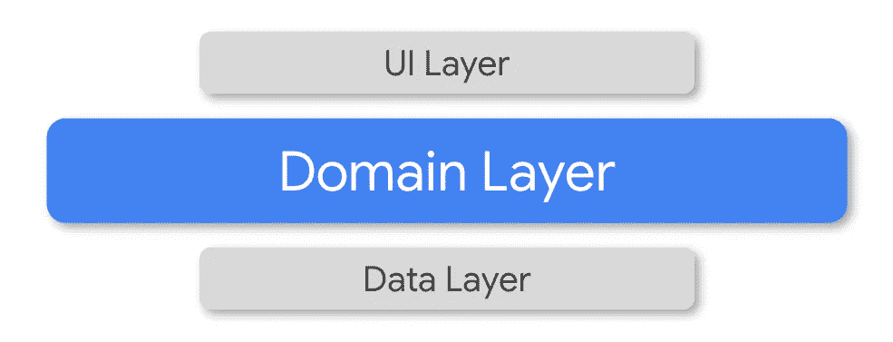
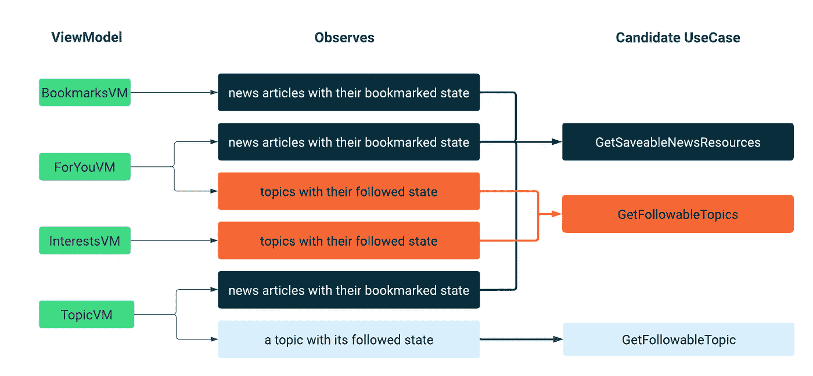
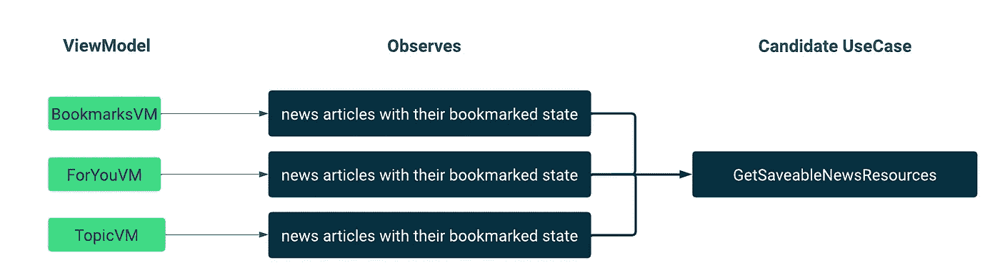
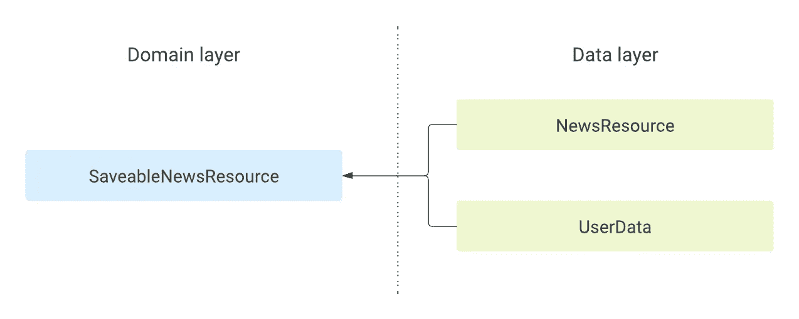

# 添加域层

> 原文：<https://medium.com/androiddevelopers/adding-a-domain-layer-bc5a708a96da?source=collection_archive---------0----------------------->

在本文中，我将解释我们如何在 Android 应用程序的[中添加](https://github.com/android/nowinandroid)[域层](https://developer.android.com/topic/architecture/domain-layer)，以提高可读性、可伸缩性和可移植性。

The domain layer sits between the UI and data layers

在 Android 应用程序架构中，领域层包含业务逻辑，即规定应用程序如何工作的规则。在本文的剩余部分，我将使用术语“逻辑”来指代“业务逻辑”，而不是“UI 逻辑”或任何其他形式的逻辑。

随着应用程序变得越来越复杂，引入域层是很常见的，并使用它来封装复杂的逻辑或被许多屏幕级状态持有者重用的逻辑，如视图模型。

本文所基于的拉取请求在这里是。我简化并重新命名了一些类名，以关注核心概念。

# 用例

领域层是通过将逻辑(通常来自 UI 层)移动到*用例*中来创建的。用例是包含逻辑的函数(或具有单一公共方法的类)。他们执行单一的操作，该操作通常组合或转换来自存储库或其他用例的数据。

本文中用例的[命名约定](https://en.wikipedia.org/wiki/Naming_convention_(programming))(以及 Android 应用中的 Now)遵循官方指南[:](https://developer.android.com/topic/architecture/domain-layer#conventions)

*   *现在时态的动词*例如`Get`
*   名词/什么例如:T1
*   `UseCase`后缀。

示例:`[GetFollowableTopicUseCase](https://github.com/android/nowinandroid/blob/56b3c1d0b950ed27051424ca6718743d7a3c6b97/core/domain/src/main/java/com/google/samples/apps/nowinandroid/core/domain/GetFollowableTopicsUseCase.kt)`

# 过程

以下是我们所用流程的概述:

*   识别视图模型中重复和复杂的逻辑
*   创建适当命名的用例
*   将逻辑移到用例中
*   重构视图模型以依赖用例而不是存储库
*   为用例添加测试

# 识别重复的逻辑并创建用例

下图显示了每个视图模型观察到的数据。“观察”列中的每个框代表逻辑，通常组合来自多个流的数据。每个方框代表一个用例的候选，相同颜色的方框表示重复的逻辑。

Diagram showing the logic contained by each ViewModel and use case candidates for that logic

为了可读性，图中省略了“用例”后缀。

# 将逻辑移到用例中

既然“命名事物”的困难部分已经完成，我们只需要将逻辑从每个视图模型移动到相关的`UseCase`中。让我们看一个例子。

观察新闻文章的逻辑在三种不同的视图模型中使用。

Diagram showing duplicate logic in three ViewModels being moved into a single use case

我们来看看`BookmarksViewModel`里面的这个逻辑:

事情是这样的:

1.  书签从`UserDataRepository`获得
2.  新闻资源(又名文章)从`NewsRepository`获得
3.  这两者结合起来创建一个书签新闻资源列表
4.  该列表经过过滤，只显示书签新闻资源

步骤 1–3 的逻辑对于所有其他视图模型都是通用的，因此可以移到名为`GetSaveableNewsResourcesUseCase`的新用例中。代码如下:

# 领域层模块和模型

用例存在于领域层，为了清楚地将这一层与我们代码库的其余部分分开，我们创建了一个`:domain`模块。由用例创建的类，通常是由于组合了来自多个存储库的数据模型，也被移到了`:domain`模块中。

一个很好的例子是`SaveableNewsResource`数据类，它是由`NewsRepository`提供的`NewsResource`和使用来自`UserDataRepository`的书签列表计算的`isSaved`属性组合而成的。

Diagram showing data layer classes (NewsResource and UserData) being combined into a domain layer class (SaveableNewsResource).

# 根据用例更新视图模型

现在我们已经创建了`GetSaveableNewsResourcesUseCase`，我们可以重构`BookmarksViewModel`来调用它。

ViewModel 现在更简单，更容易阅读。从构造函数中可以清楚地看到这个类在做什么——获取可保存的新闻资源，并且不需要中间的`bookmarks`变量来存储来自用户数据存储库的数据。

仍然有一些逻辑来过滤掉未加书签的新闻文章。我们可以将这个过滤逻辑转移到另一个用例(可能命名为`Get**Saved**NewsResourcesUseCase`)中，但是为一个对`filter`的调用创建一个全新的类可能不值得增加一个额外用例的复杂性。最终，由您决定将多少逻辑移入您的用例。

其他视图模型现在可以根据我们的用例进行重构。添加任何常见的逻辑，如返回给定主题或作者的新闻资源的能力。

# 摘要

我们对重复逻辑的每个区域重复了这个过程:

*   选择视图模型
*   将逻辑转移到用例中
*   重构其他视图模型以使用用例

当然，我们还[为每次使用 cas 添加了测试](https://github.com/search?l=&q=repo%3Aandroid%2Fnowinandroid+filename%3A%2AUseCaseTest.kt&type=code)，因为用例是简单的函数，所以非常容易测试！最终，通过添加领域层，我们的代码库更容易维护和扩展。

你可以在[架构学习之旅](https://github.com/android/nowinandroid/blob/main/docs/ArchitectureLearningJourney.md)中阅读更多关于 Android 中领域层的内容，在官方 Android 开发者网站上阅读更多[的深度指导。](https://developer.android.com/topic/architecture/domain-layer)