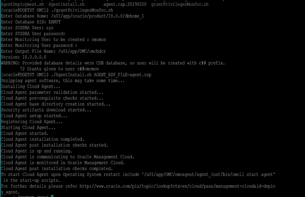
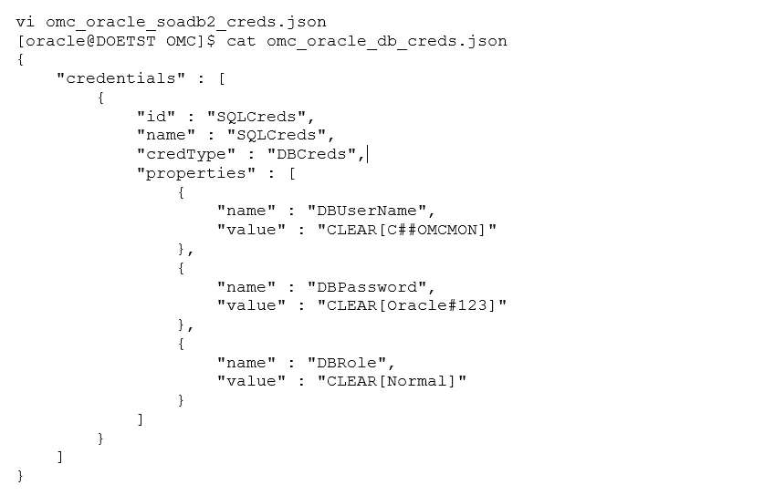
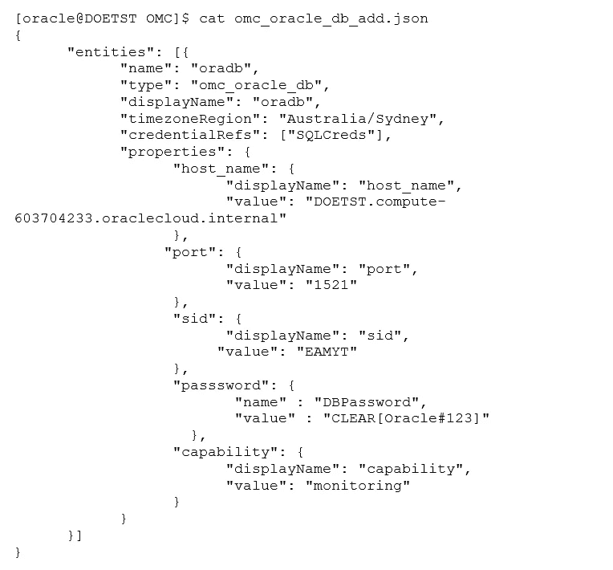

# 使用 JSON 方法向 Oracle 管理云添加实体

> 原文：<https://medium.com/oracledevs/adding-an-entity-to-oracle-management-cloud-with-json-method-59d3f841565d?source=collection_archive---------0----------------------->

## 作者:[mono war Mukul](https://medium.com/u/3757393c69bd?source=post_page-----59d3f841565d--------------------------------)(OCM)[NASS yam Basha](https://medium.com/u/ba3f0a72ff81?source=post_page-----59d3f841565d--------------------------------)(甲骨文王牌总监，OCM)

## **简介**

在之前的文章中，我们已经使用 Oracle Management Cloud 图形用户界面添加了实体，在本文中，我们将使用 JSON 方法添加数据库实体。将使用命令行实用程序 OMCLI 从目标服务器推送实体添加到 OMC，以便根据详细说明进行基础架构监控。最后，我们还将测试如何从 Oracle 管理云中删除实体。

## **先决条件**

无论是从 OMC GUI 还是使用 JSON push 方法添加实体，先决条件都是相同的。有关如何使用 OMC GUI 方法添加实体的更多详细信息，请参考文章“ [OMC:为 Oracle 基础架构监控发现实体—第二部分](/oracledevs/omc-discovering-entities-for-oracle-infrastructure-monitoring-part-ii-d3231a06fade)”。作为先决条件的一部分，我们需要创建数据库用户，或者我们可以使用默认的数据库用户" ***DBSNMP*** "要创建新用户，请执行预定义的脚本“***grantprivilegesmonsvc . sh***”，可从 MOS 文档 ID ***2401597.1*** 下载。该脚本将创建用户并授予必要的角色和权限。

```
$chmod 777 grantPrivilegesMonSvc.sh
$./grantPrivilegesMonSvc.sh
```

脚本完成后，我们可以看到用户已经创建了监控，然后我们可以继续安装代理，代理的安装已经在文章“ [Oracle 管理云—代理部署](/oracledevs/oracle-management-cloud-agent-deployment-24394dde017f)”中详细介绍过了



Creating monitoring user and assigning roles.

为了从 it 分析模块中获益，数据库用户只需运行脚本" *grantPrivilegesITA.sh* "就可以获得一些额外的角色

## **使用 JSON 添加数据库实体**

我们已经创建了用户 omcmon，并根据文档创建和授予了适当的角色和权限。现在我们将使用 JSON 方法添加数据库实体。要使用命令行添加实体，我们必须使用 OMCLI (Oracle 管理命令行界面)。使用 OMCLI 时，我们必须使用两个 JSON 文件 1)凭证 2)实体信息。我们将在下面看到实际步骤。

> ***注:我们将从目标服务器*** 添加实体

最初，我们必须准备 JSON 用来认证和注册 Oracle 管理云的凭证。在凭证 JSON 文件中我们必须输入数据库用户、密码和角色用户。



Credentials JSON file

下载 JSON 文件:[https://codepen.io/nassyambasha/pen/rRVPQW.html](https://codepen.io/nassyambasha/pen/rRVPQW.html)

接下来，我们将为数据库实体准备 JSON 文件；我们必须提到实体的配置，例如

*   实体名称
*   实体类型
*   显示名称
*   时区区域名称
*   主机名
*   港口
*   （同 suddenionosphericdisturbance）电离层的突然骚扰
*   监控密码



Entity JSON file

下载 JSON 文件:【https://codepen.io/nassyambasha/pen/rRVPQW.html 

准备好 JSON 文件后，我们将使用 OMCLI 和下面的命令添加实体。

```
[oracle@DOETST OMC]$ **omcli add_entity agent omc_oracle_db_add.json -credential_file omc_oracle_db_creds.json**
Oracle Management Cloud Agent
Copyright © 1996, 2018 Oracle Corporation. All rights reserved.
Operation Succeeded: Accepted 1 of 1 entities for processing.
```

添加实体后，我们可以通过传递实体 JSON 文件来查看实体的状态。

```
[oracle@DOETST OMC]$ **omcli status_entity agent omc_oracle_db_add.json**
Oracle Management Cloud Agent
Copyright © 1996, 2018 Oracle Corporation. All rights reserved.
omc_oracle_db.oradb : AGENT:entity successfully added — ( Entity count: 3 Validation checks: 2 warnings found )
omc_oracle_db_instance.oradb/EAMYT
omc_oracle_pdb.oradb/PDB1
```

在上面的输出中，如果添加实体失败，然后进行故障排除，我们可以使用相同的命令添加 verbose。

```
[oracle@DOETST OMC]$ **omcli status_entity agent omc_oracle_db_add.json -verbose**
Oracle Management Cloud Agent
Copyright © 1996, 2018 Oracle Corporation. All rights reserved.
omc_oracle_db.oradb : AGENT:entity successfully added — ( Entity count: 3 Validation checks: 2 warnings found )
omc_oracle_db_instance.oradb/EAMYT
omc_oracle_pdb.oradb/PDB1
Details:
Check 1 : Validate if parameter “Host Name (host_name)” is provided.
Status : SUCCESS
Check 2 : Validate if parameter “port” is provided.
Status : SUCCESS
Check 3 : Validate if parameter “sid or Service Name (service_name)” is provided.
Status : SUCCESS
Check 4 : Validate if parameter “protocol” is provided.
Status : SUCCESS
Check 5 : Validate if credential parameter “Username (DBUserName)” is provided.
Status : SUCCESS
Check 6 : Validate if credential parameter “Password (DBPassword)” is provided.
Status : SUCCESS
Check 7 : Validate if credential parameter “Database Role (DBRole)” is provided.
Status : SUCCESS
Check 8 : Validate if credential parameter “name” is provided.
Status : SUCCESS
Check 9 : Validate if credential parameter “credType” is provided.
Status : SUCCESS
Check 10: Validate database connectivity
Status : SUCCESS
Check 11: Version Compatibility Check
Status : SUCCESS
Check 12: Validate if the user “C##OMCMON” has required privileges and grants.
Status : WARNING
Issue : The following privileges have not been granted to “C##OMCMON”.
READ ON V_$RSRCPDBMETRIC_HISTORY
READ ON GV_$RSRCPDBMETRIC_HISTORY
READ ON GV_$CON_SYSMETRIC_HISTORY
READ ON V_$SYSTEM_PARAMETER
READ ON GV_$SYSTEM_PARAMETER
READ ON V_$CON_SYSMETRIC_HISTORY
Action : For details on how to grant the required privileges, follow instructions at[http://www.oracle.com/pls/topic/lookup?ctx=en/cloud/paas/management-cloud&id=im_prereq_omc_oracle_db](http://www.oracle.com/pls/topic/lookup?ctx=en/cloud/paas/management-cloud&id=im_prereq_omc_oracle_db)Check 13: Validate if the user “C##OMCMON” has required privileges and grants, in case if there is
plan to enable Enterprise Edition license.
Status : WARNING
Issue : The following privileges have not been granted to “C##OMCMON”.
SELECT ON V_$RSRC_CONSUMER_GROUP
SELECT ON DBA_HIST_SNAPSHOT
SELECT ON DBA_HIST_IC_CLIENT_STATS
SELECT ON GV_$RSRC_CONSUMER_GROUP
SELECT ON V_$SQL_PLAN
SELECT ON GV_$SQL_PLAN
SELECT ON DBA_HIST_PGASTAT
SELECT ON DBA_HIST_OSSTAT
SELECT ON DBA_HIST_SQLTEXT
SELECT ON GV_$SQLCOMMAND
SELECT ON DBA_HIST_SQLSTAT
SELECT ON DBA_HIST_SGA
SELECT ON DBA_HIST_SYS_TIME_MODEL
SELECT ON DBA_HIST_SYSMETRIC_HISTORY
SELECT ON DBA_HIST_DATABASE_INSTANCE
SELECT ON DBA_HIST_SYSSTAT
SELECT ON V_$SQL
SELECT ON DBA_HIST_SYSTEM_EVENT
SELECT ON DBA_HIST_SGASTAT
Action : If you plan on enabling Enterprise Edition on this database, you will need to add
additional privileges to the monitoring user “C##OMCMON”. See
[https://docs.oracle.com/pls/topic/lookup?ctx=en/cloud/paas/management-cloud&id=im_prereq_omc_oracle_db](https://docs.oracle.com/pls/topic/lookup?ctx=en/cloud/paas/management-cloud&id=im_prereq_omc_oracle_db)
for details.
Check 14: Perform entity discovery
**Status : SUCCESS
omc_oracle_db_instance.oradb/EAMYT
omc_oracle_pdb.oradb/PDB1**
```

我们可以看到该实体已成功添加到 OMC 中。类似地，要删除实体，我们可以使用类似的命令，改变属性“delete_entity”

```
[oracle@DOETST OMC]$ **omcli delete_entity agent omc_oracle_db_add.json**
Oracle Management Cloud Agent
Copyright © 1996, 2018 Oracle Corporation. All rights reserved.
Request for removing the entities was accepted for processing.
```

## **总结**

我们已经从先决条件开始了解了如何准备 JSON 文件，以便使用命令行实用程序 OMCLI 将实体添加到 Oracle management cloud for infra structure，包括故障排除。在本文中，关键部分是理解 JSON 文件，并在添加实体之前仔细使用正确的值。我们还看到了如何使用命令行实用程序 OMCLI 删除实体。

## **作者简介**

***Nassyam Basha*** 是数据库管理员。他有大约十年的 Oracle 数据库管理员工作经验，目前是 eprosed KSA 公司的数据库专家。他拥有马德拉斯大学的计算机应用硕士学位。他是 Oracle 11g 认证大师和 Oracle ACE 总监。他以超级英雄的身份积极参与甲骨文相关论坛，如 OTN，甲骨文支持被授予“大师”称号，并担任 OTN 版主，与 OTN 一起撰写了大量关于 Toad World 的文章。他维护着一个与甲骨文技术相关的博客，[www.oracle-ckpt.com](http://www.oracle-ckpt.com/)，可以通过[https://www.linkedin.com/in/nassyambasha/](https://www.linkedin.com/in/nassyambasha/)找到他

***Monowar Mukul*** 目前担任首席 Oracle 数据库专家。我是 Oracle 认证大师(Oracle 12c 认证大师管理、Oracle 12c 认证大师 MAA 和 Oracle 11g 认证大师管理)。他在 Oracle MAA 空间担任了 17 年的 Oracle 数据库管理员顾问，负责数据库云服务器和非数据库云服务器系统、Oracle 云空间和 SOA 中间件。他曾在澳大利亚的多个商业领域工作，包括高等教育、能源、政府、采矿和运输。作为一名首席 Oracle 数据库专家，他展示了高度发展的批判性思维和分析技能。你可以在 https://www.linkedin.com/in/monowarmukul/[找到更多关于他和他的工作成就的细节](https://www.linkedin.com/in/monowarmukul/)

## **参考文献**

*为 Oracle 管理云创建 Oracle 数据库监控凭据(基础架构监控)(文档 ID 2401597.1)*

[](https://docs.oracle.com/en/cloud/paas/management-cloud/moncs/entity-monitoring-prerequisites-and-credentials.html#GUID-8E6F21D8-2391-4F6E-8E91-11D24E003F7C) [## 使用 Oracle 基础架构监控

### 您仍然可以创建一个单独的监视帐户，并使用…授予它一组最少的权限

docs.oracle.com](https://docs.oracle.com/en/cloud/paas/management-cloud/moncs/entity-monitoring-prerequisites-and-credentials.html#GUID-8E6F21D8-2391-4F6E-8E91-11D24E003F7C)