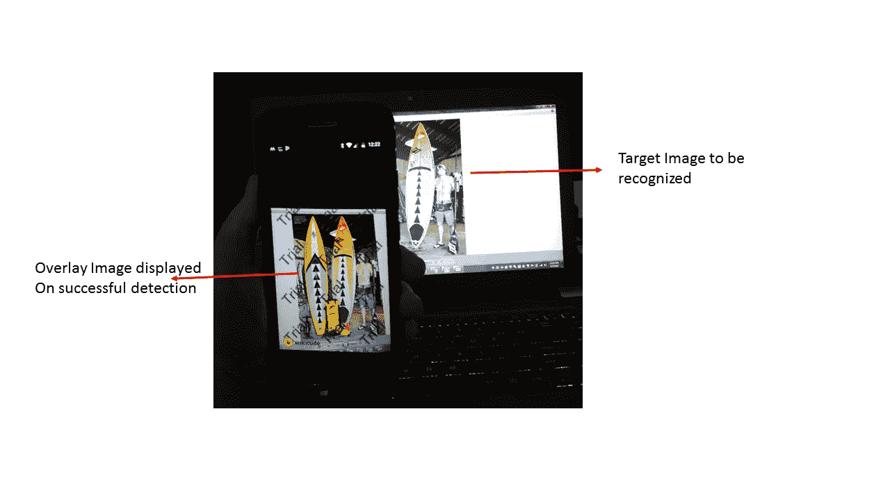
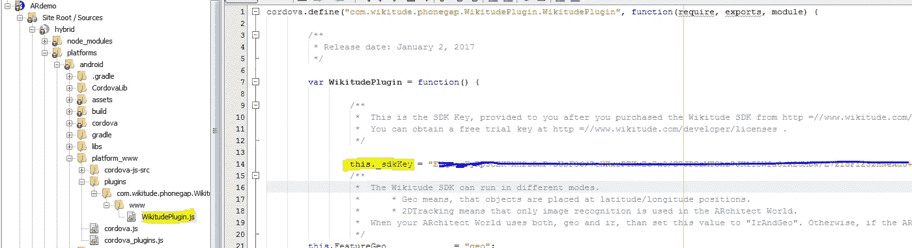
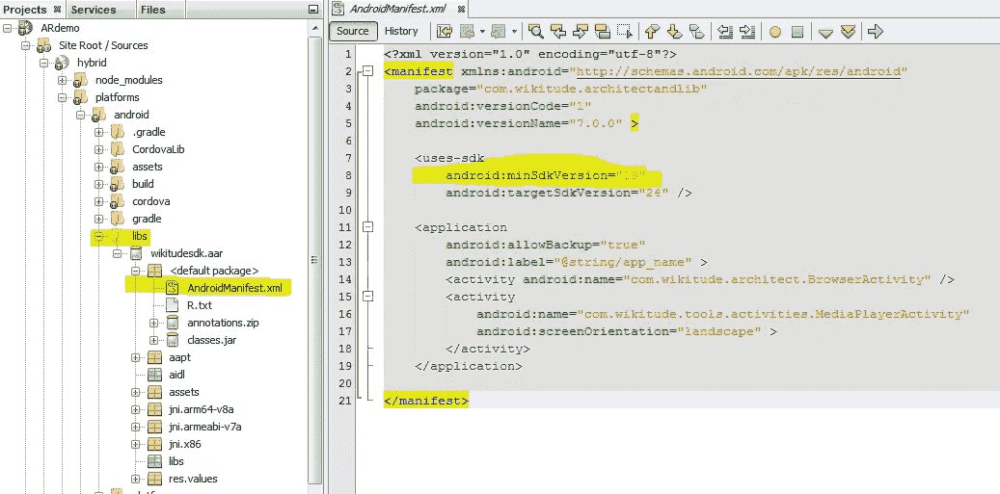
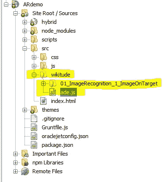

# 使用 Wikitude SDK 向 Oracle JET Mobile 添加增强现实

> 原文：<https://medium.com/oracledevs/adding-augmented-reality-to-oracle-jet-mobile-using-wikitude-sdk-65ec2b9de842?source=collection_archive---------1----------------------->

这个博客旨在帮助你使用 [Oracle JET](http://www.oracle.com/webfolder/technetwork/jet/index.html) 和 [Wikitude SDK 的 cordova 插件](https://www.wikitude.com/external/doc/documentation/latest/phonegap/gettingstartedphonegap.html)构建你的第一个增强现实移动应用

使用 Wikitude cordova 插件，我们可以将增强现实视图嵌入到 JET 混合移动应用程序中，以开发包括图像识别和跟踪在内的全功能增强现实应用程序。

在这篇博客中，我将把 Wikitude 提供的[图像识别示例](https://github.com/Wikitude/wikitude-sdk-samples/tree/master/01_ImageRecognition_1_ImageOnTarget)合并到我们的 JET 移动应用程序中，以展示图像跟踪 AR 功能。使用这个应用程序，我们将能够从图像集合中识别出一个图像，并显示一个叠加图像。



Image recognition

**项目设置**
[用于](https://github.com/oracle/generator-oraclejet) [Oracle JET](http://www.oracle.com/webfolder/technetwork/jet/index.html) 的 Yeoman generator 可让您快速设置一个项目，用作 Android 和 iOS 的 Web 应用程序或移动混合应用程序。使用以下命令为 Android 生成混合应用程序:

```
yo oraclejet:hybrid ARdemo --template=navbar --platforms=android
```

基于 *navbar* 模板的原生混合应用程序代码将被放置在“ **ARdemo** 文件夹中。更多脚手架选项，请参考[此处](https://docs.oracle.com/middleware/jet320/jet/developer/GUID-C75CD8DC-5084-4831-BE1A-FFEE4EA8600C.htm#GUID-02F219FA-3060-4949-9755-5363F2BC9D9D)

**添加 Wikitude Cordova 插件**

一旦上面的命令成功，这意味着你的应用程序准备好了。换到你的新应用目录 app，进入 **hybrid** 文件夹，添加 Wikitude cordova 插件:

下载 [Wikitude cordova 插件](https://cdn.wikitude.com/extensions/phonegap/wikitude-cordova-plugin-7.0.0-3.5.2.zip)，注册激活 Wikitude SDK(试用许可)

提取。zip 文件并添加 cordova 插件:

```
cordova plugin add *your_path:*\wikitude-cordova-plugin-7.0.0–3.5.2
```

**设置配置**

从 [Wikitude 许可证页面](http://www.wikitude.com/developer/licenses)下载您的许可证密钥


Wikitude license page

确保他们正确键入( *this。_sdkKey* )在构建 android 时设置在*平台/Android/platform _ www/plugins/com . wiki tude . phonegap . wiki tude plugin/www/wiki tude plugin . js*文件内。更多详情，请参见此[页](https://www.wikitude.com/external/doc/documentation/latest/phonegap/triallicense.html#cordova-plugin)



Update Key value

更新*在 hybrid \ platforms \ Android \ androidmanifest . XML 中使用-sdk android:minSdkVersion* 到 **19** ，如 Wikitude 库中所声明的



AndroidManifest.xml in wikitude library

接下来，下载 [wikitude 示例](https://github.com/Wikitude/wikitude-sdk-samples)，并复制

I)*01 _ image recognition _ 1 _ imageon target*目录 **src\wikitude** 中的样本 ii)从 samples 文件夹中复制 *ade.js* 并粘贴到 **src\wikitude** 文件夹中



Folder heirarchy

**实施步骤**

我们将在 appcontroller.js 文件中添加我们的代码，下面是实现步骤

I)创建 Wikitude 插件的一个实例

ii)创建插件后，首先要做的是检查您的设备是否能够运行增强现实体验

iii)对于此应用程序，我们要求图像识别只有经验，所以添加自我。*required features =[" image _ tracking "]*

iv)在成功回调中，我们加载了增强现实体验。

我们将在点击 *dashboard.js、*中的按钮时调用 AR 功能，如下所示

**在 Android 设备上构建并运行应用程序**
在您的命令提示符下，请将目录更改为项目文件夹

使用以下命令构建应用程序:
***grunt build—platform = Android***

一旦构建成功，则使用以下命令运行应用程序:
***grunt serve—platform = Android—disable livereload = true***

**演示输出:**

为了测试这个演示，请在这里下载[提供的图像集。扫描目标图像](https://www.wikitude.com/external/doc/documentation/latest/phonegap/images/wikitude_sample_app_target_images.zip)

Oracle JET Image Recognition app built using Wikitude Cordova Plugin

> *本文表达的观点仅代表我个人，不一定代表甲骨文的观点。*