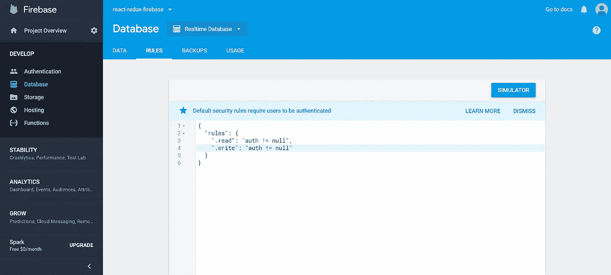

# 向 React Redux Firebase 应用程序添加身份验证

> 原文：<https://medium.com/quick-code/adding-authentication-to-react-redux-firebase-app-f0efcb1c519a?source=collection_archive---------0----------------------->

Photo by [Micah Williams](https://unsplash.com/photos/lmFJOx7hPc4?utm_source=unsplash&utm_medium=referral&utm_content=creditCopyText) on [Unsplash](https://unsplash.com/?utm_source=unsplash&utm_medium=referral&utm_content=creditCopyText)

在[这篇文章](/quick-code/how-to-integrate-react-redux-and-firebase-in-3-simple-steps-c44804a6af38)中，我们学习了关于 React Redux 和 Firebase 集成的基础知识，并以工作待办应用程序结束。在本文中，我们将采用它并为其添加身份验证。为此，我们需要执行以下步骤:

*   添加登录组件
*   为验证状态、登录和注销添加监听程序
*   在 Redux 中跟踪验证状态
*   确保用户只有在登录后才能访问应用程序
*   在 firebase 控制台中更改数据库规则

## 添加登录组件

该组件将处理两件事:

1.  它将有一个按钮，当用户点击它，他将使用谷歌 OAuth 登录。
2.  如果用户已经登录，它会将用户重定向到应用程序

*渲染*负责**点 1** 而*组件将更新*负责**点 2** 。你也可以从 [best React native 课程](https://blog.coursesity.com/free-react-native-courses/)中学习。

## 正在为验证状态添加监听程序

这里我们需要 3 个函数。一个监听用户登录或注销。一个用于实际登录用户，另一个用于注销用户。我们需要在 Firebase 配置中创建新的引用，然后用它来添加这些函数。

`signIn`和`signOut`只是改变用户的状态。当状态改变时，fetchUser 将得到通知，并更新 redux 存储。如果用户登录，它将使用用户对象更新它。如果用户退出，它会用`null`更新。现在我们需要实际跟踪存储中的身份验证状态

## 添加受保护的路由

我们需要确定一件事。当用户未被认证时。并试图访问私有路由。那么他或她应该被重定向到登录。我们可以用高阶元件来实现这一点。该组件将简单地接受另一个组件，并在用户通过身份验证时呈现它。如果没有，它将重定向到登录页面。

## 在 Redux 中跟踪身份验证状态

我们只需要添加新的 reducer 来处理 auth 状态，然后将其添加到`combineReducers`。

## 在 Firebase 中更改数据库规则

现在，当我们将身份验证添加到我们的应用程序中时，改变数据库的规则将是一件好事。规则会说，只有登录的用户才能访问它。要改变它，去你的 Firebase 控制台，并设置为这张图片。

Database rules in firebase

## 总结

就是这样。没用多长时间。我们在几分钟内就让 Google OAuth 开始工作了。现在，我们的应用程序已经过身份验证并受到保护。现在，用户可以登录、创建新任务并完成它们。源代码可以在 [GitHub](https://github.com/codewithbernard/react-redux-firebase) 获得。随意克隆它，扩展它，玩它。如果你有任何问题，不要犹豫，问。如果你喜欢这个故事，请随意鼓掌。感谢您的时间，下次再见。