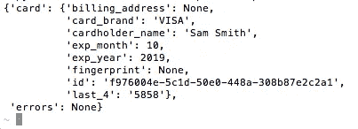

# 使用 Python 在文件细节上添加卡片

> 原文：<https://medium.com/square-corner-blog/adding-card-on-file-details-with-python-4bc827dbf62?source=collection_archive---------6----------------------->

## 将客户的信用卡附在 Square 个人资料上是设置定期付款的一个重要部分。下面是如何用 Python 实现的。

> 注意，我们已经行动了！如果您想继续了解 Square 的最新技术内容，请访问我们在 https://developer.squareup.com/blog[的新家](https://developer.squareup.com/blog)

在本帖中，我们将使用`[CustomerCard](https://docs.connect.squareup.com/api/connect/v2#endpoint-createcustomercard)`端点向客户添加一张卡，然后您可以使用该卡在线或亲自进行订阅计费。但是请记住，没有客户的明确许可，您不应该将存档的卡链接到客户。例如，您可以在您的购买流程中包括一个复选框(默认情况下未选中)，客户可以选中该复选框来指定他们希望保存他们的卡信息以供将来购买。

## 设置

首先，你需要一个 Square 账户，一个 Square 开发者门户中的应用程序，当然，至少要有一个用户可以把卡挂在上面。您可以在 https://squareup.com/developers[的](https://squareup.com/developers)创建您的 Square 帐户，在 https://connect.squareup.com/apps[的](https://connect.squareup.com/apps)创建您的开发者应用程序，要[创建您的客户](https://docs.connect.squareup.com/api/connect/v2#endpoint-createcustomer)，您可以使用 [Square 销售点应用程序](https://squareup.com/help/us/en/article/5532-manage-your-customer-directory-from-the-square-app)或使用 API 在您的客户目录中创建客户。

## 将卡附在文件上

在文件中添加卡与电子商务交易中向卡收费非常相似。您必须使用`[sqpaymentform](https://docs.connect.squareup.com/payments/sqpaymentform/sqpaymentform-overview)`生成一个 card nonce，然后将其传递给 [CreateCustomerCard](https://docs.connect.squareup.com/api/connect/v2#endpoint-createcustomercard) 端点。由于支付表单必须嵌入到不同的面向客户端的页面中，并且附加客户卡的 REST 请求将隐藏在服务器端，所以这个示例将只使用硬编码的测试随机数。让我们看看代码:

在这里，您可以看到代码首先初始化了 [Square Python SDK](https://github.com/square/connect-python-sdk) ，并导入了一些有用的信息，比如 CustomersAPI 和创建客户卡请求的模型。然后，您需要设置访问令牌。我推荐使用沙盒访问令牌，这样您就可以使用假的卡 nonce，在本例中也是硬编码的。

当实际创建`CustomerCard`时，代码使用上面导入的模型，附加 card nonce，以及虚构的`cardholder_name`。您也可以选择添加一个`billing_address`，但这不是必需的。

## 结果呢

您可以使用命令链接`python createCustomerCard.py`(或者您决定命名的任何名称)直接从命令行运行这个代码片段。如果一切顺利，当您的客户卡详细信息打印在屏幕上时，您应该会看到如下内容。

现在，您可以使用该卡亲自或在线进行卡上购物，以满足您的付款需求！

感谢阅读。如果你有任何问题、评论、担忧或激动，欢迎在下面评论这篇文章，或者通过 [Twitter](https://twitter.com/SquareDev) 联系我们。