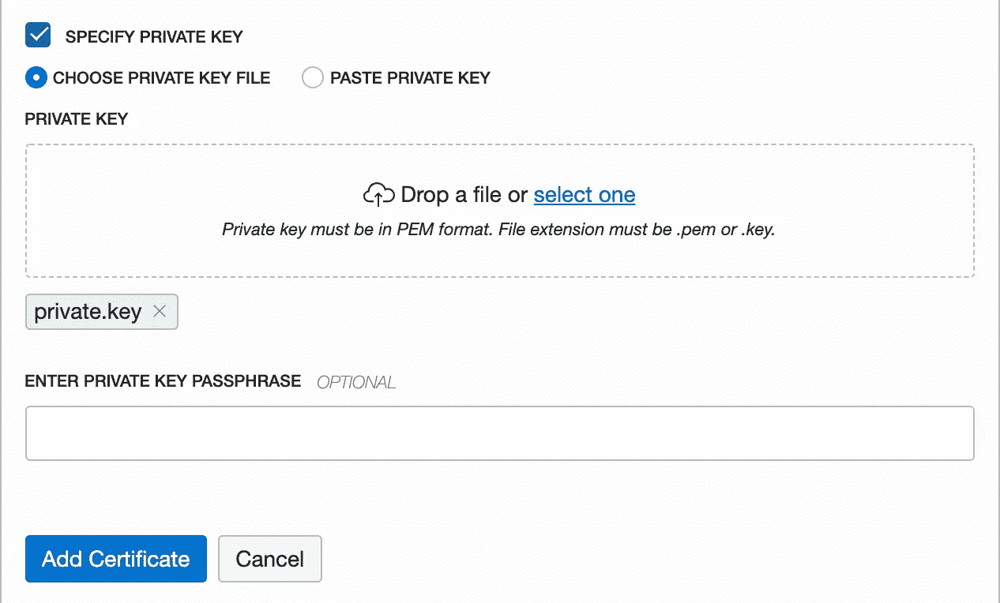

# 4.增加 HTTPS 对 OCI 的支持

> 原文：<https://medium.com/oracledevs/adding-https-support-to-oci-a96f6e7213f?source=collection_archive---------0----------------------->


Image courtesy of Shutterstock.com

在本系列的前几篇文章中，我们创建了一个网站，然后学习了如何在服务器重启时自动启动它，以及如何根据需要扩展它。到目前为止，web 服务器只使用 HTTP 作为它的协议。我们希望增加 HTTPS 支持，这样我们最终能够让用户安全地登录到网站。

在本文中，我们将执行以下步骤:

1.  创建一个 web 服务器来支持在端口 8080 上传输静态文件
2.  配置负载平衡器以支持 web 流量
3.  注册一个 DNS 名称，并将其指向我们的负载平衡器
4.  从证书颁发机构注册 SSL 证书
5.  配置负载平衡器以支持 HTTPS

> **先决条件**
> 您需要注册一个域名，并能够编辑该域名的 DNS 记录，以便更改相关的 IP 地址。你可以向大多数虚拟主机提供商注册一个新域名。
> 您还需要完成本系列的前三篇文章，并且**而不是**已经删除了您在第三篇文章中创建的服务器和负载均衡器。
> [第 1 篇—OCI 入门](/oracledevs/getting-started-with-oracle-cloud-infrastructure-6b048dad480c)，
> [第 2 篇—自动启动您的 Web 服务器](/oracledevs/automatically-starting-your-web-server-2b7b793dfcb4)，
> [第 3 篇—扩展您的 OCI Web 服务器](/oracledevs/scaling-your-oci-web-server-203895180102)。

为了节省一些现金，并保持试用帐户的精神，我们将从[SSLforFree.com](https://www.sslforfree.com/)那里获得我们的 SSL 证书。为了验证我们对 SSLforFree.com 域名的所有权，我们需要能够在端口 80 上发布“验证”文件。

# 创建我们的静态文件 Web 服务器

我们将创建第二台 web 服务器来处理端口 8080 上对静态文件的请求(sslforfree.com 用于验证您对主机的所有权)。如果您已经拥有负载平衡器的有效 SSL 证书，请随意跳到最后一步 ***配置您的负载平衡器以使用 HTTPS*** 。

> **为什么是 8080 端口？如果我们让 web 服务器监听端口 80，我们必须以 root 用户的身份启动它们。这通常被认为是不安全的。我们将在端口 8080 上运行我们的服务器，然后让负载平衡器将流量从端口 80 转发到端口 8080。**

## 创建新的 Node.js 项目

打开一个命令行，导航到本地计算机上要创建新节点应用程序的文件夹/目录。我将 mine 命名为 ***staticServer*** ，因此在我用来存储所有节点项目的主目录中，我键入:

```
mkdir staticServer
cd staticServer
npm init
```

在本地机器上的 staticServer 文件夹中，创建 ***index.js*** 文件，并赋予其以下内容:

```
const http = require('http');
const fs = require('fs');
hostname = '0.0.0.0';
const port = 8080;const server = http.createServer((req, res) => {
   var currentDate = new Date();
   var utcDate = currentDate.toUTCString();
   var absURL = '/home/opc/staticServer' + req.url; if(req.method === 'GET') {
      // This is a request to get a file.
      console.log('GET ' + req.url + ' : ' + utcDate);
      // Is this a health check?
      if (req.url === '/healthcheck') {
         // Yes, this is a health check. Report that we are healthy
         res.statusCode = 200;
         res.setHeader('Content-Type', 'text/plain');
         res.end("Healthy\n");
      } else if (fs.existsSync(absURL) && !fs.lstatSync(absURL).isDirectory()) {
         // This is a request for a static file
         console.log('GET ' + absURL + ' : exists!');
         res.statusCode = 200;
         res.setHeader('Content-Type', 'text/plain');
         // Open the file and read it synchronously
         var contents = fs.readFileSync('/home/opc/staticServer' + req.url, 'utf8');
         res.write(contents);
         res.end("\n");
      } else {
         // This is a request for a file that doesn't exist or
         // a directory. We don't support such requests
         console.log('ILLEGAL REQUEST: ' + req.method + ' ' + absURL);
         res.statusCode = 403;
         res.end('FORBIDDEN\n');
      }
   } else {
      // This is an unknown / unsupported request
      console.log('UNKNOWN REQUEST: ' + req.method + ' ' + req.url);
      res.statusCode = 400;
      res.end('Unknown request\n');
   }
});server.listen(port, hostname, () => {
   console.log(`Server running at [http://${hostname}:${port}/`);](/${hostname}:${port}/`);)
});
```

现在使用 ***scp*** 将您的本地 ***staticServer/*** 文件夹复制到您的两个计算实例上:

```
scp -r -i *~/oci_key* ~/Downloads/nodeWorkspace/staticServer  [*opc*@](mailto:opc@129.213.52.76)<your IP address>:/home/opc
```

## 为端口 8080 添加无状态入口规则

现在，我们需要允许流量通过端口 8080 到达我们的 web 服务器。为此，我们需要创建一个新的无状态入口规则，该规则将向任何 IP 地址开放端口 8080。为此，使用汉堡菜单导航至 ***联网- >虚拟云网络*** ，并在虚拟云网络列表中点击您的 VCN。在 ***资源*** 部分下，单击 ***安全列表*** 链接，然后单击您的 VCN 的默认安全列表(如果您一直在关注本系列文章，您应该只会看到 1 个安全列表)。点击蓝色 ***添加入口规则*** 按钮，添加一个新的无状态入口规则，如下图所示。


## 在防火墙中打开端口 8080

您将需要在 ***的防火墙中打开每个*** 的 web 服务器实例的 8080 端口。SSH 到您的每个 web 服务器实例，并执行以下命令:

```
sudo firewall-cmd --permanent --add-port=8080/tcp
sudo firewall-cmd --reload
```

一旦你完成了这些步骤，你就准备好继续前进了。

# 为 Web 流量配置负载平衡器

现在我们需要配置我们的负载平衡器来支持端口 80 上的 web 流量，并将该流量转发到我们的两个 web 服务器实例上的端口 8080。

## 为我们的静态 Web 服务器创建一个后端集

我们为静态文件 web 服务器编写的代码监听端口 8080。我们需要创建一个后端集，专门列出这两台服务器。我们的侦听器(在下一步中创建)将使用这个后端集来路由它在端口 80 上获得的流量。这是在 OCI 环境中进行端口转发的一种方式。点击蓝色 ***创建后台设置*** 按钮即可开始。


将后端集命名为 ***http8080*** (我确实喜欢简单、明确的名称)。接受 ***流量分配策略*** 和 ***会话持久性*** 的默认值。在此向导中向下滚动以访问下半部分。


现在，您可以为后端配置运行状况检查。将 ***协议*** 设置为 ***HTTP*** ，将 ***端口*** 设置为 ***8080*** 。将 ***间隔*** 设置为 ***100000*** (100 秒，或者你喜欢的任何合理值)。重试次数*为 ***3*** (该值的一般经验法则)。将 ***状态码*** 设置为 ***200*** ，并将 ***URL 路径*** 设置为 ***/healthcheck*** ，因为这是我们的服务器正在监听的 URL。最后，将 ***响应体正则表达式*** 设置为 ***健康*** 。准备好后按下 ***创建*** 按钮。*

**

*请稍等片刻，等待新的后端集创建完成。一旦它出现在后端集列表中，您就可以继续操作了。*

*既然您的后端集已经创建，我们需要为它分配后端。点击您新创建的 ***http8080*** 后端集，向下滚动 ***资源*** 部分。点击*链接。**

****

**点击 ***添加后端*** 按钮。**

****

**选择列出的两个 web 服务器，并分别将它们的 ***端口*** 设置为 ***8080*** 。将 ***webserver2*** 的 ***权重*** 设置为 ***2*** ，因为它是一个更强的实例。接受其余的默认设置，滚动到底部点击蓝色的 ***添加*** 按钮。**

****

## **在端口 80 上创建一个监听器**

**我们将修改现有的负载平衡器，使其也监听端口 80。SSL 使用端口 443，但作为我们设置的一部分，我们需要向 web 流量开放端口 80，以便我们可以向 SSLforFree.com 验证我们拥有我们正在请求证书的服务器。**

**使用页面左侧的资源菜单单击 ***监听器*** 链接。然后点击 ***创建监听器*** 按钮开始。**

****

**将新的监听器命名为 ***listener80*** ，并接受默认的协议和端口。选择 ***http8080*** 后端设置并按下 ***创建*** 按钮。**

****

## **为端口 80 创建入口规则**

**现在，我们需要允许流量到达端口 80 上的负载平衡器。为此，我们需要创建一个新的无状态入口规则，该规则将向任何 IP 地址开放端口 80。为此，使用汉堡菜单导航至 ***联网- >虚拟云网络*** ，并在虚拟云网络列表中点击您的 VCN。在 ***资源*** 部分下，单击 ***安全列表*** 链接，然后单击您的 VCN 的默认安全列表(如果您一直在关注本系列文章，您应该只会看到 1 个安全列表)。点击蓝色 ***添加入口规则*** 按钮，添加一个新的无状态入口规则，如下图所示。**

****

## **测试静态文件服务器**

**在继续之前，让我们确保新的监听器工作正常。打开两个 SSH 控制台，每个控制台对应一个计算实例(webserver1 和 webserver2)。在每个 SSH 控制台上，执行以下命令:**

```
**cd /home/opc/staticServer
node index.js &**
```

**这将启动静态内容 web 服务器。现在回到你的网络浏览器，看看下面的网址**

```
**http:<your load balancer IP>/sample.txt**
```

**您应该会在浏览器窗口中看到 sample.txt 文件的内容。**

****

# **注册一个 DNS 名称**

**虽然有可能为一个 IP 地址获得一个 SSL 证书，但在现实世界中这是不可能的。通常，我们需要一个域名证书。您将需要一个注册的域名，您可以修改其 DNS 记录以将该名称指向您的负载平衡器。我已经注册了 jeffdavies.org 域名，所以我只是进入我的托管服务提供商，编辑该域名的 DNS 记录，以指向我的负载平衡器。请注意，当您编辑域名记录时，可能需要几个小时才能看到效果。**

**注册 DNS 名称并指向负载平衡器的 IP 地址后，您可以在浏览器中使用以下 URL 对其进行测试:**

```
**http://<your DNS>/sample.txt**
```

****

# **注册 SSL 证书**

**现在我们准备取得一些重大进展。到目前为止，所有的工作主要集中在能够提供 SSLforFree.com(或您正在使用的任何 SSL 提供商)所需的一些静态文件，以验证我们拥有注册 SSL 证书的域名和服务器。它通过给我们一些静态文件放在我们的 web 服务器上来执行验证，这些文件应该可以通过端口 80 使用我们的域名获得。**

> **免责声明 :
> 我不支持或认可 SSLforFree.com。我只是在使用它，因为它是最先满足我需求的网站之一，并且在我的搜索引擎中出现得较早。**

**前往 SSLforFree.com，在文本栏上输入你的域名。**

****

**点击绿色按钮，你会看到 3 种不同的方法来验证你的域名和服务器的所有权。**

****

**我本可以选择手动验证(DNS)方法，但是这有什么意思呢？在使用 OCI 时，为静态文件创建一个临时 web 服务器更有指导意义！**

**点击 ***中间的*** 手动验证按钮。现在事情变得有点复杂，我在这里的作用不是记录如何使用 SSLforFree.com，所以让我总结一下您需要经历的过程:**

*   **下载手动验证文件**
*   **将它们复制到 SSLforFree.com 说明页中命名的目录结构中**
*   **像前面一样，使用 scp 命令更新 2 个 web 服务器实例上的文件。**
*   **按下 SSLforFree.com 的“验证”按钮来验证您的文件。**
*   **从 SSLforFree.com 下载所有 SSL 证书(证书、私钥和 CA 包)。这将作为 ***sslforfree.zip*** 下载到您的浏览器中。**
*   **解压缩***SSL forfree . zip***文件，这样您就可以看到它包含的 3 个证书。**

# **将负载平衡器配置为使用 HTTPS**

**将负载平衡器配置为使用 HTTPS 非常快，但如果您是 OCI 的新手，这不一定直观。不过，这个过程很简单，我现在就来带您了解一下。**

## **添加入口规则**

**添加允许所有 IP 地址连接到端口 443 的入口规则，如下所示:**

****

**Open port 443 in our security list**

## **添加主机名**

**现在导航到负载平衡器的仪表板页面。在左侧 ***资源*** 标题下，点击 ***主机名*** 链接。为您的域创建一个 ***主机名*** 条目。我设置了 ***名称*** 和 ***主机名*** 字段来匹配我的域名。**

****

## **添加证书**

**同样位于 ***资源*** 栏目下的页面是一个 ***证书*** 链接。创建新证书。在你从 SSLforFree.com 下载的 ZIP 文件中有 3 个证书文件。您将在此对话框中使用它们。将证书命名为 ***SSL*** 并将***certificate . CRT***文件拖放到第一个下拉框中。勾选 ***指定 CA 证书*** 复选框，将***CA _ bundle . CRT***文件拖拽到第二个拖拽框中。**

****

**最后，选中 ***指定私钥*** 复选框，将 ***private.key*** 文件拖放到第三个下拉框中。点击底部的蓝色 ***添加证书*** 按钮完成该过程。**

****

**现在我们准备添加我们的 HTTPS 听众！在 ***资源*** 部分下点击 ***监听器*** 链接，创建一个新的监听器。将侦听器命名为 HTTPS，并选择您刚才创建的主机名。选中 ***使用 SSL*** 复选框，并且 ***端口*** 字段应自动更改为 443。对于后端集，选择侦听端口 3000 的集，而不是侦听端口 8080 的集！为什么？因为我们安装在端口 8080 上的 web 服务器只是为了帮助我们验证 SSLforFree.com 对该域的所有权而创建的，出于安全原因，我们将很快删除它。**

****

**点击底部蓝色的 ***创建*** 按钮创建监听器。**

## **测试 HTTPS**

**测试服务器非常简单。打开浏览器窗口以:**

```
**https://<yourdomain name>**
```

**您将看到显示的 ***健康*** 消息。注意地址栏中的小锁图标，确认 HTTPS 正在使用中。**

****

# **安全，安全，安全**

**现在，我们已经安装了 HTTPS，并且运行良好。然而，我们仍然有一些清理工作要做。那些在端口 8080 上运行的服务器是一个安全隐患。我们不需要他们运行，他们是一个安全风险，因为他们会盲目地提供你要求的任何文件。它们可能都以位置***/home/OPC/static server***为前缀，但是我不认为黑客会使用一些文件路径欺骗来找到解决方法。最好是我们关闭整个服务器，只在端口 3000 上运行 web 服务器。**

**打开到每个计算机实例的 SSH 连接，并停止每个 web 服务器。有很多方法可以做到这一点，但是我建议使用 ***ps*** 命令来查看每个实例中运行在 8080 上的服务器的进程 id，然后使用 ***kill*** 命令来停止该进程。以下是我使用的一些命令示例:**

```
**ps -aux | grep node**
```

**这在我的一台服务器上返回了以下响应:**

****

**由此我可以看出我需要杀死的进程的 ID 为 15093(运行 ***节点 index.js*** 的那个来自 ***opc*** 用户)。所以我把它插入命令行:**

```
**kill 15093**
```

**这将结束实例上的 web 服务器。现在我们需要去掉端口 80 上的监听器，它将信息路由到那些(现在已经不存在的)web 服务器。导航到您的负载平衡器并删除端口 80 的监听器。**

****

**同样，删除为 ***http8080*** 设置的后端。**

****

**最后，不需要允许直接访问运行在端口 3000 上的 web 服务器。所以我们也可以删除那个监听器。**

****

**请记住，我们还在每个计算机实例的防火墙中打开了端口 8080。是时候堵住我们防火墙的漏洞了。SSH 到每个实例，并执行以下命令:**

```
**sudo firewall-cmd --permanent --remove-port=8080/tcpsudo firewall-cmd --reload**
```

**此外，在安全列表中，删除允许访问端口 8080 的规则。然而，在您的 VCN 的安全列表页面中，编辑端口 3000 的入口规则。将源 CIDR 地址设置为您的负载均衡器的 IP 地址，并附加“ ***/32*** ”。这将锁定端口 3000，以便只有负载平衡器可以访问它。我们不需要从外部直接访问我们各自的 web 服务器。**

****

**Pardon my crude efforts at redaction.**

**现在我对安全方面的事情感觉好一点了。没有什么比关闭港口更能让我睡得好一点了。**

# **概括起来**

**现在我们已经让 HTTPS 在我们的 web 服务器上工作了，我们可以继续做更大更好的事情，比如认证用户，这是本系列的下一篇文章。如果你觉得这很有帮助，请一定给我发一个掌声！感谢阅读。**