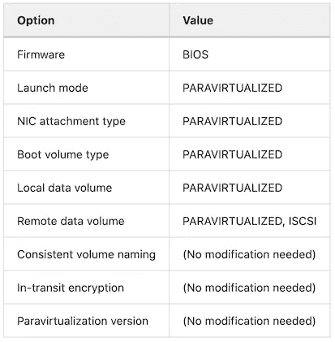

# 将映像功能方案添加到迁移工具箱

> 原文：<https://medium.com/oracledevs/adding-image-capability-schema-to-the-migration-toolbox-d0e8fef1f819?source=collection_archive---------3----------------------->

今年夏天，甲骨文云基础设施(OCI)计算团队[发布了](https://docs.oracle.com/en-us/iaas/releasenotes/changes/4f11f85a-9598-4fce-9741-edc92b4facda/)一项名为 [*映像能力模式*](https://docs.oracle.com/en-us/iaas/Content/Compute/Tasks/configuringimagecapabilities.htm) 的功能，这是一项高级功能，可为从定制映像创建的实例一致地设置启动选项。配置选项包括启动模式、网络连接类型、一致的数据块卷命名和传输中加密。除了一致地设置启动选项之外，在将现有虚拟机迁移到 OCI 时，配置映像功能也很方便。

在 OCI 上运行现有虚拟机的一种方法是[自带镜像](https://docs.oracle.com/en-us/iaas/Content/Compute/References/bringyourownimage.htm) (BYOI)。BYOI 过程包括将可引导虚拟磁盘上传到对象存储，并将其作为自定义映像导入。作为导入过程的一部分，会对映像应用启动模式。映像的启动模式是在从映像启动的实例上配置的一组预定义的启动选项。可用于导入映像的两种启动模式是模拟和半虚拟化。一般来说，在半虚拟化模式下运行的虚拟机比在模拟模式下运行的虚拟机具有更好的性能。

模拟和半虚拟化启动模式的默认启动选项如下所示。


Emulated Launch Mode


Paravirtualized Launch Mode

# 非功能性半虚拟化实例

要使用半虚拟化启动模式成功启动实例，需要安装 virtIO 驱动程序，并在操作系统中配置 ***和*** 。如果自定义映像作为半虚拟化导入，但操作系统未正确配置，则实例将看似正在运行，但将不起作用。下面是您可能在作为半虚拟化导入但没有安装虚拟化驱动程序的 Linux 或 Windows 实例的控制台上看到的内容。


Linux Console


Windows Console

查看半虚拟化设备驱动程序是否导致启动问题的一个快速方法是修改映像的功能，以强制在模拟模式下启动。

要从导入为半虚拟化的映像启动具有仿真选项的实例，首先导航到 ***自定义映像详细信息*** 页面，然后单击 ***编辑映像功能*** 按钮。


Edit Custom Image

要强制映像使用模拟启动选项，请选择仅模拟值。


Emulated Launch Options

单击“保存”按钮修改映像功能并启动一个新实例。通过点击 ***创建实例*** 按钮，可以从同一个 ***自定义图像细节*** 页面创建一个新实例。

如果新实例成功启动和引导，自定义映像的操作系统可能不支持半虚拟化。半虚拟化的设备驱动程序可以安装在 Windows 和最新的 Linux 发行版上。请关注即将发布的关于准备将现有虚拟机导入 OCI 的帖子，包括半虚拟化。

# 将模拟实例转换为半虚拟化

在用半虚拟化设备驱动程序配置了仿真实例之后，可以使用类似的过程在半虚拟化模式下启动新实例。

要创建半虚拟化的实例，请从模拟实例开始创建自定义映像。 ***创建自定义图像*** 选项在 ***下可用*** 按钮的 ***实例详情*** 页面。请注意，实例在映像创建过程中会重新启动，通常只需几分钟。


Create Custom Image

创建自定义图像后，导航到 ***自定义图像详细信息*** 页面，点击 ***编辑图像能力*** 按钮。

要强制从模拟实例导出的映像使用半虚拟化启动选项，请仅选择半虚拟化值。



Paravirtualized Launch Options

最后，保存修改后的映像功能并启动一个新实例。通过点击 ***创建实例*** 按钮，可以从同一个 ***自定义图像细节*** 页面创建一个新实例。

# 使用 OCI CLI

还可以使用 OCI CLI 创建映像功能模式。开始使用 OCI CLI 的最快方法是从 OCI 控制台使用[云外壳](https://docs.oracle.com/en-us/iaas/Content/API/Concepts/cloudshellintro.htm)。

要使用 OCI CLI 应用映像功能模式，首先要找到全局模式 ***id*** 和 ***当前版本名称*** 。

```
oci compute global-image-capability-schema list --all
```

其次，获取全局模式作为模板。

```
Syntax:

oci compute global-image-capability-schema-version get \
   --global-image-capability-schema-id <ID> \
   --global-image-capability-schema-version-name <VERSION_NAME>

Example:

oci compute global-image-capability-schema-version get --global-image-capability-schema-id ocid1.computeglobalimgcapschema.oc1.iad.aaaaaaaa743mjhi74zq5j6d42a --global-image-capability-schema-version-name 2c015226-8eed-193c90b > emulated_schema.json
```

第三，使用全局模式输出创建一个具有适当值的 ***仿真模式. json*** 文件。务必将 ***源*** 属性从 ***全局*** 改为 ***图像*** 。

下面是一个带有仿真启动选项的 JSON 文件示例:

```
{
   "Compute.Firmware": {
     "default-value": "BIOS",
     "descriptor-type": "enumstring",
     "source": "IMAGE",
     "values": [
       "BIOS"
     ]
   },
   "Compute.LaunchMode": {
     "default-value": "EMULATED",
     "descriptor-type": "enumstring",
     "source": "IMAGE",
     "values": [
       "EMULATED"
     ]
   },
   "Network.AttachmentType": {
     "default-value": "EMULATED",
     "descriptor-type": "enumstring",
     "source": "IMAGE",
     "values": [
       "EMULATED"
     ]
   },
   "Storage.BootVolumeType": {
     "default-value": "IDE",
     "descriptor-type": "enumstring",
     "source": "IMAGE",
     "values": [
       "IDE"
     ]
   }
 }
```

最后，为定制映像创建一个映像功能模式。

```
Syntax:

oci compute image-capability-schema create \
   --compartment-id <COMPARTMENT_ID> \
   --image-id <IMAGE_ID> \
   --global-image-capability-schema-version-name <VERSION_NAME> \
   --schema-data=file:// <SCHEMA_DATA_FILE>.json

Example:

oci compute image-capability-schema create --compartment-id ocid1.compartment.oc1..aaaaaaaacubvmt72cs2cjne4tc32pgk --image-id ocid1.image.oc1.iad.aaaaaaaaxkwffehulnmpkeq --global-image-capability-schema-version-name 2c015226-8eed-193c90b --schema-data=file://emulated_schema.json
```

# 最后的想法

使用映像功能并不是修复非功能性 paravirtualzied 实例的唯一方法，但它是迄今为止最快的方法。在发布映像功能模式之前，需要将非功能映像导出到对象存储，需要下载 qcow2 虚拟磁盘并从导出中提取，然后使用适当的启动模式重新导入磁盘。这个过程可能需要 45 分钟或更长时间。最广泛的方法是修改源虚拟机并再次尝试 BYOI 进程。

我希望您在迁移过程中不需要使用映像功能模式，但是如果您需要恢复一个非功能性的半虚拟化实例，现在您有了一个简单的工具。请务必关注未来关于准备将现有虚拟机导入 OCI 的帖子。这篇文章将介绍在移动任何数据之前您需要做出的一些决定和准备工作，以便平稳地过渡到 OCI，一切都按预期进行。

保持头脑清醒！