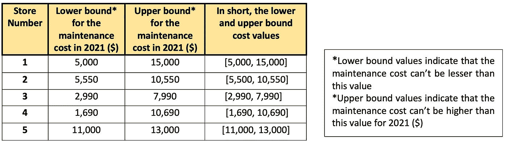

# 向基于树的模型添加预测间隔

> 原文：<https://medium.com/walmartglobaltech/adding-prediction-intervals-to-tree-based-models-8ea53814a4b9?source=collection_archive---------0----------------------->


[Photo Credit](https://www.real-statistics.com/wp-content/uploads/2018/01/regression-prediction-interval-chart.png)

**1。简介**

在回归机器学习模型中，我们经常发现所谓的点估计，即模型输出的单个值，没有关于该值的确定性的度量。这可能是有问题的，因为它会使我们相信预测是完全正确的，其效果可能会级联到下游任务/决策中。如果我们提供一个**预测区间**，比点估计更有信心，而不是一个单一的值，这将更好地造福于预测的消费者。在这篇博客中，我们讨论了如何使用分位数回归器森林为基于树的模型生成预测区间及其在 Python 中的实现(Scikit-Learn)。

**2。问题陈述**

美国的大型零售商在全国有 100 家或 1000 家商店。每个商店都有几种类型的设备，这些零售商每年花费数百万美元来维护其商店、设备和基础设施的质量。在沃尔玛，我们建立了回归模型，预测未来几年这些商店的未来维护成本，这使管理团队能够提前规划商店维护预算。

但我们在这里有一个问题——这些回归模型没有告诉我们可以在多大程度上依赖这些未来预测。让我详细说明这一点。

假设我们已经使用截至 2018 年的可用信息训练了 ML 模型，并使用该模型来预测 2019 年和 2020 年的维护成本。本博客中使用的数据都是为了更好地解释概念而编造的，并不是“实际数字”。假设以下是我们从模型中获得的 2020 年 4 家不同商店的未来维护成本值。


Table showing the error percentages of maintenance cost across various stores

如您所见，平均而言，ML 模型在预测未来成本时会产生 12 %的误差(中值误差在 8%左右)。

现在我们已经建立了模型并测试了它的性能，是时候从模型中获得对明年 2021 年的预测了。假设我们的模型预测了下一年的以下值。


如下表所示，某些东西会在预测上获得更多的信任，并且比点预测更有用。我们没有预测维护成本的单一值，而是提供了这些预测的范围。



Table showing the upper and lower bounds

除了范围之外，预测区间也提供了一种置信度。95%的置信区间表示该模型对给定商店的未来维护成本落在计算的下限和上限内有 95%的把握。这将有助于用户理解与每个预测相关的不确定性。例如，商店编号 3 的点预测是 4990，计算的下限和上限范围是[2990，7990]。这意味着预测的平均维护成本为 4990 英镑，但我们可以说，在 95%的置信度下，它将保持在下限(2990 英镑)和上限(7990 英镑)之内。

宽的预测区间表示模型对该预测不是很有信心，而窄的区间表示模型非常有信心。企业可以利用这些信息来更准确地规划维护预算，甚至可以根据与预测相关的不确定性来决定使用模型结果或一些基本维护值。

预测间隔也可以帮助数据科学家评估模型性能。即使模型性能指标(如 [MAPE](https://en.wikipedia.org/wiki/Mean_absolute_percentage_error) 和 [RMSE](https://en.wikipedia.org/wiki/Root-mean-square_deviation) )较低，所有预测样本的较宽预测区间可以表明模型对这些预测的确信度较低。在这种情况下，可以采取额外的措施来改善模型性能。

**3。生成预测区间的机器学习方法**

为了生成任何基于树的模型(随机森林和梯度推进模型)的预测区间，我们使用[分位数回归器森林。](https://scikit-garden.github.io/examples/QuantileRegressionForests/)为了更好地理解分位数回归森林的概念，让我们首先理解基于森林的模型的高级工作方式。

比方说，我们已经训练了一个模型，使用截至 2018 年可用的以下特征信息来预测商店中所有制冷相关设备的维护成本。下表显示了模拟训练数据。


Training data

请参考[随机森林](https://towardsdatascience.com/an-implementation-and-explanation-of-the-random-forest-in-python-77bf308a9b76)和[梯度增强模型](https://blog.paperspace.com/implementing-gradient-boosting-regression-python/)了解它们的内部工作原理。

森林模型为所有要素创建箱，并计算每个箱的平均维护成本。下表显示了每个特性的箱以及每个箱的平均成本。


Table showing the working of forest-based models

假设我们想用下面的特征值预测商店 6 和 7 的维护成本。


Table showing how the forest-based models predict for a new data point

*   该模型将首先识别对应于每个特征值的箱以及该箱下一年的平均维护成本。
*   然后，它将计算所有功能下一年的平均维护成本，这是该商店下一年的维护成本

但是我们不知道这个模型对这些预测有多确定。分位数回归子森林的优势来了。他们可以使用[分位数](https://en.wikipedia.org/wiki/Quantile)的概念生成预测区间。

分位数是统计学中理解数据集分布的一个非常常用的工具。例如，如果您想知道整个数据集中高于 25%的数据点和低于 75%的数据的值，那么您可以计算 25%的分位数。类似地，我们可以根据需要计算 95%、5%或任何其他分位数。

让我们在模型中使用分位数的概念来扩展它的能力。之前，该模型仅存储每个箱的平均维护成本，但我们也可以存储每个箱的一些其他值，如下所示:

*   置信度为 5%时的最低修复成本:至少 95%落入此区间的数据点的成本高于此值。
*   置信度为 95%时的最高修复成本:至少有 95%落入此箱的数据点的成本低于此值。

这是具有更新功能的数据的外观。


Table shows the calculation of the Lowest and Highest Maintenance repair costs. Here, P denotes Percentile()

类似地，我们可以计算商店 6 和 7 的维护成本的预测间隔，如下所示。


Table shows the calculation of Lowest and Highest Maintenance costs for a new data point

正如我们在这里看到的， ***在第一个数据点，尽管气温为 10°C，但过去一年的冰淇淋销售额为 25，000 美元。模型理解这种异常行为，这就是上限值和下限值*** 之间存在显著差异的原因。由于模型结果的不确定性，预测区间变得更宽。

在下一节中，我们将看到 python sklearn 库如何帮助生成这些预测区间。

**4。Python 实现 GBM 的预测区间**

[Scikit learn 的 GBM 模型](https://scikit-learn.org/stable/auto_examples/ensemble/plot_gradient_boosting_quantile.html)具有训练分位数回归森林的内置功能。可以通过在 API 调用中设置参数 *loss=quantile* 来实现。主要区别在于，我们需要训练两个额外的 GBM 模型来预测目标，而不是训练 1 个 GBM 模型，如下所示:

*   对于下限预测，请使用

```
GradientBoostingRegressor(loss='quantile', alpha=0.05)
```

*   对于上限预测，使用

```
GradientBoostingRegressor(loss='quantile', alpha=0.95)
```

在高层次上，该模型优化了损失函数。通过将损失参数设置为分位数，并选择适当的 alpha(分位数)，我们将能够获得与这些百分位数相对应的预测。因此，结合使用这 3 个模型，可以为每个数据点生成预测区间。

让我们来看看实际情况。


Required libraries


Training the 3 GBM models


Making the predictions using the model

这就是我们如何结合使用这 3 个模型来为每个数据点生成预测区间。

**5。结论**

机器学习模型并不完美，因此向模型输出添加预测区间会增加其可信度。分位数回归森林是在基于树的回归模型中实现相同功能的众多方法之一。我希望这个博客已经给了你这个概念的基础，我鼓励你进一步探索，并将其应用于你自己的问题。

**作者:**

1.  achala Sharma([achala Sharma](https://medium.com/u/dec8289c9718?source=post_page-----8ea53814a4b9--------------------------------))—沃尔玛全球技术部员工数据科学家
2.  Bhavana Gopakumar([Bhavana G](https://medium.com/u/7e9c9bcd04c0?source=post_page-----8ea53814a4b9--------------------------------))—沃尔玛全球技术部数据科学家

**6。参考文献**

以下是为各种模型生成预测区间的一些参考

[https://sci kit-garden . github . io/examples/QuantileRegressionForests/](https://scikit-garden.github.io/examples/QuantileRegressionForests/)

[https://towards data science . com/quantile-regression-from-linear-models-to-trees-to-deep-learning-af 3738 b 527 c 3](https://towardsdatascience.com/quantile-regression-from-linear-models-to-trees-to-deep-learning-af3738b527c3)

[https://sci kit-learn . org/dev/auto _ examples/linear _ model/plot _ quantile _ regression . html](https://scikit-learn.org/dev/auto_examples/linear_model/plot_quantile_regression.html)

[https://datascienceplus . com/prediction-interval-the-wider-sis ter-of-confidence-interval/](https://datascienceplus.com/prediction-interval-the-wider-sister-of-confidence-interval/)