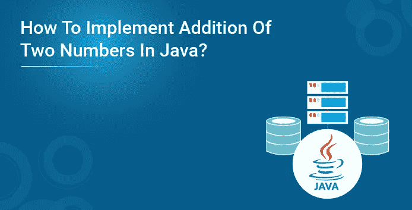
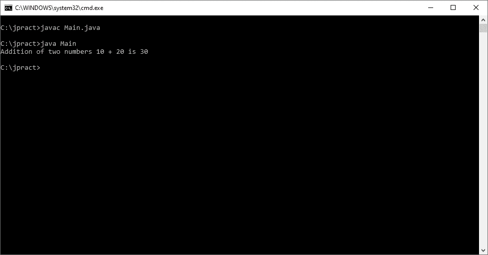
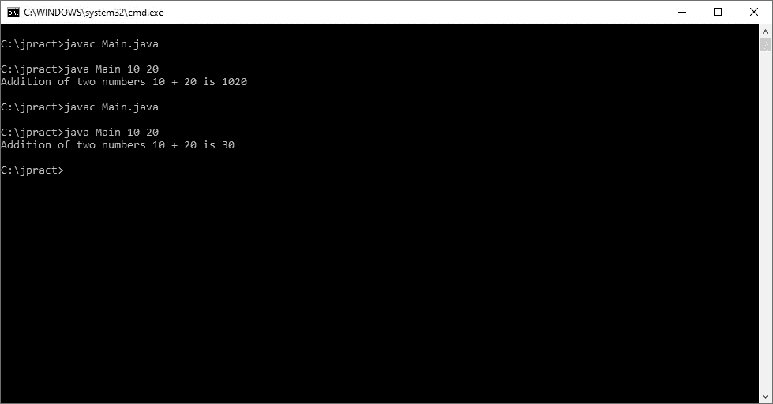
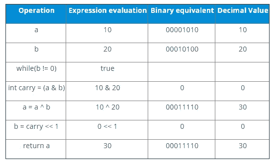
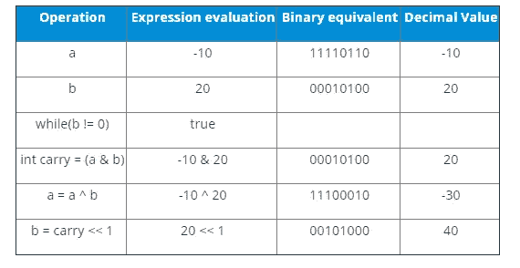
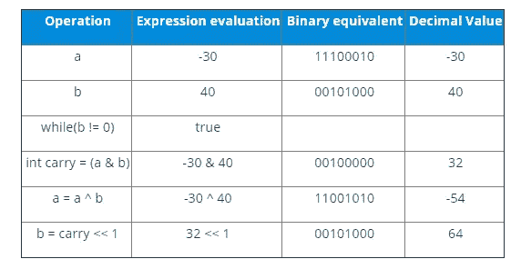
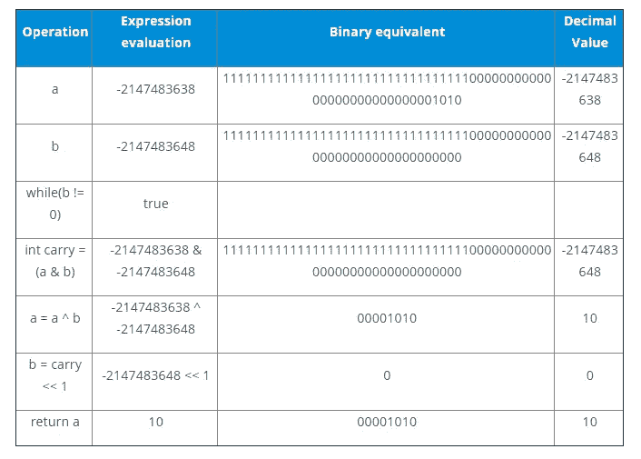

# Java 中两个数的加法

> 原文：<https://medium.com/edureka/addition-of-numbers-in-java-9d5307454319?source=collection_archive---------5----------------------->



在本文中，我将向您介绍一个简单而重要的概念，即 Java 中两个数的相加。但是在继续之前，我建议您先熟悉“什么是 Java”，Java 的特性以及如何在您的系统上安装 Java。这将有助于你快速轻松地掌握即将到来的概念。本 Java 教程系列中的其他博客由我们的 Java 培训专家撰写，将深入涵盖 Java 和 J2EE 的所有重要主题，

本文将涉及以下几点:

*   方法 1
*   方法 2
*   重复一元运算符
*   初始循环表
*   Java 中的按位和位移运算符
*   递归

那么让我们开始吧，

# Java 中两个数的加法

# 方法 1

让我们通过用 Java 开发一个程序在屏幕上打印“两个数相加”来直接理解。

```
Class AddTwoNumbers
{
public static void main(String[] args)
{
System.out.println(“Addition of two numbers 10 + 20 is ” + (10 + 20));
}
}
```



我们必须明白，这里的数字是直接相加的，比如说 10 + 20 就是 30。但是我们从控制台得到的数字。在这种情况下，这些值将存储在一个变量中。就 Java 而言，字符串数组变量将根据它们的索引存储这些数字。

```
public class Main
{
public static void main(String[] args)
{
System.out.println("Addition of two numbers " + args[0] + " + " + args[1] + " is " + (args[0] + args[1]));
}
}
```

当我们传递相同的数字 10 和 20 时，输出将如控制台所示。


呃，我们在这里得到的结果并不理想。记住 String[] args，您从控制台获得的每个输入都用 String 表示。所以这里我们要把那些字符串转换成整数来计算加法。

```
public class Main
{
public static void main(String[] args)
{
//System.out.println("Addition of two numbers " + args[0] + " + " + args[1] + " is " + (args[0] + args[1]));
System.out.println("Addition of two numbers " + args[0] + " + " + args[1] + " is " + (Integer.parseInt(args[0]) + Integer.parseInt(args[1])));
}
}
```

**输出**



现在期望的输出就是我们想要的。也就是说，在我们将它从字符串解析为整数后，10 和 20 相加就是 30。

在这篇关于 Java 中两个数相加的文章中

# 方法 2

1.  使用减法运算符:我们可以使用减法将两个数字相加，这样它将否定负值，从而得到加法。

```
public class AddTwoNumbers
{
public static int add(int a, int b)
{
return a – (-b);
}
public static void main(String[] args)
{
System.out.println(add(10, 20));
System.out.println(add(-10, 20));
}
}
```

**输出**

30

10

在这篇文章的下一部分中，我们将讨论 Java 中两个数字的加法

# 重复一元运算符

这涉及到一个 while 循环，其背后的基本思想是将第一个操作数的值归零。并且继续以相同的迭代次数递增其对应的第二操作数。考虑下面的例子。

```
public class HelloWorld
{
public static void main(String []args)
{
System.out.println("add " + add(10, 20));
System.out.println("add " + add(-10, 20));
}
public static int add(int a, int b)
{
//System.out.println("---> " + a + " : " + b);
while(a > 0)
{
//System.out.println("while a>0---> " + a + " : " + b);
b++;
a--;
}
while(a < 0)
{
//System.out.println("while a<0---> " + a + " : " + b);
b--;
a++;
}
//System.out.println("return b---> " + a + " : " + b);
return b;
}
}
```

**输出**

```
$javac HelloWorld.java
$java -Xmx128M -Xms16M HelloWorld
add 30
add 10
```

在这篇文章的下一部分中，我们将讨论 Java 中两个数字的加法

# Java 中的按位和位移运算符

我们也可以使用 XOR 按位运算符将两个整数相加，进位可以通过 and 运算符获得。要将进位加到和中，我们需要使用带符号的左移运算符。这是怎么发生的？我们先来看一个例子。

```
public class HelloWorld{
public static void main(String []args){
System.out.println("Addition using +ve " + addUsingBits(10, 20));
System.out.println("Addition using -ve " + addUsingBits(-10, 20));
}
public static int addUsingBits (int a, int b){
while (b != 0){
int carry = (a & b);
a = a ^ b;
b = carry << 1;
}
return a;
}
}
```

**输出**

$贾瓦茨·HelloWorld.java

$java -Xmx128M -Xms16M HelloWorld

使用+ve 30 的加法

使用-ve 10 的加法

请记住，XOR 运算用于计算两位的相加。AND 运算用于计算两位的进位。我们来分析一下，好吗？根据输入值，第一个条件是 a = 10，b = 20。



现在，让我们假设 a 的输入为负，比如-10。让我们看看下表中发生了什么。这让我们陷入了一个循环，直到进位的十进制值变为负值。

在这篇文章的下一部分中，我们将讨论 Java 中两个数字的加法

# 初始循环表



循环 1。



依此类推……直到 loop 变成 b = 0；为了简洁起见，这里没有显示所有结果。所以下表代表了这个操作中的最后一个循环。



这就是加法的计算方法。唷！想法到此为止。试想一下，如果这个计算是人工完成的，主要是二进制计算。

在这篇文章的下一部分中，我们将讨论 Java 中两个数字的加法

# 递归

我们也可以用递归来写上面的程序。计算部分略有不同，让我们把它作为你的家庭作业，好吗？我将给出递归的摘录，你可以试着建立你自己的表，这样你就知道它内部是如何工作的。此外，除非你对这里的内部工作很感兴趣，否则没有必要对这些仅仅是为了表示的目的而大动干戈。

```
public static int addUsingRecursion(int a, int b){
if(b == 0) return a;
int sum = a ^ b;
int carry = (a & b) << 1;
return add(sum, carry);
}
```

这都是为了在 Java 中使用+运算符和不使用+运算符的两个数相加。选择这两种方法的原因完全取决于项目的需要和要求。我还没有评估和测试这两个场景的工作情况以得出性能。我猜只有当你建造火箭并把它送上太空时，这种想法才会生效。

为了简洁起见，我只解释了与整数相关的数字，它有自己的内存限制。我把进一步探索使用 float、double 等的任务留给了您。永远记住，如果你超过了基本类型的极限值，那么结果将显示不同的答案。

如果你想查看更多关于人工智能、Python、道德黑客等市场最热门技术的文章，你可以参考 Edureka 的官方网站。

请留意本系列中解释 Java 其他各方面的其他文章。

> *1。* [*面向对象编程*](/edureka/object-oriented-programming-b29cfd50eca0)
> 
> *2。*[*Java 中的继承*](/edureka/inheritance-in-java-f638d3ed559e)
> 
> *3。*[*Java 中的多态性*](/edureka/polymorphism-in-java-9559e3641b9b)
> 
> *4。*[*Java 中的抽象*](/edureka/java-abstraction-d2d790c09037)
> 
> *5。* [*Java 字符串*](/edureka/java-string-68e5d0ca331f)
> 
> *6。* [*Java 数组*](/edureka/java-array-tutorial-50299ef85e5)
> 
> *7。* [*Java 集合*](/edureka/java-collections-6d50b013aef8)
> 
> *8。* [*Java 线程*](/edureka/java-thread-bfb08e4eb691)
> 
> *9。*[*Java servlet 简介*](/edureka/java-servlets-62f583d69c7e)
> 
> 10。 [*Servlet 和 JSP 教程*](/edureka/servlet-and-jsp-tutorial-ef2e2ab9ee2a)
> 
> *11。*[*Java 中的异常处理*](/edureka/java-exception-handling-7bd07435508c)
> 
> *12。* [*Java 教程*](/edureka/java-tutorial-bbdd28a2acd7)
> 
> *13。* [*Java 面试题*](/edureka/java-interview-questions-1d59b9c53973)
> 
> *14。* [*Java 程序*](/edureka/java-programs-1e3220df2e76)
> 
> 15。 [*科特林 vs Java*](/edureka/kotlin-vs-java-4f8653f38c04)
> 
> *16。* [*依赖注入使用 Spring Boot*](/edureka/what-is-dependency-injection-5006b53af782)
> 
> *17。* [*堪比 Java 中的*](/edureka/comparable-in-java-e9cfa7be7ff7)
> 
> *18。* [*十大 Java 框架*](/edureka/java-frameworks-5d52f3211f39)
> 
> *19。* [*Java 反射 API*](/edureka/java-reflection-api-d38f3f5513fc)
> 
> *20。*[*Java 中的 30 大模式*](/edureka/pattern-programs-in-java-f33186c711c8)
> 
> *21。* [*核心 Java 备忘单*](/edureka/java-cheat-sheet-3ad4d174012c)
> 
> *22。*[*Java 中的套接字编程*](/edureka/socket-programming-in-java-f09b82facd0)
> 
> *23。* [*Java OOP 备忘单*](/edureka/java-oop-cheat-sheet-9c6ebb5e1175)
> 
> *24。*[*Java 中的注释*](/edureka/annotations-in-java-9847d531d2bb)
> 
> *25。*[*Java 中的图书馆管理系统项目*](/edureka/library-management-system-project-in-java-b003acba7f17)
> 
> 26。[*Java 中的树*](/edureka/java-binary-tree-caede8dfada5)
> 
> *27。*[*Java 中的机器学习*](/edureka/machine-learning-in-java-db872998f368)
> 
> *28。* [*顶级数据结构&Java 中的算法*](/edureka/data-structures-algorithms-in-java-d27e915db1c5)
> 
> 29。 [*Java 开发者技能*](/edureka/java-developer-skills-83983e3d3b92)
> 
> 三十。 [*前 55 名 Servlet 面试问题*](/edureka/servlet-interview-questions-266b8fbb4b2d)
> 
> 31。[](/edureka/java-exception-handling-7bd07435508c)*[*顶级 Java 项目*](/edureka/java-projects-db51097281e3)*
> 
> **32。* [*Java 字符串备忘单*](/edureka/java-string-cheat-sheet-9a91a6b46540)*
> 
> *33。[*Java 中的嵌套类*](/edureka/nested-classes-java-f1987805e7e3)*
> 
> **34。* [*Java 集合面试问答*](/edureka/java-collections-interview-questions-162c5d7ef078)*
> 
> **35。*[*Java 中如何处理死锁？*](/edureka/deadlock-in-java-5d1e4f0338d5)*
> 
> **36。* [*你需要知道的 50 个 Java 合集面试问题*](/edureka/java-collections-interview-questions-6d20f552773e)*
> 
> **37。*[*Java 中的字符串池是什么概念？*](/edureka/java-string-pool-5b5b3b327bdf)*
> 
> **38。*[*C、C++和 Java 有什么区别？*](/edureka/difference-between-c-cpp-and-java-625c4e91fb95)*
> 
> **39。*[*Java 中的回文——如何检查一个数字或字符串？*](/edureka/palindrome-in-java-5d116eb8755a)*
> 
> **40。* [*你需要知道的顶级 MVC 面试问答*](/edureka/mvc-interview-questions-cd568f6d7c2e)*
> 
> *41。[*Java 编程语言十大应用*](/edureka/applications-of-java-11e64f9588b0)*
> 
> *42。[*Java 中的死锁*](/edureka/deadlock-in-java-5d1e4f0338d5)*
> 
> **43。*[*Java 中的平方和平方根*](/edureka/java-sqrt-method-59354a700571)*
> 
> **44。*[*Java 中的类型转换*](/edureka/type-casting-in-java-ac4cd7e0bbe1)*
> 
> *45。[*Java 中的运算符及其类型*](/edureka/operators-in-java-fd05a7445c0a)*
> 
> *46。[*Java 中的析构函数*](/edureka/destructor-in-java-21cc46ed48fc)*
> 
> *47。[*Java 中的二分搜索法*](/edureka/binary-search-in-java-cf40e927a8d3)*
> 
> **48。*[*Java 中的 MVC 架构*](/edureka/mvc-architecture-in-java-a85952ae2684)*
> 
> **49。* [*冬眠面试问答*](/edureka/hibernate-interview-questions-78b45ec5cce8)*

**原载于 2019 年 9 月 19 日*[*https://www.edureka.co*](https://www.edureka.co/blog/addition-of-two-numbers-in-java/)*。**