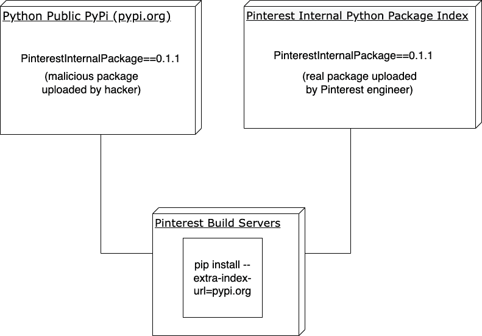

# 在 Pinterest 解决 Python 依赖困惑

> 原文：<https://medium.com/pinterest-engineering/addressing-python-dependency-confusion-at-pinterest-e0a0609c8e9?source=collection_archive---------3----------------------->

Bill Prin |软件工程师，工程生产力，PythonDevin Lundberg |软件工程师，安全主管；和亚当·贝瑞|软件工程师，工程生产力

在当今世界，软件供应链是一个非常重要的安全话题。2021 年 5 月，美国[石油管道系统成为网络攻击](https://www.bloomberg.com/news/articles/2021-06-04/hackers-breached-colonial-pipeline-using-compromised-password)的受害者，在联邦调查局的协助下，向攻击者支付了超过 440 万美元的赎金，以恢复他们的系统。

结果，美国总统乔·拜登被迫宣布进入紧急状态，并于 5 月 12 日在[发布了第 14028](https://www.cnbc.com/2021/05/12/biden-signs-executive-order-to-strengthen-cybersecurity-after-colonial-pipeline-hack.html) 号行政命令，提高软件供应链的软件安全标准。据 VentureBeat 报道，[软件供应链攻击在 2021 年增加了 300%。](https://venturebeat.com/2022/01/27/report-software-supply-chain-attacks-increased-300-in-2021/)

那年早些时候，安全研究员 Alex Birsan 写了一篇病毒文章，描述了他如何[利用一种叫做“依赖混淆”的软件供应链漏洞攻击苹果、微软和其他十几家公司](/@alex.birsan/dependency-confusion-4a5d60fec610)。

作为一名软件工程师，你会经常发现有用的软件在线免费发布在软件包仓库上，比如 Python 的 PyPi 或者 NodeJS 的 NPM。这些开源软件包可以节省大量的时间，但是从互联网上下载代码会带来大量的安全隐患。

有了依赖混淆，黑客可以给他们的恶意包起一个和正版包一样的名字，然后上传到一个公共库，希望它被意外下载。如果发生这种情况，攻击者将有权执行[任意代码](https://en.wikipedia.org/wiki/Arbitrary_code_execution)，可能允许他们完全访问敏感数据，或者使他们能够破坏为 Pinterest 等网站提供支持的生产服务。Pinterest 非常重视安全性，减轻这些努力已经成为该公司的首要任务。Pinterest 指派了内部安全专家和第三方安全研究人员来审计我们的依赖性混淆风险。

为了防止依赖性混淆，我们采取的第一个行动是验证我们所有的依赖性都被“固定”到了一个特定的版本。例如，不接受任何版本的“requests”库，而是在“requirements.txt”文件中将需求指定为“requests==2.27.1”。这是非常重要的第一步，这样你就不会不小心下载了恶意版本的软件包。这是防止 Python 依赖混淆攻击的必要步骤，但仅仅这样还不够。

Python 编程语言特别容易受到供应链攻击，原因有几个。

*   Python 中有一种代码重用的文化。
    正因为如此，人们经常想要添加新的库，这些库通常是由不知名的第三方开发者创建的。
*   最流行的软件包管理器 pip 很容易配置错误，从而使您的组织容易受到依赖性混淆的影响。
    这是一个由志愿者组成的团队运行的非常有价值的工具。总的来说，他们做得非常出色，这也是这个工具如此受欢迎的原因，但它确实有这个弱点。

# “pip–额外索引 url”的危险

让我们面临依赖性混乱风险的一个主要问题是，我们的 Python“pip”配置使用了多个索引端点，使用了配置标志“extra-index-url”。Pinterest Python 工件的一部分存储在我们自己的定制存储库中，[开源为 Pinrepo](https://github.com/pinterest/pinrepo) ，我们的一些 Python 包存储在 JFrog 的 [Artifactory](https://jfrog.com/artifactory/) 中。

使用“— extra-index-url”标志有一个很大的危险:它不支持任何优先级排序。这已经在 [Github](https://github.com/pypa/pip/issues/8606) 和[堆栈溢出](https://stackoverflow.com/questions/67253141/python-pip-priority-order-with-index-url-and-extra-index-url)中进行了广泛的讨论。简短的总结是，管理 pip 开源项目的志愿者团队没有考虑 pip 工具范围内的存储库索引优先级。相反，他们建议使用一个单一的服务器端点来管理后端的优先级。

下图显示了攻击的样子。

请记住， **pip 不允许您设置哪个后端索引优先。**因此，尽管版本被锁定，pip 仍有可能意外下载恶意软件包。一种补救方法是在 PyPi 上用一个空包“蹲”住每个内部包。然而，PyPi 组织并不认可这种方法，并且已经移除了空的包。

幸运的是，Artifactory 支持[虚拟存储库](https://www.jfrog.com/confluence/display/JFROG/Virtual+Repositories)的概念，允许您使用单个端点，然后“虚拟地”分派到适当的后端存储库，包括优先级等功能。这意味着你可以配置 Artifactory 来*总是*优先考虑内部存储库，从而降低意外下载外部包的风险。

在 Pinterest，我们投资将所有包转移到与 Artifactory 虚拟端点兼容的存储库中。然后，我们设置虚拟端点，以正确的优先级顺序委托给后端包索引，总是优先考虑内部包。通过切换到 Artifactory 上的单个端点，我们可以优先考虑 pip 在哪里寻找包，并且总是优先选择内部版本。

# 其他重要的补救措施

还有一些其他重要的补救步骤。其中最大的一个是将依赖项安装绑定到内容的一个**散列**，而不仅仅是包的名称和版本。这样，即使软件包的名称和版本完全相同，如果任何内容与预期不同，安装也会失败。这可以通过像 [pip-tools](https://github.com/jazzband/pip-tools) 或[poems](https://python-poetry.org/)这样的工具来完成。

另一个我们正在实施的建议是用相同的前缀命名每个内部包，比如 pinterest-*。通过这种方式，我们可以编写逻辑代码，永远不从外部资源下载带有那个前缀的包。

在 Pinterest，我们对安全基础设施进行了重大改进，这将有助于防止我们看到的供应链软件攻击类型。尽管如此，鉴于从互联网上频繁下载和运行的代码数量，这是一个巨大的安全领域，每个公司都应该投资加强。软件供应链攻击对政府和企业都是一个严重的威胁，这是 Pinterest engineering 将持续监控并投资防止的一个领域。

# 致谢和参考

我们要感谢 Josh Koza 和产品安全团队、持续集成和测试团队的 Jasmine Qin 以及云架构团队的 Kynan Lalone 和 Ruth 王君馨所做的努力。我们也在寻找能帮助提高我们工程生产力的人:代码和语言运行时团队，他们专注于解决 Java、Python、Node、C++和 Go 等语言的类似问题。

其中一篇关于依赖性困惑的内容丰富的博文来自 Twilio: [依赖性、困惑和解决方案:Twilio 做了什么来解决依赖性困惑](https://www.twilio.com/blog/avoiding-dependency-confusion-attacks)。在 Pinterest engineering，我们发现 Twilio 关于该主题的文章信息量很大，我们强烈建议任何致力于防止依赖性混淆的公司查看 Twilio 关于该主题的帖子。

这个领域的其他有用的参考资料是谷歌的 SLSA 框架，你可以在谷歌的博客文章[上读到，介绍 SLSA，一个端到端的供应链完整性框架](https://security.googleblog.com/2021/06/introducing-slsa-end-to-end-framework.html)，以及 [Sigstore](https://www.sigstore.dev/) 项目，旨在推动更好的软件签名和验证行业标准。

*要在 Pinterest 上了解更多工程知识，请查看我们的* [*工程博客*](https://medium.com/pinterest-engineering) *，并访问我们的*[*Pinterest Labs*](https://www.pinterestlabs.com?utm_source=medium&utm_medium=blog-article&utm_campaign=prin-et-al-march-10-2022)*网站。要查看和申请空缺职位，请访问我们的* [*招聘*](https://www.pinterestcareers.com?utm_source=medium&utm_medium=blog-article&utm_campaign=prin-et-al-march-10-2022) *页面*